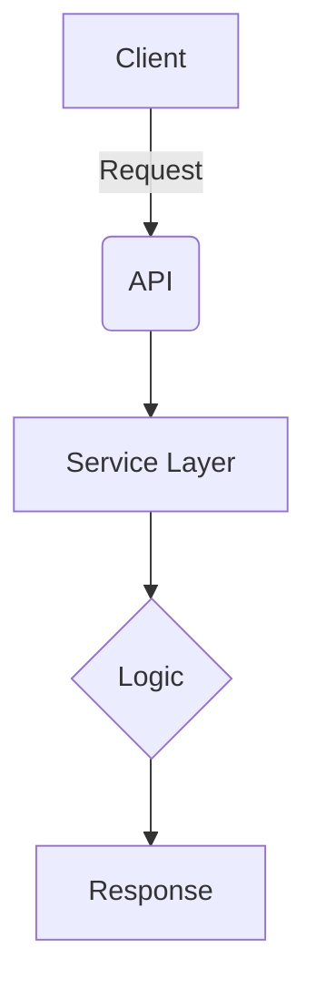

# Backend Development Guidelines

This document provides development guidelines for **Claude Code** when working on the **HWP Report Generator backend**.

---

## Table of Contents

1. [Code Style and Documentation](#code-style-and-documentation)
2. [Testing Guidelines](#testing-guidelines)
3. [References](#references)

---

## Code Style and Documentation

### DocString Rules

**All Python functions and classes MUST include a Google-style DocString.**

#### DocString Format Example

```python
def generate_report(topic: str, user_id: int) -> dict:
    """Generates a report and returns metadata.

    Args:
        topic: Report generation topic (e.g., "Digital Banking Trends 2025")
        user_id: ID of the user creating the report

    Returns:
        Dictionary containing generated report info:
            - id: Report ID
            - filename: Generated file name
            - file_path: File storage path

    Raises:
        ValueError: When topic is empty
        APIError: When Claude API call fails

    Examples:
        >>> report = generate_report("AI Trends", user_id=1)
        >>> print(report['filename'])
        'report_20251027_103954.hwpx'
    """
    pass

def get_user_by_id(user_id: int) -> User:
    """Retrieves a user by ID."""
    pass
```

For class DocStrings, include attributes in the docstring header. Private functions (prefixed with `_`) should also have DocStrings but can be shorter.

#### Required Sections

| Section | When Required | Format |
|---------|---------------|--------|
| **Summary** | Always | One-line description ending with period |
| **Args** | If parameters exist | `param_name: description` |
| **Returns** | If return value exists | Describe structure and meaning |
| **Raises** | If exceptions possible | `ExceptionType: Condition` |
| **Examples** | For complex functions | Use doctest format (`>>>`) |

#### Key Rules

1. **Summary:** Start with imperative verb ("Generates", "Returns", "Calculates"), end with period
2. **Args:** Omit types (use type hints), indicate optional params, use indentation for nested structures
3. **Returns:** Describe structure, list key fields for dicts/objects
4. **Raises:** List exceptions with conditions
5. **Examples:** Use `>>>` format, show input and output

#### Common Mistakes

❌ No DocString, incomplete summary, wrong format (`@param`, `@return`)
✅ Complete Google-style DocString with all required sections

### Scope

Apply to: `app/routers/*.py`, `app/models/*.py`, `app/database/*.py`, `app/utils/*.py`, and all backend Python files.

**Exceptions:** `__init__.py` (imports only), simple getters/setters, test functions (optional).

---

## File Management Guidelines

### Artifact Storage

**ALWAYS use `ArtifactManager` for artifact file operations.**

#### ✅ DO - Use ArtifactManager

```python
from app.utils.artifact_manager import ArtifactManager
from shared.types.enums import ArtifactKind

# Generate standardized file path
filepath = ArtifactManager.generate_artifact_path(
    topic_id=topic.id,
    message_id=message.id,
    filename=f"report_v{version}.md"
)

# Store artifact
file_size = ArtifactManager.store_artifact(
    content=markdown_content,
    filepath=filepath,
    is_binary=False  # False for MD, True for HWPX
)

# Calculate hash for integrity
sha256 = ArtifactManager.calculate_sha256(filepath)

# Store metadata in database
artifact = ArtifactDB.create_artifact(
    topic_id=topic.id,
    message_id=message.id,
    kind=ArtifactKind.MD,
    filename=os.path.basename(filepath),
    file_path=filepath,
    file_size=file_size,
    sha256=sha256
)
```

#### ❌ DON'T - Direct file operations

```python
# DON'T do this!
with open(f"artifacts/topic_{topic_id}/file.md", "w") as f:
    f.write(content)
```

**Why?** `ArtifactManager` provides:
- Consistent file path structure
- Automatic directory creation
- UTF-8 encoding for text files
- File size and hash calculation
- Support for future storage backends (S3, Azure Blob)

### Markdown File Operations

**Use `MarkdownHandler` for Markdown file operations.**

#### ✅ DO - Use MarkdownHandler

```python
from app.utils.md_handler import MarkdownHandler

# Format report data as Markdown
report_data = {
    "title": "Digital Banking Report",
    "summary": "Executive summary...",
    "background": "Background information...",
    "main_content": "Detailed analysis...",
    "conclusion": "Conclusions and recommendations..."
}

md_content = MarkdownHandler.format_report_as_md(report_data)

# Save Markdown file
MarkdownHandler.save_md_file(md_content, filepath)

# Read Markdown file
content = MarkdownHandler.read_md_file(filepath)

# Parse Markdown back to structured data
parsed_data = MarkdownHandler.parse_md_report(content)
```

**Report Structure Standard:**
- `# {Title}` - Main title (H1)
- `## 요약` - Summary section (H2)
- `## 배경 및 목적` - Background section (H2)
- `## 주요 내용` - Main content section (H2)
- `## 결론 및 제언` - Conclusion section (H2)

### Transformation Tracking

**ALWAYS record transformations when converting artifacts.**

#### ✅ DO - Track transformations

```python
from app.database.transformation_db import TransformationDB
from app.models.transformation import TransformationCreate
from shared.types.enums import TransformOperation

# After converting MD to HWPX
transformation = TransformationDB.create_transformation(
    TransformationCreate(
        from_artifact_id=md_artifact.id,
        to_artifact_id=hwpx_artifact.id,
        operation=TransformOperation.CONVERT,
        params_json='{"template": "report_template.hwpx"}'
    )
)
```

**Benefits:**
- Lineage tracking (which HWPX came from which MD)
- Audit trail for conversions
- Support for conversion chains (MD → HWPX → PDF)
- Debugging conversion issues

#### Common Transformation Operations

```python
from shared.types.enums import TransformOperation

# Format conversion
TransformOperation.CONVERT  # MD → HWPX, HWPX → PDF, etc.

# Language translation (future use)
TransformOperation.TRANSLATE  # KO → EN, EN → KO, etc.
```

---

## Testing Guidelines

> **📖 For detailed testing guide, see [BACKEND_TEST.md](./BACKEND_TEST.md)**

### Quick Start

**Run all tests with coverage:**

```bash
cd backend
uv run pytest tests/ -v --cov=app --cov-report=term-missing
```

**Install test dependencies:**

```bash
uv pip install -r requirements-dev.txt
```

---

### Current Coverage Status

**Overall Coverage: 52%** ✅ (Target: ≥70%, topics.py: 78%)

- **Total Tests:** 88+ tests (88 passed, 0 failed)
- **Test Files:** 20+ files covering auth, claude_client, hwp_handler, API endpoints, and templates
- **Coverage Increase:** +6% (from 46% to 52% in this session)

**Top Modules:**
- `routers/topics.py`: 78% ✅ (+39% improvement)
- `utils/markdown_builder.py`: 100% ✅
- `utils/response_helper.py`: 96% ✅
- `utils/markdown_parser.py`: 92% ✅
- `utils/auth.py`: 80% ✅
- `utils/file_utils.py`: 96% ✅

---

### Coverage Goals

- **Overall:** ≥ 70%
- **Core business logic:** ≥ 90%
- **Utility functions:** ≥ 85%

---

### Best Practices

**DO ✅:**
- Mock all external API calls (Claude API, etc.)
- Use `@patch('app.utils.module.Class')` at point of use
- Keep tests independent and isolated
- Use fixtures for common setup
- Test both success and error scenarios

**DON'T ❌:**
- Never call actual APIs in tests
- Don't use production database
- Don't use incorrect mock paths (`@patch('anthropic.Anthropic')` → use `@patch('app.utils.claude_client.Anthropic')`)
- Don't skip error handling tests

**For detailed information on:**
- Test structure and fixtures
- Mocking patterns and examples
- Test writing patterns
- Troubleshooting common issues
- CI/CD integration

**→ See [BACKEND_TEST.md](./BACKEND_TEST.md)**

---

## DocString Review Checklist

- [ ] Does every public function/class have a DocString?
- [ ] Is the summary line clear and concise?
- [ ] Are Args and Returns sections complete?
- [ ] Is there a Raises section if exceptions may occur?
- [ ] Do complex functions include Examples?
- [ ] Is it written in English and follows Google style?

---

## Recent Improvements (v2.2)

### Bug Fix: /ask Artifact Markdown Parsing

**Problem:**
- `/api/topics/{topic_id}/ask` endpoint was saving raw Claude response to artifact
- Expected: Parse markdown through `parse_markdown_to_content()` → `build_report_md()`

**Solution:**
- Added markdown parsing and building logic to /ask function (lines 884-892)
- Now consistent with `generate_topic_report` implementation
- 3 new test cases added (TC-ASK-001, TC-ASK-003, TC-ASK-004)

**Test Results:**
```
tests/test_routers_topics.py::TestTopicsRouter
- 28/28 tests PASSED (100%)
- /ask tests: 15/15 PASSED (100%)
- New markdown validation tests: 3/3 PASSED (100%)
```

**Files Modified:**
- `app/routers/topics.py` (lines 880-906)
- `tests/test_routers_topics.py` (new test methods added)

**Reference:**
- Spec: `backend/doc/specs/20251110_fix_ask_artifact_markdown_parsing.md`

---

## Unit Spec Workflow

**Before implementing any feature or fix, Claude Code MUST create a Unit Spec document.**

### Workflow Steps

1. **User Request** → User describes a feature, bug fix, or change
2. **Unit Spec Creation** → Claude creates a spec document following `backend/doc/Backend_UnitSpec.md` template
3. **Review & Approval** → User reviews and approves the spec
4. **Implementation** → Claude implements according to the approved spec
5. **Testing** → Verify all test cases defined in the spec

### Unit Spec Template Structure

Each Unit Spec MUST include:

#### 1. Requirements Summary
- **Purpose:** One-line description of what the feature/fix does
- **Type:** ☐ New ☐ Change ☐ Delete
- **Core Requirements:**
  - Input: Expected parameters (e.g., topic, userId)
  - Output: Return values (e.g., markdown, json, status code)
  - Constraints: Validation rules, timeouts, error conditions
  - Processing Flow: One-line summary of operation

#### 2. Implementation Target Files
| Type | Path | Description |
|------|------|-------------|
| New | backend/app/api/... | New endpoint |
| Change | backend/app/services/... | Modified logic |
| Reference | backend/app/utils/... | Reference implementation |

#### 3. Flow Diagram (Mermaid)


#### 4. Test Plan
- **Principles:** TDD, Layer Coverage (Unit → Integration → API), Independence
- **Test Cases:** Use table format with:
  - TC ID
  - Layer (API/Unit/Integration)
  - Scenario
  - Purpose
  - Input/Precondition
  - Expected Result

### Example Workflow

```
User: "Add a feature to export reports to PDF"

Claude: "I'll create a Unit Spec for this feature first."

→ Creates: backend/doc/specs/export_pdf_feature.md
→ Presents: Spec summary with requirements, files, flow, tests
→ Asks: "Please review this spec. Should I proceed with implementation?"

User: "Approved, but change the endpoint path"

Claude: "Updated. Starting implementation..."
→ Implements according to spec
→ Writes tests from test plan
→ Reports completion with test results
```

### Unit Spec File Naming

- Location: `backend/doc/specs/`
- Format: `YYYYMMDD_feature_name.md`
- Example: `20251106_export_pdf_feature.md`

### Benefits

- **Clear Requirements:** Prevents misunderstandings
- **Test-First:** Tests are defined before implementation
- **Documentation:** Specs serve as implementation documentation
- **Review Point:** User can correct course before coding begins
- **Consistency:** All features follow same planning process

### Reference

- Template: `backend/doc/Backend_UnitSpec.md`
- Test Guide: `backend/BACKEND_TEST.md`

---

## Keyword Management Strategy for Placeholder Classification

### Overview

When `meta_info_generator.py` extracts Placeholders from Templates, unknown keywords (e.g., `{{RISK}}`, `{{POSITION}}`) may not match predefined keyword patterns. This section outlines the strategy for managing such keywords over time.

**Current Strategy (Phase 1):** Progressive keyword expansion with data-driven decision making.

### Phase 1: Current Implementation (MVP)

**Predefined Keywords (5):**
```python
PHASE_1_KEYWORDS = {
    "TITLE": {"type": "section_title", "section": "제목"},
    "SUMMARY": {"type": "section_content", "section": "요약"},
    "BACKGROUND": {"type": "section_content", "section": "배경"},
    "CONCLUSION": {"type": "section_content", "section": "결론"},
    "DATE": {"type": "metadata", "section": "날짜"},
}

# Location: backend/app/utils/meta_info_generator.py
KEYWORD_CLASSIFICATION = PHASE_1_KEYWORDS
```

**Key Features:**
- Unknown keywords fall back to safe defaults (`section_content`)
- Usage patterns are logged for analysis (see below)
- No Admin page required

**Logging Requirement:**
Add `KeywordUsageLog` table to track which keywords are matched vs. unmatched:
```sql
CREATE TABLE keyword_usage_logs (
    id INTEGER PRIMARY KEY,
    user_id INTEGER NOT NULL,
    template_id INTEGER NOT NULL,
    keyword TEXT NOT NULL,
    matched_keyword TEXT,  -- NULL if default is used
    created_at TIMESTAMP DEFAULT CURRENT_TIMESTAMP,
    FOREIGN KEY(user_id) REFERENCES users(id),
    FOREIGN KEY(template_id) REFERENCES templates(id)
);
```

### Phase 2: Progressive Keyword Expansion (1 month after Phase 1)

**Objective:** Analyze usage patterns and add frequently used keywords to `PHASE_2_KEYWORDS`.

**Candidate Keywords to Monitor:**
- `RISK` (위험 분석)
- `OVERVIEW` (개요)
- `MARKET` (시장 분석)
- `REGULATION` (규제 현황)
- `EXECUTIVE` (요약)

**Implementation:**
1. Run monthly analysis on `keyword_usage_logs`
2. Identify top 5-10 unmatched keywords
3. Add to `PHASE_2_KEYWORDS` in code
4. Update `KEYWORD_CLASSIFICATION = PHASE_2_KEYWORDS`

**Monitoring Target:**
- Goal: Matched keywords ≥ 80% (unmatched < 20%)

### Phase 3: Hybrid Strategy (3-6 months after Phase 1)

**Objective:** Support organization-specific and custom keywords via Admin interface.

**Strategy:** Combine code-based keywords + database-managed custom keywords.

**Required Implementation:**
1. **Database Schema:**
   ```sql
   CREATE TABLE custom_keywords (
       id INTEGER PRIMARY KEY,
       keyword TEXT UNIQUE NOT NULL,
       type TEXT NOT NULL,  -- section_title, section_content, metadata
       display_name TEXT NOT NULL,
       description TEXT,
       examples JSON,
       created_at TIMESTAMP DEFAULT CURRENT_TIMESTAMP,
       updated_at TIMESTAMP DEFAULT CURRENT_TIMESTAMP
   );
   ```

2. **Admin API Endpoints:**
   ```
   POST /api/admin/custom-keywords
   GET /api/admin/custom-keywords
   PUT /api/admin/custom-keywords/{id}
   DELETE /api/admin/custom-keywords/{id}
   ```

3. **Merge Logic in meta_info_generator.py:**
   ```python
   def create_meta_info_from_placeholders(placeholders, custom_keywords=None):
       # Merge built-in + custom keywords (custom overrides built-in)
       all_keywords = {**BUILT_IN_KEYWORDS, **(custom_keywords or {})}
       # ... rest of logic
   ```

### Reference Documents

- **Detailed Analysis:** `backend/doc/keyword_management_strategies.md`
- **Implementation Guide:** `backend/doc/meta_info_generator_guide.md`
- **Why Keyword Matching:** `backend/doc/why_keyword_matching.md`

---

## References

- [Google Python Style Guide - Docstrings](https://google.github.io/styleguide/pyguide.html#38-comments-and-docstrings)
- [PEP 257 - Docstring Conventions](https://peps.python.org/pep-0257/)
- [Napoleon - Sphinx extension for Google style docstrings](https://www.sphinx-doc.org/en/master/usage/extensions/napoleon.html)
- [pytest Documentation](https://docs.pytest.org/)
- [pytest-cov Documentation](https://pytest-cov.readthedocs.io/)

---

**Last Updated:** November 10, 2025 (v2.2 improvements added)
**Version:** 1.4
**Effective Date:** Immediately

**Recent Session Notes (2025-11-10):**
- ✅ Fixed `/ask` artifact markdown parsing bug
- ✅ Added 3 new test cases for markdown validation
- ✅ Improved topics.py coverage from 39% to 78%
- ✅ All 28 topic tests passing (100%)
- ✅ Created Unit Spec: `20251110_fix_ask_artifact_markdown_parsing.md`
