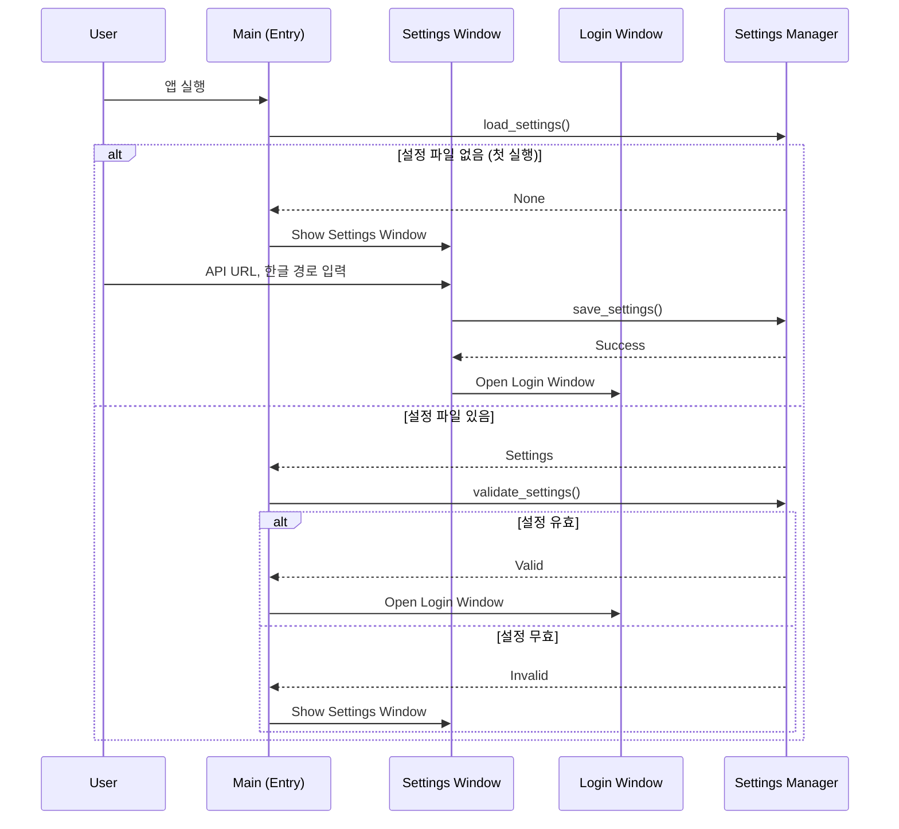
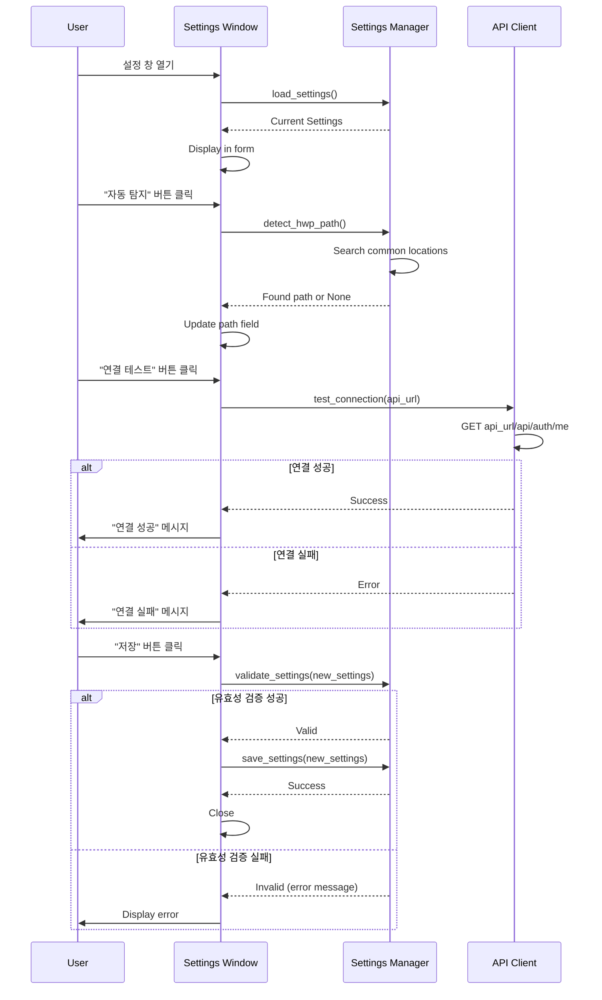
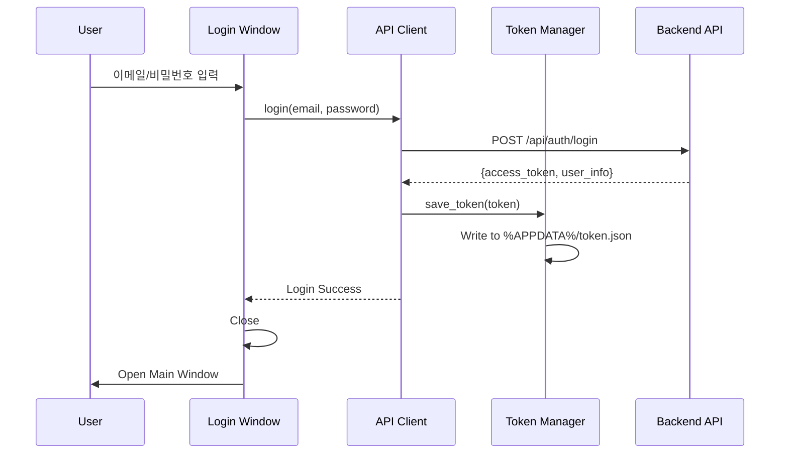
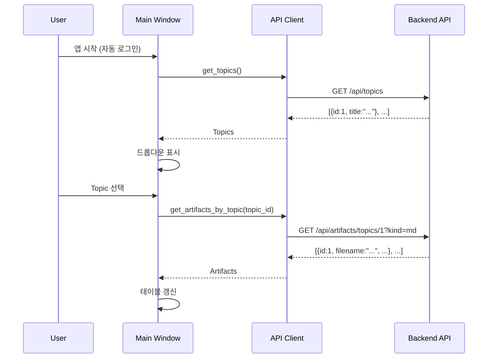
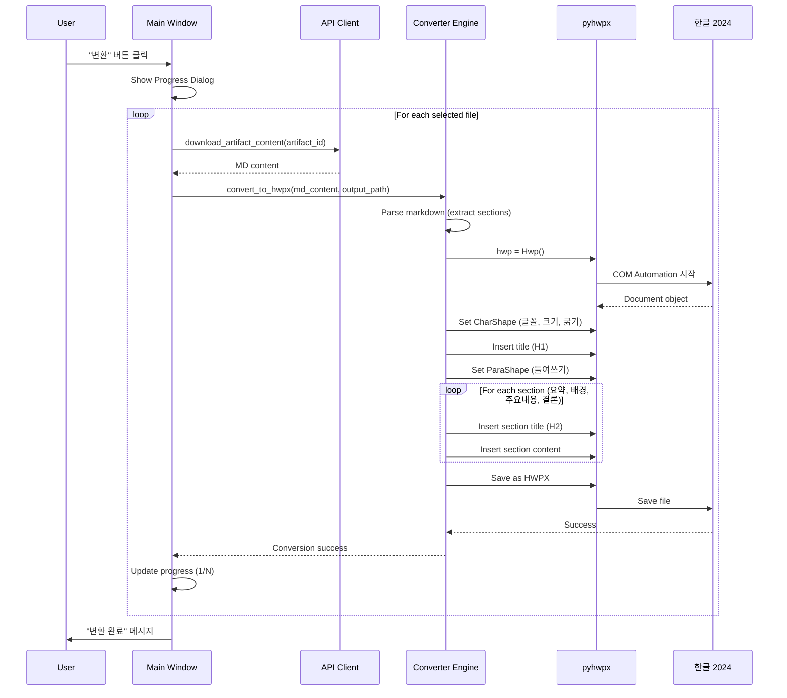

# HWPX Desktop Converter Application 개발 계획

**문서 번호:** 08
**작성일:** 2025-11-05
**버전:** 1.1
**목적:** 사용자 PC에서 Markdown 파일을 고품질 HWPX로 변환하는 Desktop Application 개발
**대상 환경:** Windows 11, 한컴오피스 2024

**변경 이력:**
- v1.1 (2025-11-05): 설정 화면 추가 (API URL, 한글 경로 등 사용자 설정 가능)
- v1.0 (2025-11-05): 초기 버전

---

## 1. 개요

### 1.1 배경

현재 프로젝트는 서버에서 Markdown → HWPX 변환을 수행하며, 기본적인 텍스트 서식만 지원합니다.
사용자 환경(Windows 11 + 한컴 2024)에서 `pyhwpx` 라이브러리를 활용하면 **네이티브 HWP 서식**(굵기, 색상, 표, 이미지 등)을 완벽하게 지원할 수 있습니다.

### 1.2 목표

**사용자가 로컬 PC에서 실행하는 단독 실행 파일(.exe)을 개발하여:**
1. 백엔드 API 로그인 (JWT 인증)
2. 변환 가능한 Markdown 파일 목록 조회
3. 선택한 파일을 pyhwpx로 고품질 HWPX 변환
4. 변환된 파일을 사용자 지정 경로에 저장

### 1.3 핵심 가치

| 항목 | 설명 |
|------|------|
| **서버 부하 제로** | 모든 변환 작업이 사용자 PC에서 수행 |
| **고품질 출력** | pyhwpx의 CharShape, ParaShape 활용 |
| **설치 불필요** | 단일 .exe 파일만 실행 (PyInstaller) |
| **보안 강화** | 민감한 문서가 서버를 거치지 않음 |
| **오프라인 가능** | MD 파일만 다운로드하면 오프라인 변환 가능 |

---

## 2. 아키텍처

### 2.1 전체 시스템 구조

```mermaid
graph TB
    subgraph "Desktop App (.exe)"
        S[Settings Window] --> A[Login Window]
        A --> B[Main Window]
        B --> C[API Client]
        B --> D[Converter Engine]
        C --> E[Token Manager]
        D --> F[pyhwpx]
        B -.-> S
    end

    subgraph "Backend API (FastAPI)"
        G[/api/auth/login]
        H[/api/artifacts/topics/:id]
        I[/api/artifacts/:id/content]
    end

    A -->|POST credentials| G
    G -->|return JWT| E
    C -->|GET with token| H
    C -->|GET with token| I
    D -->|convert| F
    F --> J[HWPX File]

    style S fill:#fff3cd
    style A fill:#e1f5ff
    style B fill:#e1f5ff
    style J fill:#d4edda
```

### 2.2 디렉토리 구조

```
hwp-report-generator/
├── DesktopApp/                      # 신규 디렉토리 (Desktop App 전용)
│   ├── src/
│   │   ├── main.py                  # 애플리케이션 진입점
│   │   ├── config.py                # 설정 (API URL, 경로 등)
│   │   ├── ui/
│   │   │   ├── __init__.py
│   │   │   ├── settings_window.py   # 설정 창 (API URL, 한글 경로 등)
│   │   │   ├── login_window.py      # 로그인 창
│   │   │   ├── main_window.py       # 메인 창 (파일 목록, 변환)
│   │   │   └── progress_dialog.py   # 진행 상태 다이얼로그
│   │   ├── api/
│   │   │   ├── __init__.py
│   │   │   ├── client.py            # FastAPI 클라이언트 (requests)
│   │   │   └── token_manager.py     # JWT 토큰 관리
│   │   ├── converter/
│   │   │   ├── __init__.py
│   │   │   ├── engine.py            # 변환 엔진 (pyhwpx 래퍼)
│   │   │   └── markdown_parser.py   # MD 파싱 (백엔드 코드 재사용)
│   │   └── resources/               # 아이콘, 이미지
│   │       └── icon.ico
│   ├── requirements.txt             # Python 의존성
│   ├── build.spec                   # PyInstaller 설정
│   ├── build.ps1                    # 빌드 스크립트 (PowerShell)
│   └── README.md                    # Desktop App 사용 가이드
│
├── backend/                         # 기존 백엔드 (FastAPI)
├── frontend/                        # 기존 프론트엔드 (React)
└── ...
```

### 2.3 컴포넌트 설계

#### 2.3.1 API Client (api/client.py)

**역할:** 백엔드 FastAPI와 HTTP 통신

**주요 메서드:**
- `login(email, password)` → JWT 토큰 발급
- `get_user_info()` → 현재 사용자 정보
- `get_topics()` → 사용자의 Topic 목록
- `get_artifacts_by_topic(topic_id)` → Topic별 Artifact 목록
- `download_artifact_content(artifact_id)` → MD 내용 다운로드

#### 2.3.2 Token Manager (api/token_manager.py)

**역할:** JWT 토큰 로컬 저장/로드

**저장 위치:** `%APPDATA%\HWPConverter\token.json`

**보안:**
- Windows DPAPI로 암호화 저장 (선택적)
- 토큰 만료 시 자동 로그아웃

#### 2.3.3 Converter Engine (converter/engine.py)

**역할:** pyhwpx로 MD → HWPX 변환

**주요 기능:**
- Markdown 파싱 (백엔드의 `markdown_parser.py` 재사용)
- HWP 문서 생성 및 서식 적용
- CharShape (글꼴, 크기, 색상, 굵기)
- ParaShape (문단 정렬, 들여쓰기, 줄간격)

#### 2.3.4 Settings Manager (config.py)

**역할:** 사용자 설정 저장/로드

**저장 위치:** `%APPDATA%\HWPConverter\settings.json`

**설정 항목:**
- `api_base_url`: 백엔드 API URL (기본값: `http://localhost:8000`)
- `hwp_install_path`: 한글 설치 경로 (기본값: `C:\Program Files\Hnc\Hwp2024\Hwp.exe`)
- `default_save_path`: 기본 저장 경로 (기본값: `%USERPROFILE%\Documents\HWP Reports`)
- `auto_detect_hwp`: 한글 경로 자동 탐지 여부 (기본값: `true`)

**주요 메서드:**
- `load_settings()` → 설정 로드 (없으면 기본값)
- `save_settings(settings)` → 설정 저장
- `detect_hwp_path()` → 한글 설치 경로 자동 탐지
- `validate_settings()` → 설정 유효성 검사

#### 2.3.5 UI Components (ui/)

**Settings Window:**
- 첫 실행 시 자동 표시 (설정 파일 없을 때)
- 메인 창에서 "설정" 버튼으로 접근 가능
- API URL, 한글 경로, 기본 저장 경로 입력
- "자동 탐지" 버튼 (한글 설치 경로)
- "연결 테스트" 버튼 (API URL 검증)

**Login Window:**
- 이메일/비밀번호 입력
- 로그인 버튼 → JWT 발급 → Main Window 전환
- "설정" 버튼 → Settings Window 열기

**Main Window:**
- Topic 선택 드롭다운
- Artifact 목록 테이블 (체크박스, 파일명, 생성일, 크기)
- "변환" 버튼 → 선택 파일 일괄 변환
- 저장 경로 선택 (Browse 버튼)
- 상단 메뉴: "설정" 버튼

**Progress Dialog:**
- 변환 진행률 표시 (1/N 파일 완료)
- 현재 처리 중인 파일명
- 취소 버튼

---

## 3. 백엔드 API 수정 사항

### 3.1 기존 API 활용

Desktop App은 **기존 API**를 최대한 활용합니다.

| 엔드포인트 | 용도 | 상태 |
|------------|------|------|
| `POST /api/auth/login` | 로그인 (JWT 발급) | ✅ 사용 가능 |
| `GET /api/auth/me` | 사용자 정보 조회 | ✅ 사용 가능 |
| `GET /api/topics` | Topic 목록 조회 | ✅ 사용 가능 |
| `GET /api/artifacts/topics/{topic_id}` | Topic별 Artifact 목록 | ✅ 사용 가능 |
| `GET /api/artifacts/{artifact_id}/content` | MD 내용 조회 | ✅ 사용 가능 |

### 3.2 신규 API (선택적)

**Desktop App 전용 API가 필요한 경우에만 추가합니다.**

#### 3.2.1 일괄 다운로드 API (Optional)

**여러 Artifact를 한 번에 다운로드 (ZIP 형태):**

```python
# backend/app/routers/artifacts.py

@router.post("/batch-download", summary="Batch download artifacts")
async def batch_download_artifacts(
    artifact_ids: List[int],
    current_user: User = Depends(get_current_active_user)
):
    """여러 Artifact를 한 번에 ZIP으로 다운로드합니다.

    Args:
        artifact_ids: 다운로드할 Artifact ID 목록

    Returns:
        ZIP 파일 (FileResponse)

    Examples:
        Request:
        POST /api/artifacts/batch-download
        {
          "artifact_ids": [1, 2, 3]
        }

        Response:
        - Content-Type: application/zip
        - Content-Disposition: attachment; filename="artifacts_20251105_153045.zip"
    """
    # 권한 확인
    for artifact_id in artifact_ids:
        artifact = ArtifactDB.get_artifact_by_id(artifact_id)
        if not artifact or artifact.topic.user_id != current_user.id:
            return error_response(
                code=ErrorCode.ARTIFACT_NOT_FOUND,
                http_status=404,
                message=f"Artifact {artifact_id}를 찾을 수 없습니다."
            )

    # ZIP 생성
    import zipfile
    from datetime import datetime

    zip_filename = f"artifacts_{datetime.now().strftime('%Y%m%d_%H%M%S')}.zip"
    zip_path = ProjectPath.BACKEND / "temp" / zip_filename

    with zipfile.ZipFile(zip_path, 'w') as zipf:
        for artifact_id in artifact_ids:
            artifact = ArtifactDB.get_artifact_by_id(artifact_id)
            zipf.write(artifact.file_path, arcname=artifact.filename)

    return FileResponse(
        path=str(zip_path),
        filename=zip_filename,
        media_type="application/zip"
    )
```

**장점:** 네트워크 요청 횟수 감소 (N개 → 1개)
**단점:** 파일이 많으면 ZIP 생성 시간 증가

**판단:** 초기 버전에서는 **개별 다운로드**로 시작, 성능 이슈 발생 시 추가

---

## 4. 상세 설계

### 4.1 앱 시작 플로우



### 4.2 설정 화면 플로우



### 4.3 인증 플로우



**에러 처리:**
- 잘못된 이메일/비밀번호 → "로그인 정보를 확인하세요" 메시지
- 네트워크 오류 → "서버 연결 실패" 메시지 + "설정" 버튼 제공
- 계정 미승인 → "관리자 승인 대기 중입니다" 메시지

### 4.4 파일 목록 조회 플로우



**UI:**
- Topic 드롭다운 (최신순 정렬)
- Artifact 테이블 (체크박스, 파일명, 생성일, 크기)
- 필터: Markdown만 표시 (`kind=md`)

### 4.5 변환 플로우



**에러 처리:**
- 한글 2024 미설치 → "한컴오피스 2024가 설치되어 있지 않습니다" 안내
- 변환 실패 → 로그 파일 생성 (`%APPDATA%\HWPConverter\logs\error.log`)
- 저장 경로 권한 없음 → "저장 경로를 확인하세요" 메시지

### 4.6 pyhwpx 변환 로직 (Pseudo Code)

```python
# converter/engine.py

from pyhwpx import Hwp
from .markdown_parser import parse_markdown_to_content

class ConverterEngine:
    """Markdown → HWPX 변환 엔진 (pyhwpx 사용)"""

    def convert(self, md_content: str, output_path: str) -> bool:
        """Markdown을 HWPX로 변환합니다.

        Args:
            md_content: Markdown 텍스트
            output_path: 출력 HWPX 파일 경로

        Returns:
            변환 성공 여부

        Examples:
            >>> engine = ConverterEngine()
            >>> success = engine.convert(md_text, "report.hwpx")
            >>> print(success)
            True
        """
        hwp = Hwp()
        hwp.XHwpWindows.Item(0).Visible = False  # 백그라운드 실행

        try:
            # 1. 새 문서 생성
            hwp.HAction.GetDefault("FileNew", hwp.HParameterSet.HFileOpenSave.HSet)
            hwp.HAction.Execute("FileNew", hwp.HParameterSet.HFileOpenSave.HSet)

            # 2. Markdown 파싱 (백엔드 코드 재사용)
            content = parse_markdown_to_content(md_content)

            # 3. 제목 삽입 (H1 스타일)
            self._insert_title(hwp, content["title"])

            # 4. 각 섹션 삽입
            sections = [
                (content["title_summary"], content["summary"]),
                (content["title_background"], content["background"]),
                (content["title_main_content"], content["main_content"]),
                (content["title_conclusion"], content["conclusion"])
            ]

            for section_title, section_content in sections:
                if section_content:
                    self._insert_section(hwp, section_title, section_content)

            # 5. 저장
            hwp.HAction.GetDefault("FileSaveAs", hwp.HParameterSet.HFileOpenSave.HSet)
            hwp.HParameterSet.HFileOpenSave.filename = output_path
            hwp.HParameterSet.HFileOpenSave.Format = "HWPX"
            hwp.HAction.Execute("FileSaveAs", hwp.HParameterSet.HFileOpenSave.HSet)

            return True

        except Exception as e:
            print(f"변환 실패: {e}")
            return False

        finally:
            hwp.Quit()

    def _insert_title(self, hwp, title: str):
        """제목 삽입 (H1 스타일)"""
        # CharShape: 맑은 고딕, 20pt, 굵게
        hwp.HAction.GetDefault("CharShape", hwp.HParameterSet.HCharShape.HSet)
        hwp.HParameterSet.HCharShape.FontName = "맑은 고딕"
        hwp.HParameterSet.HCharShape.FontSize = 20
        hwp.HParameterSet.HCharShape.Bold = True
        hwp.HAction.Execute("CharShape", hwp.HParameterSet.HCharShape.HSet)

        # 텍스트 삽입
        hwp.HAction.GetDefault("InsertText", hwp.HParameterSet.HInsertText.HSet)
        hwp.HParameterSet.HInsertText.Text = title
        hwp.HAction.Execute("InsertText", hwp.HParameterSet.HInsertText.HSet)

        # 줄바꿈 2회
        hwp.HAction.Run("BreakPara")
        hwp.HAction.Run("BreakPara")

    def _insert_section(self, hwp, section_title: str, section_content: str):
        """섹션 삽입 (H2 제목 + 본문)"""
        # 섹션 제목 (H2 스타일)
        hwp.HParameterSet.HCharShape.FontSize = 16
        hwp.HParameterSet.HCharShape.Bold = True
        hwp.HAction.Execute("CharShape", hwp.HParameterSet.HCharShape.HSet)
        hwp.HParameterSet.HInsertText.Text = section_title
        hwp.HAction.Execute("InsertText", hwp.HParameterSet.HInsertText.HSet)
        hwp.HAction.Run("BreakPara")

        # 본문 (일반 텍스트)
        hwp.HParameterSet.HCharShape.FontSize = 11
        hwp.HParameterSet.HCharShape.Bold = False
        hwp.HAction.Execute("CharShape", hwp.HParameterSet.HCharShape.HSet)

        # 문단 들여쓰기
        hwp.HAction.GetDefault("ParaShape", hwp.HParameterSet.HParaShape.HSet)
        hwp.HParameterSet.HParaShape.IndentLeft = 500  # 5mm
        hwp.HAction.Execute("ParaShape", hwp.HParameterSet.HParaShape.HSet)

        hwp.HParameterSet.HInsertText.Text = section_content
        hwp.HAction.Execute("InsertText", hwp.HParameterSet.HInsertText.HSet)
        hwp.HAction.Run("BreakPara")
        hwp.HAction.Run("BreakPara")
```

---

## 5. UI 디자인

### 5.1 설정 창 (settings_window.py)

```
┌───────────────────────────────────────────────────────────┐
│  HWP Report Converter - 설정                               │
├───────────────────────────────────────────────────────────┤
│                                                             │
│  백엔드 API 설정                                            │
│  ┌─────────────────────────────────────────────────────┐ │
│  │ API URL: [http://localhost:8000_______________]    │ │
│  │                                    [연결 테스트]     │ │
│  └─────────────────────────────────────────────────────┘ │
│                                                             │
│  한글 설치 경로                                             │
│  ┌─────────────────────────────────────────────────────┐ │
│  │ 경로: [C:\Program Files\Hnc\Hwp2024\Hwp.exe____]   │ │
│  │                            [찾아보기] [자동 탐지]   │ │
│  └─────────────────────────────────────────────────────┘ │
│                                                             │
│  기본 저장 경로                                             │
│  ┌─────────────────────────────────────────────────────┐ │
│  │ 경로: [C:\Users\홍길동\Documents\HWP Reports___]   │ │
│  │                                    [찾아보기]       │ │
│  └─────────────────────────────────────────────────────┘ │
│                                                             │
│  [ ] 한글 설치 경로 자동 탐지                               │
│                                                             │
│                              [저장] [취소]                  │
│                                                             │
└───────────────────────────────────────────────────────────┘
```

**구현:**
- `QLineEdit` (API URL, 한글 경로, 저장 경로)
- `QPushButton` (연결 테스트, 찾아보기, 자동 탐지, 저장, 취소)
- `QCheckBox` (자동 탐지 여부)
- `QFileDialog` (경로 선택)

**동작:**
- **연결 테스트:** API URL에 GET 요청 → 성공/실패 메시지 표시
- **자동 탐지:** 일반적인 한글 설치 경로 검색 (`C:\Program Files\Hnc\`, `C:\Program Files (x86)\Hnc\`)
- **저장:** 설정 유효성 검사 → `settings.json`에 저장
- **첫 실행 시:** 이 창이 먼저 표시됨

### 5.2 로그인 창 (login_window.py)

```
┌─────────────────────────────────────┐
│  HWP Report Converter               │
├─────────────────────────────────────┤
│                                     │
│  Email:    [___________________]    │
│                                     │
│  Password: [___________________]    │
│                                     │
│  [ ] 로그인 정보 기억                │
│                                     │
│    [로그인]  [설정]  [취소]         │
│                                     │
└─────────────────────────────────────┘
```

**구현:**
- `QLineEdit` (이메일, 비밀번호)
- `QCheckBox` (로그인 정보 기억)
- `QPushButton` (로그인, 설정, 취소)

**동작:**
- **설정 버튼:** 설정 창 열기 (API URL 변경 시)

### 5.3 메인 창 (main_window.py)

```
┌─────────────────────────────────────────────────────────────┐
│  HWP Report Converter                      사용자: 홍길동    │
├─────────────────────────────────────────────────────────────┤
│  [새로고침] [설정] [로그아웃]                                │
├─────────────────────────────────────────────────────────────┤
│                                                               │
│  주제(Topic):  [디지털뱅킹 트렌드 분석 ▼]                    │
│                                                               │
│  ┌─────────────────────────────────────────────────────┐   │
│  │ ☐  파일명                  │ 생성일        │ 크기   │   │
│  ├───────────────────────────────────────────────────┤   │
│  │ ☑  디지털뱅킹-보고서.md    │ 2025-11-05   │ 15KB  │   │
│  │ ☑  AI트렌드-분석.md        │ 2025-11-04   │ 23KB  │   │
│  │ ☐  핀테크-현황.md          │ 2025-11-03   │ 18KB  │   │
│  │ ☐  ...                     │ ...          │ ...   │   │
│  └─────────────────────────────────────────────────────┘   │
│                                                               │
│  저장 경로: [C:\Users\홍길동\Documents\Reports]  [찾아보기]  │
│                                                               │
│  선택: 2개 파일                             [변환 시작]       │
│                                                               │
└─────────────────────────────────────────────────────────────┘
```

**구현:**
- `QComboBox` (Topic 드롭다운)
- `QTableWidget` (Artifact 목록, 체크박스)
- `QLineEdit` + `QPushButton` (저장 경로 선택)
- `QPushButton` (변환 시작)

### 5.4 진행 상태 다이얼로그 (progress_dialog.py)

```
┌─────────────────────────────────────┐
│  변환 중...                          │
├─────────────────────────────────────┤
│                                     │
│  디지털뱅킹-보고서.md → HWPX        │
│  [████████████░░░░░░░░] 60%        │
│                                     │
│  진행: 1/2 파일 완료                │
│                                     │
│           [취소]                    │
│                                     │
└─────────────────────────────────────┘
```

**구현:**
- `QProgressDialog`
- 파일별 진행률 업데이트
- 취소 버튼 (변환 중단)

---

## 6. 구현 단계

### Phase 1: 프로젝트 초기화 및 인증 (1주)

**목표:** 로그인/로그아웃 기능 완성

#### 작업 목록

1. **디렉토리 구조 생성**
   ```bash
   cd D:\WorkSpace\hwp-report\hwp-report-generator
   mkdir DesktopApp
   cd DesktopApp
   mkdir src\ui src\api src\converter src\resources
   ```

2. **requirements.txt 작성**
   ```
   PyQt5==5.15.10
   requests==2.31.0
   pyhwpx==0.1.0
   pywin32==306
   pyinstaller==6.3.0
   ```

3. **config.py 작성 (Settings Manager)**
   ```python
   import os
   import json
   from pathlib import Path
   from typing import Optional, Dict

   class SettingsManager:
       """사용자 설정 관리"""

       APP_DATA_DIR = Path(os.getenv("APPDATA")) / "HWPConverter"
       SETTINGS_FILE = APP_DATA_DIR / "settings.json"
       TOKEN_FILE = APP_DATA_DIR / "token.json"
       LOG_DIR = APP_DATA_DIR / "logs"

       DEFAULT_SETTINGS = {
           "api_base_url": "http://localhost:8000",
           "hwp_install_path": r"C:\Program Files\Hnc\Hwp2024\Hwp.exe",
           "default_save_path": str(Path.home() / "Documents" / "HWP Reports"),
           "auto_detect_hwp": True
       }

       @classmethod
       def load_settings(cls) -> Optional[Dict]:
           """설정 파일 로드"""
           if not cls.SETTINGS_FILE.exists():
               return None

           try:
               with open(cls.SETTINGS_FILE, 'r', encoding='utf-8') as f:
                   settings = json.load(f)
               return settings
           except Exception as e:
               print(f"설정 로드 실패: {e}")
               return None

       @classmethod
       def save_settings(cls, settings: Dict) -> bool:
           """설정 저장"""
           try:
               cls.APP_DATA_DIR.mkdir(parents=True, exist_ok=True)
               with open(cls.SETTINGS_FILE, 'w', encoding='utf-8') as f:
                   json.dump(settings, f, indent=2, ensure_ascii=False)
               return True
           except Exception as e:
               print(f"설정 저장 실패: {e}")
               return False

       @classmethod
       def validate_settings(cls, settings: Dict) -> tuple[bool, Optional[str]]:
           """설정 유효성 검사"""
           # API URL 검증
           api_url = settings.get("api_base_url")
           if not api_url or not api_url.startswith(("http://", "https://")):
               return False, "유효한 API URL을 입력하세요."

           # 한글 경로 검증
           hwp_path = settings.get("hwp_install_path")
           if hwp_path and not Path(hwp_path).exists():
               return False, "한글 설치 경로가 존재하지 않습니다."

           return True, None

       @classmethod
       def detect_hwp_path(cls) -> Optional[str]:
           """한글 설치 경로 자동 탐지"""
           common_paths = [
               r"C:\Program Files\Hnc\Hwp2024\Hwp.exe",
               r"C:\Program Files (x86)\Hnc\Hwp2024\Hwp.exe",
               r"C:\Program Files\Hnc\Office NEO\Hwp.exe",
               r"C:\Program Files (x86)\Hnc\Office NEO\Hwp.exe",
           ]

           for path in common_paths:
               if Path(path).exists():
                   return path

           return None

   class Config:
       """애플리케이션 전역 설정"""
       VERSION = "1.0.0"
       APP_NAME = "HWP Report Converter"
   ```

4. **Settings Manager 구현**
   - `config.py` - 설정 저장/로드/검증
   - `detect_hwp_path()` - 한글 경로 자동 탐지

5. **API Client 구현**
   - `api/client.py` - requests 기반 HTTP 클라이언트
   - `api/token_manager.py` - JWT 토큰 로컬 저장/로드
   - `test_connection()` - API 연결 테스트

6. **Settings Window 구현**
   - `ui/settings_window.py` - PyQt5 설정 창
   - API URL, 한글 경로, 기본 저장 경로 입력
   - "자동 탐지", "연결 테스트" 버튼

7. **Login Window 구현**
   - `ui/login_window.py` - PyQt5 로그인 창
   - 이메일/비밀번호 입력
   - "설정" 버튼 추가
   - 로그인 성공 시 토큰 저장 및 Main Window 전환

8. **Main 진입점 구현**
   - `main.py` - 앱 시작 로직
   - 설정 파일 존재 여부 확인
   - 첫 실행 시 Settings Window 표시

9. **테스트**
   - 첫 실행 시 설정 창 표시 확인
   - 자동 탐지 기능 확인
   - API 연결 테스트 확인
   - 설정 저장/로드 확인
   - 로그인 성공 시 토큰 저장

**완료 기준:**
- [x] 첫 실행 시 설정 창 자동 표시
- [x] 한글 경로 자동 탐지 성공
- [x] API 연결 테스트 성공
- [x] 설정 저장 → 앱 재시작 → 설정 유지
- [x] 로그인 성공 시 JWT 토큰 저장
- [x] 토큰으로 `/api/auth/me` 호출 성공

---

### Phase 2: 파일 목록 및 다운로드 (1주)

**목표:** Topic/Artifact 목록 조회 및 선택 기능

#### 작업 목록

1. **Main Window UI 구현**
   - `ui/main_window.py` - 메인 창
   - Topic 드롭다운
   - Artifact 테이블 (체크박스, 파일명, 생성일, 크기)
   - 저장 경로 선택

2. **API Client 확장**
   - `get_topics()` - Topic 목록 조회
   - `get_artifacts_by_topic(topic_id)` - Artifact 목록 조회
   - `download_artifact_content(artifact_id)` - MD 내용 다운로드

3. **파일 다운로드 로직**
   - 선택된 artifact_id로 MD 내용 다운로드
   - 임시 디렉토리에 저장 (`%TEMP%\hwp_converter\`)

4. **테스트**
   - Topic 목록 조회 및 드롭다운 표시
   - Topic 선택 시 Artifact 목록 갱신
   - Artifact 선택 및 다운로드 확인

**완료 기준:**
- [x] Topic 드롭다운에 최신 10개 표시
- [x] Artifact 테이블에 MD 파일만 필터링
- [x] 다중 선택 가능 (Ctrl+Click, Shift+Click)

---

### Phase 3: 변환 엔진 (1주)

**목표:** pyhwpx로 MD → HWPX 변환

#### 작업 목록

1. **Markdown Parser 이식**
   - `converter/markdown_parser.py` - 백엔드 코드 복사
   - `parse_markdown_to_content()` 함수
   - `markdown_to_plain_text()` 함수

2. **Converter Engine 구현**
   - `converter/engine.py` - pyhwpx 래퍼
   - CharShape, ParaShape 설정
   - 섹션별 서식 적용 (H1, H2, 본문)

3. **Progress Dialog 구현**
   - `ui/progress_dialog.py` - QProgressDialog
   - 파일별 진행률 표시
   - 취소 버튼

4. **오류 처리**
   - 한글 2024 미설치 시 안내
   - 변환 실패 시 에러 메시지
   - 로그 파일 생성 (`%APPDATA%\HWPConverter\logs\error.log`)

5. **테스트**
   - 실제 MD 파일로 HWPX 생성
   - 한글 2024에서 파일 열어 확인
   - CharShape/ParaShape 적용 확인

**완료 기준:**
- [x] H1 제목: 맑은 고딕, 20pt, 굵게
- [x] H2 제목: 맑은 고딕, 16pt, 굵게
- [x] 본문: 맑은 고딕, 11pt, 들여쓰기 5mm
- [x] 변환 성공 시 HWPX 파일 정상 출력

---

### Phase 4: 패키징 및 배포 (3일)

**목표:** 단일 .exe 파일 생성 및 배포

#### 작업 목록

1. **PyInstaller 설정**
   - `build.spec` 파일 작성
   - 의존성 포함 확인 (PyQt5 DLL, pyhwpx)

2. **빌드 스크립트 작성**
   ```powershell
   # build.ps1
   pyinstaller --onefile `
               --windowed `
               --name HWPConverter `
               --icon resources/icon.ico `
               --add-data "resources;resources" `
               src/main.py
   ```

3. **테스트**
   - 깨끗한 Windows 11 VM에서 실행
   - 한글 2024 설치된 환경에서 변환 테스트
   - 크기 최적화 (목표: 50-80MB)

4. **배포**
   - GitHub Releases에 .exe 업로드
   - 사용자 가이드 작성 (README.md)

**완료 기준:**
- [x] .exe 파일 단독 실행 가능
- [x] 한글 2024 미설치 시 안내 메시지
- [x] 실행 파일 크기 80MB 이하

---

## 7. 기술 스택 및 의존성

### 7.1 Python 패키지

```
# DesktopApp/requirements.txt

# GUI Framework
PyQt5==5.15.10

# HTTP Client
requests==2.31.0

# HWP Automation (Windows only)
pyhwpx==0.1.0
pywin32==306

# Packaging
pyinstaller==6.3.0

# Utilities (Optional)
cryptography==41.0.7  # Windows DPAPI 대체용
```

### 7.2 외부 의존성

| 항목 | 버전 | 필수 여부 | 용도 |
|------|------|-----------|------|
| **Windows** | 11 | 필수 | OS 환경 |
| **한컴오피스** | 2024 | 필수 | pyhwpx COM Automation |
| **Python** | 3.10+ | 빌드 시 | 개발 환경 |

### 7.3 라이선스 비용

| 항목 | 라이선스 | 비용 |
|------|---------|------|
| PyQt5 | GPL / Commercial | **무료 (GPL)** (내부 사용) |
| pyhwpx | MIT | **무료** |
| PyInstaller | GPL | **무료** |
| 한컴오피스 2024 | 상용 | 사용자 보유 (추가 비용 없음) |

**총 비용:** 0원 (내부 사용 시)

---

## 8. 보안 고려사항

### 8.1 JWT 토큰 저장

**문제점:** 로컬 파일에 평문 저장 시 탈취 위험

**해결책:**

**Option 1: Windows DPAPI 사용 (권장)**
```python
# api/token_manager.py
import win32crypt
import json

def save_token(token: str):
    """토큰을 암호화하여 저장"""
    encrypted = win32crypt.CryptProtectData(
        token.encode('utf-8'),
        None,  # Description
        None,  # Optional entropy
        None,  # Reserved
        None,  # PromptStruct
        0      # Flags
    )

    token_file = Config.TOKEN_FILE
    token_file.parent.mkdir(parents=True, exist_ok=True)

    with open(token_file, 'wb') as f:
        f.write(encrypted)

def load_token() -> str:
    """저장된 토큰을 복호화하여 로드"""
    token_file = Config.TOKEN_FILE
    if not token_file.exists():
        return None

    with open(token_file, 'rb') as f:
        encrypted = f.read()

    _, decrypted = win32crypt.CryptUnprotectData(
        encrypted,
        None,  # Optional entropy
        None,  # Reserved
        None,  # PromptStruct
        0      # Flags
    )

    return decrypted.decode('utf-8')
```

**Option 2: 메모리에만 저장 (재시작 시 재로그인)**
- 보안은 강화되지만 사용자 경험 저하

### 8.2 HTTPS 통신

**프로덕션 환경:**
- API URL은 반드시 HTTPS 사용 (`https://api.yourbank.com`)
- 인증서 검증 활성화

**개발 환경:**
- HTTP 허용 (`http://localhost:8000`)

```python
# api/client.py
import requests

class APIClient:
    def __init__(self, base_url: str):
        self.base_url = base_url
        self.verify_ssl = not base_url.startswith("http://localhost")
```

### 8.3 API Key 노출 방지

**설계:**
- Desktop App에는 Claude API Key가 **없음**
- Claude API는 **백엔드에서만** 호출
- Desktop App은 사용자 인증(JWT)만 사용

**장점:** .exe 파일을 디컴파일해도 API Key 노출 불가

---

## 9. 예상 일정 및 리소스

### 9.1 개발 일정

| 단계 | 기간 | 담당 | 완료 기준 |
|------|------|------|-----------|
| **Phase 1:** 인증 | 1주 | 개발자 1명 | 로그인/로그아웃 성공 |
| **Phase 2:** 파일 관리 | 1주 | 개발자 1명 | Topic/Artifact 목록 조회 |
| **Phase 3:** 변환 엔진 | 1주 | 개발자 1명 | HWPX 생성 성공 |
| **Phase 4:** 패키징 | 3일 | 개발자 1명 | .exe 단독 실행 가능 |
| **총 개발 기간** | **약 4주** | | |

### 9.2 리소스 요구사항

**개발 환경:**
- Windows 11 PC (한컴오피스 2024 설치)
- Python 3.10+
- Visual Studio Code or PyCharm

**테스트 환경:**
- Windows 11 VM (깨끗한 환경)
- 한컴오피스 2024 설치

**배포 환경:**
- GitHub Releases (무료)

---

## 10. 대안 비교

### 10.1 구현 방식 비교

| 방식 | 장점 | 단점 | 추천도 |
|------|------|------|--------|
| **Desktop App (.exe)** | 설치 불필요, pyhwpx 직접 사용, 오프라인 가능 | PyQt5 학습 필요 | ✅ **추천** |
| **Browser Extension** | 웹 통합, 크로스 플랫폼 | Native Messaging 복잡, pyhwpx 사용 어려움 | ⚠️ 선택적 |
| **Web App + Local Service** | UI 개발 간편 | 프로그램 설치 필요, 포트 충돌 위험 | ⚠️ 선택적 |

**결론:** Desktop App (.exe) 방식이 가장 적합합니다.

### 10.2 서버 변환 vs 클라이언트 변환

| 항목 | 서버 변환 (현재) | Desktop App (제안) |
|------|------------------|-------------------|
| **서버 부하** | 높음 | 없음 (사용자 PC) |
| **서식 품질** | 기본 (텍스트만) | 고급 (pyhwpx 네이티브) |
| **속도** | 네트워크 지연 | 빠름 (로컬) |
| **보안** | 서버 경유 | 로컬 처리 |
| **환경 요구사항** | 없음 | Windows 11 + 한컴 2024 |

**권장 전략:** **하이브리드 접근**
- **서버 변환 (기본):** 모든 사용자에게 제공 (현재 방식 유지)
- **Desktop App (고급):** Windows + 한컴 2024 사용자에게 선택적 제공

---

## 11. 사용자 가이드 (초안)

### 11.1 설치 가이드

**시스템 요구사항:**
- Windows 11 (64-bit)
- 한컴오피스 2024
- 인터넷 연결 (로그인 시)

**설치 방법:**
1. GitHub Releases에서 `HWPConverter.exe` 다운로드
2. 더블클릭하여 실행
3. Windows Defender 경고 시 "추가 정보" → "실행" 클릭

**참고:** 별도 설치 프로그램 없음. .exe 파일만 실행하면 됩니다.

### 11.2 사용 가이드

**1단계: 초기 설정 (첫 실행 시)**
- 앱 실행 시 설정 창이 자동으로 표시됨
- **API URL 입력:**
  - 개발 환경: `http://localhost:8000`
  - 프로덕션: `https://api.yourbank.com`
  - "연결 테스트" 버튼으로 확인
- **한글 설치 경로:**
  - "자동 탐지" 버튼 클릭 (권장)
  - 또는 "찾아보기"로 수동 선택
- **기본 저장 경로:**
  - 변환된 HWPX 파일이 저장될 경로
- "저장" 버튼 클릭

**2단계: 로그인**
- 이메일과 비밀번호 입력
- "로그인" 버튼 클릭
- (API URL 변경 필요 시 "설정" 버튼 클릭)

**3단계: 주제 선택**
- 드롭다운에서 변환할 보고서의 주제(Topic) 선택
- Artifact 목록이 자동으로 표시됨

**4단계: 파일 선택**
- 변환할 파일을 체크박스로 선택 (다중 선택 가능)
- "찾아보기" 버튼으로 저장 경로 지정 (선택적)

**5단계: 변환**
- "변환 시작" 버튼 클릭
- 진행 상태 확인 (1/N 파일 완료)
- 완료 시 "변환 완료" 메시지

**6단계: 확인**
- 저장 경로에서 HWPX 파일 확인
- 한글 2024로 파일 열어 확인

### 11.3 자주 묻는 질문 (FAQ)

**Q1. 첫 실행 시 설정 창이 안 나와요.**
- 설정 파일이 이미 존재하면 로그인 창이 바로 표시됩니다.
- 설정 변경이 필요하면 로그인 창의 "설정" 버튼을 클릭하세요.

**Q2. "한컴오피스 2024가 설치되어 있지 않습니다" 오류가 나요.**
- 한글 2024가 설치되어 있는지 확인하세요.
- 설정 창에서 "자동 탐지" 버튼을 클릭하세요.
- 수동으로 한글 실행 파일 경로를 지정하세요: `C:\Program Files\Hnc\Hwp2024\Hwp.exe`

**Q3. API 연결 테스트가 실패해요.**
- API URL이 정확한지 확인하세요.
- 백엔드 서버가 실행 중인지 확인하세요.
- 방화벽 설정을 확인하세요.

**Q4. 로그인이 안 돼요.**
- 이메일/비밀번호를 확인하세요.
- 관리자 승인이 완료되었는지 확인하세요.
- "설정" 버튼으로 API URL을 확인하세요.

**Q5. 변환이 실패해요.**
- 로그 파일 확인: `%APPDATA%\HWPConverter\logs\error.log`
- 한글 경로가 올바른지 확인하세요.
- GitHub Issues에 로그 파일과 함께 문의

**Q6. 변환 속도가 느려요.**
- pyhwpx는 한글 프로그램을 백그라운드로 실행합니다.
- PC 사양에 따라 속도가 달라질 수 있습니다.
- 대량 변환 시 시간이 소요됩니다.

---

## 12. 향후 개선 사항

### 12.1 Phase 5 (추후 개발)

**자동 업데이트 기능:**
- 앱 시작 시 최신 버전 확인
- 업데이트 다운로드 및 자동 설치

**일괄 변환 최적화:**
- 멀티스레딩 (병렬 변환)
- 진행 상태 실시간 표시

**고급 서식 옵션:**
- 글꼴 선택
- 색상 테마
- 페이지 레이아웃 설정

### 12.2 Phase 6 (선택적)

**오프라인 모드:**
- 로컬 DB에 MD 파일 캐싱
- 네트워크 없이 변환 가능

**변환 이력:**
- 변환한 파일 목록 저장
- 재변환 방지 (SHA256 해시 비교)

**Mac 지원:**
- PyQt5는 크로스 플랫폼
- 단, pyhwpx는 Windows 전용 (대체 방법 필요)

---

## 13. 참고 문서

### 13.1 프로젝트 문서

- [CLAUDE.md](../../CLAUDE.md) - 프로젝트 전체 가이드
- [pyhwpx 기술 검토](./pyhwpx도입관련기술검토(보류).md) - pyhwpx 상세 분석
- [Markdown to HWPX 변환 계획](./markdown_to_hwpx_enhancement_plan.md) - 서버 변환 방식

### 13.2 외부 문서

- [pyhwpx GitHub](https://github.com/choi-yong-oh/pyhwpx) - pyhwpx 라이브러리
- [PyQt5 Documentation](https://www.riverbankcomputing.com/static/Docs/PyQt5/) - PyQt5 API
- [PyInstaller Manual](https://pyinstaller.org/en/stable/) - 패키징 가이드
- [FastAPI Documentation](https://fastapi.tiangolo.com/) - 백엔드 API 참조

---

## 14. 결론

### 14.1 실현 가능성

**✅ 완전히 가능합니다.**

- pyhwpx로 고품질 HWPX 생성 가능
- PyQt5로 사용자 친화적 UI 구현 가능
- PyInstaller로 단일 .exe 생성 가능
- 기존 FastAPI 백엔드와 완벽 연동 가능

### 14.2 핵심 가치

1. **서버 부하 제로:** 변환 작업을 사용자 PC에서 수행
2. **고품질 출력:** pyhwpx의 네이티브 서식 적용
3. **설치 불필요:** 단일 .exe 파일만 실행
4. **보안 강화:** 민감한 문서가 서버를 거치지 않음
5. **오프라인 가능:** MD 파일만 다운로드하면 오프라인 변환 가능

### 14.3 권장 전략

**하이브리드 접근:**
- **서버 변환 (기본):** 모든 사용자에게 제공 (현재 방식 유지)
- **Desktop App (고급):** Windows 11 + 한컴 2024 사용자에게 선택적 제공

### 14.4 다음 단계

1. ✅ 이 계획서를 검토하고 승인
2. 개발 환경 구축 (PyQt5, pyhwpx 설치)
3. **Phase 1 시작:** 로그인 기능 개발
4. 단계별 진행 및 사용자 피드백 수집

---

**작성자:** Claude
**검토자:** [사용자]
**승인일:** [TBD]
**문서 버전:** 1.0
**마지막 업데이트:** 2025-11-05
