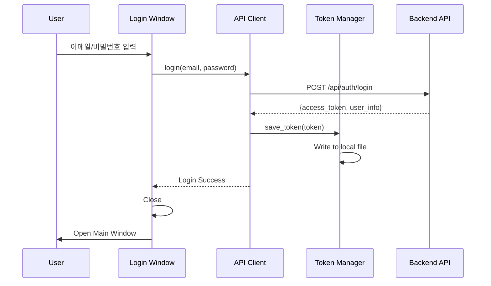
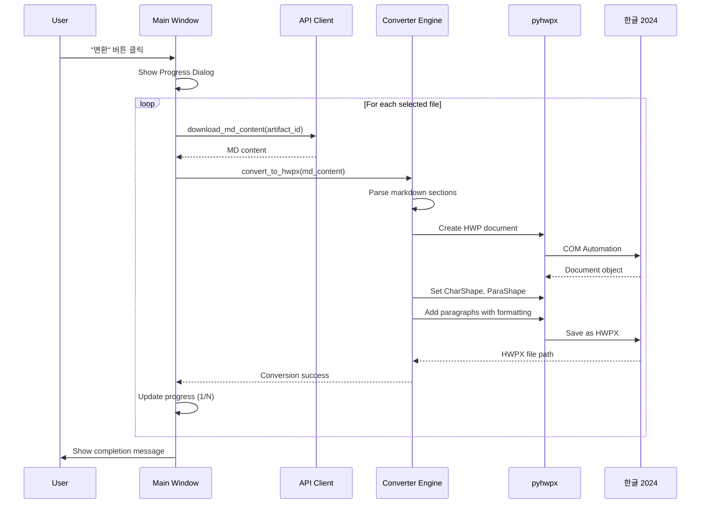

# Desktop Converter Application 구현 계획

**작성일:** 2025-11-05
**목적:** 사용자 PC에서 MD 파일을 HWPX로 변환하는 단독 실행 프로그램 설계
**대상 환경:** Windows 11, 한컴오피스 2024

---

## 1. 개요

### 1.1 목적
- 서버 부하 없이 사용자 PC에서 고품질 HWPX 변환 수행
- 별도 설치 과정 없는 단일 .exe 실행 파일 제공
- 백엔드 API와 연동하여 MD 파일 목록 조회 및 다운로드
- pyhwpx 라이브러리를 활용한 네이티브 HWP 문서 생성

### 1.2 주요 기능
1. **인증**: 백엔드 API 로그인 (JWT 토큰 발급/저장)
2. **파일 관리**: 변환 가능한 MD 파일 목록 조회
3. **변환**: 선택한 MD 파일을 HWPX로 변환 (pyhwpx 사용)
4. **진행 상태**: 변환 진행률 표시
5. **로컬 저장**: 변환된 HWPX 파일을 사용자 지정 경로에 저장

### 1.3 기술 스택
- **GUI**: PyQt5 (크로스 플랫폼 GUI 프레임워크)
- **변환 엔진**: pyhwpx (HWP COM Automation)
- **HTTP 클라이언트**: requests (백엔드 API 통신)
- **패키징**: PyInstaller (단일 .exe 생성)
- **인증**: JWT 토큰 (로컬 파일 저장)

---

## 2. 아키텍처

### 2.1 전체 구조

```mermaid
graph TB
    subgraph "Desktop App (.exe)"
        A[Login Window] --> B[Main Window]
        B --> C[API Client]
        B --> D[Converter Engine]
        C --> E[Token Manager]
        D --> F[pyhwpx]
    end

    subgraph "Backend API"
        G[/api/auth/login] --> H[JWT Token]
        I[/api/artifacts] --> J[MD File List]
        K[/api/artifacts/:id/content] --> L[MD Content]
    end

    A -->|POST credentials| G
    G -->|return token| E
    C -->|GET with token| I
    C -->|GET with token| K
    D -->|convert| F
    F --> M[HWPX File]

    style A fill:#e1f5ff
    style B fill:#e1f5ff
    style M fill:#d4edda
```

### 2.2 컴포넌트 구조

```
desktop_converter/
├── main.py                 # 애플리케이션 진입점
├── ui/
│   ├── login_window.py     # 로그인 창
│   ├── main_window.py      # 메인 창 (파일 목록, 변환)
│   └── progress_dialog.py  # 진행 상태 다이얼로그
├── api/
│   ├── client.py           # API 클라이언트 (requests)
│   └── token_manager.py    # JWT 토큰 관리
├── converter/
│   ├── engine.py           # 변환 엔진 (pyhwpx 래퍼)
│   └── markdown_parser.py  # MD 파싱 (백엔드 코드 재사용)
├── config.py               # 설정 (API URL 등)
├── resources/              # 아이콘, 이미지
└── requirements.txt
```

---

## 3. 상세 설계

### 3.1 인증 플로우



**구현 세부사항:**
- JWT 토큰을 `%APPDATA%\HWPConverter\token.json`에 저장
- 암호화 옵션: `cryptography` 라이브러리로 AES 암호화 (선택적)
- 만료 시 자동 재로그인 프롬프트

### 3.2 파일 목록 조회

**API 엔드포인트 (신규 필요):**
```
GET /api/artifacts?user_id={user_id}&type=markdown
Authorization: Bearer {token}

Response:
{
  "success": true,
  "data": [
    {
      "id": 123,
      "filename": "2025-디지털뱅킹-보고서.md",
      "created_at": "2025-11-05T10:30:00",
      "topic_title": "디지털뱅킹 트렌드",
      "version": 1,
      "size": 15234
    },
    ...
  ]
}
```

**UI:**
- QTableWidget으로 파일 목록 표시 (파일명, 생성일, 토픽, 버전, 크기)
- 다중 선택 가능 (Ctrl+Click, Shift+Click)
- "변환" 버튼 클릭 시 선택된 파일들을 순차적으로 변환

### 3.3 변환 플로우



**변환 로직 (pyhwpx):**

```python
from pyhwpx import Hwp

def convert_md_to_hwpx(md_content: str, output_path: str) -> bool:
    """
    Markdown 내용을 HWPX로 변환

    Args:
        md_content: Markdown 텍스트
        output_path: 출력 HWPX 파일 경로

    Returns:
        변환 성공 여부
    """
    hwp = Hwp()
    hwp.XHwpWindows.Item(0).Visible = False  # 백그라운드 실행

    try:
        # 1. 새 문서 생성
        hwp.HAction.GetDefault("FileNew", hwp.HParameterSet.HFileOpenSave.HSet)
        hwp.HAction.Execute("FileNew", hwp.HParameterSet.HFileOpenSave.HSet)

        # 2. Markdown 파싱
        content = parse_markdown_to_content(md_content)

        # 3. 제목 삽입 (H1)
        hwp.HAction.GetDefault("CharShape", hwp.HParameterSet.HCharShape.HSet)
        hwp.HParameterSet.HCharShape.FontName = "맑은 고딕"
        hwp.HParameterSet.HCharShape.FontSize = 20
        hwp.HParameterSet.HCharShape.Bold = True
        hwp.HAction.Execute("CharShape", hwp.HParameterSet.HCharShape.HSet)

        hwp.HAction.GetDefault("InsertText", hwp.HParameterSet.HInsertText.HSet)
        hwp.HParameterSet.HInsertText.Text = content["title"]
        hwp.HAction.Execute("InsertText", hwp.HParameterSet.HInsertText.HSet)

        hwp.HAction.Run("BreakPara")  # 줄바꿈
        hwp.HAction.Run("BreakPara")

        # 4. 각 섹션 삽입
        sections = [
            (content["title_summary"], content["summary"]),
            (content["title_background"], content["background"]),
            (content["title_main_content"], content["main_content"]),
            (content["title_conclusion"], content["conclusion"])
        ]

        for section_title, section_content in sections:
            if not section_content:
                continue

            # 섹션 제목 (H2) - 굵게, 16pt
            hwp.HParameterSet.HCharShape.FontSize = 16
            hwp.HParameterSet.HCharShape.Bold = True
            hwp.HAction.Execute("CharShape", hwp.HParameterSet.HCharShape.HSet)
            hwp.HParameterSet.HInsertText.Text = section_title
            hwp.HAction.Execute("InsertText", hwp.HParameterSet.HInsertText.HSet)
            hwp.HAction.Run("BreakPara")

            # 섹션 내용 - 일반 텍스트, 11pt
            hwp.HParameterSet.HCharShape.FontSize = 11
            hwp.HParameterSet.HCharShape.Bold = False
            hwp.HAction.Execute("CharShape", hwp.HParameterSet.HCharShape.HSet)

            # 문단 들여쓰기 적용
            hwp.HAction.GetDefault("ParaShape", hwp.HParameterSet.HParaShape.HSet)
            hwp.HParameterSet.HParaShape.IndentLeft = 500  # 왼쪽 여백 5mm
            hwp.HAction.Execute("ParaShape", hwp.HParameterSet.HParaShape.HSet)

            hwp.HParameterSet.HInsertText.Text = section_content
            hwp.HAction.Execute("InsertText", hwp.HParameterSet.HInsertText.HSet)
            hwp.HAction.Run("BreakPara")
            hwp.HAction.Run("BreakPara")

        # 5. 저장
        hwp.HAction.GetDefault("FileSaveAs", hwp.HParameterSet.HFileOpenSave.HSet)
        hwp.HParameterSet.HFileOpenSave.filename = output_path
        hwp.HParameterSet.HFileOpenSave.Format = "HWPX"
        hwp.HAction.Execute("FileSaveAs", hwp.HParameterSet.HFileOpenSave.HSet)

        return True

    except Exception as e:
        print(f"변환 실패: {e}")
        return False

    finally:
        hwp.Quit()
```

### 3.4 UI 디자인

**로그인 창 (login_window.py):**
```
┌─────────────────────────────────────┐
│  HWP Report Converter               │
├─────────────────────────────────────┤
│                                     │
│  Email:    [___________________]    │
│                                     │
│  Password: [___________________]    │
│                                     │
│  [ ] 로그인 정보 기억                │
│                                     │
│         [로그인]  [취소]             │
│                                     │
└─────────────────────────────────────┘
```

**메인 창 (main_window.py):**
```
┌─────────────────────────────────────────────────────────────┐
│  HWP Report Converter                      사용자: 홍길동    │
├─────────────────────────────────────────────────────────────┤
│  [새로고침] [설정] [로그아웃]                                │
├─────────────────────────────────────────────────────────────┤
│                                                               │
│  ┌─────────────────────────────────────────────────────┐   │
│  │ ☐  파일명                  │ 생성일        │ 크기   │   │
│  ├───────────────────────────────────────────────────┤   │
│  │ ☑  디지털뱅킹-보고서.md    │ 2025-11-05   │ 15KB  │   │
│  │ ☑  AI트렌드-분석.md        │ 2025-11-04   │ 23KB  │   │
│  │ ☐  핀테크-현황.md          │ 2025-11-03   │ 18KB  │   │
│  │ ☐  ...                     │ ...          │ ...   │   │
│  └─────────────────────────────────────────────────────┘   │
│                                                               │
│  저장 경로: [C:\Users\홍길동\Documents\Reports]  [찾아보기]  │
│                                                               │
│  선택: 2개 파일                             [변환 시작]       │
│                                                               │
└─────────────────────────────────────────────────────────────┘
```

**진행 상태 다이얼로그 (progress_dialog.py):**
```
┌─────────────────────────────────────┐
│  변환 중...                          │
├─────────────────────────────────────┤
│                                     │
│  디지털뱅킹-보고서.md → HWPX        │
│  [████████████░░░░░░░░] 60%        │
│                                     │
│  진행: 1/2 파일 완료                │
│                                     │
│           [취소]                    │
│                                     │
└─────────────────────────────────────┘
```

---

## 4. 백엔드 API 수정 사항

### 4.1 신규 엔드포인트

**1. 사용자별 Artifact 목록 조회 (Markdown만)**

```python
# backend/app/routers/artifacts.py

@router.get("/", response_model=Dict[str, Any])
async def list_artifacts(
    user_id: Optional[int] = None,
    type: Optional[str] = Query(None, regex="^(markdown|hwpx)$"),
    current_user: dict = Depends(get_current_user)
):
    """
    사용자의 Artifact 목록 조회

    - Desktop converter에서 사용
    - type=markdown으로 필터링 가능
    """
    if user_id and user_id != current_user["user_id"]:
        # 관리자가 아니면 본인 것만 조회 가능
        if not current_user.get("is_admin"):
            return error_response(
                code=ErrorCode.AUTH_UNAUTHORIZED,
                http_status=403,
                message="다른 사용자의 파일을 조회할 수 없습니다."
            )

    artifacts = get_user_artifacts(
        user_id=user_id or current_user["user_id"],
        artifact_type=type
    )

    return success_response(artifacts)
```

**2. Artifact 일괄 다운로드 (여러 파일)**

```python
@router.post("/batch-download", response_model=Dict[str, Any])
async def batch_download_artifacts(
    artifact_ids: List[int],
    current_user: dict = Depends(get_current_user)
):
    """
    여러 Artifact를 한 번에 다운로드 (ZIP)

    Desktop converter에서 사용
    """
    # 권한 확인
    for artifact_id in artifact_ids:
        artifact = get_artifact_by_id(artifact_id)
        if not artifact or artifact["user_id"] != current_user["user_id"]:
            return error_response(
                code=ErrorCode.ARTIFACT_NOT_FOUND,
                http_status=404,
                message=f"Artifact {artifact_id}를 찾을 수 없습니다."
            )

    # ZIP 생성
    zip_path = create_artifacts_zip(artifact_ids)

    return FileResponse(
        path=zip_path,
        filename=f"artifacts_{datetime.now().strftime('%Y%m%d_%H%M%S')}.zip",
        media_type="application/zip"
    )
```

### 4.2 CORS 설정

Desktop app에서 API 호출 시 CORS 이슈가 없으므로 변경 불필요.
단, API URL을 `http://localhost:8000` 또는 실제 서버 URL로 설정 필요.

---

## 5. 구현 단계

### Phase 1: 기본 구조 및 인증 (1주)

**목표:** 로그인/로그아웃 기능 완성

1. **프로젝트 초기화**
   - `desktop_converter/` 디렉토리 생성
   - `requirements.txt` 작성
   ```
   PyQt5==5.15.10
   requests==2.31.0
   pyhwpx==0.1.0
   pyinstaller==6.3.0
   ```

2. **API Client 구현**
   - `api/client.py`: requests 기반 HTTP 클라이언트
   - `api/token_manager.py`: JWT 토큰 로컬 저장/로드

3. **Login UI 구현**
   - `ui/login_window.py`: PyQt5 로그인 창
   - 이메일/비밀번호 입력
   - 로그인 성공 시 토큰 저장 및 메인 창 열기

4. **테스트**
   - 백엔드 API와 연동 테스트
   - 토큰 저장/로드 확인

### Phase 2: 파일 목록 및 다운로드 (1주)

**목표:** MD 파일 목록 조회 및 선택 기능

1. **백엔드 API 수정**
   - `GET /api/artifacts` 엔드포인트 추가/수정
   - Markdown 타입 필터링 지원

2. **Main UI 구현**
   - `ui/main_window.py`: 파일 목록 테이블
   - 체크박스로 다중 선택
   - 새로고침 버튼
   - 로그아웃 버튼

3. **파일 다운로드**
   - 선택된 artifact_id로 MD 내용 다운로드
   - 임시 디렉토리에 저장 (`%TEMP%\hwp_converter\`)

4. **테스트**
   - 실제 백엔드에서 파일 목록 조회
   - 선택 및 다운로드 확인

### Phase 3: 변환 엔진 (1주)

**목표:** pyhwpx로 MD → HWPX 변환

1. **Converter Engine 구현**
   - `converter/engine.py`: pyhwpx 래퍼
   - `converter/markdown_parser.py`: 백엔드 코드 이식
   - CharShape, ParaShape 설정
   - 섹션별 서식 적용

2. **진행 상태 UI**
   - `ui/progress_dialog.py`: QProgressDialog
   - 파일별 진행률 표시
   - 취소 버튼

3. **오류 처리**
   - 한글 2024 미설치 시 안내
   - 변환 실패 시 에러 메시지
   - 로그 파일 생성 (`%APPDATA%\HWPConverter\logs\`)

4. **테스트**
   - 실제 MD 파일로 HWPX 생성
   - 한글 2024에서 파일 열어 확인

### Phase 4: 패키징 및 배포 (3일)

**목표:** 단일 .exe 파일 생성

1. **PyInstaller 설정**
   ```bash
   pyinstaller --onefile \
               --windowed \
               --name HWPConverter \
               --icon resources/icon.ico \
               --add-data "resources;resources" \
               main.py
   ```

2. **의존성 포함**
   - PyQt5 DLL 자동 포함 확인
   - pyhwpx 모듈 포함 확인

3. **테스트**
   - 깨끗한 Windows 11 VM에서 실행
   - 한글 2024 설치된 환경에서 변환 테스트
   - 크기 최적화 (예상: 50-80MB)

4. **배포**
   - GitHub Releases에 .exe 업로드
   - 사용자 가이드 작성

---

## 6. 보안 고려사항

### 6.1 JWT 토큰 저장
- **문제점:** 로컬 파일에 평문 저장 시 탈취 위험
- **해결책:**
  - Option 1: Windows DPAPI로 암호화 (추천)
  ```python
  import win32crypt

  encrypted = win32crypt.CryptProtectData(token.encode())
  with open(token_file, 'wb') as f:
      f.write(encrypted)
  ```
  - Option 2: 메모리에만 저장 (재시작 시 재로그인)

### 6.2 HTTPS 통신
- API URL은 반드시 HTTPS 사용 (프로덕션)
- 개발 시에만 HTTP 허용

### 6.3 API Key 노출 방지
- .exe 파일을 디컴파일해도 API Key가 없음 (사용자 인증만 사용)
- Claude API Key는 백엔드에만 존재

---

## 7. 예상 일정 및 비용

### 7.1 개발 일정
| 단계 | 기간 | 담당 |
|------|------|------|
| Phase 1: 인증 | 1주 | 개발자 1명 |
| Phase 2: 파일 관리 | 1주 | 개발자 1명 |
| Phase 3: 변환 엔진 | 1주 | 개발자 1명 |
| Phase 4: 패키징 | 3일 | 개발자 1명 |
| **총 개발 기간** | **약 4주** | |

### 7.2 라이선스 비용
- **pyhwpx**: 무료 (오픈소스)
- **PyQt5**: 무료 (GPL/Commercial 선택)
  - 내부 사용만 하면 GPL 가능
  - 외부 판매 시 Commercial License 필요 (약 $550/개발자)
- **PyInstaller**: 무료 (GPL)
- **한컴오피스 2024**: 사용자가 이미 보유 (추가 비용 없음)

### 7.3 유지보수
- 백엔드 API 변경 시 클라이언트 업데이트 필요
- 자동 업데이트 기능 추가 권장 (추후)

---

## 8. 대안 비교

| 항목 | Desktop App (.exe) | Browser Extension | Web App + Local Service |
|------|-------------------|-------------------|------------------------|
| 설치 과정 | 없음 (단일 .exe) | Chrome 스토어 설치 | 프로그램 설치 필요 |
| pyhwpx 사용 | ✅ 가능 | ⚠️ Native Messaging 필요 | ✅ 가능 |
| UI 품질 | ⭐⭐⭐⭐⭐ (네이티브) | ⭐⭐⭐ (제한적) | ⭐⭐⭐⭐ (웹 기반) |
| 개발 난이도 | 중간 | 어려움 | 중간 |
| 보안 | 높음 | 중간 | 높음 |
| **추천도** | ✅ **추천** | 선택적 | 선택적 |

**결론:** Desktop App (.exe) 방식이 가장 적합합니다.

---

## 9. 코드 예시

### 9.1 main.py (진입점)

```python
import sys
from PyQt5.QtWidgets import QApplication
from ui.login_window import LoginWindow
from config import Config

def main():
    """애플리케이션 진입점"""
    app = QApplication(sys.argv)
    app.setApplicationName("HWP Report Converter")
    app.setOrganizationName("YourBank")

    # 로그인 창 표시
    login_window = LoginWindow()
    login_window.show()

    sys.exit(app.exec_())

if __name__ == "__main__":
    main()
```

### 9.2 api/client.py

```python
import requests
from typing import Dict, List, Optional
from .token_manager import TokenManager

class APIClient:
    """백엔드 API 클라이언트"""

    def __init__(self, base_url: str):
        self.base_url = base_url
        self.token_manager = TokenManager()

    def login(self, email: str, password: str) -> Dict:
        """로그인 및 토큰 저장"""
        response = requests.post(
            f"{self.base_url}/api/auth/login",
            json={"email": email, "password": password}
        )
        response.raise_for_status()

        data = response.json()
        if data["success"]:
            token = data["data"]["access_token"]
            self.token_manager.save_token(token)
            return data["data"]
        else:
            raise Exception(data["error"]["message"])

    def get_artifacts(self, type: str = "markdown") -> List[Dict]:
        """Markdown 파일 목록 조회"""
        token = self.token_manager.load_token()
        if not token:
            raise Exception("로그인이 필요합니다.")

        response = requests.get(
            f"{self.base_url}/api/artifacts",
            params={"type": type},
            headers={"Authorization": f"Bearer {token}"}
        )
        response.raise_for_status()

        data = response.json()
        if data["success"]:
            return data["data"]
        else:
            raise Exception(data["error"]["message"])

    def download_artifact_content(self, artifact_id: int) -> str:
        """Artifact 내용 다운로드 (Markdown)"""
        token = self.token_manager.load_token()
        response = requests.get(
            f"{self.base_url}/api/artifacts/{artifact_id}/content",
            headers={"Authorization": f"Bearer {token}"}
        )
        response.raise_for_status()

        data = response.json()
        if data["success"]:
            return data["data"]["content"]
        else:
            raise Exception(data["error"]["message"])
```

### 9.3 ui/login_window.py

```python
from PyQt5.QtWidgets import (QWidget, QVBoxLayout, QLineEdit,
                              QPushButton, QLabel, QMessageBox)
from api.client import APIClient
from config import Config
from .main_window import MainWindow

class LoginWindow(QWidget):
    """로그인 창"""

    def __init__(self):
        super().__init__()
        self.api_client = APIClient(Config.API_BASE_URL)
        self.init_ui()

    def init_ui(self):
        """UI 초기화"""
        self.setWindowTitle("HWP Report Converter - 로그인")
        self.setFixedSize(400, 250)

        layout = QVBoxLayout()

        # 제목
        title = QLabel("HWP Report Converter")
        title.setStyleSheet("font-size: 18px; font-weight: bold;")
        layout.addWidget(title)

        # 이메일
        layout.addWidget(QLabel("Email:"))
        self.email_input = QLineEdit()
        self.email_input.setPlaceholderText("example@bank.com")
        layout.addWidget(self.email_input)

        # 비밀번호
        layout.addWidget(QLabel("Password:"))
        self.password_input = QLineEdit()
        self.password_input.setEchoMode(QLineEdit.Password)
        layout.addWidget(self.password_input)

        # 로그인 버튼
        login_btn = QPushButton("로그인")
        login_btn.clicked.connect(self.handle_login)
        layout.addWidget(login_btn)

        self.setLayout(layout)

    def handle_login(self):
        """로그인 처리"""
        email = self.email_input.text()
        password = self.password_input.text()

        if not email or not password:
            QMessageBox.warning(self, "입력 오류", "이메일과 비밀번호를 입력하세요.")
            return

        try:
            user_info = self.api_client.login(email, password)

            # 메인 창 열기
            self.main_window = MainWindow(self.api_client, user_info)
            self.main_window.show()
            self.close()

        except Exception as e:
            QMessageBox.critical(self, "로그인 실패", str(e))
```

### 9.4 ui/main_window.py

```python
from PyQt5.QtWidgets import (QWidget, QVBoxLayout, QTableWidget,
                              QPushButton, QFileDialog, QMessageBox,
                              QTableWidgetItem, QHBoxLayout, QLabel)
from PyQt5.QtCore import Qt
from converter.engine import ConverterEngine
from .progress_dialog import ProgressDialog

class MainWindow(QWidget):
    """메인 창 - 파일 목록 및 변환"""

    def __init__(self, api_client, user_info):
        super().__init__()
        self.api_client = api_client
        self.user_info = user_info
        self.converter = ConverterEngine()
        self.init_ui()
        self.load_artifacts()

    def init_ui(self):
        """UI 초기화"""
        self.setWindowTitle(f"HWP Report Converter - {self.user_info['username']}")
        self.setGeometry(100, 100, 800, 600)

        layout = QVBoxLayout()

        # 상단 버튼
        top_layout = QHBoxLayout()
        refresh_btn = QPushButton("새로고침")
        refresh_btn.clicked.connect(self.load_artifacts)
        top_layout.addWidget(refresh_btn)
        top_layout.addStretch()

        logout_btn = QPushButton("로그아웃")
        logout_btn.clicked.connect(self.handle_logout)
        top_layout.addWidget(logout_btn)

        layout.addLayout(top_layout)

        # 파일 목록 테이블
        self.table = QTableWidget()
        self.table.setColumnCount(5)
        self.table.setHorizontalHeaderLabels(["선택", "파일명", "생성일", "크기", "ID"])
        self.table.setColumnWidth(0, 50)
        self.table.setColumnWidth(1, 300)
        layout.addWidget(self.table)

        # 변환 버튼
        convert_btn = QPushButton("선택한 파일 변환")
        convert_btn.clicked.connect(self.handle_convert)
        layout.addWidget(convert_btn)

        self.setLayout(layout)

    def load_artifacts(self):
        """파일 목록 로드"""
        try:
            artifacts = self.api_client.get_artifacts(type="markdown")
            self.table.setRowCount(len(artifacts))

            for i, artifact in enumerate(artifacts):
                # 체크박스
                checkbox = QTableWidgetItem()
                checkbox.setFlags(Qt.ItemIsUserCheckable | Qt.ItemIsEnabled)
                checkbox.setCheckState(Qt.Unchecked)
                self.table.setItem(i, 0, checkbox)

                # 파일명
                self.table.setItem(i, 1, QTableWidgetItem(artifact["filename"]))

                # 생성일
                self.table.setItem(i, 2, QTableWidgetItem(artifact["created_at"][:10]))

                # 크기
                size_kb = artifact["size"] / 1024
                self.table.setItem(i, 3, QTableWidgetItem(f"{size_kb:.1f} KB"))

                # ID (숨김)
                id_item = QTableWidgetItem(str(artifact["id"]))
                self.table.setItem(i, 4, id_item)

            self.table.hideColumn(4)  # ID 컬럼 숨김

        except Exception as e:
            QMessageBox.critical(self, "오류", f"파일 목록 로드 실패: {e}")

    def handle_convert(self):
        """선택한 파일 변환"""
        selected_ids = []
        for i in range(self.table.rowCount()):
            checkbox = self.table.item(i, 0)
            if checkbox.checkState() == Qt.Checked:
                artifact_id = int(self.table.item(i, 4).text())
                selected_ids.append(artifact_id)

        if not selected_ids:
            QMessageBox.warning(self, "선택 오류", "변환할 파일을 선택하세요.")
            return

        # 저장 경로 선택
        output_dir = QFileDialog.getExistingDirectory(self, "저장 경로 선택")
        if not output_dir:
            return

        # 진행 다이얼로그 표시
        progress = ProgressDialog(len(selected_ids), self)
        progress.show()

        success_count = 0
        for i, artifact_id in enumerate(selected_ids):
            try:
                # MD 다운로드
                md_content = self.api_client.download_artifact_content(artifact_id)

                # 파일명 찾기
                for row in range(self.table.rowCount()):
                    if int(self.table.item(row, 4).text()) == artifact_id:
                        filename = self.table.item(row, 1).text()
                        break

                # 변환
                output_path = f"{output_dir}/{filename.replace('.md', '.hwpx')}"
                progress.update_status(f"{filename} 변환 중...")

                if self.converter.convert(md_content, output_path):
                    success_count += 1

                progress.update_progress(i + 1)

            except Exception as e:
                QMessageBox.warning(self, "변환 오류", f"{filename} 변환 실패: {e}")

        progress.close()
        QMessageBox.information(self, "완료",
                                f"{success_count}/{len(selected_ids)} 파일 변환 완료")

    def handle_logout(self):
        """로그아웃"""
        self.api_client.token_manager.clear_token()
        self.close()

        # 로그인 창 다시 열기
        from .login_window import LoginWindow
        self.login_window = LoginWindow()
        self.login_window.show()
```

### 9.5 config.py

```python
class Config:
    """애플리케이션 설정"""

    # API 서버 URL
    API_BASE_URL = "http://localhost:8000"  # 개발 환경
    # API_BASE_URL = "https://api.yourbank.com"  # 프로덕션

    # 토큰 저장 경로
    import os
    TOKEN_FILE = os.path.join(
        os.getenv("APPDATA"),
        "HWPConverter",
        "token.json"
    )

    # 로그 디렉토리
    LOG_DIR = os.path.join(
        os.getenv("APPDATA"),
        "HWPConverter",
        "logs"
    )
```

---

## 10. 결론

### 10.1 실현 가능성
✅ **완전히 가능합니다.**

- pyhwpx로 고품질 HWPX 생성 가능
- PyQt5로 사용자 친화적 UI 구현 가능
- PyInstaller로 단일 .exe 생성 가능
- FastAPI 백엔드와 완벽 연동 가능

### 10.2 장점
1. **서버 부하 제로**: 변환 작업을 사용자 PC에서 수행
2. **고품질 출력**: pyhwpx의 네이티브 서식 적용
3. **설치 불필요**: 단일 .exe 파일만 실행
4. **보안**: 민감한 문서가 서버를 거치지 않음
5. **오프라인 가능**: MD 파일만 다운로드하면 오프라인 변환 가능

### 10.3 권장 사항
- **단계적 출시**: Phase 1-3까지 먼저 완성 후 사용자 피드백 수집
- **하이브리드 접근**: 서버 변환(기본) + Desktop 변환(고급) 병행 제공
- **자동 업데이트**: 추후 in-app 업데이트 기능 추가
- **사용자 가이드**: 한글 2024 설치 필수 안내 문서 작성

### 10.4 다음 단계
1. ✅ 이 문서를 검토하고 승인
2. 개발 환경 구축 (PyQt5, pyhwpx 설치)
3. Phase 1 개발 시작 (로그인 기능)

---

**작성자:** Claude
**검토자:** [사용자]
**승인일:** [TBD]
