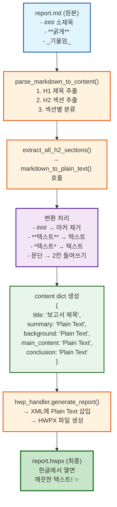

# Markdown → HWPX 변환 강화 계획서

## 📋 현황 분석

### 문제점

현재 `backend\artifacts\6\v1\report.hwpx` 파일을 한글에서 열면 다음과 같은 Markdown 문법이 그대로 표시됩니다:

**변환 전 (현재 문제):**
```
### 1. 2026년 코스피 지수 전망

**은행권**은 2026년 순이익이 약 18.5조원으로...

_생성일: 2025-11-04 10:44:51_
```

**변환 후 (목표):**
```
1. 2026년 코스피 지수 전망

은행권은 2026년 순이익이 약 18.5조원으로...

생성일: 2025-11-04 10:44:51
```

### 원인

- `markdown_parser.py`: H1, H2 섹션 구조만 파싱
- **본문 내 Markdown 문법 미처리**: H3~H6, 볼드, 이탤릭, 링크 등이 그대로 XML에 삽입됨

---

## 🎯 해결 방안

### 1단계: `markdown_to_plain_text()` 함수 추가

**위치:** `backend/app/utils/markdown_parser.py`

**기능:** Markdown 본문에서 모든 문법 요소를 Plain Text로 변환

**변환 규칙:**

| Markdown 문법 | 변환 전 | 변환 후 |
|--------------|---------|---------|
| H3~H6 헤더 | `### 소제목` | `소제목` |
| 굵게 | `**텍스트**` | `텍스트` |
| 기울임 | `*텍스트*` 또는 `_텍스트_` | `텍스트` |
| 굵게+기울임 | `***텍스트***` | `텍스트` |
| 취소선 | `~~텍스트~~` | `텍스트` |
| 인라인 코드 | `` `코드` `` | `코드` |
| 링크 | `[텍스트](url)` | `텍스트` |
| 이미지 | `` | `[이미지: alt]` |
| 순서없는 리스트 | `- 항목` | `• 항목` |
| 순서있는 리스트 | `1. 항목` | `1. 항목` (유지) |
| 인용 | `> 텍스트` | `텍스트` |
| 수평선 | `---` | (제거) |
| 문단 들여쓰기 | (자동) | 각 문단 앞에 2칸 공백 추가 |

### 2단계: 기존 함수 통합

`extract_all_h2_sections()` 함수에서 섹션 내용 추출 시 자동으로 `markdown_to_plain_text()` 호출

**변경 전:**
```python
def extract_all_h2_sections(md_text: str) -> List[Tuple[str, str]]:
    pattern = r'^##\s+(.+?)\s*$\n+(.*?)(?=\n+^##\s|\Z)'
    matches = re.findall(pattern, md_text, re.MULTILINE | re.DOTALL)
    return [(title.strip(), content.strip()) for title, content in matches]
```

**변경 후:**
```python
def extract_all_h2_sections(md_text: str) -> List[Tuple[str, str]]:
    pattern = r'^##\s+(.+?)\s*$\n+(.*?)(?=\n+^##\s|\Z)'
    matches = re.findall(pattern, md_text, re.MULTILINE | re.DOTALL)
    # ✨ Markdown 문법 제거 추가
    return [(title.strip(), markdown_to_plain_text(content.strip()))
            for title, content in matches]
```

### 3단계: Fallback 처리

섹션 분류가 실패한 경우(내용이 비어있을 때)의 `main_content`도 Plain Text로 변환:

```python
# parse_markdown_to_content() 함수 내부
if not any([content["summary"], content["background"],
            content["main_content"], content["conclusion"]]):
    if title_match:
        raw_content = md_text[title_match.end():].strip()
    else:
        raw_content = md_text.strip()

    # ✨ Markdown 문법 제거 추가
    content["main_content"] = markdown_to_plain_text(raw_content)
```

---

## 📊 변환 예상 결과

### 예시 1: H3 헤더

**원본 MD:**
```markdown
## 주요 분석 내용

### 1. 2026년 코스피 지수 전망

2026년 코스피 지수는 기준 시나리오상 2,900~3,200pt 범위에서 형성될 것으로 전망됩니다.

### 2. 금융권 업종별 실적 전망

**은행권**은 2026년 순이익이 약 18.5조원으로 전년 대비 5~7% 증가할 것으로 전망됩니다.
```

**변환 후 (Plain Text):**
```
1. 2026년 코스피 지수 전망

  2026년 코스피 지수는 기준 시나리오상 2,900~3,200pt 범위에서 형성될 것으로 전망됩니다.

2. 금융권 업종별 실적 전망

  은행권은 2026년 순이익이 약 18.5조원으로 전년 대비 5~7% 증가할 것으로 전망됩니다.
```

**HWPX 표시 (한글 프로그램):**
```
1. 2026년 코스피 지수 전망
  2026년 코스피 지수는 기준 시나리오상 2,900~3,200pt 범위에서 형성될 것으로 전망됩니다.

2. 금융권 업종별 실적 전망
  은행권은 2026년 순이익이 약 18.5조원으로 전년 대비 5~7% 증가할 것으로 전망됩니다.
```

### 예시 2: 볼드/이탤릭

**원본 MD:**
```markdown
**증권사**는 가장 큰 수혜 업종으로 평가됩니다. 2026년 코스피 일평균 거래대금은 12~14조원으로 증가할 것으로 보이며, 이는 *개인투자자의 시장 복귀* 및 기관투자자의 매수세 확대에 따른 것입니다.

_생성일: 2025-11-04 10:44:51_
```

**변환 후 (Plain Text):**
```
  증권사는 가장 큰 수혜 업종으로 평가됩니다. 2026년 코스피 일평균 거래대금은 12~14조원으로 증가할 것으로 보이며, 이는 개인투자자의 시장 복귀 및 기관투자자의 매수세 확대에 따른 것입니다.

  생성일: 2025-11-04 10:44:51
```

### 예시 3: 실제 보고서 전체 변환 예시

**원본 MD (artifacts/6/v1/report.md 일부):**
```markdown
### 1. 2026년 코스피 지수 전망

2026년 코스피 지수는 기준 시나리오상 2,900~3,200pt 범위에서 형성될 것으로 전망됩니다.

다만 리스크 요인도 존재합니다. 미·중 기술패권 경쟁의 재격화, 중동 지정학적 리스크, 그리고 국내 가계부채 문제 등이 하방 리스크로 작용할 수 있습니다.

### 2. 금융권 업종별 실적 전망

**은행권**은 2026년 순이익이 약 18.5조원으로 전년 대비 5~7% 증가할 것으로 전망됩니다.

**증권사**는 가장 큰 수혜 업종으로 평가됩니다.

**자산운용사**는 주식형 펀드 설정액 증가 및 운용수수료 수익 확대로 2026년 순이익이 전년 대비 10~12% 증가할 전망입니다.
```

**변환 후 (Plain Text):**
```
1. 2026년 코스피 지수 전망

  2026년 코스피 지수는 기준 시나리오상 2,900~3,200pt 범위에서 형성될 것으로 전망됩니다.

  다만 리스크 요인도 존재합니다. 미·중 기술패권 경쟁의 재격화, 중동 지정학적 리스크, 그리고 국내 가계부채 문제 등이 하방 리스크로 작용할 수 있습니다.

2. 금융권 업종별 실적 전망

  은행권은 2026년 순이익이 약 18.5조원으로 전년 대비 5~7% 증가할 것으로 전망됩니다.

  증권사는 가장 큰 수혜 업종으로 평가됩니다.

  자산운용사는 주식형 펀드 설정액 증가 및 운용수수료 수익 확대로 2026년 순이익이 전년 대비 10~12% 증가할 전망입니다.
```

**HWPX 최종 표시:**
- `###` 문법 → 헤더 마커만 제거하고 텍스트 유지
- `**텍스트**` → 일반 텍스트로 표시
- `1.`, `2.` 순서 리스트 → 그대로 유지
- 일반 문단 → 2칸 들여쓰기 적용
- 모든 Markdown 문법이 제거되어 **전문적인 보고서 형태**로 표시됨

---

## 🔧 구현 세부사항

### 함수 추가: `markdown_to_plain_text()`

```python
def markdown_to_plain_text(md_text: str) -> str:
    """Markdown 문법을 Plain Text로 변환합니다.

    HWP에 삽입될 본문 내용에서 Markdown 문법 요소들을 제거하여
    순수한 텍스트로 변환합니다.

    Args:
        md_text: Markdown 형식의 텍스트

    Returns:
        Plain text로 변환된 텍스트

    Examples:
        >>> text = "### 소제목\\n\\n**굵은** 글씨와 *기울임*"
        >>> markdown_to_plain_text(text)
        '소제목\\n\\n  굵은 글씨와 기울임'
        >>> text = "1. 첫 번째\\n\\n일반 문단"
        >>> markdown_to_plain_text(text)
        '1. 첫 번째\\n\\n  일반 문단'
    """
    text = md_text

    # 1. H3~H6 헤더 마커 제거 (텍스트만 남김)
    text = re.sub(r'^######\s+(.+)$', r'\1', text, flags=re.MULTILINE)
    text = re.sub(r'^#####\s+(.+)$', r'\1', text, flags=re.MULTILINE)
    text = re.sub(r'^####\s+(.+)$', r'\1', text, flags=re.MULTILINE)
    text = re.sub(r'^###\s+(.+)$', r'\1', text, flags=re.MULTILINE)

    # 2. 굵게 + 기울임 (***text*** 또는 ___text___)
    text = re.sub(r'\*\*\*(.+?)\*\*\*', r'\1', text)
    text = re.sub(r'___(.+?)___', r'\1', text)

    # 3. 굵게 (**text** 또는 __text__)
    text = re.sub(r'\*\*(.+?)\*\*', r'\1', text)
    text = re.sub(r'__(.+?)__', r'\1', text)

    # 4. 기울임 (*text* 또는 _text_)
    text = re.sub(r'\*(.+?)\*', r'\1', text)
    text = re.sub(r'(?<!\w)_(.+?)_(?!\w)', r'\1', text)

    # 5. 취소선 (~~text~~)
    text = re.sub(r'~~(.+?)~~', r'\1', text)

    # 6. 인라인 코드 (`code`)
    text = re.sub(r'`(.+?)`', r'\1', text)

    # 7. 링크 ([text](url))
    text = re.sub(r'\[([^\]]+)\]\([^\)]+\)', r'\1', text)

    # 8. 이미지 ()
    text = re.sub(r'!\[([^\]]*)\]\([^\)]+\)', r'[이미지: \1]', text)

    # 9. 리스트 마커
    # 순서 없는 리스트 (-, *, +) → 불릿(•)으로 변환
    text = re.sub(r'^[\s]*[-\*\+]\s+', '• ', text, flags=re.MULTILINE)
    # 순서 있는 리스트 (1., 2., ...)는 그대로 유지

    # 10. 인용 (> text)
    text = re.sub(r'^>\s+', '', text, flags=re.MULTILINE)

    # 11. 수평선 (---, ***, ___)
    text = re.sub(r'^[\s]*[-\*_]{3,}[\s]*$', '', text, flags=re.MULTILINE)

    # 12. 문단 들여쓰기 추가
    # 각 문단(빈 줄로 구분된 텍스트 블록)의 시작에 2칸 공백 추가
    # 단, 순서 있는 리스트나 불릿 리스트는 제외
    paragraphs = text.split('\n\n')
    indented_paragraphs = []
    for para in paragraphs:
        if para.strip():
            # 순서 있는 리스트나 불릿으로 시작하지 않으면 들여쓰기
            if not re.match(r'^\d+\.', para.strip()) and not para.strip().startswith('•'):
                para = '  ' + para
            indented_paragraphs.append(para)
    text = '\n\n'.join(indented_paragraphs)

    return text.strip()
```

---

## 📁 전체 변환 흐름



---

## ✅ 테스트 계획

### 테스트 케이스

**1. 기본 문법 변환**
- 입력: `### 제목\n\n**굵게** 및 *기울임*`
- 기대: `제목\n\n  굵게 및 기울임`

**2. 복합 문법**
- 입력: `***굵게+기울임*** 텍스트`
- 기대: `굵게+기울임 텍스트`

**3. 링크 및 이미지**
- 입력: `[링크](https://example.com) 및 `
- 기대: `링크 및 [이미지: 이미지]`

**4. 실제 보고서 섹션**
- 입력: `backend/artifacts/6/v1/report.md`의 "주요 분석 내용" 섹션
- 기대: 모든 Markdown 문법이 제거된 깨끗한 텍스트

---

## 🚀 구현 단계

### 1단계: 함수 추가 (5분)
- `markdown_to_plain_text()` 함수 작성
- `backend/app/utils/markdown_parser.py`에 추가

### 2단계: 기존 함수 수정 (3분)
- `extract_all_h2_sections()` 수정
- `parse_markdown_to_content()` fallback 처리 추가

### 3단계: 테스트 HWPX 생성 (5분)
- 실제 `report.md`로 변환
- `test_fixed.hwpx` 생성

### 4단계: 검증 (2분)
- 한글 프로그램에서 열어서 확인

---

**계획서 작성 완료: 2025-11-04**
**예상 구현 시간: 15분**
