# pyhwpx 라이브러리 도입 관련 기술 검토 (보류)

**작성일**: 2025-11-05
**검토 결과**: **도입 보류** (현재 시스템 유지 권장)
**버전**: 1.0

---

## 📋 목차

1. [개요](#개요)
2. [pyhwpx 라이브러리 분석](#pyhwpx-라이브러리-분석)
3. [Markdown 문법별 대응 가능성](#markdown-문법별-대응-가능성)
4. [주요 API 및 기능](#주요-api-및-기능)
5. [현재 프로젝트와의 비교](#현재-프로젝트와의-비교)
6. [적용 가능성 평가](#적용-가능성-평가)
7. [권장 사항](#권장-사항)
8. [결론](#결론)

---

## 개요

### 검토 배경

현재 프로젝트는 Markdown 파일을 HWPX 형식으로 변환할 때 다음과 같은 방식을 사용합니다:

```
Markdown → parse_markdown_to_content() → Plain Text
→ XML 플레이스홀더 치환 → HWPX (Unzip-Modify-Rezip)
```

이 과정에서 Markdown 문법(굵게, 기울임, 링크 등)을 제거하여 Plain Text로 변환합니다.

**검토 목적**: pyhwpx 라이브러리를 활용하면 Markdown 서식을 보존하면서 HWPX로 변환할 수 있는지 확인

### 검토 방법

1. pyhwpx 라이브러리의 기능 조사
2. Markdown 문법별 매핑 가능성 분석
3. 현재 시스템과의 장단점 비교
4. 프로젝트 적용 시 마이그레이션 난이도 평가
5. 최종 권장사항 도출

---

## pyhwpx 라이브러리 분석

### 기본 정보

| 항목 | 내용 |
|------|------|
| **라이브러리명** | pyhwpx |
| **최신 버전** | 1.6.6 (2025-09-19) |
| **PyPI** | https://pypi.org/project/pyhwpx/ |
| **GitHub** | https://github.com/martiniifun/pyhwpx |
| **문서** | https://wikidocs.net/book/8956 (한국어 Cookbook) |
| **라이선스** | MIT |
| **Python 버전** | 3.9 이상 |
| **의존성** | pywin32 |

### 핵심 특징

**1. COM Automation 기반**
- pywin32를 사용하여 HWP Automation API를 래핑
- Windows 환경에서만 작동
- 로컬에 한글(HWP) 프로그램이 반드시 설치되어 있어야 함

**2. 직관적인 API**
- win32com보다 간편한 인터페이스 제공
- 한글 자동화 작업을 Python으로 수행

**3. 기본 사용 예제**

```python
from pyhwpx import Hwp

# 한글 프로그램 실행 (보안 모듈 자동 등록)
hwp = Hwp()

# 텍스트 삽입
hwp.insert_text("Hello world!")

# 파일 저장
hwp.save_as("./helloworld.hwp")

# 한글 프로그램 종료
hwp.quit()
```

### 설치 요구사항

```bash
# 설치 명령
pip install pyhwpx

# 시스템 요구사항
- Windows OS (Linux/Mac 불가)
- 한글(HWP) 프로그램 설치 필수
- Python 3.9+
- pywin32 패키지
```

---

## Markdown 문법별 대응 가능성

### 상세 매핑 테이블

| Markdown 문법 | 예시 | pyhwpx 지원 | API/방법 | 구현 난이도 | 비고 |
|--------------|------|------------|----------|------------|------|
| **H1~H6 헤더** | `# 제목`, `## 소제목` | ✅ 부분 지원 | `ParaShape` 스타일 변경 | ⭐⭐⭐ | 사전 정의된 스타일 필요 |
| **굵게** | `**텍스트**` | ✅ 완전 지원 | `CharShape.SetItem("Bold", True)` | ⭐ | 간단 |
| **기울임** | `*텍스트*` | ✅ 완전 지원 | `CharShape.SetItem("Italic", True)` | ⭐ | 간단 |
| **굵게+기울임** | `***텍스트***` | ✅ 완전 지원 | Bold + Italic 동시 설정 | ⭐ | 간단 |
| **취소선** | `~~텍스트~~` | ✅ 완전 지원 | `CharShape.SetItem("StrikeOutType", True)` | ⭐ | 간단 |
| **인라인 코드** | `` `코드` `` | ✅ 가능 | `CharShape.SetItem("FaceName", "Courier New")` | ⭐⭐ | 고정폭 글꼴로 대체 |
| **링크** | `[텍스트](url)` | ⚠️ 가능 (미확인) | HWP Automation 하이퍼링크 API | ⭐⭐⭐⭐ | 문서 부족 |
| **이미지** | `` | ✅ 완전 지원 | `insert_picture(path)` | ⭐ | URL도 지원, 자동 크기 조정 |
| **순서 있는 리스트** | `1. 항목` | ⚠️ 가능 (미확인) | `ParaShape` 번호 매기기 | ⭐⭐⭐ | 문서 부족 |
| **순서 없는 리스트** | `- 항목` | ⚠️ 가능 (미확인) | `ParaShape` 불릿 설정 | ⭐⭐⭐ | 문서 부족 |
| **표** | Markdown table | ✅ 완전 지원 | `create_table(rows, cols)` | ⭐⭐ | 데이터 삽입 간편 |
| **인용** | `> 텍스트` | ⚠️ 가능 | `ParaShape` 들여쓰기 + 스타일 | ⭐⭐⭐ | 수동 스타일 필요 |
| **수평선** | `---` | ⚠️ 가능 | 도형 삽입 API | ⭐⭐⭐⭐ | 복잡 |
| **코드 블록** | ` ```code``` ` | ⚠️ 가능 | 고정폭 글꼴 + 배경색 | ⭐⭐⭐ | 수동 서식 필요 |

**범례:**
- ✅ 완전 지원: 명확한 API와 예제 존재
- ⚠️ 가능 (미확인): API는 있으나 문서/예제 부족
- ❌ 불가능: 해당 기능 없음
- ⭐: 쉬움 / ⭐⭐: 보통 / ⭐⭐⭐: 어려움 / ⭐⭐⭐⭐: 매우 어려움

---

## 주요 API 및 기능

### 1. 텍스트 서식 (CharShape)

#### 지원 속성

- `Bold`: 굵게 (True/False)
- `Italic`: 기울임 (True/False)
- `Height`: 글꼴 크기 (100 units = 1pt, 예: 2000 = 20pt)
- `FaceName`: 글꼴 이름 (문자열)
- `TextColor`: 텍스트 색상 (RGB: 0x0-0xFFFFFF)
- `UnderlineType`: 밑줄 종류 (0: 없음, 1: 아래, 3: 위)
- `UnderlineShape`: 밑줄 모양 (0-12)
- `UnderlineColor`: 밑줄 색상
- `StrikeOutType`: 취소선 (True/False)
- `StrikeOutShape`: 취소선 모양 (0-12)
- `StrikeOutColor`: 취소선 색상

#### 사용 예제

**방법 1: 직접 속성 설정**
```python
prop = hwp.CharShape
prop.SetItem("Height", 2000)  # 20pt
prop.SetItem("Italic", True)
prop.SetItem("Bold", True)
prop.SetItem("TextColor", 0xFF0000)  # 빨간색
hwp.CharShape = prop
```

**방법 2: 간편 메서드**
```python
hwp.set_font(
    Height=20,
    Italic=True,
    Bold=True,
    TextColor=hwp.rgb_color("Red"),
    UnderlineType=1,
    UnderlineColor=hwp.rgb_color("Blue")
)
```

**방법 3: 토글 명령**
```python
hwp.CharShapeBold()        # 굵게 토글
hwp.CharShapeItalic()      # 기울임 토글
hwp.CharShapeUnderline()   # 밑줄 토글
hwp.CharShapeCenterline()  # 취소선 토글
```

### 2. 문단 서식 (ParaShape)

#### 지원 속성

- `AlignType`: 정렬 방식
  - 0: 양쪽 정렬 (기본값)
  - 1: 왼쪽 정렬
  - 2: 오른쪽 정렬
  - 3: 가운데 정렬
  - 4: 배분 정렬
  - 5: 나눔 정렬
- `LineSpacing`: 줄 간격
- `PrevSpacing`: 문단 앞 간격
- `NextSpacing`: 문단 뒤 간격
- `LeftMargin`: 왼쪽 여백
- `RightMargin`: 오른쪽 여백
- `Indent`: 들여쓰기

#### 사용 예제

**정렬 설정:**
```python
prop = hwp.ParaShape
prop.SetItem("AlignType", 3)  # 가운데 정렬
hwp.ParaShape = prop
```

**줄 간격 설정:**
```python
prop = hwp.ParaShape
prop.SetItem("LineSpacing", 100)
hwp.ParaShape = prop
```

**간편 메서드:**
```python
hwp.ParagraphShapeAlignCenter()       # 가운데 정렬
hwp.ParagraphShapeAlignLeft()         # 왼쪽 정렬
hwp.ParagraphShapeAlignRight()        # 오른쪽 정렬
hwp.ParagraphShapeIncreaseLeftMargin() # 왼쪽 여백 증가
hwp.ParagraphShapeDecreaseLineSpacing() # 줄 간격 감소
```

### 3. 표 생성 및 편집

#### 기본 표 생성

```python
# 5행 5열 표 생성 (글자처럼 취급)
hwp.create_table(5, 5, treat_as_char=True)

# 표 셀 이동 및 데이터 입력
for i in range(25):
    hwp.insert_text(str(i))
    hwp.TableRightCell()  # 다음 셀로 이동
```

#### 데이터에서 표 생성

```python
# 다양한 데이터 형식 지원
hwp.table_from_data(data)
# 지원 형식: dict, list, pandas DataFrame, CSV, Excel
```

#### 표 내부 여백 및 정렬

```python
# 표 셀 내부 여백 설정 (0,0,0,0)
hwp.set_table_inside_margin(0, 0, 0, 0)

# 표 셀 정렬
hwp.TableCellAlignCenterCenter()  # 중앙-중앙 정렬
```

### 4. 이미지 삽입

```python
# 로컬 파일
hwp.insert_picture("./image.png")

# URL 이미지
hwp.insert_picture("https://example.com/image.jpg")

# 특징:
# - 자동 크기 조정 (페이지 크기에 맞춤)
# - 셀 내부에서는 셀 너비에 자동 맞춤
# - 절대 경로 불필요
```

### 5. 텍스트 삽입 및 커서 이동

```python
# 텍스트 삽입
hwp.insert_text("Hello world!")

# 커서 이동
hwp.Move("NextChar")     # 다음 문자
hwp.Move("PrevChar")     # 이전 문자
hwp.Move("NextLine")     # 다음 줄
hwp.Move("PrevLine")     # 이전 줄
hwp.Move("DocBegin")     # 문서 시작
hwp.Move("DocEnd")       # 문서 끝
```

---

## 현재 프로젝트와의 비교

### 시스템 아키텍처 비교

```mermaid
graph TD
    subgraph "현재 시스템 (XML 직접 조작)"
        A1[Markdown] --> A2[parse_markdown_to_content]
        A2 --> A3[markdown_to_plain_text]
        A3 --> A4[Plain Text + 들여쓰기]
        A4 --> A5[XML 플레이스홀더 치환]
        A5 --> A6[HWPX Unzip-Modify-Rezip]
        A6 --> A7[HWPX 파일]
    end

    subgraph "pyhwpx 방식"
        B1[Markdown] --> B2[MD 파서<br/>서식 정보 보존]
        B2 --> B3[pyhwpx API 호출]
        B3 --> B4[한글 프로그램 실행<br/>COM Automation]
        B4 --> B5[CharShape/ParaShape 설정]
        B5 --> B6[HWP/HWPX 파일]
    end

    style A1 fill:#e1f5ff
    style A7 fill:#c8e6c9
    style B1 fill:#e1f5ff
    style B6 fill:#c8e6c9
    style B4 fill:#ffebee
```



### 장단점 비교

#### 현재 시스템 (XML 직접 조작)

**장점 ✅:**

1. **플랫폼 독립적**
   - Linux, macOS, Windows 모두 지원
   - Docker 컨테이너에서 실행 가능
   - 서버 환경에 이상적

2. **한글 프로그램 불필요**
   - 순수 Python으로 HWPX 생성
   - 외부 프로그램 의존성 없음
   - 라이선스 비용 없음

3. **경량 및 빠른 성능**
   - 외부 프로그램 실행 오버헤드 없음
   - 파일 직접 조작으로 빠른 생성
   - 메모리 효율적

4. **동시성 지원**
   - 여러 요청 동시 처리 가능
   - FastAPI 비동기 환경에 적합
   - 프로세스 격리 문제 없음

5. **안정적 배포**
   - 단순한 의존성 (Python + zipfile)
   - 환경 설정 간단
   - CI/CD 파이프라인 통합 쉬움

**단점 ❌:**

1. **복잡한 서식 제한**
   - Markdown 서식을 Plain Text로 변환 필요
   - 굵게, 기울임 등 서식 제거
   - XML 직접 조작의 어려움

2. **문서화 부족**
   - HWPX XML 스펙 정보 제한적
   - 커뮤니티 리소스 부족
   - 고급 기능 구현 어려움

3. **제한적 기능**
   - 표/이미지 삽입 복잡
   - 스타일 관리 어려움
   - 복잡한 레이아웃 구현 힘듦

#### pyhwpx (COM Automation)

**장점 ✅:**

1. **풍부한 서식 지원**
   - 굵게, 기울임, 색상 완전 지원
   - Markdown 서식 보존 가능
   - 복잡한 스타일 적용 쉬움

2. **표/이미지 간편**
   - 직관적인 API
   - 자동 크기 조정
   - 다양한 데이터 형식 지원

3. **공식 API**
   - 한컴 공식 Automation API 래퍼
   - 안정적인 기능
   - 지속적인 업데이트

4. **고급 기능**
   - 필드, 매크로 지원
   - 복잡한 문서 구조 가능
   - HWP의 모든 기능 접근

**단점 ❌:**

1. **Windows 전용**
   - Linux/macOS 지원 불가
   - Docker 환경 부적합
   - 서버 배포 제약

2. **한글 프로그램 필수**
   - 로컬에 한글 설치 필수
   - GUI 프로그램 실행 필요
   - 라이선스 비용 발생

3. **성능 문제**
   - COM 통신 오버헤드
   - 프로그램 실행 시간 소요
   - 메모리 사용량 높음

4. **동시성 제한**
   - 한글 프로그램 인스턴스 충돌
   - 여러 요청 동시 처리 어려움
   - 프로세스 격리 필요

5. **복잡한 배포**
   - Windows Server 필요
   - 한글 프로그램 설치 및 설정
   - 라이선스 관리 필요

### 비용 비교

| 항목 | 현재 시스템 | pyhwpx |
|------|------------|--------|
| **라이선스** | 무료 | 서버당 한글 라이선스 필요 (약 10-30만원/년) |
| **인프라** | Linux 서버 (저렴) | Windows Server (비싸) |
| **개발 시간** | 이미 구현 완료 | 2-3주 마이그레이션 필요 |
| **유지보수** | 낮음 | 높음 (한글 업데이트 대응) |

---

## 적용 가능성 평가

### 시나리오 분석

#### ❌ 시나리오 1: 현재 시스템 완전 대체

**평가**: **권장하지 않음**

**이유:**
1. **서버 환경 부적합**:
   - FastAPI 백엔드는 Linux/Docker에서 실행될 가능성 높음
   - Windows Server로 변경 시 인프라 비용 증가

2. **라이선스 비용**:
   - 개발/스테이징/프로덕션 서버마다 한글 라이선스 필요
   - 연간 수십만원 추가 비용 발생

3. **동시성 문제**:
   - 여러 사용자의 동시 요청 처리 어려움
   - 한글 프로그램 인스턴스 충돌 위험

4. **성능 저하**:
   - COM Automation은 파일 직접 조작보다 느림
   - 프로그램 실행 시간 추가 소요

5. **의존성 증가**:
   - Windows + 한글 프로그램 필수
   - 환경 설정 복잡도 증가

#### ⚠️ 시나리오 2: 하이브리드 접근 (선택적 사용)

**평가**: **제한적 도입 가능**

**적용 방법:**

**2-1. 로컬 개발 도구로 활용**

```python
# backend/tools/local_preview.py
"""
개발자 로컬 PC에서 풍부한 서식의 미리보기 생성
프로덕션 서버에서는 사용하지 않음
"""
import os
from pyhwpx import Hwp

def create_rich_preview(md_path: str, output_path: str):
    """pyhwpx로 서식이 보존된 미리보기 생성 (로컬 전용)"""

    # Windows + 한글 설치 확인
    if os.name != 'nt':
        raise RuntimeError("pyhwpx는 Windows에서만 실행 가능합니다.")

    try:
        hwp = Hwp()

        # Markdown 파일 읽기
        with open(md_path, 'r', encoding='utf-8') as f:
            md_content = f.read()

        # TODO: Markdown 파싱 및 서식 적용
        # parse_markdown_with_formatting(md_content)
        # apply_formatting_to_hwp(hwp, formatted_content)

        hwp.save_as(output_path)
        hwp.quit()

        print(f"✅ 미리보기 생성 완료: {output_path}")

    except Exception as e:
        print(f"❌ 미리보기 생성 실패: {e}")
```

**사용 시점:**
- 개발자가 로컬 PC에서 결과 확인
- 클라이언트 데모용 문서 생성
- 테스트 및 디버깅

**2-2. 선택적 기능 (API 옵션)**

```python
# backend/app/routers/artifacts.py
from typing import Optional

@router.post("/{artifact_id}/convert", summary="Convert MD to HWPX")
async def convert_md_to_hwpx(
    artifact_id: int,
    use_rich_format: bool = False,  # 기본값: False (XML 방식)
    current_user: User = Depends(get_current_active_user)
):
    """
    MD 아티팩트를 HWPX로 변환

    Parameters:
        use_rich_format: True일 경우 pyhwpx 사용 (Windows 서버 필요)
                        False일 경우 기존 XML 방식 사용 (기본값)
    """

    if use_rich_format:
        # Windows 서버에서만 사용 가능
        if os.name != 'nt' or not check_hwp_installed():
            return error_response(
                code=ErrorCode.FEATURE_NOT_AVAILABLE,
                http_status=400,
                message="풍부한 서식 변환은 Windows 서버에서만 가능합니다.",
                hint="use_rich_format=false로 설정하여 기본 변환을 사용하세요."
            )

        # pyhwpx 변환
        return convert_with_pyhwpx(artifact_id)
    else:
        # 기존 XML 변환 (기본값)
        return convert_with_xml(artifact_id)
```

#### ✅ 시나리오 3: 현재 시스템 유지 + 점진적 개선

**평가**: **가장 권장**

**개선 방향:**

**3-1. XML 방식으로 제한적 서식 추가**

현재 시스템을 확장하여 일부 서식을 XML로 직접 구현:

```python
# backend/app/utils/markdown_parser.py

from typing import List, Tuple
from dataclasses import dataclass

@dataclass
class TextRun:
    """서식 정보가 포함된 텍스트 조각"""
    text: str
    bold: bool = False
    italic: bool = False
    font_size: int = 10  # pt
    color: str = "0x000000"  # RGB

def markdown_to_formatted_runs(md_text: str) -> List[TextRun]:
    """
    Markdown을 서식 정보가 포함된 TextRun 리스트로 변환

    예: "**굵은** 텍스트" → [
        TextRun("굵은", bold=True),
        TextRun(" 텍스트", bold=False)
    ]
    """
    runs = []

    # TODO: 정규식으로 **text**, *text* 파싱
    # TODO: TextRun 객체 생성

    return runs
```

```python
# backend/app/utils/hwp_handler.py

def insert_formatted_text(self, runs: List[TextRun]):
    """
    서식이 포함된 텍스트를 XML에 삽입

    <hp:run charPrIDRef="21">
        <hp:t bold="true">굵은 텍스트</hp:t>
    </hp:run>
    """
    for run in runs:
        # XML에 <hp:run> 태그로 서식 적용
        xml_run = f'<hp:run charPrIDRef="{char_id}">'

        if run.bold or run.italic:
            # 서식 속성 추가
            xml_run += f'<hp:t bold="{str(run.bold).lower()}" '
            xml_run += f'italic="{str(run.italic).lower()}">'
        else:
            xml_run += '<hp:t>'

        xml_run += escape_xml(run.text)
        xml_run += '</hp:t></hp:run>'

        # XML에 삽입
        # ...
```

**장점:**
- ✅ 기존 시스템 유지 (플랫폼 독립적)
- ✅ 점진적 개선 가능
- ✅ 배포 환경 변경 불필요
- ✅ 비용 증가 없음

**단점:**
- ⚠️ 모든 서식 지원은 어려움
- ⚠️ 개발 시간 소요

**3-2. 문서화 개선**

- pyhwpx 분석 결과 문서화 (이 문서)
- 향후 고려 사항 명시
- 의사 결정 근거 기록

### 마이그레이션 난이도 평가

만약 pyhwpx로 완전 전환한다면:

**필요한 작업:**

1. **환경 설정** (1-2일)
   - Windows Server 구축
   - 한글 프로그램 설치 및 라이선스 등록
   - pywin32, pyhwpx 설치

2. **코드 재작성** (1-2주)
   - `hwp_handler.py` 전체 리팩토링 (약 350줄)
   - Markdown 파서 강화 (서식 정보 보존)
   - 에러 처리 추가 (COM 예외)

3. **테스트 재작성** (3-5일)
   - 60개 이상 테스트 수정
   - Windows 환경 전용 테스트

4. **배포 변경** (2-3일)
   - Docker → Windows VM
   - CI/CD 파이프라인 수정
   - 환경 변수 설정

5. **문서화** (1일)
   - API 문서 업데이트
   - 설치 가이드 작성

**예상 총 소요 시간**: **2-3주**

**위험 요소:**
- COM Automation 안정성 문제
- 동시 요청 처리 방안
- 라이선스 관리
- 성능 최적화

---

## 권장 사항

### 🎯 최종 권장: 현재 시스템 유지 + 선택적 개선

#### 권장 이유

**1. 현재 시스템이 프로젝트 요구사항에 충분히 부합**

현재 시스템은 다음과 같은 이유로 우수합니다:

- ✅ **플랫폼 독립적**: Linux/Docker 서버 환경에 최적
- ✅ **안정적**: 외부 프로그램 의존성 없음
- ✅ **빠른 성능**: 직접 파일 조작으로 빠른 생성
- ✅ **비용 효율적**: 추가 라이선스 불필요
- ✅ **이미 구현 완료**: `markdown_to_plain_text()` 기능 작동 중

**2. pyhwpx의 제약사항이 크게 작용**

pyhwpx는 다음과 같은 한계가 있습니다:

- ❌ **Windows 전용**: 서버 환경 제약
- ❌ **한글 프로그램 필수**: 라이선스 비용 및 관리 부담
- ❌ **동시성 문제**: 여러 요청 처리 어려움
- ❌ **성능 저하**: COM Automation 오버헤드

**3. 사용자 요구사항은 이미 충족**

현재 프로젝트의 목표는:
- Markdown 자동 생성
- HWPX 형식으로 변환
- **전문 보고서 형태로 제공** ✅

→ 현재 시스템으로 충분히 달성 가능

### 📝 구체적 권장사항

#### 1단계: 현재 시스템 유지 (우선순위: 높음)

**수행 작업:**
- ✅ 이미 구현된 `markdown_to_plain_text()` 기능 사용
- ✅ XML 플레이스홀더 치환 방식 유지
- ✅ 문단 들여쓰기 (2칸 공백) 유지

**이유:**
- 안정적이고 검증된 시스템
- 프로덕션 환경에 적합
- 추가 비용 없음

#### 2단계: pyhwpx를 로컬 개발 도구로만 활용 (우선순위: 중간)

**수행 작업:**
- 개발자 PC에서 풍부한 서식의 미리보기 생성 도구 작성
- `backend/tools/local_preview.py` 스크립트 추가
- 프로덕션 서버에는 배포하지 않음

**이유:**
- 개발/테스트 단계에서 유용
- 클라이언트 데모용 문서 생성
- 서버 환경과 분리

**구현 예:**
```python
# backend/tools/local_preview.py
"""
로컬 개발 환경에서만 사용하는 pyhwpx 미리보기 도구
프로덕션 서버에서는 사용하지 않음
"""

import os
import sys

def main():
    if os.name != 'nt':
        print("❌ 이 도구는 Windows에서만 실행됩니다.")
        sys.exit(1)

    try:
        from pyhwpx import Hwp
        print("✅ pyhwpx 사용 가능")
    except ImportError:
        print("❌ pyhwpx가 설치되지 않았습니다.")
        print("설치: pip install pyhwpx")
        sys.exit(1)

    # TODO: 미리보기 생성 로직
    print("로컬 미리보기 생성 중...")

if __name__ == "__main__":
    main()
```

#### 3단계: 문서화 (우선순위: 높음)

**수행 작업:**
- ✅ 이 기술 검토 문서 작성 완료
- 향후 검토 시점 명시
- 의사 결정 근거 기록

#### 4단계: 선택적 XML 서식 개선 (우선순위: 낮음)

**수행 작업 (향후 검토):**
- Markdown 굵게/기울임을 XML 서식으로 변환 (선택 사항)
- `markdown_to_formatted_runs()` 함수 추가
- `hwp_handler.py`에 서식 삽입 기능 추가

**시점:**
- 사용자 요청이 명확할 때
- 리소스 여유가 있을 때

### 🚫 권장하지 않는 사항

1. ❌ **현재 시스템을 pyhwpx로 완전 대체**
   - 서버 환경 제약
   - 비용 증가
   - 마이그레이션 리스크

2. ❌ **프로덕션 서버에 pyhwpx 배포**
   - Windows Server 필요
   - 동시성 문제
   - 성능 저하

3. ❌ **하이브리드 시스템 (pyhwpx + XML 혼용)**
   - 복잡도 증가
   - 유지보수 어려움
   - 일관성 저하

---

## 결론

### 최종 결정: pyhwpx 도입 보류

**근거:**

1. **현재 시스템이 프로젝트 요구사항을 충족**
   - Markdown → HWPX 변환 작동
   - 전문 보고서 형태 제공
   - 안정적인 운영

2. **pyhwpx의 제약사항이 크게 작용**
   - Windows 전용 (서버 환경 부적합)
   - 한글 프로그램 필수 (비용 증가)
   - 동시성 문제 (성능 저하)

3. **비용 대비 효과가 낮음**
   - 마이그레이션 시간: 2-3주
   - 라이선스 비용: 연간 수십만원
   - 얻는 이점: 서식 보존 (필수 요구사항 아님)

### 향후 검토 시점

다음 조건이 충족될 경우 pyhwpx 도입을 재검토:

1. **서버 환경 변경**
   - Windows Server로 배포 환경 전환 시
   - 온프레미스 환경으로 이전 시

2. **요구사항 변경**
   - 복잡한 서식 요구사항 증가
   - Markdown 서식 보존이 필수 기능으로 요청됨
   - 표, 이미지 등 고급 기능 필요

3. **예산 확보**
   - 한글 라이선스 예산 확보
   - Windows Server 인프라 구축 가능

4. **기술 환경 변화**
   - pyhwpx가 크로스 플랫폼 지원 시작
   - 한글 웹 API 제공 (SaaS 형태)

### 대안

현재 시스템 기반으로 다음과 같은 개선을 고려:

1. **제한적 서식 지원** (XML 직접 조작)
   - 굵게/기울임을 XML 태그로 변환
   - 점진적 개선 가능

2. **템플릿 다양화**
   - 다양한 보고서 템플릿 제공
   - 사용자 커스터마이징 옵션

3. **PDF 변환 추가**
   - HWPX → PDF 변환 기능
   - 더 넓은 호환성

### 참고 자료

- **pyhwpx PyPI**: https://pypi.org/project/pyhwpx/
- **pyhwpx GitHub**: https://github.com/martiniifun/pyhwpx
- **pyhwpx Cookbook**: https://wikidocs.net/book/8956
- **현재 프로젝트 계획서**: `backend/doc/markdown_to_hwpx_enhancement_plan.md`
- **현재 구현 코드**:
  - `backend/app/utils/markdown_parser.py`
  - `backend/app/utils/hwp_handler.py`

---

**문서 버전**: 1.0
**최종 수정일**: 2025-11-05
**검토자**: Claude Code
**결정**: pyhwpx 도입 보류, 현재 시스템 유지
