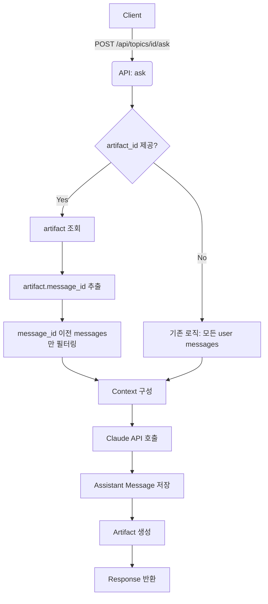

# Unit Spec: Context Limit by Selected Artifact

## 1. 요구사항 요약

- **목적:** 사용자가 선택한 artifact 이전의 message들만 컨텍스트로 포함하도록 변경
- **유형:** ☑ 신규 ☐ 변경 ☐ 삭제
- **핵심 요구사항:**
  - 입력: `artifact_id` (선택 시), `topic_id`, `content` (질문 내용)
  - 출력: AI 응답 (markdown), 새 artifact
  - 예외/제약:
    - artifact_id가 지정되면 해당 artifact를 생성한 message까지만 context에 포함
    - artifact_id가 없으면 기존 동작 유지 (모든 user messages 포함)
    - 총 20개 message 중 10번 message의 artifact 선택 시 → 1~10번 message만 context로 포함
  - 처리흐름 요약: artifact 선택 → message_id 추출 → 해당 message 이전 메시지만 필터링 → Claude 호출

---

## 2. 구현 대상 파일

| 구분 | 경로                                    | 설명                  |
| ---- | --------------------------------------- | --------------------- |
| 변경 | backend/app/routers/topics.py | `ask()` 함수의 context 구성 로직 수정 |
| 참조 | backend/app/database/message_db.py | Message 관련 쿼리 참조 |
| 참조 | backend/app/models/topic.py | AskRequest 모델 (artifact_id 이미 존재) |

---

## 3. 동작 플로우 (Mermaid)



---

## 4. 테스트 계획

### 4.1 원칙

- **테스트 우선(TDD)**: 본 섹션의 항목을 우선 구현하고 코드 작성.
- **계층별 커버리지**: Unit → Integration → API(E2E-lite) 순서로 최소 P0 커버.
- **독립성/재현성**: 외부 연동(LLM/DB/File I/O)은 모킹 또는 임베디드 스토리지 사용.
- **판정 기준**: 기대 상태코드/스키마/부작용(저장/로그)을 명시적으로 검증.

### 4.2 구현 예상 테스트 항목(각 항목의 목적 포함)

| TC ID      | 계층 | 시나리오              | 목적(무엇을 검증?)                 | 입력/사전조건                        | 기대결과                                           |
| ---------- | ---- | --------------------- | ---------------------------------- | ------------------------------------ | -------------------------------------------------- |
| TC-API-001 | API  | artifact_id 없이 요청 | 기존 동작 유지 (모든 user msg 포함) | `POST /api/topics/1/ask` `{content:"질문"}` | `200`, 모든 user messages가 context에 포함 |
| TC-API-002 | API  | artifact_id와 함께 요청 | 선택한 artifact 이전 msg만 포함 | `{content:"질문", artifact_id:5}` (message_id=10) | `200`, message 1~10만 context에 포함 |
| TC-API-003 | API  | 잘못된 artifact_id | 에러 핸들링 | `{artifact_id:99999}` | `404`, ARTIFACT.NOT_FOUND |
| TC-API-004 | API  | 다른 topic의 artifact | 권한 검증 | `{artifact_id:3}` (다른 topic 소속) | `403`, ARTIFACT.UNAUTHORIZED |
| TC-UNIT-005 | Unit | message 필터링 로직 | seq_no 기반 필터링 정확성 | messages=[1,2,3,4,5], target_seq_no=3 | [1,2,3] 반환 |
| TC-UNIT-006 | Unit | artifact 없는 경우 | 필터링 없이 모든 msg 반환 | messages=[1,2,3], artifact_id=None | [1,2,3] 반환 |

### 4.3 샘플 테스트 코드

테스트 작성가이드 `backend/BACKEND_TEST.md`

---

## 5. 사용자 요청 프롬프트

**Original User Request:**

```
기능을 수정해줘. @backend\app\routers\artifacts.py
현재 : 해당 api에서 사용자의 모든 메시지를 컨텍스트로 포함
수정요청 : 사용자가 선택한 artifacts 이전의 message 들만 컨텍스트로 포함.
예시 : message 가 총 20가지 중 10번 message와 관련된 artifacts가 선택될 경우
 - 좋은 경우 : user messages 중 1~10 번까지만 context로 제공.
 - 나쁜 경우 : user messages 중 10번 이상이  context로 포함됨.
```

**요청 일시:** 2025-11-06

**컨텍스트/배경:**
- API 엔드포인트: `POST /api/topics/{topic_id}/ask` (확인됨)
- artifact_id는 프론트엔드에서 전달 (확인됨)
- AskRequest 모델에 이미 `artifact_id` 필드 존재
- 현재는 모든 user messages를 context로 포함

**명확화 Q&A:**
- Q: 컨텍스트를 사용하는 API는 어느 엔드포인트인가요?
- A: `POST /api/topics/{topic_id}/ask`

- Q: artifacts 선택은 어디서 이루어지나요?
- A: 프론트엔드에서 artifact_id 전달

---

## 6. 구현 상세

### 6.1 현재 로직 (Line 614-647)

```python
# User 메시지 필터링
user_messages = [m for m in all_messages if m.role == MessageRole.USER]
if body.max_messages is not None:
    user_messages = user_messages[-body.max_messages:]
logger.info(f"[ASK] User messages to include: {len(user_messages)}")

# Assistant 메시지 필터링 (참조 문서 생성 메시지만)
assistant_messages = []
if reference_artifact:
    ref_msg = MessageDB.get_message_by_id(reference_artifact.message_id)
    if ref_msg:
        assistant_messages = [ref_msg]
        logger.info(f"[ASK] Including reference assistant message - message_id={ref_msg.id}")
```

**문제점:**
- `user_messages`가 모든 user messages를 포함
- `reference_artifact`가 있어도 user messages는 필터링되지 않음

### 6.2 수정 로직

```python
# User 메시지 필터링
user_messages = [m for m in all_messages if m.role == MessageRole.USER]

# ✨ NEW: artifact_id가 지정된 경우, 해당 message 이전 것만 포함
if reference_artifact:
    ref_msg = MessageDB.get_message_by_id(reference_artifact.message_id)
    if ref_msg:
        # reference message의 seq_no까지만 포함
        user_messages = [m for m in user_messages if m.seq_no <= ref_msg.seq_no]
        logger.info(f"[ASK] Filtered user messages by artifact - up_to_seq_no={ref_msg.seq_no}, count={len(user_messages)}")

# 기존 max_messages 제한 (여전히 적용)
if body.max_messages is not None:
    user_messages = user_messages[-body.max_messages:]

logger.info(f"[ASK] User messages to include: {len(user_messages)}")

# Assistant 메시지 필터링 (참조 문서 생성 메시지만)
assistant_messages = []
if reference_artifact:
    ref_msg = MessageDB.get_message_by_id(reference_artifact.message_id)
    if ref_msg:
        assistant_messages = [ref_msg]
        logger.info(f"[ASK] Including reference assistant message - message_id={ref_msg.id}")
```

### 6.3 변경 영향 범위

- **로직 변경**: `ask()` 함수 내 context 구성 부분 (Line 614-647)
- **API 계약 변경**: 없음 (artifact_id 필드 이미 존재)
- **DB 스키마 변경**: 없음
- **하위 호환성**: 유지 (artifact_id 미제공 시 기존 동작)

---

## 7. 검증 시나리오

### Scenario 1: artifact_id 없이 요청 (기존 동작)

**Given:**
- Topic에 user messages 20개 존재

**When:**
```json
POST /api/topics/1/ask
{
  "content": "추가 질문"
}
```

**Then:**
- 모든 20개 user messages가 context에 포함
- 기존 동작과 동일

### Scenario 2: artifact_id와 함께 요청 (새 동작)

**Given:**
- Topic에 user messages 20개 존재
- Message #10에 artifact_id=5 생성됨

**When:**
```json
POST /api/topics/1/ask
{
  "content": "이전 보고서 수정해줘",
  "artifact_id": 5
}
```

**Then:**
- Message #10의 seq_no 확인
- seq_no <= 10인 user messages만 context에 포함 (1~10)
- Message #11~20은 context에서 제외

### Scenario 3: max_messages와 함께 사용

**Given:**
- Topic에 user messages 20개 존재
- Message #10에 artifact_id=5 생성됨

**When:**
```json
POST /api/topics/1/ask
{
  "content": "질문",
  "artifact_id": 5,
  "max_messages": 5
}
```

**Then:**
- 먼저 artifact 기준으로 필터링: 1~10
- 그 후 max_messages 적용: 6~10 (마지막 5개)

---

**Note:** 이 spec은 context 구성 로직의 정확성을 보장하기 위해 작성되었습니다. artifact 선택 시 이전 대화만 참조함으로써 사용자의 의도에 맞는 응답을 생성할 수 있습니다.
