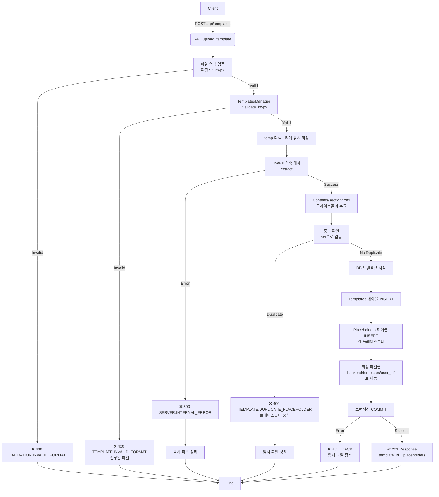

# Unit Spec: Template 업로드 기능

## 1. 요구사항 요약

- **목적:** 사용자가 HWPX 템플릿 파일을 업로드하고 플레이스홀더를 자동으로 추출하여 DB에 저장
- **유형:** ☑ 신규 ☐ 변경 ☐ 삭제
- **핵심 요구사항:**
  - 입력: HWPX 파일 + 템플릿 제목 (multipart/form-data)
  - 출력: 템플릿 메타데이터 + 추출된 플레이스홀더 목록 (JSON)
  - 예외/제약:
    - .hwpx 파일만 등록 가능
    - 플레이스홀더 중복 시 업로드 실패
    - 템플릿은 사용자별로 격리 (다른 사용자 접근 불가)
    - 관리자는 모든 템플릿 조회 가능
    - 모든 작업 완료 전까지 DB에 저장하지 않음 (트랜잭션)
  - 처리흐름 요약: 파일 업로드 → 검증 → 압축 해제 → 플레이스홀더 추출 → 중복 확인 → DB 저장 (원자성)

---

## 2. 구현 대상 파일

| 구분 | 경로 | 설명 |
|------|------|------|
| 신규 | backend/app/models/template.py | Template, Placeholder Pydantic 모델 |
| 신규 | backend/app/database/template_db.py | Template, Placeholder CRUD 작업 |
| 신규 | backend/app/utils/templates_manager.py | 템플릿 파일 관리 (업로드, 압축 해제, 플레이스홀더 추출) |
| 신규 | backend/app/routers/templates.py | Template 관련 API 엔드포인트 |
| 변경 | backend/app/main.py | templates 라우터 등록 |
| 참조 | backend/app/utils/response_helper.py | 표준 응답 형식 |

---

## 3. 동작 플로우 (Mermaid)



---

## 4. 데이터 모델

### 4.1 Templates 테이블
```python
# backend/app/models/template.py
class TemplateBase(BaseModel):
    title: str  # 템플릿 제목
    description: Optional[str] = None

class TemplateCreate(TemplateBase):
    filename: str  # 원본 파일명
    file_path: str  # 저장 경로
    file_size: int  # 파일 크기 (bytes)
    sha256: str  # 파일 무결성 체크용 해시

class Template(TemplateCreate):
    id: int
    user_id: int
    is_active: bool = True
    created_at: datetime
    updated_at: datetime

    class Config:
        from_attributes = True
```

### 4.2 Placeholders 테이블
```python
class PlaceholderBase(BaseModel):
    placeholder_key: str  # "{{TITLE}}", "{{SUMMARY}}" 등

class PlaceholderCreate(PlaceholderBase):
    template_id: int

class Placeholder(PlaceholderCreate):
    id: int
    created_at: datetime

    class Config:
        from_attributes = True
```

### 4.3 API 요청/응답 모델
```python
class UploadTemplateRequest(BaseModel):
    title: str  # 템플릿 제목
    # file: UploadFile - multipart/form-data에서 처리

class PlaceholderResponse(BaseModel):
    key: str  # 플레이스홀더 키 (예: "{{TITLE}}")

class UploadTemplateResponse(BaseModel):
    id: int
    title: str
    filename: str
    file_size: int
    placeholders: List[PlaceholderResponse]
    created_at: datetime
```

---

## 5. 테스트 계획

### 5.1 원칙

- **테스트 우선(TDD)**: 본 섹션의 항목을 우선 구현하고 코드 작성
- **계층별 커버리지**: Unit → Integration → API(E2E-lite) 순서로 최소 P0 커버
- **독립성/재현성**: 파일 I/O는 임시 디렉토리 사용, DB는 모킹 또는 테스트 DB 사용
- **판정 기준**: 기대 상태코드/스키마/부작용(저장/로그)을 명시적으로 검증

### 5.2 구현 예상 테스트 항목

| TC ID | 계층 | 시나리오 | 목적 | 입력/사전조건 | 기대결과 |
|-------|------|---------|------|--------------|---------|
| TC-API-001 | API | 정상 템플릿 업로드 | API 계약 검증, 200 응답, 스키마 일치 | `.hwpx` 파일 + 제목 | `201`, `id`, `placeholders` 배열 포함 |
| TC-API-002 | API | 파일 확장자 오류 | 확장자 검증 | `.hwp`, `.docx` 파일 | `400`, `VALIDATION.INVALID_FORMAT` |
| TC-API-003 | API | 손상된 HWPX | ZIP 파일 유효성 검증 | 손상된 `.hwpx` | `400`, `TEMPLATE.INVALID_FORMAT` |
| TC-API-004 | API | 플레이스홀더 중복 | 중복 검증 | `{{TITLE}}` 2개 포함 HWPX | `400`, `TEMPLATE.DUPLICATE_PLACEHOLDER` |
| TC-API-005 | API | 제목 누락 | 입력 검증 | `{file: ...}` | `400`, 에러 메시지 |
| TC-API-006 | API | 사용자 권한 검증 | 로그인 필수 | 로그인 안 함 | `401`, `AUTH.UNAUTHORIZED` |
| TC-UNIT-007 | Unit | 플레이스홀더 추출 정확성 | 정규식 매칭 | XML 콘텐츠 + `{{KEY}}` 패턴 | 모든 플레이스홀더 추출, 중복 없음 |
| TC-UNIT-008 | Unit | 중복 검증 로직 | set 기반 중복 확인 | `["{{TITLE}}", "{{TITLE}}"]` | `True` (중복 존재) |
| TC-UNIT-009 | Unit | 파일 검증 (Magic Byte) | ZIP 시그니처 확인 | PK\x03\x04 헤더 | 유효성 검증 통과 |
| TC-UNIT-010 | Unit | section*.xml 필터링 | Contents 내 section 파일만 추출 | `[section1.xml, header.xml, section2.xml]` | `[section1.xml, section2.xml]` 만 처리 |
| TC-INT-011 | Integration | DB 트랜잭션 롤백 | 파일 저장 후 DB 오류 시 롤백 | DB INSERT 실패 시뮬레이션 | Template/Placeholder INSERT 안됨, 파일은 정리 |
| TC-INT-012 | Integration | 임시 파일 정리 | 예외 발생 시 임시 파일 삭제 | 중간 단계 오류 | temp 디렉토리 비어있음 |
| TC-API-013 | API | 파일 크기 제한 (향후) | 대용량 파일 거절 | 100MB 파일 | `413`, 크기 초과 메시지 |

### 5.3 테스트 코드 예시

```python
# backend/tests/test_templates_upload.py

import pytest
from fastapi.testclient import TestClient
from app.main import app
from app.database.template_db import TemplateDB

client = TestClient(app)

class TestTemplateUpload:

    def test_upload_valid_hwpx(self, auth_headers, sample_hwpx_file):
        """정상 템플릿 업로드 - TC-API-001"""
        response = client.post(
            "/api/templates",
            files={"file": sample_hwpx_file},
            data={"title": "재무보고서 템플릿"},
            headers=auth_headers
        )

        assert response.status_code == 201
        data = response.json()
        assert data["success"] is True
        assert "id" in data["data"]
        assert "placeholders" in data["data"]
        assert isinstance(data["data"]["placeholders"], list)

    def test_upload_invalid_extension(self, auth_headers, sample_docx_file):
        """확장자 검증 - TC-API-002"""
        response = client.post(
            "/api/templates",
            files={"file": sample_docx_file},
            data={"title": "템플릿"},
            headers=auth_headers
        )

        assert response.status_code == 400
        assert response.json()["error"]["code"] == "VALIDATION.INVALID_FORMAT"

    def test_upload_duplicate_placeholder(self, auth_headers, hwpx_with_duplicate_placeholder):
        """플레이스홀더 중복 - TC-API-004"""
        response = client.post(
            "/api/templates",
            files={"file": hwpx_with_duplicate_placeholder},
            data={"title": "중복 템플릿"},
            headers=auth_headers
        )

        assert response.status_code == 400
        assert response.json()["error"]["code"] == "TEMPLATE.DUPLICATE_PLACEHOLDER"

class TestPlaceholderExtraction:

    def test_extract_placeholders_from_xml(self):
        """플레이스홀더 추출 - TC-UNIT-007"""
        xml_content = """
        <document>
            <text>{{TITLE}}</text>
            <text>{{SUMMARY}}</text>
        </document>
        """

        from app.utils.templates_manager import TemplatesManager
        manager = TemplatesManager()
        placeholders = manager._extract_placeholders_from_content(xml_content)

        assert len(placeholders) == 2
        assert "{{TITLE}}" in placeholders
        assert "{{SUMMARY}}" in placeholders

    def test_detect_duplicate_placeholders(self):
        """중복 검증 - TC-UNIT-008"""
        placeholders = ["{{TITLE}}", "{{SUMMARY}}", "{{TITLE}}"]

        from app.utils.templates_manager import TemplatesManager
        manager = TemplatesManager()
        has_duplicate = manager._has_duplicate_placeholders(placeholders)

        assert has_duplicate is True
```

---

## 6. API 엔드포인트

### 6.1 템플릿 업로드
```
POST /api/templates
Content-Type: multipart/form-data

Request:
- file: UploadFile (binary)
- title: string

Response (201):
{
  "success": true,
  "data": {
    "id": 1,
    "title": "재무보고서 템플릿",
    "filename": "template_20251106_123456.hwpx",
    "file_size": 45678,
    "placeholders": [
      {"key": "{{TITLE}}"},
      {"key": "{{SUMMARY}}"},
      {"key": "{{BACKGROUND}}"},
      {"key": "{{MAIN_CONTENT}}"},
      {"key": "{{CONCLUSION}}"}
    ],
    "created_at": "2025-11-06T10:30:00"
  },
  "error": null,
  "meta": {"requestId": "uuid"}
}

Response (400 - 확장자):
{
  "success": false,
  "data": null,
  "error": {
    "code": "VALIDATION.INVALID_FORMAT",
    "httpStatus": 400,
    "message": ".hwpx 파일만 업로드 가능합니다.",
    "hint": "파일 형식을 확인해주세요."
  }
}

Response (400 - 중복):
{
  "success": false,
  "data": null,
  "error": {
    "code": "TEMPLATE.DUPLICATE_PLACEHOLDER",
    "httpStatus": 400,
    "message": "플레이스홀더 {{TITLE}}이 중복되었습니다.",
    "details": {
      "duplicate_keys": ["{{TITLE}}"]
    },
    "hint": "템플릿에서 중복된 플레이스홀더를 제거해주세요."
  }
}
```

### 6.2 내 템플릿 목록 조회
```
GET /api/templates

Response (200):
{
  "success": true,
  "data": [
    {
      "id": 1,
      "title": "재무보고서 템플릿",
      "filename": "template_20251106_123456.hwpx",
      "file_size": 45678,
      "created_at": "2025-11-06T10:30:00"
    },
    {
      "id": 2,
      "title": "영업보고서 템플릿",
      "filename": "template_20251105_234567.hwpx",
      "file_size": 52341,
      "created_at": "2025-11-05T14:15:00"
    }
  ],
  "error": null,
  "meta": {"requestId": "uuid"}
}
```

### 6.3 템플릿 상세 조회 (메타 + 플레이스홀더)
```
GET /api/templates/{template_id}

Response (200):
{
  "success": true,
  "data": {
    "id": 1,
    "title": "재무보고서 템플릿",
    "filename": "template_20251106_123456.hwpx",
    "file_size": 45678,
    "placeholders": [
      {"key": "{{TITLE}}"},
      {"key": "{{SUMMARY}}"},
      {"key": "{{BACKGROUND}}"},
      {"key": "{{MAIN_CONTENT}}"},
      {"key": "{{CONCLUSION}}"}
    ],
    "created_at": "2025-11-06T10:30:00"
  },
  "error": null,
  "meta": {"requestId": "uuid"}
}
```

### 6.4 템플릿 삭제
```
DELETE /api/templates/{template_id}

Response (200):
{
  "success": true,
  "data": {
    "id": 1,
    "message": "템플릿이 삭제되었습니다."
  },
  "error": null,
  "meta": {"requestId": "uuid"}
}
```

### 6.5 관리자: 전체 템플릿 조회
```
GET /api/admin/templates

Response (200):
{
  "success": true,
  "data": [
    {
      "id": 1,
      "title": "재무보고서 템플릿",
      "username": "user1",
      "file_size": 45678,
      "placeholder_count": 5,
      "created_at": "2025-11-06T10:30:00"
    },
    ...
  ],
  "error": null,
  "meta": {"requestId": "uuid"}
}
```

---

## 7. 에러 코드

| 코드 | HTTP | 메시지 | 상황 |
|------|------|--------|------|
| `VALIDATION.INVALID_FORMAT` | 400 | .hwpx 파일만 업로드 가능 | 파일 확장자가 .hwpx가 아님 |
| `TEMPLATE.INVALID_FORMAT` | 400 | HWPX 파일이 손상되었습니다 | ZIP 파일 유효성 검증 실패 |
| `TEMPLATE.DUPLICATE_PLACEHOLDER` | 400 | 플레이스홀더가 중복되었습니다 | 동일 플레이스홀더 2개 이상 존재 |
| `TEMPLATE.NOT_FOUND` | 404 | 템플릿을 찾을 수 없습니다 | template_id 없음 |
| `TEMPLATE.UNAUTHORIZED` | 403 | 템플릿에 접근할 권한이 없습니다 | 다른 사용자 템플릿 접근 시도 |
| `AUTH.UNAUTHORIZED` | 401 | 인증이 필요합니다 | 로그인 안 함 |
| `SERVER.INTERNAL_ERROR` | 500 | 서버 오류 발생 | 파일 압축 해제 실패, DB 오류 등 |

---

## 8. 파일 저장 구조

```
backend/templates/
  user_1/
    template_1/
      template_20251106_123456.hwpx
    template_2/
      template_20251105_234567.hwpx
  user_2/
    template_3/
      template_20251106_789012.hwpx
```

---

## 9. TemplatesManager 클래스 설계

```python
# backend/app/utils/templates_manager.py

class TemplatesManager:
    """템플릿 파일 관리 (업로드, 압축 해제, 플레이스홀더 추출)"""

    def __init__(self):
        self.templates_dir = Path("backend/templates")
        self.temp_dir = Path("backend/temp")

    def validate_hwpx(self, file_content: bytes) -> bool:
        """HWPX 파일 검증 (Magic Byte)"""
        # ZIP 파일 시그니처: PK\x03\x04
        return file_content[:4] == b'PK\x03\x04'

    def extract_hwpx(self, file_path: str) -> str:
        """HWPX 압축 해제

        Returns:
            압축 해제된 디렉토리 경로
        """
        # zipfile 사용하여 압축 해제
        pass

    def extract_placeholders(self, work_dir: str) -> Set[str]:
        """Contents/section*.xml에서 플레이스홀더 추출

        Returns:
            플레이스홀더 집합 (예: {"{{TITLE}}", "{{SUMMARY}}"})
        """
        # re.findall(r'\{\{([A-Z_]+)\}\}', content)
        # 중복 자동 제거 (set 사용)
        pass

    def has_duplicate_placeholders(self, placeholders: Set[str]) -> bool:
        """플레이스홀더 중복 검증"""
        # set으로 이미 중복 제거됨, 항상 False
        # 아니면 list 입력받아 set 변환 시 길이 비교
        pass

    def save_template_file(self,
                          temp_file_path: str,
                          user_id: int,
                          template_id: int) -> str:
        """임시 파일을 최종 저장 경로로 이동

        Returns:
            최종 저장 경로
        """
        # backend/templates/user_{user_id}/template_{template_id}/
        pass

    def cleanup_temp_files(self, work_dir: str):
        """임시 파일/디렉토리 삭제"""
        # shutil.rmtree(work_dir)
        pass
```

---

## 10. 사용자 요청 프롬프트

**Original User Request (1차):**

```
기능을 추가해줘.
요구사항
 - Template 업로드 기능 신규 등록.

예상 시나리오
 1. 사용자가 웹사이트에서 hwpx 파일 업로드 (hwpx 파일과 함께 template 제목도 입력 받는다)
 2. backend에서 서버에 hwpx 파일 저장
 3. hwpx 파일을 압축해제
 4. 압축해제된 'Contents' 안을 탐색하여 플레이스 홀더를 모두 찾는다.
 - 플레이스 홀더란 : "{{"로 시작, "}}"로 종료 되는 문구 ex) {{TITLE}} => {{TITLE}}
 5. 모든 작업이 완료될 경우 DB 테이블에 Templates와 Placeholders에 해당 내용을 저장한다.

제약사항1. : Template는 사용자별로 공유되지 않는다. 단 관리자는 모든 template 조회 가능
제약사항2. : 모든 작업이 완료될 때까지 Templates와 Placeholder DB에 내용을 저장 하지 않는다.
```

**Claude 응답 (1차):**
추가 고려사항을 분석하여 제시 (DB 설계, 보안, 에러 처리 등 11가지 영역)

**User Clarification (2차):**

```
보안사항.
- backend/templates 를 이용.
- ArtifactManager 활용하지 말고 별도로 TemplatesManager 생성
- 플레이스 홀더 탐색 대상파일 Contents 밑에 "section"로 시작하는 파일

제약사항
 - 플레이스 홀더 중복 로직 추가. 중복일 경우 템플릿 업로드 실패.
 - .hwpx 파일만 등록 가능.

기존 시스템과의 통합은 우선 보류. 추후 마이그레이션 예정.
```

**요청 일시:** 2025-11-06

**컨텍스트/배경:**
- 기존 시스템: 하드코딩된 단일 템플릿 사용
- 목표: 사용자가 자신의 템플릿 업로드 및 관리
- 파일 관리: `backend/templates` 디렉토리 사용 (backend/app/artifacts 사용 안함)
- TemplatesManager 신규 생성 (ArtifactManager 미사용)

**최종 명확화 (통합):**
- ✅ 파일 저장: `backend/templates` 디렉토리 사용
- ✅ 파일 관리자: TemplatesManager 별도 생성 (ArtifactManager 미사용)
- ✅ 플레이스홀더 탐색: Contents 디렉토리 하위에 "section"으로 시작하는 파일만 처리
  - 예: `section1.xml`, `section2.xml`, `section0.xml` (O)
  - 예: `header.xml`, `footer.xml` (X)
- ✅ 제약사항:
  - 플레이스홀더 중복 시 업로드 실패 (400 TEMPLATE.DUPLICATE_PLACEHOLDER)
  - .hwpx 파일만 등록 가능 (다른 확장자 거절)
- ✅ 기존 시스템 통합: 우선 보류 (추후 마이그레이션 단계에서 진행)

---

## 11. 구현 순서 (권장)

1. **Models 생성**: `template.py` - Template, Placeholder, API 요청/응답 모델
2. **Database 생성**: `template_db.py` - CRUD 함수 (create, get, list, delete)
3. **TemplatesManager 생성**: `templates_manager.py` - 파일 검증, 압축 해제, 플레이스홀더 추출
4. **Router 생성**: `templates.py` - API 엔드포인트 구현
5. **Main 수정**: `main.py` - templates 라우터 등록
6. **Tests 작성**: `test_templates_*.py` - Unit, Integration, API 테스트
7. **Frontend**: 파일 업로드 UI (추후)

---

**Note:** 이 spec은 템플릿 업로드의 정확성과 안정성을 보장하기 위해 작성되었습니다. 트랜잭션 보장, 에러 핸들링, 파일 정리 등 모든 예외 상황을 고려하여 구현해야 합니다.
