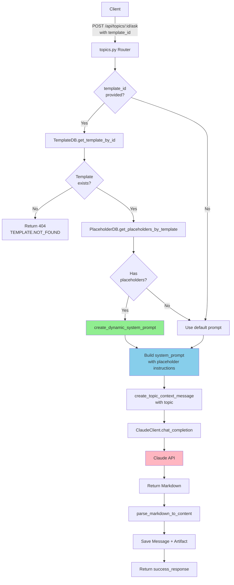

# Unit Spec: Dynamic System Prompt Generation from Template Placeholders

## 1. 요구사항 요약

- **목적:** Template의 placeholder를 기반으로 Claude API의 system prompt를 동적으로 생성하여 사용자 정의 템플릿 지원
- **유형:** ☑ 신규 ☐ 변경 ☐ 삭제
- **핵심 요구사항:**
  - 입력: `template_id` (int), `topic` (str)
  - 출력: 동적으로 생성된 system prompt (str), Claude API 응답 markdown (str)
  - 예외/제약:
    - Template이 존재하지 않으면 404 반환
    - Placeholder가 없는 Template은 기본 prompt 사용
    - Claude API 호출 타임아웃 120초
  - 처리흐름 요약: Template의 placeholder 조회 → 동적 prompt 생성 → Claude API 호출 → Markdown 반환

---

## 2. 구현 대상 파일

| 구분 | 경로 | 설명 |
|------|------|------|
| 신규 | `backend/app/utils/prompts.py` | `create_dynamic_system_prompt()` 함수 추가 |
| 변경 | `backend/app/routers/topics.py` | `/api/topics/{topic_id}/ask` 엔드포인트에 template_id 파라미터 추가 |
| 변경 | `backend/app/routers/topics.py` | `/api/topics/generate` 엔드포인트에 template_id 파라미터 추가 |
| 변경 | `backend/app/models/topic.py` | `TopicMessageRequest` 모델에 `template_id` 필드 추가 (Optional) |
| 참조 | `backend/app/utils/claude_client.py` | Claude API 호출 패턴 참고 |
| 참조 | `backend/app/database/template_db.py` | Template 및 Placeholder 조회 로직 참고 |
| 참조 | `backend/app/utils/markdown_parser.py` | Markdown 파싱 로직 참고 |

---

## 3. 동작 플로우 (Mermaid)



---

## 4. 테스트 계획

### 4.1 원칙

- **테스트 우선(TDD)**: 본 섹션의 항목을 우선 구현하고 코드 작성
- **계층별 커버리지**: Unit → Integration → API(E2E-lite) 순서로 최소 P0 커버
- **독립성/재현성**: Claude API는 모킹, DB는 실제 SQLite 사용
- **판정 기준**: 기대 상태코드/스키마/부작용(저장/로그)을 명시적으로 검증

### 4.2 구현 예상 테스트 항목

| TC ID | 계층 | 시나리오 | 목적(무엇을 검증?) | 입력/사전조건 | 기대결과 |
|-------|------|----------|-------------------|---------------|---------|
| TC-UNIT-001 | Unit | 동적 prompt 생성 (5개 placeholder) | placeholder 기반 prompt 생성 | `placeholders = [{{TITLE}}, {{SUMMARY}}, {{BACKGROUND}}, {{MAIN_CONTENT}}, {{CONCLUSION}}]` | prompt에 5개 항목 포함, 구조화된 출력 요청 포함 |
| TC-UNIT-002 | Unit | 동적 prompt 생성 (커스텀 placeholder) | 비표준 placeholder 처리 | `placeholders = [{{EXECUTIVE_SUMMARY}}, {{RISK_ANALYSIS}}, {{RECOMMENDATION}}]` | prompt에 3개 커스텀 항목 포함 |
| TC-UNIT-003 | Unit | 빈 placeholder 리스트 | 기본 prompt 반환 | `placeholders = []` | `FINANCIAL_REPORT_SYSTEM_PROMPT` 반환 |
| TC-UNIT-004 | Unit | 중복 placeholder 제거 | 중복 제거 로직 검증 | `placeholders = [{{TITLE}}, {{TITLE}}, {{SUMMARY}}]` | prompt에 2개 항목만 포함 |
| TC-API-005 | API | template_id 포함 요청 성공 | API 계약/상태코드 검증 | `POST /api/topics/1/ask {topic: "AI", template_id: 1}` | 200, markdown 필드 존재, Message + Artifact 생성됨 |
| TC-API-006 | API | 존재하지 않는 template_id | 에러 처리 | `POST /api/topics/1/ask {topic: "AI", template_id: 999}` | 404, `TEMPLATE.NOT_FOUND` |
| TC-API-007 | API | template_id 없이 요청 (기본 동작) | 하위 호환성 검증 | `POST /api/topics/1/ask {topic: "AI"}` | 200, 기본 prompt 사용 |
| TC-API-008 | API | 다른 사용자의 template 접근 | 권한 검증 | User A의 template을 User B가 요청 | 404, `TEMPLATE.NOT_FOUND` |
| TC-INTG-009 | Integration | Template → Placeholder → Prompt → Claude | 전체 플로우 | Template with placeholders → 동적 prompt 생성 → Claude 모킹 → MD 파싱 | 올바른 구조의 MD 반환 |
| TC-INTG-010 | Integration | Template → HWPX 변환 | Placeholder 매칭 검증 | Template placeholders와 MD content 매칭 → HWPX 변환 | HWPX 파일에 placeholder가 올바르게 치환됨 |

### 4.3 샘플 테스트 코드

#### TC-UNIT-001: 동적 prompt 생성 (5개 placeholder)

```python
# tests/test_prompts.py
import pytest
from app.utils.prompts import create_dynamic_system_prompt
from app.models.template import Placeholder

def test_create_dynamic_prompt_with_standard_placeholders():
    """표준 placeholder로 동적 prompt 생성 테스트"""
    # Given: 5개의 표준 placeholder
    placeholders = [
        Placeholder(id=1, template_id=1, placeholder_key="{{TITLE}}"),
        Placeholder(id=2, template_id=1, placeholder_key="{{SUMMARY}}"),
        Placeholder(id=3, template_id=1, placeholder_key="{{BACKGROUND}}"),
        Placeholder(id=4, template_id=1, placeholder_key="{{MAIN_CONTENT}}"),
        Placeholder(id=5, template_id=1, placeholder_key="{{CONCLUSION}}")
    ]

    # When: 동적 prompt 생성
    prompt = create_dynamic_system_prompt(placeholders)

    # Then: 모든 placeholder가 prompt에 포함됨
    assert "TITLE" in prompt
    assert "SUMMARY" in prompt
    assert "BACKGROUND" in prompt
    assert "MAIN_CONTENT" in prompt
    assert "CONCLUSION" in prompt
    assert "Markdown" in prompt  # Markdown 출력 지시 포함
    assert "##" in prompt  # H2 구조 지시 포함
```

#### TC-API-005: template_id 포함 요청 성공

```python
# tests/test_topics_router.py
import pytest
from fastapi.testclient import TestClient
from unittest.mock import patch, MagicMock
from app.main import app
from app.database.template_db import TemplateDB, PlaceholderDB

@pytest.fixture
def client():
    return TestClient(app)

@pytest.fixture
def auth_headers(test_user):
    """인증 헤더 픽스처"""
    token = create_access_token(data={"sub": test_user.email})
    return {"Authorization": f"Bearer {token}"}

def test_ask_with_template_id_success(client, auth_headers, test_user):
    """template_id를 포함한 요청이 성공하는지 테스트"""
    # Given: Topic과 Template 생성
    topic = TopicDB.create_topic(test_user.id, TopicCreate(title="AI Report"))
    template = TemplateDB.create_template(test_user.id, TemplateCreate(
        title="Custom Template",
        filename="template.hwpx",
        file_path="/path/to/template.hwpx",
        file_size=1024,
        sha256="abc123"
    ))
    PlaceholderDB.create_placeholders_batch(template.id, [
        "{{TITLE}}", "{{SUMMARY}}", "{{CONCLUSION}}"
    ])

    # Mock Claude API
    with patch('app.utils.claude_client.Anthropic') as mock_anthropic:
        mock_client = MagicMock()
        mock_anthropic.return_value = mock_client
        mock_message = MagicMock()
        mock_message.content = [MagicMock(text="# Test Report\n## Summary\nTest content")]
        mock_message.usage.input_tokens = 100
        mock_message.usage.output_tokens = 200
        mock_client.messages.create.return_value = mock_message

        # When: template_id와 함께 요청
        response = client.post(
            f"/api/topics/{topic.id}/ask",
            json={
                "user_message": "AI 기술 동향 보고서 작성",
                "template_id": template.id
            },
            headers=auth_headers
        )

        # Then: 성공 응답
        assert response.status_code == 200
        data = response.json()
        assert data["success"] is True
        assert "message" in data["data"]
        assert "artifact" in data["data"]

        # Verify: Message와 Artifact가 DB에 저장됨
        message = MessageDB.get_messages_by_topic(topic.id)[0]
        assert message is not None
        artifact = ArtifactDB.get_artifact_by_message_id(message.id)
        assert artifact is not None
```

#### TC-API-006: 존재하지 않는 template_id

```python
def test_ask_with_invalid_template_id(client, auth_headers, test_user):
    """존재하지 않는 template_id로 요청 시 404 반환 테스트"""
    # Given: Topic만 생성 (Template 없음)
    topic = TopicDB.create_topic(test_user.id, TopicCreate(title="AI Report"))

    # When: 존재하지 않는 template_id로 요청
    response = client.post(
        f"/api/topics/{topic.id}/ask",
        json={
            "user_message": "AI 기술 동향 보고서 작성",
            "template_id": 99999
        },
        headers=auth_headers
    )

    # Then: 404 에러 반환
    assert response.status_code == 404
    data = response.json()
    assert data["success"] is False
    assert data["error"]["code"] == "TEMPLATE.NOT_FOUND"
```

---

## 5. 사용자 요청 프롬프트

### Original User Request (1차)

```
현재 프로젝트를 분석해서.
해당 요구사항을 현재 프로젝트에서 구현 가능 한지 검토 해줘.

요구사항
 1. 사용자 요구사항(template, topic 포함) 요청
 2. template에 속한 placeholder를 기반으로 system prompt에 등록할 구조 생성
 3. system prompt(template의 placeholder 기반), message(topic 기반)을 등록하여 claude api에 질문
 4. claude api에서 응답받은 데이터를 md 파일로 저장.
 5. md 파일을 기반으로 hwpx로 변환. (hwpx로 변환될 때 파일 내부에 기록된 플레이스홀더와 리플레이스)
```

### Claude 응답

```
분석 결과:
- 1, 3, 4, 5번 요구사항은 이미 구현됨
- 2번 요구사항이 부분 구현 필요:
  - Template의 placeholder 추출 기능: ✅ 완료 (TemplatesManager.extract_placeholders)
  - Placeholder를 DB에 저장: ✅ 완료 (PlaceholderDB)
  - ❌ 미구현: Placeholder를 기반으로 동적으로 system prompt를 생성하는 로직

현재 System Prompt는 prompts.py에 하드코딩되어 있음.
필요한 기능: Template의 placeholder를 조회하여 동적으로 system prompt를 구성하는 함수 구현.
```

### User Clarification/Modification (2차)

```
현재 Placeholder는 @backend/app/routers/templates.py 에 구현이 되어 있어.
이 부분 검토해줘.

[확인 결과]
- TemplatesManager.extract_placeholders() 메서드 확인 완료
- PlaceholderDB 클래스 확인 완료
- Placeholder 추출 및 저장 로직은 완전히 구현됨
- 여전히 동적 prompt 생성 로직은 미구현
```

```
문서작성해줘.
```

### 최종 명확화 (통합)

- ✅ Template에서 placeholder 추출 기능 (이미 구현됨)
- ✅ Placeholder를 DB에 저장 (이미 구현됨)
- ✅ Claude API 호출 기능 (이미 구현됨)
- ✅ Markdown 저장 및 HWPX 변환 (이미 구현됨)
- ❌ **구현 필요:** Template의 placeholder를 기반으로 동적 system prompt 생성
- ❌ **구현 필요:** API 엔드포인트에 template_id 파라미터 추가
- ❌ **구현 필요:** Template 권한 검증 (자신의 template만 사용 가능)

---

**요청 일시:** 2025-11-07

**컨텍스트/배경:**
- 현재 시스템은 고정된 template (`report_template.hwpx`)과 하드코딩된 system prompt 사용
- 사용자가 커스텀 template을 업로드할 수 있는 기능은 이미 구현됨 (`/api/templates`)
- 사용자가 자신의 template에 정의된 placeholder 구조에 맞춰 보고서를 생성하려면, 동적 prompt 생성 기능이 필요함
- 기존 기능과의 하위 호환성을 유지하면서 확장해야 함 (template_id를 선택적 파라미터로 제공)

---

## 6. 상세 구현 명세

### 6.1 `create_dynamic_system_prompt()` 함수

**위치:** `backend/app/utils/prompts.py`

**함수 시그니처:**
```python
def create_dynamic_system_prompt(placeholders: List[Placeholder]) -> str:
    """Template의 placeholder를 기반으로 동적 system prompt 생성.

    Args:
        placeholders: Template에 정의된 placeholder 목록

    Returns:
        동적으로 생성된 system prompt (Markdown 형식)

    Examples:
        >>> placeholders = [
        ...     Placeholder(id=1, template_id=1, placeholder_key="{{TITLE}}"),
        ...     Placeholder(id=2, template_id=1, placeholder_key="{{SUMMARY}}")
        ... ]
        >>> prompt = create_dynamic_system_prompt(placeholders)
        >>> print(prompt)
        당신은 금융 기관의 전문 보고서 작성자입니다.
        다음 구조로 Markdown 보고서를 작성하세요:

        # [보고서 제목]
        ## TITLE
        [TITLE 내용]
        ## SUMMARY
        [SUMMARY 내용]
    """
```

**구현 로직:**
1. Placeholder 키에서 `{{`, `}}` 제거하여 항목명 추출
2. 중복 제거 (set 사용)
3. 항목별로 H2 섹션 구조 생성
4. 기본 지시사항 + 동적 구조를 결합하여 prompt 생성

**Prompt 템플릿:**
```
당신은 금융 기관의 전문 보고서 작성자입니다.
다음 구조로 Markdown 보고서를 작성하세요:

# [보고서 제목]
{동적으로 생성된 섹션 구조}

**작성 가이드:**
- 각 섹션은 H2(##)로 시작하세요
- 각 섹션은 명확하고 구조화된 내용을 포함하세요
- 전문적이고 객관적인 톤을 유지하세요
- 불필요한 장식적 표현은 피하세요
```

### 6.2 API 엔드포인트 수정

**변경 파일:** `backend/app/routers/topics.py`

#### `/api/topics/{topic_id}/ask` 엔드포인트

**Request Model 변경:**
```python
# backend/app/models/topic.py
class TopicMessageRequest(BaseModel):
    user_message: str = Field(..., min_length=1, max_length=5000)
    template_id: Optional[int] = Field(None, description="사용할 템플릿 ID (선택)")
    selected_artifact_ids: Optional[List[int]] = Field(None)
```

**로직 변경:**
```python
@router.post("/{topic_id}/ask")
async def ask_question(
    topic_id: int,
    request: TopicMessageRequest,
    current_user: User = Depends(get_current_active_user)
):
    # 1. Topic 조회 및 권한 검증 (기존)
    topic = TopicDB.get_topic_by_id(topic_id, current_user.id)
    if not topic:
        return error_response(...)

    # 2. [NEW] Template 기반 system prompt 생성
    if request.template_id:
        # Template 조회 (권한 검증 포함)
        template = TemplateDB.get_template_by_id(request.template_id, current_user.id)
        if not template:
            return error_response(
                code=ErrorCode.TEMPLATE_NOT_FOUND,
                http_status=404,
                message="템플릿을 찾을 수 없습니다.",
                hint="템플릿 ID를 확인하거나 template_id 없이 요청해주세요."
            )

        # Placeholder 조회
        placeholders = PlaceholderDB.get_placeholders_by_template(template.id)

        # 동적 prompt 생성
        if placeholders:
            system_prompt = create_dynamic_system_prompt(placeholders)
        else:
            system_prompt = FINANCIAL_REPORT_SYSTEM_PROMPT
    else:
        # 기본 prompt 사용
        system_prompt = FINANCIAL_REPORT_SYSTEM_PROMPT

    # 3. Claude API 호출 (기존 로직, system_prompt 파라미터 전달)
    messages = [...]
    markdown = claude_client.chat_completion(system_prompt, messages)

    # 4-7. 나머지 로직 (기존과 동일)
    ...
```

### 6.3 Response Helper 에러 코드 추가

**파일:** `backend/app/utils/response_helper.py`

```python
class ErrorCode:
    # ... 기존 코드 ...

    # Template Errors
    TEMPLATE_NOT_FOUND = "TEMPLATE.NOT_FOUND"
    TEMPLATE_UNAUTHORIZED = "TEMPLATE.UNAUTHORIZED"
    TEMPLATE_INVALID_FORMAT = "TEMPLATE.INVALID_FORMAT"
    TEMPLATE_DUPLICATE_PLACEHOLDER = "TEMPLATE.DUPLICATE_PLACEHOLDER"
```

---

## 7. 데이터베이스 영향

**변경 없음** - 기존 `templates`와 `placeholders` 테이블 사용

---

## 8. 하위 호환성

- `template_id`는 Optional 파라미터로 구현
- 기존 요청 (template_id 없음)은 기본 prompt 사용하여 동작
- 기존 API 응답 구조 유지

---

## 9. 보안 고려사항

1. **Template 권한 검증**: `TemplateDB.get_template_by_id(template_id, user_id)` 사용
   - 다른 사용자의 template 접근 차단
2. **SQL Injection 방지**: Parameterized query 사용 (이미 적용됨)
3. **Placeholder Injection 방지**:
   - Regex 패턴으로 `{{[A-Z_]+}}` 형식만 허용
   - 사용자 입력을 placeholder로 직접 사용하지 않음

---

## 10. 성능 고려사항

1. **DB 쿼리 최적화**:
   - Template + Placeholder를 한 번의 트랜잭션으로 조회
   - 캐싱 고려 (향후 개선)
2. **Prompt 생성 오버헤드**:
   - 최대 20-30개 placeholder 가정 시 무시 가능한 수준
3. **Claude API 타임아웃**: 기존 120초 유지

---

## 11. 향후 확장 가능성

1. **Template 공유**: Public template 기능 (관리자 승인)
2. **Prompt 템플릿 라이브러리**: 업종별/목적별 prompt 템플릿
3. **다국어 지원**: Placeholder에 label 추가 (영문/한글)
4. **Prompt 버전 관리**: Template 업데이트 시 prompt 이력 관리

---

## 12. 롤백 계획

1. **기능 비활성화**: `template_id` 파라미터 무시하고 기본 prompt 사용
2. **코드 롤백**: Git revert로 변경 전 상태로 복구
3. **영향 범위**: API 엔드포인트 2개, 유틸 함수 1개 (최소 영향)

---

**문서 작성자:** Claude Code
**문서 작성일:** 2025-11-07
**문서 버전:** 1.0
**승인 상태:** ⏳ Pending Review
