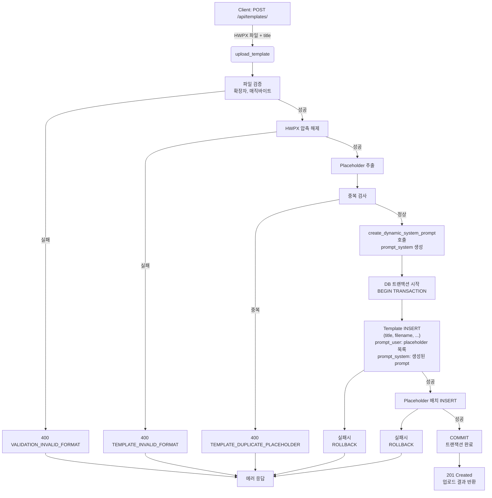

# Unit Spec: Template 업로드 시 동적 System Prompt 자동 생성 및 저장

## 1. 요구사항 요약

- **목적:** 사용자가 업로드한 Template에서 추출한 Placeholder를 기반으로 동적 system_prompt를 자동 생성하여 DB에 저장
- **유형:** ☑️ 변경
- **핵심 요구사항:**
  - 입력: Template HWPX 파일 업로드 (이미 구현)
  - 출력: Template DB에 `prompt_user`, `prompt_system` 저장
  - 예외/제약:
    - 모든 작업 완료 후 DB 저장 (원자성 보장)
    - 중간에 오류 발생 시 전체 롤백 (트랜잭션)
    - `create_dynamic_system_prompt()` 함수 호출하여 prompt 생성
  - 처리흐름 요약:
    1. Template 파일 검증 및 임시 저장
    2. HWPX 압축 해제 및 Placeholder 추출
    3. `create_dynamic_system_prompt()` 호출하여 동적 prompt 생성
    4. DB에 Template + Prompt 일괄 저장 (트랜잭션)

---

## 2. 구현 대상 파일

| 구분 | 경로                                       | 설명                                    |
|------|--------------------------------------------|-----------------------------------------|
| 변경 | backend/app/database/connection.py         | Templates 테이블 마이그레이션 (컬럼 추가) |
| 변경 | backend/app/models/template.py             | Template 모델에 prompt 필드 추가        |
| 변경 | backend/app/routers/templates.py           | upload_template 함수 수정               |
| 변경 | backend/app/database/template_db.py        | create_template 메서드 수정             |
| 참조 | backend/app/utils/prompts.py               | create_dynamic_system_prompt 함수 (기존) |
| 참조 | backend/app/utils/templates_manager.py     | TemplatesManager (기존)                 |

---

## 3. 동작 플로우 (Mermaid)



---

## 4. 데이터 구조 변경

### 4.1 Templates 테이블 마이그레이션

**변경 사항:**

```sql
-- 추가 컬럼 (기존 테이블에 ALTER TABLE로 추가)
ALTER TABLE templates ADD COLUMN prompt_user TEXT DEFAULT NULL;
ALTER TABLE templates ADD COLUMN prompt_system TEXT DEFAULT NULL;
```

**최종 테이블 스키마:**

| 컬럼명 | 타입 | NOT NULL | 기본값 | 설명 |
|-------|------|----------|--------|------|
| id | INTEGER | ✅ | PK | 템플릿 ID |
| user_id | INTEGER | ✅ | FK | 사용자 ID |
| title | TEXT | ✅ | | 템플릿 제목 |
| description | TEXT | | NULL | 템플릿 설명 |
| filename | TEXT | ✅ | | 파일명 |
| file_path | TEXT | ✅ | | 파일 경로 |
| file_size | INTEGER | | 0 | 파일 크기 |
| sha256 | TEXT | ✅ | | SHA256 해시 |
| is_active | BOOLEAN | | 1 | 활성화 상태 |
| **prompt_user** | **TEXT** | | **NULL** | **Placeholder 목록 (JSON 또는 문자열)** |
| **prompt_system** | **TEXT** | | **NULL** | **동적 생성된 System Prompt** |
| created_at | TIMESTAMP | | NOW | 생성 날짜 |
| updated_at | TIMESTAMP | | NOW | 수정 날짜 |

### 4.2 Template 모델 업데이트

**변경 전:**
```python
class Template(TemplateCreate):
    id: int
    user_id: int
    is_active: bool = Field(True, description="활성화 상태")
    created_at: datetime
    updated_at: datetime
```

**변경 후:**
```python
class Template(TemplateCreate):
    id: int
    user_id: int
    is_active: bool = Field(True, description="활성화 상태")
    prompt_user: Optional[str] = Field(None, description="Placeholder 목록")
    prompt_system: Optional[str] = Field(None, description="동적 생성된 System Prompt")
    created_at: datetime
    updated_at: datetime
```

---

## 5. API 변경 사항

### 5.1 POST /api/templates/ (변경)

**기존 동작:** Template 업로드 및 Placeholder 저장

**변경 사항:**
- 업로드 후 `create_dynamic_system_prompt()` 호출
- `prompt_system` DB 저장
- 트랜잭션 처리

**응답 예시 (201 Created):**

```json
{
  "success": true,
  "data": {
    "id": 1,
    "title": "재무보고서 템플릿",
    "filename": "template_20251108_123456.hwpx",
    "file_size": 45678,
    "placeholders": [
      {"key": "{{TITLE}}"},
      {"key": "{{SUMMARY}}"},
      {"key": "{{CONCLUSION}}"}
    ],
    "prompt_user": "{{TITLE}}, {{SUMMARY}}, {{CONCLUSION}}",
    "prompt_system": "당신은 금융 기관의 전문 보고서 작성자입니다...",
    "created_at": "2025-11-08T10:30:00"
  },
  "error": null,
  "meta": {"requestId": "uuid"}
}
```

---

## 6. 핵심 구현 로직

### 6.1 upload_template 함수 수정 포인트

```python
async def upload_template(...):
    # 기존 로직 (1-9단계: 검증, 임시저장, 압축해제, placeholder 추출)

    # [신규] 10단계: Dynamic Prompt 생성
    from app.utils.prompts import create_dynamic_system_prompt
    prompt_system = create_dynamic_system_prompt(placeholders)

    # [신규] 11단계: prompt_user 준비 (Placeholder 키 리스트 문자열화)
    prompt_user = ", ".join([p.placeholder_key for p in placeholders])

    # [신규] 12단계: DB 트랜잭션 (원자성 보장)
    try:
        template_data = TemplateCreate(
            title=title,
            description=None,
            filename=file.filename,
            file_path="",
            file_size=len(file_content),
            sha256=sha256,
            prompt_user=prompt_user,      # 신규
            prompt_system=prompt_system    # 신규
        )

        # Template 생성 (Placeholder와 함께 원자적으로 처리)
        template = TemplateDB.create_template_with_transaction(
            current_user.id,
            template_data,
            placeholder_list  # Placeholder도 함께 저장
        )

        # 성공 응답
        return success_response(...)

    except Exception as e:
        # 롤백 자동 처리
        return error_response(...)
```

### 6.2 TemplateDB.create_template_with_transaction 신규 메서드

```python
@staticmethod
def create_template_with_transaction(
    user_id: int,
    template_data: TemplateCreate,
    placeholders: List[str]  # Placeholder 키 리스트
) -> Template:
    """
    Template와 Placeholder를 트랜잭션으로 원자적으로 저장

    Args:
        user_id: 사용자 ID
        template_data: Template 데이터 (prompt_user, prompt_system 포함)
        placeholders: Placeholder 키 리스트

    Returns:
        생성된 Template 객체

    Raises:
        Exception: DB 오류 시 트랜잭션 롤백
    """
    conn = get_db_connection()
    cursor = conn.cursor()

    try:
        # 트랜잭션 시작
        cursor.execute("BEGIN TRANSACTION")

        # Template INSERT
        cursor.execute("""
            INSERT INTO templates
            (user_id, title, description, filename, file_path, file_size, sha256, prompt_user, prompt_system, created_at, updated_at)
            VALUES (?, ?, ?, ?, ?, ?, ?, ?, ?, CURRENT_TIMESTAMP, CURRENT_TIMESTAMP)
        """, (
            user_id,
            template_data.title,
            template_data.description,
            template_data.filename,
            template_data.file_path,
            template_data.file_size,
            template_data.sha256,
            template_data.prompt_user,
            template_data.prompt_system
        ))

        template_id = cursor.lastrowid

        # Placeholder 배치 INSERT
        for placeholder_key in placeholders:
            cursor.execute("""
                INSERT INTO placeholders (template_id, placeholder_key, created_at)
                VALUES (?, ?, CURRENT_TIMESTAMP)
            """, (template_id, placeholder_key))

        # 커밋
        conn.commit()

        # 결과 조회 및 반환
        return get_template(template_id)

    except Exception as e:
        conn.rollback()
        raise e
    finally:
        cursor.close()
        conn.close()
```

---

## 7. 테스트 계획

### 7.1 원칙

- **테스트 우선(TDD)**: 본 섹션의 항목을 우선 구현하고 코드 작성
- **계층별 커버리지**: Unit → Integration → API 순서로 최소 P0 커버
- **독립성/재현성**: 외부 연동은 모킹 처리
- **판정 기준**: 응답 코드, 스키마, DB 상태를 명시적으로 검증

### 7.2 구현 예상 테스트 항목

| TC ID | 계층 | 시나리오 | 목적 | 입력/사전조건 | 기대결과 |
|-------|------|---------|------|--------------|---------|
| TC-API-001 | API | Template 업로드 성공 (Prompt 자동생성) | API 응답 스키마 및 prompt 필드 검증 | HWPX 파일 + title | 201, `prompt_system`, `prompt_user` 필드 포함, DB에 저장됨 |
| TC-API-002 | API | 입력 누락 | 입력 검증 | 파일 누락 | 400 VALIDATION_REQUIRED_FIELD |
| TC-API-003 | API | 잘못된 파일 형식 | 확장자 검증 | .docx 파일 | 400 VALIDATION_INVALID_FORMAT |
| TC-API-004 | API | 손상된 HWPX | HWPX 검증 | 매직바이트 없음 | 400 TEMPLATE_INVALID_FORMAT |
| TC-API-005 | API | 중복 Placeholder | 중복 검사 | {{TITLE}} 중복 | 400 TEMPLATE_DUPLICATE_PLACEHOLDER |
| TC-SVC-006 | Unit | create_dynamic_system_prompt 호출 | Prompt 생성 로직 | placeholders 리스트 | Prompt 문자열 반환, 모든 placeholder 포함 |
| TC-DB-007 | Integration | 트랜잭션 성공 | Template + Placeholder 원자적 저장 | 정상 데이터 | Template 1개 + Placeholder N개 INSERT, prompt 필드 저장됨 |
| TC-DB-008 | Integration | 트랜잭션 롤백 (Template INSERT 실패 후 Placeholder 시도) | 롤백 처리 | DB 제약 위반 시뮬레이션 | Template 0개, Placeholder 0개 (완전 롤백) |
| TC-DB-009 | Integration | 트랜잭션 롤백 (Placeholder INSERT 실패 후) | 부분 실패 시 전체 롤백 | Placeholder 제약 위반 시뮬레이션 | Template 0개 (롤백됨) |
| TC-API-010 | API | 응답에 prompt 필드 포함 | 응답 스키마 | 정상 업로드 | `prompt_user`, `prompt_system` 모두 응답에 포함 |

### 7.3 샘플 테스트 코드

```python
# backend/tests/test_template_dynamic_prompt.py

import pytest
from fastapi.testclient import TestClient
from app.main import app

client = TestClient(app)

@pytest.fixture
def auth_headers(client):
    # 로그인 후 토큰 반환
    response = client.post("/api/auth/register", json={...})
    token = response.json()["data"]["access_token"]
    return {"Authorization": f"Bearer {token}"}

class TestTemplateUploadWithDynamicPrompt:

    def test_upload_template_with_dynamic_prompt_success(self, auth_headers):
        """Template 업로드 시 동적 prompt 자동 생성 검증"""
        with open("path/to/sample.hwpx", "rb") as f:
            files = {"file": f}
            data = {"title": "Test Template"}

            response = client.post(
                "/api/templates/",
                headers=auth_headers,
                files=files,
                data=data
            )

        assert response.status_code == 201
        result = response.json()
        assert result["success"] is True

        # 신규 필드 검증
        assert "prompt_user" in result["data"]
        assert "prompt_system" in result["data"]
        assert result["data"]["prompt_system"] is not None
        assert len(result["data"]["prompt_system"]) > 0

        # DB 검증
        from app.database.template_db import TemplateDB
        template = TemplateDB.get_template(result["data"]["id"])
        assert template.prompt_user is not None
        assert template.prompt_system is not None

    def test_upload_template_transaction_rollback_on_failure(self, auth_headers, monkeypatch):
        """Placeholder INSERT 실패 시 Template도 롤백되는지 검증"""

        with open("path/to/sample.hwpx", "rb") as f:
            files = {"file": f}
            data = {"title": "Test Template"}

            # Placeholder INSERT를 실패하도록 모킹
            original_create_placeholders = PlaceholderDB.create_placeholders_batch
            def mock_create_placeholders_batch(*args, **kwargs):
                raise Exception("Simulated DB Error")

            monkeypatch.setattr(PlaceholderDB, "create_placeholders_batch", mock_create_placeholders_batch)

            response = client.post(
                "/api/templates/",
                headers=auth_headers,
                files=files,
                data=data
            )

        assert response.status_code == 500
        assert response.json()["success"] is False

        # DB에 Template이 저장되지 않았는지 확인
        from app.database.template_db import TemplateDB
        # 마지막 Template이 생성되지 않았거나 다른 Template인지 확인
```

---

## 8. 구현 체크리스트

- [ ] **DB 마이그레이션**
  - [ ] `backend/app/database/connection.py` - Templates 테이블 ALTER (prompt_user, prompt_system 추가)
  - [ ] 마이그레이션 검증 (python init_db.py 실행)

- [ ] **Model 변경**
  - [ ] `backend/app/models/template.py` - Template, TemplateCreate 모델에 prompt 필드 추가

- [ ] **Router 변경**
  - [ ] `backend/app/routers/templates.py` - upload_template 함수 수정
    - [ ] create_dynamic_system_prompt 호출
    - [ ] prompt_user, prompt_system 준비
    - [ ] TemplateDB.create_template_with_transaction 호출

- [ ] **Database 변경**
  - [ ] `backend/app/database/template_db.py`
    - [ ] create_template_with_transaction 신규 메서드 구현
    - [ ] 트랜잭션 처리 (BEGIN, COMMIT, ROLLBACK)

- [ ] **응답 모델 업데이트**
  - [ ] UploadTemplateResponse에 prompt 필드 추가

- [ ] **테스트**
  - [ ] TC-API-001: 성공 케이스 (Prompt 생성 및 저장)
  - [ ] TC-API-002~005: 입력 검증
  - [ ] TC-SVC-006: create_dynamic_system_prompt 호출 검증
  - [ ] TC-DB-007~009: 트랜잭션 원자성 검증
  - [ ] TC-API-010: 응답 스키마 검증

- [ ] **문서화**
  - [ ] Docstring 작성
  - [ ] Swagger 문서 자동 생성 확인

---

## 9. 사용자 요청 기록

### Original User Request:

```
기능을 수정해줘.
요구사항 : template 업로드시 system_prompt 자동 생성 및 templates DB에 저장 흐름 생성.
수정대상 : "POST /api/templates/"
DB 변경 사항  1. templates 테이블에 신규 속성 2개 추가 (prompt_user, prompt_system)
사용예시
1. 사용자 template 업로드
2. 기존에 해당 API 진행 후 마지막에 prompts.py 에 있는 "create_dynamic_system_prompt" 를 호출후 templates에 systme_prompt로 저장.
제약사항1. : 모든 작업이 완료된 다음에 DB 저장 진행. 한 번이라도 정상적으로 수행되지 않는 내역이 있으면 롤백 처리.
```

### 최종 명확화 (통합):

- ✅ templates 테이블에 `prompt_user`, `prompt_system` 컬럼 추가
- ✅ POST /api/templates/ 수정: 업로드 후 create_dynamic_system_prompt() 호출
- ✅ prompt_system을 templates DB에 저장
- ✅ 트랜잭션 처리: BEGIN → INSERT (Template + Placeholder) → COMMIT/ROLLBACK
- ✅ 단계 10~12: Dynamic Prompt 생성 및 DB 저장

---

**요청 일시:** 2025-11-08

**컨텍스트/배경:**
- 기존 Template 업로드 API (POST /api/templates/)는 정상 작동 중
- `create_dynamic_system_prompt()` 함수는 prompts.py에 구현되어 있음
- 새로운 기능: Template 업로드 시 자동으로 placeholder 기반 system_prompt 생성 및 저장

---

## 검토 항목

- [ ] 요구사항 명확함?
- [ ] DB 스키마 변경이 명확함?
- [ ] 트랜잭션 처리 방식이 적절함?
- [ ] 테스트 계획이 충분함?
- [ ] 프로세스 플로우가 타당함?

**승인자 명:** _______________
**승인 일시:** _______________
