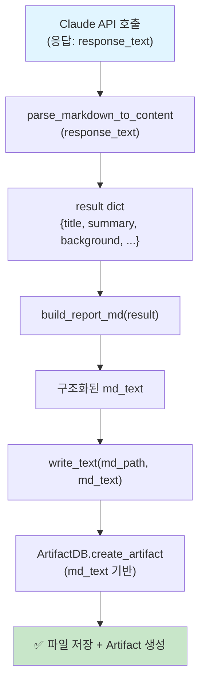

# Unit Spec: /ask 엔드포인트 아티팩트 마크다운 파싱 수정

## 1. 요구사항 요약

- **목적:** `/api/topics/{topic_id}/ask` 엔드포인트에서 Claude 응답을 저장할 때, 원본 응답 전체가 아닌 파싱된 구조화된 마크다운만 artifact로 저장하도록 수정
- **유형:** ☑️ 변경
- **핵심 요구사항:**
  - 입력: Claude API 응답 (markdown 형식 raw text)
  - 출력: 파싱된 구조화된 마크다운 (title, summary, background, main_content, conclusion)
  - 예외/제약:
    - 파싱 실패 시 원본 응답 저장이 아닌 에러 반환
    - `parse_markdown_to_content()` 호출 필수
    - `build_report_md()` 호출 필수
  - 처리흐름 요약: Claude 응답 → 파싱 → 마크다운 빌드 → 파일 저장 → artifact 생성

---

## 2. 구현 대상 파일

| 구분 | 경로                                    | 설명                                      |
| ---- | --------------------------------------- | ----------------------------------------- |
| 변경 | backend/app/routers/topics.py           | `/ask` 함수의 7단계 (MD 파일 저장) 수정   |
| 참조 | backend/app/routers/topics.py           | `generate_topic_report` 함수 (올바른 구현) |
| 참조 | backend/app/utils/markdown_parser.py    | `parse_markdown_to_content()` 함수        |
| 참조 | backend/app/utils/markdown_builder.py   | `build_report_md()` 함수                  |

---

## 3. 동작 플로우 (Mermaid)



**비교:**

**❌ 현재 (오류):** `response_text` → 직접 저장 → artifact 생성

**✅ 수정 후 (정상):** `response_text` → 파싱 → 빌드 → 저장 → artifact 생성

---

## 4. 구현 상세

### 4.1 수정 대상 코드 위치

**파일:** [backend/app/routers/topics.py](../../app/routers/topics.py)
**함수:** `ask()` (라인 590-959)
**대상 섹션:** 7단계 (MD 파일 저장, 라인 880-911)

### 4.2 현재 코드 (오류)

```python
# === 7단계: MD 파일 저장 (필수) ===
logger.info(f"[ASK] Saving MD artifact - topic_id={topic_id}")

try:
    # 버전 계산
    version = next_artifact_version(topic_id, ArtifactKind.MD, topic.language)
    logger.info(f"[ASK] Artifact version - version={version}")

    # 파일 경로 생성
    base_dir, md_path = build_artifact_paths(topic_id, version, "report.md")
    logger.info(f"[ASK] Artifact path - path={md_path}")

    # 파일 저장
    bytes_written = write_text(md_path, response_text)  # ❌ 원본 응답 전체
    file_hash = sha256_of(md_path)

    logger.info(f"[ASK] File written - size={bytes_written}, hash={file_hash[:16]}...")

    # Artifact DB 레코드 생성
    artifact = ArtifactDB.create_artifact(...)
```

### 4.3 수정된 코드 (정상)

```python
# === 7단계: MD 파일 저장 (필수) ===
logger.info(f"[ASK] Saving MD artifact - topic_id={topic_id}")

try:
    # Markdown 파싱 및 제목 추출
    logger.info(f"[ASK] Parsing markdown content")
    result = parse_markdown_to_content(response_text)
    logger.info(f"[ASK] Parsed successfully - title={result.get('title')}")

    # 마크다운 빌드
    md_text = build_report_md(result)
    logger.info(f"[ASK] Built markdown - length={len(md_text)}")

    # 버전 계산
    version = next_artifact_version(topic_id, ArtifactKind.MD, topic.language)
    logger.info(f"[ASK] Artifact version - version={version}")

    # 파일 경로 생성
    base_dir, md_path = build_artifact_paths(topic_id, version, "report.md")
    logger.info(f"[ASK] Artifact path - path={md_path}")

    # 파일 저장 (파싱된 마크다운만)
    bytes_written = write_text(md_path, md_text)  # ✅ 파싱된 마크다운
    file_hash = sha256_of(md_path)

    logger.info(f"[ASK] File written - size={bytes_written}, hash={file_hash[:16]}...")

    # Artifact DB 레코드 생성
    artifact = ArtifactDB.create_artifact(...)
```

### 4.4 주요 변경사항

| 항목 | 현재 | 수정 후 |
|------|------|--------|
| 파싱 여부 | ❌ 없음 | ✅ `parse_markdown_to_content()` 호출 |
| 빌드 여부 | ❌ 없음 | ✅ `build_report_md()` 호출 |
| 저장 내용 | `response_text` (원본) | `md_text` (파싱됨) |
| 로그 추가 | - | 파싱/빌드 진행 상황 |

### 4.5 `generate_topic_report` 함수와의 일관성

**참고:** `generate_topic_report` (라인 222-241)에서 이미 올바르게 구현됨:

```python
# === 8단계: Markdown 파일 저장 ===
try:
    md_text = build_report_md(result)  # 파싱된 result 사용
    version = next_artifact_version(topic.id, ArtifactKind.MD, topic_data.language)
    _, md_path = build_artifact_paths(topic.id, version, "report.md")
    bytes_written = write_text(md_path, md_text)  # ✅ 파싱된 md_text 저장
    file_hash = sha256_of(md_path)
```

→ `/ask`도 동일한 방식으로 수정하여 **일관성 확보**

---

## 5. 테스트 계획

### 5.1 원칙

- **테스트 우선(TDD)**: 본 섹션의 항목을 우선 구현하고 코드 작성
- **계층별 커버리지**: Unit (파싱 로직) → Integration (저장 로직) → API (E2E)
- **독립성/재현성**: Claude API, 파일 I/O 모킹
- **판정 기준**: artifact 파일 내용, 로그 메시지, 응답 스키마 검증

### 5.2 구현 예상 테스트 항목

| TC ID      | 계층 | 시나리오                    | 목적(무엇을 검증?)                                | 입력/사전조건                                   | 기대결과                                                         |
| ---------- | ---- | --------------------------- | ------------------------------------------------- | ----------------------------------------------- | ---------------------------------------------------------------- |
| TC-ASK-001 | API  | /ask 정상 호출              | artifact 파일이 파싱된 마크다운 포함하는지 검증  | POST /api/topics/{id}/ask `{"content":"..."}` | artifact 파일 내용이 구조화된 마크다운 (title, summary, ... 포함) |
| TC-ASK-002 | Unit | parse_markdown_to_content 호출 | 파싱 결과 dict 구조 검증                         | raw claude 응답 (markdown)                      | `result["title"]`, `result["summary"]` 등 키 존재 및 값 유효      |
| TC-ASK-003 | Unit | build_report_md 호출        | 빌드된 마크다운 형식 검증                        | parsed result dict                              | 빌드 결과가 `#`, `##` 헤더 포함한 유효한 마크다운                |
| TC-ASK-004 | Integration | 파싱 → 빌드 → 저장 | 전체 파이프라인 통합 검증                        | Claude 응답 (mocked) + file system (temp)       | 저장된 파일 크기, 해시, artifact DB 레코드 일관성 검증           |
| TC-ASK-005 | API  | 파싱 실패 시 오류 처리      | parse 실패 시 정상적인 에러 응답 반환            | 비정상 마크다운 형식 (mocked)                   | `500` + `ErrorCode.ARTIFACT_CREATION_FAILED` + error details     |
| TC-ASK-006 | Integration | artifact DB 레코드 정합성 | 저장된 파일과 artifact 메타정보 일치 검증        | 정상 파싱 결과                                  | artifact.file_size = 저장��� 파일 크기, artifact.sha256 = 실제 해시 |

### 5.3 샘플 테스트 코드 (스켈레톤)

**Test 파일:** `backend/tests/test_ask_artifact_markdown.py` (신규 또는 기존 파일 확장)

```python
# 예시 구조 (상세 구현은 BACKEND_TEST.md 참고)

class TestAskArtifactMarkdown:
    """
    /ask 엔드포인트의 artifact markdown 파싱 검증 테스트
    """

    def test_ask_saves_parsed_markdown_not_raw_response(self):
        """
        TC-ASK-001: artifact 파일에 파싱된 마크다운이 저장되는지 검증
        """
        # GIVEN
        topic_id = 1
        claude_response = "# 보고서\n## 요약\n...\n## 결론\n..."

        # WHEN
        response = client.post(
            f"/api/topics/{topic_id}/ask",
            json={"content": "..."},
            headers={"Authorization": f"Bearer {token}"}
        )

        # THEN
        assert response.status_code == 200
        artifact_id = response.json()["data"]["artifact"]["id"]
        artifact = ArtifactDB.get_artifact_by_id(artifact_id)

        with open(artifact.file_path, 'r', encoding='utf-8') as f:
            saved_content = f.read()

        # artifact 파일이 파싱된 마크다운을 포함해야 함
        assert "## 요약" in saved_content or "## Summary" in saved_content
        assert claude_response != saved_content  # 원본과 다름을 확인

    def test_ask_markdown_parsing_consistency_with_generate(self):
        """
        TC-ASK-004: /ask와 /generate의 파싱 로직 일관성 검증
        """
        # GIVEN: 동일한 Claude 응답
        claude_response = "# 제목\n## 요약\n...\n## 결론\n..."

        # WHEN: /generate로 생성한 artifact
        gen_artifact = ... # generate_topic_report 통해 생성

        # WHEN: /ask로 생성한 artifact
        ask_artifact = ... # ask 통해 생성

        # THEN: 두 artifact 파일의 내용 구조가 동일
        assert read_artifact(gen_artifact) == read_artifact(ask_artifact)

    def test_ask_parsing_failure_returns_error(self):
        """
        TC-ASK-005: 파싱 실패 시 에러 반환 검증
        """
        # GIVEN: 비정상 응답 (parse 실패 유발)
        with patch('app.utils.claude_client.ClaudeClient.chat_completion') as mock:
            mock.return_value = ("garbage content", 100, 50)  # 파싱 불가능한 내용

            # WHEN
            response = client.post(...)

            # THEN
            assert response.status_code == 500
            assert response.json()["error"]["code"] == "ARTIFACT.CREATION_FAILED"
```

---

## 5. 사용자 요청 프롬프트

### Original User Request

```
지금 @backend/app/routers/topics.py 에 /ask에 문제가 있는 것 같아.
추가로 물어본 질문에 대해서 보고서로 만들어진 md 파일이 artifact에
저장되는게 아니라 claude 가 응답으로 돌려준 모든 내용이 artifact로
들어가는데 이부분 점검해줘.
```

### Claude 분석 (분석 및 문제 원인 제시)

```
문제 발견 완료:

1. 문제 위치: /ask 함수 라인 893
   - 현재: bytes_written = write_text(md_path, response_text)
   - response_text는 Claude가 반환한 원본 응답(전체 내용)
   - 파싱/빌드 로직 없이 직접 저장

2. 올바른 구현: generate_topic_report 함수 (라인 226)
   - parse_markdown_to_content(response_text) 호출
   - build_report_md(result) 호출
   - 빌드된 마크다운(md_text)을 저장

3. 일관성 문제:
   - generate_topic_report: ✅ 올바른 방식
   - /ask: ❌ 원본 응답 직접 저장
   - 동일한 엔드포인트인데 처리 방식이 다름

원인: /ask 함수의 7단계 (MD 파일 저장)에서
generate_topic_report와 동일한 파싱-빌드 로직 누락
```

### 최종 명확화 (통합)

- ✅ 문제 특정: /ask 함수 라인 893의 `response_text` 직접 저장
- ✅ 원인 규명: 파싱 및 마크다운 빌드 로직 누락
- ✅ 참고 구현: `generate_topic_report` 함수의 라인 189-226 로직 동일 적용
- ✅ 일관성 확보: 두 함수의 artifact 저장 방식 통일
- ✅ 테스트 방략: artifact 파일 내용 검증 추가

---

**요청 일시:** 2025-11-10

**컨텍스트/배경:**

- 프로젝트: HWP Report Generator (FastAPI + Claude API)
- v2.0 이후 대화형 시스템 도입 (Topics + Messages + Artifacts)
- `generate_topic_report` (초기 보고서 생성)와 `/ask` (후속 질문) 두 엔드포인트 존재
- 두 엔드포인트 모두 Claude 응답을 마크다운 artifact로 저장해야 함

**관련 이슈:**

- `/ask` 엔드포인트에서 생성되는 artifact 파일이 Claude의 원본 응답 내용을 그대로 포함
- `generate_topic_report`에서는 정상적으로 파싱된 마크다운만 저장됨
- 두 엔드포인트의 처리 로직 불일치 → 사용자 경험 차이 발생

---

## 6. 구현 체크리스트

- [ ] `/ask` 함수의 7단계 코드 수정 완료
- [ ] `parse_markdown_to_content()` 호출 추가
- [ ] `build_report_md()` 호출 추가
- [ ] 로그 메시지 추가 (파싱, 빌드 진행 상황)
- [ ] `generate_topic_report` 와의 일관성 재확인
- [ ] Unit 테스트 작성 (TC-ASK-001 ~ TC-ASK-006)
- [ ] Integration 테스트 (파일 저장 및 artifact DB 정합성)
- [ ] API E2E 테스트 (실제 엔드포인트 호출)
- [ ] 로그 확인 및 에러 처리 검증
- [ ] Code Review 완료

---

**Spec 작성 일시:** 2025-11-10
**작성자:** Claude Code
**상태:** ⏳ 사용자 검토 대기
