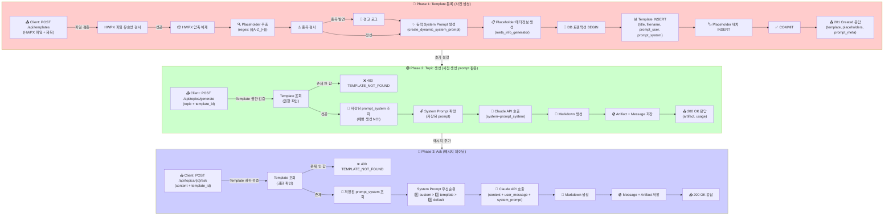

# Unit Spec: Template 기반 System Prompt 동적 생성 및 활용

## 1. 요구사항 요약

- **목적:** Template 업로드 시 Placeholder 기반 System Prompt를 사전 생성하여 저장하고, 사용자가 Template을 선택하여 보고서 생성 시 저장된 System Prompt를 활용하여 Claude API를 호출함으로써 API 사용량 및 처리 속도 최적화
- **유형:** ☑️ 변경 (Template 업로드) + ☑️ 변경 (Topic 생성/Ask)
- **핵심 요구사항:**
  - 입력:
    - 1️⃣ Template 업로드 (HWPX 파일 + 제목)
    - 2️⃣ Topic 생성 (주제 + template_id)
  - 출력:
    - 1️⃣ Template DB에 `prompt_system`, `prompt_user` 저장
    - 2️⃣ 저장된 prompt_system을 활용하여 Claude API 호출 후 보고서 반환
  - 예외/제약:
    - Template 등록 실패 시 전체 롤백 (트랜잭션)
    - template_id 존재하지 않음 → 400 TEMPLATE_NOT_FOUND
    - Placeholder 중복 → 경고 후 계속 진행 (또는 차단 옵션)
    - 매번 prompt 생성하지 않음 (사전 생성된 prompt 재사용)
    - 사용자가 prompt_system 수정 가능 (향후 기능)
  - 처리흐름 요약: Template 등록 시 placeholder 추출 → 동적 prompt 사전 생성 → DB 저장 | Topic 생성 시 저장된 prompt 조회 → Claude API 호출 (prompt 매번 생성 안 함)

---

## 2. 구현 대상 파일

| 구분 | 경로                                       | 설명                                    |
|------|--------------------------------------------|-----------------------------------------|
| 신규 | backend/app/utils/meta_info_generator.py   | Placeholder 분석 → 메타정보 JSON 생성   |
| 변경 | backend/app/models/template.py             | Template 모델 (prompt 필드 확인)        |
| 변경 | backend/app/database/template_db.py        | Template CRUD 메서드 (이미 구현)        |
| 변경 | backend/app/routers/templates.py           | POST /api/templates/ (이미 구현)        |
| 변경 | backend/app/routers/topics.py              | POST /api/topics/generate 수정          |
| 참조 | backend/app/utils/prompts.py               | create_dynamic_system_prompt (이미 구현)|
| 참조 | backend/app/utils/templates_manager.py     | extract_placeholders (이미 구현)        |

---

## 3. 동작 플로우 (Mermaid)



---

## 4. 데이터 구조

### 4.1 Template 모델

```python
class Template(BaseModel):
    id: int
    user_id: int
    title: str
    description: Optional[str] = None
    filename: str
    file_path: str
    file_size: int
    sha256: str
    is_active: bool = True

    # ✨ 신규/수정 필드
    prompt_user: Optional[str]          # "TITLE, SUMMARY, BACKGROUND" (Placeholder 목록)
    prompt_system: Optional[str]        # "당신은 금융... ## TITLE..." (사전 생성된 System Prompt)
    prompt_meta: Optional[str]          # JSON (메타정보 - 선택사항)

    created_at: datetime
    updated_at: datetime
```

### 4.2 Placeholder 메타정보 구조 (SystemPromptGenerate.md)

```json
[
  {
    "key": "{{TITLE}}",
    "type": "section_title",
    "display_name": "보고서 제목",
    "description": "보고서의 명확한 제목을 작성하세요.",
    "examples": ["2025 디지털뱅킹 트렌드 분석"],
    "required": true,
    "order_hint": 1
  },
  {
    "key": "{{SUMMARY}}",
    "type": "section_content",
    "display_name": "요약",
    "description": "2-3문단으로 보고서의 핵심 내용을 요약합니다.",
    "examples": ["최근 디지털 채널 이용률이 75%를 초과..."],
    "required": true,
    "order_hint": 2
  }
]
```

---

## 5. API 변경 사항

### 5.1 POST /api/templates/ (기존 구현 확인)

**요청:**
```json
POST /api/templates/
Content-Type: multipart/form-data

file: <HWPX 파일>
title: "재무보고서 템플릿"
```

**응답 (201 Created):**
```json
{
  "success": true,
  "data": {
    "id": 1,
    "title": "재무보고서 템플릿",
    "filename": "template_20251108_abc123.hwpx",
    "file_size": 45678,
    "sha256": "abc123...",

    "prompt_user": "TITLE, SUMMARY, BACKGROUND, CONCLUSION",
    "prompt_system": "당신은 금융 기관의 전문 보고서 작성자입니다.\n\n아래 형식에 맞춰 각 섹션을 작성해주세요:\n\n## TITLE\n[제목을 입력하세요]\n\n## SUMMARY\n[요약 내용을 작성하세요]\n\n## BACKGROUND\n[배경을 작성하세요]\n\n## CONCLUSION\n[결론을 작성하세요]",

    "placeholders": [
      {
        "id": 1,
        "template_id": 1,
        "placeholder_key": "{{TITLE}}"
      },
      {
        "id": 2,
        "template_id": 1,
        "placeholder_key": "{{SUMMARY}}"
      }
    ],

    "prompt_meta": [
      {
        "key": "{{TITLE}}",
        "type": "section_title",
        "display_name": "보고서 제목",
        "description": "보고서의 명확한 제목을 작성하세요.",
        "examples": ["2025 디지털뱅킹 트렌드 분석"],
        "required": true,
        "order_hint": 1
      }
    ],

    "created_at": "2025-11-08T10:30:00Z"
  },
  "error": null,
  "meta": {"requestId": "uuid"}
}
```

**변경사항:**
- `prompt_user`: Placeholder 목록 (사전 생성, 저장)
- `prompt_system`: 동적 System Prompt (사전 생성, 저장) ⭐ **이제 매번 생성 안 함**
- `prompt_meta`: Placeholder 메타정보 JSON (선택사항)

### 5.2 POST /api/topics/generate (변경)

**요청:**
```json
POST /api/topics/generate
Content-Type: application/json

{
  "input_prompt": "2025 디지털뱅킹 트렌드 분석 보고서 작성",
  "template_id": 1
}
```

**동작:**
```python
# 1. Template 조회 (권한 검증)
template = TemplateDB.get_template(template_id, user_id)
if not template:
    return error_response(ErrorCode.TEMPLATE_NOT_FOUND)

# 2. ⭐ 저장된 prompt_system 사용 (매번 생성 NO)
system_prompt = template.prompt_system

# 3. Claude API 호출
response = claude_client.chat(
    messages=[{"role": "user", "content": input_prompt}],
    system=system_prompt  # ← 저장된 prompt 활용
)

# 4. 결과 저장 및 반환
```

**응답 (201 Created):**
```json
{
  "success": true,
  "data": {
    "topic_id": 42,
    "artifact_id": 123,
    "content": "# 2025 디지털뱅킹 트렌드\n\n## 요약\n...",
    "usage": {
      "input_tokens": 1500,
      "output_tokens": 2500,
      "total_tokens": 4000
    }
  },
  "error": null,
  "meta": {"requestId": "uuid"}
}
```

### 5.3 POST /api/topics/{id}/ask (변경)

**요청:**
```json
POST /api/topics/42/ask
Content-Type: application/json

{
  "content": "더 자세히 설명해주세요",
  "template_id": 1
}
```

**동작:**
```python
# System Prompt 우선순위
if body.system_prompt:
    system_prompt = body.system_prompt
elif body.template_id:
    template = TemplateDB.get_template(body.template_id, user_id)
    if not template:
        return error_response(ErrorCode.TEMPLATE_NOT_FOUND)
    system_prompt = template.prompt_system  # ← 저장된 prompt 활용
else:
    system_prompt = FINANCIAL_REPORT_SYSTEM_PROMPT

# Claude API 호출
response = claude_client.chat(
    messages=[...context, {"role": "user", "content": body.content}],
    system=system_prompt
)
```

**응답 (200 OK):**
```json
{
  "success": true,
  "data": {
    "user_message_id": 100,
    "assistant_message_id": 101,
    "artifact_id": 124,
    "content": "...",
    "usage": {...}
  },
  "error": null,
  "meta": {"requestId": "uuid"}
}
```

---

## 6. 핵심 구현 로직

### 6.1 Template 등록 (POST /api/templates/)

**이미 구현되어 있음 ✅**

```python
# backend/app/routers/templates.py

async def upload_template(
    file: UploadFile,
    title: str,
    current_user = Depends(get_current_user)
):
    # 1. 파일 검증
    if not file.filename.endswith('.hwpx'):
        return error_response(ErrorCode.VALIDATION_INVALID_FORMAT, ...)

    # 2. HWPX 압축 해제 및 내용 추출
    manager = TemplatesManager()
    hwpx_content = await file.read()

    # 3. Placeholder 추출
    placeholders = manager.extract_placeholders(hwpx_content)

    # 4. 중복 검사
    if manager.has_duplicate_placeholders(placeholders):
        logger.warning(f"중복된 placeholder 발견: {placeholders}")
        # 계속 진행 (또는 400 에러 반환 - 옵션)

    # 5. ✨ 동적 System Prompt 생성 (사전 생성)
    from app.utils.prompts import create_dynamic_system_prompt
    prompt_system = create_dynamic_system_prompt(placeholders)

    # 6. ✨ Placeholder 메타정보 생성 (신규)
    from app.utils.meta_info_generator import create_meta_info_from_placeholders
    prompt_meta = create_meta_info_from_placeholders(placeholders)

    # 7. prompt_user 준비 (Placeholder 키 목록)
    prompt_user = ", ".join([p.placeholder_key.replace("{{", "").replace("}}", "")
                              for p in placeholders])

    # 8. DB 트랜잭션: Template + Placeholder 저장
    template_data = TemplateCreate(
        title=title,
        filename=file.filename,
        file_path="...",
        file_size=len(hwpx_content),
        sha256=sha256_hash,
        prompt_user=prompt_user,          # ✨ 저장
        prompt_system=prompt_system,      # ✨ 저장
        prompt_meta=json.dumps(prompt_meta)  # ✨ 저장
    )

    template = TemplateDB.create_template_with_transaction(
        current_user.id,
        template_data,
        placeholders
    )

    # 9. 응답 반환
    return success_response({
        "id": template.id,
        "title": template.title,
        "prompt_user": template.prompt_user,
        "prompt_system": template.prompt_system,
        "prompt_meta": json.loads(template.prompt_meta) if template.prompt_meta else None,
        "placeholders": placeholders
    }, status_code=201)
```

### 6.2 Topic 생성 (POST /api/topics/generate) - 수정 필요

**현재 코드 검토 필요:**

```python
# backend/app/routers/topics.py - POST /generate 엔드포인트

@router.post("/generate", response_model=dict)
async def generate_topic_with_message(
    body: TopicMessageRequest,
    current_user: User = Depends(get_current_user)
):
    """
    Template 기반 Topic 생성 (with 동적 System Prompt 활용)

    - 저장된 prompt_system을 활용하여 Claude API 호출
    - 매번 prompt 생성하지 않음 (성능/비용 최적화)
    """

    # 1. Template 로드 (template_id 있을 경우)
    system_prompt = FINANCIAL_REPORT_SYSTEM_PROMPT  # 기본값

    if body.template_id:
        # ⭐ 핵심: 저장된 prompt_system 조회
        template = TemplateDB.get_template(body.template_id, current_user.id)
        if not template:
            return error_response(
                code=ErrorCode.TEMPLATE_NOT_FOUND,
                http_status=404,
                message=f"Template #{body.template_id} not found"
            )

        # 저장된 prompt_system 사용
        if template.prompt_system:
            system_prompt = template.prompt_system

    # 2. Topic 생성
    topic = TopicDB.create_topic(
        user_id=current_user.id,
        input_prompt=body.input_prompt,
        template_id=body.template_id
    )

    # 3. Claude API 호출 (저장된 prompt 활용)
    messages = [
        {"role": "user", "content": body.input_prompt}
    ]

    response = claude_client.generate_markdown(
        messages=messages,
        system_prompt=system_prompt  # ← 저장된 prompt 사용
    )

    # 4. Message + Artifact 저장
    artifact = ArtifactDB.create_artifact(
        topic_id=topic.id,
        artifact_type="markdown",
        content=response.content,
        metadata={"template_id": body.template_id}
    )

    message = MessageDB.create_message(
        topic_id=topic.id,
        role="assistant",
        content=response.content,
        artifact_id=artifact.id,
        usage=response.usage
    )

    # 5. 응답 반환
    return success_response({
        "topic_id": topic.id,
        "artifact_id": artifact.id,
        "content": response.content,
        "usage": response.usage.model_dump()
    }, status_code=201)
```

### 6.3 메타정보 생성 함수 (신규) - 구현 필요

```python
# backend/app/utils/meta_info_generator.py (신규 파일)

from typing import List, Dict, Any
from app.database.models import Placeholder

def create_meta_info_from_placeholders(
    placeholders: List[Placeholder]
) -> List[Dict[str, Any]]:
    """
    Placeholder 리스트를 기반으로 메타정보 JSON 생성

    SystemPromptGenerate.md 규칙 구현:
    - key 이름에서 유형 자동 분류 (TITLE, SUMMARY, BACKGROUND, CONCLUSION, DATE)
    - 각 유형별 display_name, description, examples 생성
    - order_hint로 추천 순서 제공

    Args:
        placeholders: Placeholder 객체 리스트

    Returns:
        메타정보 JSON 리스트

    Examples:
        >>> placeholders = [
        ...     Placeholder(placeholder_key="{{TITLE}}"),
        ...     Placeholder(placeholder_key="{{SUMMARY}}")
        ... ]
        >>> meta = create_meta_info_from_placeholders(placeholders)
        >>> meta[0]["type"]
        "section_title"
    """

    meta_info = []
    order_counter = 0

    # 키워드별 분류 규칙 (SystemPromptGenerate.md)
    keyword_classification = {
        "TITLE": {"type": "section_title", "section": "제목"},
        "SUMMARY": {"type": "section_content", "section": "요약"},
        "BACKGROUND": {"type": "section_content", "section": "배경"},
        "CONCLUSION": {"type": "section_content", "section": "결론"},
        "DATE": {"type": "metadata", "section": "날짜"},
    }

    # 순서 힌트 정의
    order_hints = {
        "section_title": 1,
        "section_content": 2,
        "metadata": 0
    }

    for placeholder in placeholders:
        key = placeholder.placeholder_key  # "{{TITLE}}" 형태
        key_name = key.replace("{{", "").replace("}}", "")  # "TITLE"

        # 1. 유형 분류
        classification = None
        for keyword, config in keyword_classification.items():
            if keyword in key_name:
                classification = config
                break

        if not classification:
            # 기본값: section_content
            classification = {"type": "section_content", "section": "내용"}

        # 2. 메타정보 구성
        meta_item = {
            "key": key,
            "type": classification["type"],
            "display_name": _get_display_name(key_name, classification["type"]),
            "description": _get_description(key_name, classification),
            "examples": _get_examples(key_name, classification),
            "required": classification["type"] != "metadata",
            "order_hint": order_hints.get(classification["type"], 2)
        }

        meta_info.append(meta_item)

    return meta_info


def _get_display_name(key_name: str, ph_type: str) -> str:
    """키 이름에서 한글 display_name 생성"""
    display_names = {
        "TITLE": "보고서 제목",
        "SUMMARY": "요약",
        "BACKGROUND": "배경",
        "CONCLUSION": "결론",
        "DATE": "작성 날짜",
        "MAIN_CONTENT": "주요 내용",
        "RISK": "위험 요소",
    }
    return display_names.get(key_name, f"{key_name} 섹션")


def _get_description(key_name: str, classification: Dict) -> str:
    """키 이름에 따른 상세 설명 생성"""
    descriptions = {
        "TITLE": "보고서의 명확하고 간결한 제목을 작성하세요. 주요 주제를 한 문장으로 표현해야 합니다.",
        "SUMMARY": "2-3문단으로 보고서의 핵심 내용을 요약합니다. 독자가 전체 내용을 빠르게 파악할 수 있도록 작성해주세요.",
        "BACKGROUND": "보고서를 작성하게 된 배경, 현황, 문제의식을 설명합니다. 독자가 이후 내용을 이해하는 데 필요한 최소한의 맥락을 제공해주세요.",
        "CONCLUSION": "보고서의 요약과 향후 조치사항을 제시합니다. 주요 결론과 제언을 명확하게 정리해주세요.",
        "DATE": "보고서 작성 날짜를 입력하세요. (예: 2025-11-08)",
        "MAIN_CONTENT": "3-5개의 소제목으로 구체적이고 상세한 분석 내용을 작성하세요.",
        "RISK": "고려해야 할 주요 위험 요소와 제약사항을 명시해주세요.",
    }

    desc = descriptions.get(key_name, f"{key_name}에 해당하는 내용을 작성해주세요.")

    # 애매한 경우 주석 추가
    if key_name not in descriptions:
        desc += " (이 키의 이름이 모호하여 일반적인 보고서 규칙에 따라 추론한 정의입니다.)"

    return desc


def _get_examples(key_name: str, classification: Dict) -> List[str]:
    """키 이름에 따른 예시 문장 생성"""
    examples = {
        "TITLE": ["2025 디지털뱅킹 트렌드 분석", "모바일 뱅킹 고도화 방안"],
        "SUMMARY": ["최근 디지털 채널 이용률이 75%를 초과함에 따라 모바일 채널 고도화 필요성이 대두되었습니다."],
        "BACKGROUND": ["당 행의 전자금융 이용자는 전년도 대비 45% 증가하였으며, 특히 20-40대 이용자가 전체의 68%를 차지하고 있습니다."],
        "CONCLUSION": ["모바일 채널의 경쟁력 강화와 고객 경험 개선을 통해 시장 점유율을 15% 확대할 수 있을 것으로 기대됩니다."],
        "DATE": ["2025-11-08"],
        "MAIN_CONTENT": ["1) 시장 현황: 디지털뱅킹 시장은 연 30% 성장", "2) 고객 수요: 모바일 우선 사용자 비중 65%"],
        "RISK": ["규제 강화: 금융감독 기준 변경 가능성", "기술 위험: 사이버 보안 위협"],
    }

    return examples.get(key_name, [f"{key_name}에 해당하는 예시를 제공하세요."])
```

---

## 7. 테스트 계획

### 7.1 원칙

- **테스트 우선(TDD)**: 테스트 케이스를 먼저 작성하고 구현
- **계층별 커버리지**: Unit → Integration → API 순서로 최소 P0 커버
- **독립성/재현성**: DB는 트랜잭션 롤백, 외부 API는 모킹
- **판정 기준**: 상태코드, 응답 스키마, DB 상태를 명시적으로 검증

### 7.2 테스트 항목

| TC ID | 계층 | 시나리오 | 목적 | 입력/사전조건 | 기대결과 |
|-------|------|---------|------|--------------|---------|
| TC-API-001 | API | Template 업로드 성공 | prompt 필드 생성 검증 | HWPX + title | 201, prompt_user/prompt_system/prompt_meta 포함, DB 저장됨 |
| TC-API-002 | API | Template 업로드 - 파일 형식 오류 | 입력 검증 | .docx 파일 | 400 VALIDATION_INVALID_FORMAT |
| TC-API-003 | API | Template 업로드 - HWPX 손상 | HWPX 유효성 검사 | 손상된 ZIP | 400 TEMPLATE_INVALID_FORMAT |
| TC-API-004 | API | Template 업로드 - 중복 Placeholder | 중복 검사 | {{TITLE}} 중복 | 경고 로그 + 계속 진행 (또는 400) |
| TC-SVC-005 | Unit | Placeholder 메타정보 생성 | meta_info_generator 로직 검증 | placeholders 리스트 | JSON 메타정보 반환, 모든 필드 포함 |
| TC-SVC-006 | Unit | System Prompt 생성 | create_dynamic_system_prompt 로직 검증 | placeholders 리스트 | Prompt 문자열 반환, 모든 placeholder 포함 |
| TC-DB-007 | Integration | Template + Placeholder 트랜잭션 | 원자성 검증 | 정상 데이터 | Template 1개 + Placeholder N개 저장, prompt 필드 저장됨 |
| TC-DB-008 | Integration | Template INSERT 실패 시 롤백 | 롤백 처리 | DB 제약 위반 | Template 0개, Placeholder 0개 |
| TC-API-009 | API | Topic 생성 - Template 선택 | 저장된 prompt_system 활용 검증 | template_id + input_prompt | 201, Claude API 호출됨 (저장된 prompt 사용), prompt 매번 생성 안 함 |
| TC-API-010 | API | Topic 생성 - Template 없음 | 기본 prompt 사용 | input_prompt만 | 201, 기본 prompt 사용 |
| TC-API-011 | API | Topic 생성 - Template 존재 안 함 | 권한 검증 | 잘못된 template_id | 404 TEMPLATE_NOT_FOUND |
| TC-API-012 | API | Ask - Template 기반 메시지 | 저장된 prompt_system 활용 | content + template_id | 200, Claude API 호출됨 |

---

## 8. 구현 체크리스트

### Phase 1: 필수 구현

- [ ] **메타정보 생성 함수** (신규)
  - [ ] `backend/app/utils/meta_info_generator.py` 파일 생성
  - [ ] `create_meta_info_from_placeholders()` 함수 구현
  - [ ] `_get_display_name()`, `_get_description()`, `_get_examples()` 헬퍼 함수 구현
  - [ ] Unit 테스트: TC-SVC-005

- [ ] **Template 업로드 API 수정**
  - [ ] `backend/app/routers/templates.py` - 메타정보 ���성 로직 추가
  - [ ] 응답에 `prompt_meta` 필드 추가
  - [ ] Unit 테스트: TC-API-001, TC-API-002~004

- [ ] **Topic 생성 API 수정**
  - [ ] `backend/app/routers/topics.py` - `/generate` 엔드포인트 수정
  - [ ] Template 조회 로직 추가
  - [ ] ⭐ **저장된 `prompt_system` 사용** (매번 생성 NO)
  - [ ] 권한 검증 추가 (TEMPLATE_NOT_FOUND 에러)
  - [ ] Unit 테스트: TC-API-009~011

- [ ] **Ask API 수정**
  - [ ] `backend/app/routers/topics.py` - `/ask` 엔드포인트 수정
  - [ ] Template 기반 System Prompt 우선순위 로직 추가
  - [ ] Unit 테스트: TC-API-012

### Phase 2: 검증 및 테스트

- [ ] **전체 통합 테스트**
  - [ ] 전체 테스트 실행: `pytest tests/ -v`
  - [ ] 커버리지 70% 이상 확보
  - [ ] 모든 TC 통과 확인

- [ ] **수동 E2E 테스트**
  - [ ] Template 업로드 → prompt_system 생성 확인
  - [ ] Topic 생성 → 저장된 prompt 활용 확인
  - [ ] Ask → template 기반 prompt 우선순위 확인

### Phase 3: 문서화 및 배포

- [ ] **코드 문서화**
  - [ ] Docstring 작성 (함수, 클래스)
  - [ ] 주석 추가 (복잡한 로직)

- [ ] **API 문서화**
  - [ ] Swagger 자동 생성 확인
  - [ ] API 응답 스키마 검증

- [ ] **배포**
  - [ ] DB 마이그레이션 확인 (prompt 컬럼 존재)
  - [ ] 프로덕션 테스트
  - [ ] 모니터링 설정

---

## 9. 사용자 요청 기록

### Original User Request:

```
최종적으로 사용자가 선택한 template에 있는 placeHolder를 기반으로 동적으로
placeHolder에 맞는 메타정보를 생성하고 그 메타정보를 systemprompt에 등록하여
topic과 함께 보고서 생성을 하는것을 원해.
```

### User Clarification (1차):

```
시스템 프롬프트에 구조 생성은 template을 등록할 때 생성되는거야.
사용자는 이후에 등록한 template을 선택해서 topic을 담아 보고서 생성 요청을 하는거야.
```

### User Clarification (2차):

```
2번 사용자가 Template 선택하여 Topic 생성에는 동적 System Prompt 생성이 들어가지 않고,
1번 Template등록에서 저장된 prompt_system을 조회하여 Claude API를 호출하는게 목적이야.

이렇게 하는 이유는 System Prompt를 매번 생성하면 API 사용량과 처리 속도가 느릴 수 있고,
사용자가 동적으로 구성된 prompt_system을 변경하길 원할 때 대응하기 위해서야.
```

### 최종 명확화 (통합):

- ✅ **Phase 1 (Template 등록)**: Placeholder 추출 → 메타정보 생성 → 동적 System Prompt 사전 생성 → DB 저장
- ✅ **Phase 2 (Topic 생성)**: 저장된 prompt_system 조회 → Claude API 호출 (매번 생성 NO)
- ✅ **Phase 3 (Ask)**: 우선순위 기반 System Prompt 선택 → 저장된 prompt 활용
- ✅ **메타정보 구조**: SystemPromptGenerate.md 규칙 구현 (JSON: key, type, display_name, description, examples, required, order_hint)
- ✅ **성능 최적화**: 매번 prompt 생성 안 함 → 사전 생성된 prompt 재사용
- ✅ **확장성**: 사용자가 생성된 prompt_system 수정 가능 (향후 기능)

---

**요청 일시:** 2025-11-10

**컨텍스트/배경:**
- Template 업로드 시 System Prompt를 사전 생성하여 DB에 저장하고 싶음
- Topic 생성 시 매번 새로 생성하지 않고 저장된 prompt를 활용하여 성능 최적화
- 사용자가 생성된 prompt를 수정할 수 있는 여지 필요
- SystemPromptGenerate.md의 메타정보 구조를 활용하여 Placeholder 자동 분류

---

## 검토 항목

- [ ] 요구사항이 명확한가?
- [ ] 구현 범위(Scope)가 명확한가?
- [ ] 테스트 계획이 충분한가?
- [ ] Phase별 구현 순서가 타당한가?
- [ ] 성능 최적화 방향이 적절한가?

**승인자 명:** _______________
**승인 일시:** _______________