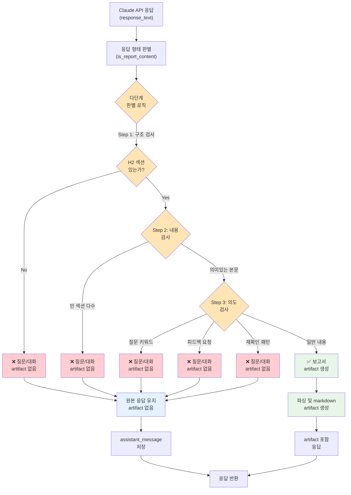

# Unit Spec: /ask 엔드포인트 응답 형태 자동 판별 (개선)

## 1. 요구사항 요약

- **목적:** Claude API 응답이 실제 보고서 콘텐츠인지 추가 질문/대화인지 자동 판별하여, 응답 형태를 동적으로 변환
- **유형:** ☑ 변경 ☐ 신규 ☐ 삭제
- **핵심 요구사항:**
  - 입력: Claude API 응답 (markdown 형식)
  - 출력:
    - **Case 1 (추가 질문/대화):** artifact 파일 생성 안 함, 원본 응답을 그대로 반환
    - **Case 2 (보고서 콘텐츠):** 파싱 후 report.md 파일 생성, artifact DB 저장
  - **핵심 문제:** H2 섹션만으로는 부족 (Claude가 형식만 맞춰서 응답 가능)
  - 판별 로직:
    1. **실제 콘텐츠 여부 검사:**
       - 빈 섹션(## 제목 다음이 빈 줄) 검사
       - 섹션별 의미있는 본문(min 50자) 필요
       - "수정이 필요하신 부분", "어떤 부분을", "말씀해주세요" 같은 질문 키워드 검사
    2. **대화 의도 검사:**
       - 사용자에게 피드백 요청 문장 ("~하시겠습니까?", "어떤 부분을")
       - 재질문/확인 패턴 ("맞나요?", "확인했습니다")
       - 조건부 수정 제안 ("~할 경우", "~시")
  - 예외/제약:
    - 판별 실패 시 보수적으로 "질문"으로 처리 (artifact 생성 안 함)
    - message_id는 항상 저장 (conversation history 유지)

---

## 2. 구현 대상 파일

| 구분 | 경로                                   | 설명                                 |
| ---- | -------------------------------------- | ------------------------------------ |
| 신규 | backend/app/utils/response_detector.py | 응답 형태 판별 유틸리티 함수         |
| 변경 | backend/app/routers/topics.py          | /ask 엔드포인트 로직 수정 (Step 6-7) |
| 참조 | backend/app/utils/markdown_parser.py   | parse_markdown_to_content 함수       |
| 참조 | backend/app/utils/markdown_builder.py  | build_report_md 함수                 |

---

## 3. 동작 플로우 (Mermaid)



---

## 4. 테스트 계획

### 4.1 원칙

- **테스트 우선(TDD)**: Unit → Integration → API(E2E) 순서
- **계층별 분류**: 판별 로직 단위 테스트 + 라우터 통합 테스트
- **독립성**: 파일 I/O, DB 접근은 모킹
- **판정 기준**:
  - Case 1: artifact 없음, assistant_message만 반환
  - Case 2: artifact 포함, markdown 파싱 적용

### 4.2 테스트 항목

#### **Unit Tests: response_detector.py**

| TC ID         | 시나리오                  | 입력                                                          | 기대결과 | 검증 항목                       |
| ------------- | ------------------------- | ------------------------------------------------------------- | -------- | ------------------------------- |
| TC-DETECT-001 | 실제 보고서 (풍부한 내용) | `## 요약\n상세 분석 내용...\n## 배경\n배경 설명...`           | `True`   | H2 섹션 + 의미있는 본문         |
| TC-DETECT-002 | 빈 섹션 많음              | `## 요약\n\n\n## 배경\n\n\n## 내용`                           | `False`  | 빈 섹션 >= 2개 = 질문 판별      |
| TC-DETECT-003 | 질문 키워드 포함          | `## 요약\n내용\n어떤 부분을 수정하시겠습니까?`                | `False`  | "수정하시겠습니까?" 감지        |
| TC-DETECT-004 | 피드백 요청               | `## 내용\n분석\n수정이 필요하신 부분이 있으시면 말씀해주세요` | `False`  | "말씀해주세요" 패턴 감지        |
| TC-DETECT-005 | 재확인 패턴               | `원문을 확인했습니다. 맞나요?`                                | `False`  | "확인했습니다" + "맞나요?" 감지 |
| TC-DETECT-006 | 조건부 제안               | `수정이 필요할 경우, 말씀해 주세요`                           | `False`  | "~할 경우", "~시" 조건부 패턴   |
| TC-DETECT-007 | 섹션 1개, 의미있는 내용   | `## 결론\n금융시장 전망...`                                   | `True`   | 최소 요구사항 충족              |
| TC-DETECT-008 | 혼합: 일부 질문           | `## 요약\n분석\n## 구조\n설명... 수정하시겠습니까?`           | `False`  | 질문 키워드 우선 (보수적)       |

#### **Integration Tests: topics.py (/ask)**

| TC ID      | 시나리오                                | 사전조건                              | 기대결과                                 | 검증 항목                   |
| ---------- | --------------------------------------- | ------------------------------------- | ---------------------------------------- | --------------------------- |
| TC-ASK-Q01 | 질문 응답 (빈 섹션) → artifact 없음     | Claude 응답이 빈 섹션                 | artifact=null, message 저장됨            | artifact 미생성             |
| TC-ASK-Q02 | 질문 응답 (피드백 요청) → artifact 없음 | Claude 응답에 "수정하시겠습니까?"     | artifact=null                            | 질문 키워드 감지            |
| TC-ASK-Q03 | 보고서 응답 → artifact 생성             | Claude 응답이 충분한 본문             | artifact 생성, markdown 파일 저장        | 파일 경로 유효              |
| TC-ASK-Q04 | 질문 응답 시 message_id 저장됨          | Claude 응답이 질문                    | message.id 존재, seq_no 증가             | conversation history 일관성 |
| TC-ASK-Q05 | 동일 topic에서 질문 후 보고서 생성      | 첫 /ask = 질문, 두 번째 /ask = 보고서 | 두 message 모두 저장, artifact는 2번째만 | message seq_no 연속성       |

---

## 5. 판별 로직 상세

### 5.1 3단계 판별 알고리즘

#### **Step 1: 기본 구조 검사**

```
H2 섹션(##) 없음 → False (질문)
H2 섹션 있음 → Step 2로
```

#### **Step 2: 내용 검사 (섹션 분석)**

```
각 H2 섹션별로:
  - 섹션 본문 추출
  - 빈 줄/공백 제거
  - 본문 길이 검사:
    - < 50자: "빈 섹션"으로 카운트
    - >= 50자: "의미있는 섹션"으로 카운트

조건:
  - 빈 섹션 >= 2개 → False (질문)
  - 빈 섹션 < 2개 → Step 3로
```

#### **Step 3: 의도 검사 (대화/질문 키워드)**

**질문 키워드 (하나 이상 매칭 시 → False):**

1. **피드백 요청:**

   - "수정이 필요하신 부분"
   - "어떤 부분을 ~하시겠습니까?"
   - "말씀해 주세요"
   - "말씀해주세요"
   - "피드백을 주세요"

2. **재확인 패턴:**

   - "~확인했습니다" + ("맞나요?", "맞습니다", "그렇습니다")
   - "~원문을 확인" + ("제공해", "기준으로")

3. **조건부/미래 제안:**

   - "~할 경우,"
   - "~시" (마지막에 동작 제시)
   - "향후 ~이 있을 경우"
   - "다음과 같은 ~이 가능합니다"

4. **사용자 선택 대기:**
   - "어떤 부분"
   - "무엇을"
   - "어떤 것"

**Step 3 결과:**

- 키워드 매칭 → False (질문)
- 키워드 미매칭 → True (보고서)

---

## 6. 사용자 요청 프롬프트

### 6.1 원본 요청

```
현재 topics에 /ask 쪽에 문제가 있어.

보고서가 만들어져야 되는데 claude 가 물어본 질문이 report.md 파일 내용으로 들어오고 있어.
우리는 내가 물���본 질문에 대해 보고서가 생성되고 그 내용이 report.md에 저장이 되어야해.

이 부분을 고안해줘.
요구사항 : claude API 응답에 따른 반환 형태 전환.
응답형태 1. case: claude api 에서 추가로 질문이 들어올 경우 -> report.md 파일 생성이 아니라 바로 사용자가 웹에서 볼 수 있도록 응답.
응답형태 2. case: Claude api 에서  보고서를 만들어줄 경우 -> report.md 파일 생성 후 평소처럼 전달.
```

### 6.2 추가 요청 (개선된 판별 로직)

```
응답 형태 자동 판별 로직을 좀 더 개선해야 되.
지금은 claude api에서 질문을 해도 H2 섹션(##)이 있으면 보고서로 판별되고 있어.
실제 예시:
- # 생성일: 2025-11-11 16:20:16
- ## 요약 (빈 섹션)
- ## 배경 및 목적 (빈 섹션)
- ## 주요 내용 (일부 내용 + "어떤 부분을 수정하시겠습니까?" 질문)
- ## 결론 및 제언 (빈 섹션)

판별 기준 개선:
1. 각 섹션의 내용이 충분한가? (빈 섹션 다수 = 질문)
2. 사용자에게 질문하는 문구가 있는가? ("수정하시겠습니까?", "말씀해주세요" 등)
3. 이를 종합해서 "질문/대화"로 판별해야 함
```

### 6.3 최종 명확화 (통합)

- ✅ Claude 응답이 **의미있는 콘텐츠가 부족**하면 (빈 섹션 2개 이상): 질문으로 판별, artifact 생성 안 함
- ✅ Claude 응답에 **질문/피드백 요청 키워드** 있으면: 질문으로 판별, artifact 생성 안 함
  - 예: "수정하시겠습니까?", "말씀해주세요", "확인했습니다 + 맞나요?", "어떤 부분을", "할 경우"
- ✅ 위 조건 모두 없으면: 보고서로 판별, artifact 생성
- ✅ assistant_message는 항상 저장 (대화 이력 유지)
- ✅ 판별 실패 시 보수적으로 **"질문"으로 처리** (artifact 생성 안 함)

---

## 7. 구현 체크리스트

### Phase 1: 판별 함수 구현 & 단위 테스트

- [ ] `response_detector.py` 신규 생성

  - [ ] `is_report_content(response_text: str) -> bool` 함수 구현
    - [ ] Step 1: H2 섹션 검사
    - [ ] Step 2: 섹션 내용 검사 (빈 섹션 카운팅)
    - [ ] Step 3: 질문 키워드 검사
  - [ ] `count_empty_sections(text: str) -> int` 헬퍼 함수
  - [ ] `has_question_keywords(text: str) -> bool` 헬퍼 함수
  - [ ] DocString 작성 (Google Style)
  - [ ] 로깅 추가

- [ ] 단위 테스트 작성 (`tests/test_utils_response_detector.py`)
  - [ ] TC-DETECT-001~008 모두 구현

### Phase 2: /ask 라우터 수정 & 통합 테스트

- [ ] `topics.py` /ask 함수 수정 (Step 6-7)

  - [ ] `is_report_content()` 호출 추가
  - [ ] artifact 생성 로직을 조건부로 변경
  - [ ] 응답 구조 수정 (artifact=null 가능하게)
  - [ ] 로깅 추가 (판별 결과 기록)

- [ ] 통합 테스트 작성 (`tests/test_routers_topics.py`)
  - [ ] TC-ASK-Q01~05 모두 구현

### Phase 3: 검증 & 문서화

- [ ] 기존 테스트 통과 확인 (회귀 테스트)
- [ ] API 명세 문서 갱신 (`backend/CLAUDE.md`)
- [ ] CLAUDE.md 업데이트 (v2.4 변경사항)
- [ ] 커밋 메시지: `feat: /ask 응답 형태 자동 판별 (질문 vs 보고서)`

---

## 8. API 응답 예시

### 8.1 성공 케이스 1: 질문/대화 응답 (artifact 없음)

**요청:**

```bash
POST /api/topics/1/ask
Content-Type: application/json
Authorization: Bearer <token>

{
  "content": "이 보고서의 어떤 부분을 수정해야 할까요?"
}
```

**응답 (200 OK):**

```json
{
  "success": true,
  "data": {
    "topic_id": 1,
    "user_message": {
      "id": 5,
      "topic_id": 1,
      "role": "user",
      "content": "이 보고서의 어떤 부분을 수정해야 할까요?",
      "seq_no": 5,
      "created_at": "2025-11-11T16:25:30Z"
    },
    "assistant_message": {
      "id": 6,
      "topic_id": 1,
      "role": "assistant",
      "content": "## 요약\n\n## 배경 및 목적\n\n## 주요 내용\n원문을 확인했습니다. 수정이 필요하신 부분이 있으시면 말씀해 주세요...",
      "seq_no": 6,
      "created_at": "2025-11-11T16:25:31Z"
    },
    "artifact": null,
    "usage": {
      "model": "claude-sonnet-4-5-20250929",
      "input_tokens": 1250,
      "output_tokens": 320,
      "latency_ms": 1850
    }
  }
}
```

### 8.2 성공 케이스 2: 보고서 생성 응답 (artifact 생성)

**요청:**

```bash
POST /api/topics/1/ask
Content-Type: application/json
Authorization: Bearer <token>

{
  "content": "이 보고서에서 은행권 전망을 더 자세히 분석해줄 수 있을까?"
}
```

**응답 (200 OK):**

```json
{
  "success": true,
  "data": {
    "topic_id": 1,
    "user_message": {
      "id": 7,
      "topic_id": 1,
      "role": "user",
      "content": "이 보고서에서 은행권 전망을 더 자세히 분석해줄 수 있을까?",
      "seq_no": 7,
      "created_at": "2025-11-11T16:26:00Z"
    },
    "assistant_message": {
      "id": 8,
      "topic_id": 1,
      "role": "assistant",
      "content": "## 요약\n2026년 금융권 은행권에 대한 상세 분석...\n\n## 배경\n글로벌 금리 인상과 국내 금융시장...\n\n## 주요 내용\n은행권 전망: 순이익 증가세, 자본비율 개선...",
      "seq_no": 8,
      "created_at": "2025-11-11T16:26:05Z"
    },
    "artifact": {
      "id": 12,
      "topic_id": 1,
      "message_id": 8,
      "kind": "MD",
      "locale": "ko_KR",
      "version": 2,
      "filename": "report.md",
      "file_path": "/path/to/artifacts/topic_1/v2/report.md",
      "file_size": 5432,
      "sha256": "a1b2c3d4e5f6...",
      "created_at": "2025-11-11T16:26:05Z"
    },
    "usage": {
      "model": "claude-sonnet-4-5-20250929",
      "input_tokens": 2100,
      "output_tokens": 1250,
      "latency_ms": 3200
    }
  }
}
```

### 8.3 실패 케이스: 주제 찾을 수 없음

**요청:**

```bash
POST /api/topics/999/ask
Content-Type: application/json
Authorization: Bearer <token>

{
  "content": "분석 결과를 알려줘"
}
```

**응답 (404 Not Found):**

```json
{
  "success": false,
  "error": {
    "code": "TOPIC.NOT_FOUND",
    "message": "토픽을 찾을 수 없습니다.",
    "http_status": 404
  }
}
```

---

## 9. 구현 코드 스케치

### response_detector.py (전체)

````python
import re
from typing import List
import logging

logger = logging.getLogger(__name__)


def is_report_content(response_text: str) -> bool:
    """Claude 응답이 실제 보고서 콘텐츠인지 판별합니다.

    3단계 판별 알고리즘:
    1. H2 섹션(##) 구조 검사 → 없으면 False
    2. 섹션별 내용 검사 → 빈 섹션 2개 이상이면 False
    3. 질문/대화 키워드 검사 → 키워드 있으면 False

    Args:
        response_text: Claude API 응답 텍스트

    Returns:
        True: 보고서 콘텐츠, False: 질문/대화

    Examples:
        >>> is_report_content("## 요약\\n상세 분석...")
        True

        >>> is_report_content("## 요약\\n\\n## 배경\\n\\n어떤 부분을 수정하시겠습니까?")
        False
    """

    if not response_text or not response_text.strip():
        logger.warning("Empty response detected, treating as non-report")
        return False

    # Step 1: H2 섹션 검사
    h2_sections = extract_h2_sections(response_text)

    if not h2_sections:
        logger.info("No H2 sections detected → Treating as question/conversation")
        return False

    logger.info(f"Found {len(h2_sections)} H2 sections")

    # Step 2: 빈 섹션 검사
    empty_count = count_empty_sections(response_text)
    total_sections = len(h2_sections)
    empty_ratio = empty_count / total_sections if total_sections > 0 else 0

    logger.info(f"Empty sections: {empty_count}/{total_sections} (ratio={empty_ratio:.2%})")

    if empty_count >= 2:
        logger.info(f"Too many empty sections ({empty_count}) → Treating as question")
        return False

    # Step 3: 질문 키워드 검사
    if has_question_keywords(response_text):
        logger.info("Question keywords detected → Treating as question")
        return False

    logger.info("All checks passed → Treating as report content")
    return True


def extract_h2_sections(text: str) -> List[str]:
    """H2 마크다운 섹션(##)을 추출합니다.

    Args:
        text: 마크다운 텍스트

    Returns:
        H2 섹션 제목 리스트
    """
    pattern = r'^## (.+?)$'
    matches = re.findall(pattern, text, re.MULTILINE)
    return matches


def get_section_content(text: str, section_title: str) -> str:
    """특정 H2 섹션의 본문을 추출합니다.

    Args:
        text: 마크다운 텍스트
        section_title: 섹션 제목 (## 제목)

    Returns:
        섹션 본문 (다음 H2까지)
    """
    # ## 섹션 이후부터 다음 ## 또는 EOF까지
    pattern = rf'^## {re.escape(section_title)}$\n(.*?)(?=^## |\Z)'
    match = re.search(pattern, text, re.MULTILINE | re.DOTALL)

    if match:
        return match.group(1).strip()

    return ""


def count_empty_sections(text: str) -> int:
    """빈 섹션의 개수를 카운트합니다.

    빈 섹션: 본문이 50자 미만인 경우

    Args:
        text: 마크다운 텍스트

    Returns:
        빈 섹션 개수
    """
    sections = extract_h2_sections(text)
    empty_count = 0

    for section_title in sections:
        content = get_section_content(text, section_title)

        # 공백/줄바꿈 제거
        content_cleaned = content.strip()

        if len(content_cleaned) < 50:
            empty_count += 1
            logger.debug(f"Empty section detected: '{section_title}' (length={len(content_cleaned)})")

    return empty_count


def has_question_keywords(text: str) -> bool:
    """질문/대화 의도를 나타내는 키워드를 검사합니다.

    Args:
        text: 마크다운 텍스트

    Returns:
        True: 질문 키워드 있음, False: 없음
    """

    # 그룹 1: 피드백 요청
    feedback_keywords = [
        r"수정이\s*필요하신\s*부분",
        r"어떤\s*부분을\s*수정하시",
        r"말씀해\s*주세요",
        r"말씀해주세요",
        r"피드백을\s*주세요",
        r"의견을\s*주세요",
        r"제안해\s*주세요",
    ]

    # 그룹 2: 재확인 패턴 (확인 + 재질문)
    confirm_keywords = [
        r"확인했습니다.*?맞",
        r"원문을\s*확인.*?제공해",
        r"구조를\s*파악했습니다",
    ]

    # 그룹 3: 조건부/미래 제안
    conditional_keywords = [
        r"[^.!?\s]+할\s*경우",
        r"향후.*?있을\s*경우",
        r"다음과\s*같은.*?가능합니다",
        r"[가-힣]+시\s+[가-힣]+",  # "~시 ~" 패턴
    ]

    # 그룹 4: 사용자 선택 대기
    choice_keywords = [
        r"어떤\s*부분",
        r"무엇을",
        r"어떤\s*것",
        r"어느\s*것",
    ]

    all_keywords = feedback_keywords + confirm_keywords + conditional_keywords + choice_keywords

    for pattern in all_keywords:
        if re.search(pattern, text, re.IGNORECASE):
            logger.debug(f"Question keyword matched: {pattern}")
            return True

    return False


def remove_code_blocks(text: str) -> str:
    """마크다운 코드블록을 제거합니다.

    Args:
        text: 마크다운 텍스트

    Returns:
        코드블록 제거된 텍스트
    """
    # ``` ... ``` 블록 제거
    text = re.sub(r'```[\s\S]*?```', '', text)

    # ~~~ ... ~~~ 블록 제거
    text = re.sub(r'~~~[\s\S]*?~~~', '', text)

    return text
````

### topics.py /ask 수정 (Step 6-7)

```python
# Step 5: Claude 호출 ✓ (기존)
response_text, input_tokens, output_tokens = claude_client.chat_completion(
    claude_messages,
    system_prompt
)

# ✨ NEW: Step 6-1 응답 형태 판별
logger.info(f"[ASK] Detecting response type")
is_report = is_report_content(response_text)
logger.info(f"[ASK] Response type detected - is_report={is_report}")

# Step 6: Assistant 메시지 저장 (항상 저장)
logger.info(f"[ASK] Saving assistant message - length={len(response_text)}")
asst_msg = MessageDB.create_message(
    topic_id,
    MessageCreate(role=MessageRole.ASSISTANT, content=response_text)
)
logger.info(f"[ASK] Assistant message saved - message_id={asst_msg.id}")

# ✨ NEW: Step 7 조건부 artifact 생성
artifact = None

if is_report:
    # 기존 로직: parse + artifact 생성
    logger.info(f"[ASK] Saving MD artifact (report content)")

    try:
        result = parse_markdown_to_content(response_text)
        generated_title = result.get("title") or "보고서"
        logger.info(f"[ASK] Parsed markdown - title={generated_title}")

        md_text = build_report_md(result)
        logger.info(f"[ASK] Built markdown - length={len(md_text)}")

        version = next_artifact_version(topic_id, ArtifactKind.MD, topic.language)
        base_dir, md_path = build_artifact_paths(topic_id, version, "report.md")

        bytes_written = write_text(md_path, md_text)
        file_hash = sha256_of(md_path)
        logger.info(f"[ASK] File written - size={bytes_written}")

        artifact = ArtifactDB.create_artifact(
            topic_id,
            asst_msg.id,
            ArtifactCreate(
                kind=ArtifactKind.MD,
                locale=topic.language,
                version=version,
                filename=md_path.name,
                file_path=str(md_path),
                file_size=bytes_written,
                sha256=file_hash
            )
        )
        logger.info(f"[ASK] Artifact created - artifact_id={artifact.id}")

    except Exception as e:
        logger.error(f"[ASK] Failed to save artifact - error={str(e)}")
        return error_response(
            code=ErrorCode.ARTIFACT_CREATION_FAILED,
            http_status=500,
            message="응답 파일 저장 중 오류가 발생했습니다.",
            details={"error": str(e)}
        )
else:
    logger.info(f"[ASK] No artifact created (question/conversation response)")

# Step 8: AI 사용량 저장 ✓ (기존)
# ... (기존 코드)

# Step 9: 성공 응답 반환
logger.info(f"[ASK] Success - topic_id={topic_id}, has_artifact={artifact is not None}")

return success_response({
    "topic_id": topic_id,
    "user_message": MessageResponse.model_validate(user_msg).model_dump(),
    "assistant_message": MessageResponse.model_validate(asst_msg).model_dump(),
    "artifact": ArtifactResponse.model_validate(artifact).model_dump() if artifact else None,  # ← 변경
    "usage": {
        "model": claude_client.model,
        "input_tokens": input_tokens,
        "output_tokens": output_tokens,
        "latency_ms": latency_ms
    }
})
```

---

## 9. 주요 변경사항 요약

| 항목               | 변경 전             | 변경 후                        |
| ------------------ | ------------------- | ------------------------------ |
| 판별 기준          | H2 섹션 존재 여부만 | 3단계: 구조 + 내용 + 의도      |
| 빈 섹션 처리       | 무시                | 개수 카운팅 (2개 이상 = 질문)  |
| 질문 키워드        | 미검사              | 정규식으로 4가지 카테고리 검사 |
| artifact 필드      | 항상 있음           | null 가능                      |
| 기본값 (판별 실패) | 보고서로 처리       | **질문으로 처리** (보수적)     |

---

**작성 일시:** 2025-11-11
**버전:** 2.0 (개선됨)
**상태:** 검토 대기
