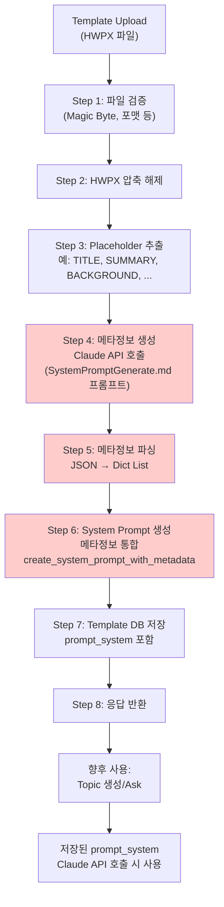

# Unit Spec: Placeholder 메타정보 Claude API 생성 및 System Prompt 통합

## 1. 요구사항 요약

- **목적:** 템플릿 업로드 시 추출된 Placeholder들에 대해 Claude API를 호출하여 각 Placeholder의 메타정보(display_name, description, examples 등)를 동적으로 생성하고, 이를 System Prompt에 통합하여 보고서 생성 시 정확한 섹션별 지침이 포함되도록 개선
- **유형:** ☐ 신규 ☑ 변경
- **핵심 요구사항:**
  - 입력: Template 업로드 후 추출된 Placeholder 목록 (예: ["{{TITLE}}", "{{SUMMARY}}", "{{BACKGROUND}}", ...])
  - 처리: SystemPromptGenerate.md의 프롬프트 기반으로 Claude API 호출
  - 출력: 메타정보 JSON 배열 + 이를 통합한 System Prompt 문자열
  - 저장: Template DB에 `prompt_system` 저장 (메타정보 포함)
  - 사용: 향후 /topic/generate 및 /topic/{id}/ask에서 이 `prompt_system` 활용
  - 예외/제약:
    - Placeholder가 없으면: 기본 FINANCIAL_REPORT_SYSTEM_PROMPT 사용
    - Claude API 호출 실패: 폴백으로 기본값 사용하되 로깅
    - 메타정보 JSON 파싱 실패: 폴백 처리
  - 처리흐름 요약: Template 업로드 → Placeholder 추출 → Claude API 호출 (SystemPromptGenerate.md 프롬프트) → 메타정보 JSON 파싱 → System Prompt 생성 및 저장

---

## 2. 구현 대상 파일

| 구분 | 경로 | 설명 |
|------|------|------|
| 신규 | backend/app/utils/claude_metadata_generator.py | Claude API로 메타정보 생성하는 유틸 함수 |
| 변경 | backend/app/utils/prompts.py | `create_system_prompt_with_metadata()` 함수 추가 |
| 변경 | backend/app/routers/templates.py | 템플릿 업로드 플로우에 메타정보 생성 로직 통합 |
| 변경 | backend/app/clients/claude_client.py | Claude API 호출 인터페이스 활용 |
| 참조 | backend/SystemPromptGenerate.md | Claude API 호출용 프롬프트 템플릿 |

---

## 3. 동작 플로우 (Mermaid)



---

## 4. 세부 구현 가이드

### 4.1 Claude API 호출용 프롬프트 구성 (SystemPromptGenerate.md 기반)

**Input**: Placeholder 목록
```python
placeholders = ["{{TITLE}}", "{{SUMMARY}}", "{{BACKGROUND}}", "{{CONCLUSION}}", "{{DATE}}"]
```

**Claude API 호출 프롬프트** (SystemPromptGenerate.md 참조):
```
당신은 "보고서 템플릿 스키마 설명 생성기"입니다.

입력:
- 사용자가 정의한 섹션 키 목록. 예: [생략]

목표:
- 각 키가 어떤 역할을 하는지 추론하고, 보고서 작성 AI가 활용할 수 있도록
  구조화된 메타 정보를 JSON 형태로 반환합니다.

규칙:
1. 반드시 JSON 배열로만 응답합니다.
2. 각 항목은 다음 속성을 가집니다:
   - key: 문자열 (예: "{{BACKGROUND}}")
   - type: "section_content" | "section_title" | "metadata" 중 하나
   - display_name: 한글 이름
   - description: 상세 설명 (2~4문장)
   - examples: 예시 1~3개
   - required: true/false
   - order_hint: 숫자 (작성 순서 추천)
[... 나머지 규칙 ...]
```

**Expected Output**: JSON 배열
```json
[
  {
    "key": "{{TITLE}}",
    "type": "section_title",
    "display_name": "제목",
    "description": "보고서의 주요 제목입니다. 명확하고 임팩트 있는 제목을 작성하세요.",
    "examples": ["2024년 금융시장 동향 분석", "AI 기술 도입 효과 평가보고서"],
    "required": true,
    "order_hint": 1
  },
  {
    "key": "{{SUMMARY}}",
    "type": "section_content",
    "display_name": "요약",
    "description": "보고서 전체의 핵심을 2-3문장으로 요약합니다.",
    "examples": ["본 보고서는 최근 금융시장의 주요 동향을 분석합니다."],
    "required": true,
    "order_hint": 2
  },
  ...
]
```

### 4.2 신규 함수: `claude_metadata_generator.py`

**파일 위치**: `backend/app/utils/claude_metadata_generator.py`

```python
from typing import List, Dict, Any, Optional
import json
import logging
from app.clients.claude_client import ClaudeClient
from app.utils.prompts import SYSTEM_PROMPT_GENERATOR

logger = logging.getLogger(__name__)

def generate_placeholder_metadata(
    placeholders: List[str]
) -> Optional[List[Dict[str, Any]]]:
    """
    Claude API를 호출하여 Placeholder 메타정보 생성.

    Args:
        placeholders: Placeholder 키 목록 (예: ["{{TITLE}}", "{{SUMMARY}}"])

    Returns:
        메타정보 JSON 배열, 실패 시 None

    Raises:
        아래 발생 가능한 예외:
        - JSON 파싱 실패
        - Claude API 호출 실패
        (모두 로깅되고, 호출자는 None 받음)
    """
    if not placeholders:
        logger.info("[METADATA_GEN] No placeholders provided")
        return None

    try:
        # Step 1: 메타정보 생성용 프롬프트 구성
        placeholder_str = ", ".join(placeholders)
        user_prompt = f"""다음 Placeholder 목록에 대한 메타정보를 JSON 배열로 생성해주세요:

{placeholder_str}

반드시 JSON 배열로만 응답하세요."""

        logger.info(f"[METADATA_GEN] Calling Claude API - placeholders={len(placeholders)}")

        # Step 2: Claude API 호출
        claude = ClaudeClient()
        response = claude.generate(
            system_prompt=SYSTEM_PROMPT_GENERATOR,  # SystemPromptGenerate.md 내용
            user_prompt=user_prompt,
            model="claude-sonnet-4-5-20250929"
        )

        logger.info(f"[METADATA_GEN] Claude response received - length={len(response)}")

        # Step 3: JSON 파싱
        # 응답에서 JSON 부분 추출 (Claude가 마크다운으로 감쌀 수 있음)
        metadata = _parse_json_response(response)

        if metadata is None:
            logger.warning("[METADATA_GEN] Failed to parse Claude response")
            return None

        logger.info(f"[METADATA_GEN] Metadata generated successfully - count={len(metadata)}")
        return metadata

    except Exception as e:
        logger.error(f"[METADATA_GEN] Error generating metadata: {str(e)}")
        return None


def _parse_json_response(response: str) -> Optional[List[Dict[str, Any]]]:
    """
    Claude 응답에서 JSON 배열 추출 및 파싱.

    응답 형식:
    1. 순수 JSON: [...] → 바로 파싱
    2. 마크다운 코드블록: ```json [...] ``` → 추출 후 파싱
    3. 기타 형식: JSON 부분 자동 추출 시도
    """
    try:
        # 1. 마크다운 코드블록 확인
        if "```json" in response:
            start = response.find("```json") + 7
            end = response.find("```", start)
            json_str = response[start:end].strip()
        elif "```" in response:
            start = response.find("```") + 3
            end = response.find("```", start)
            json_str = response[start:end].strip()
        else:
            json_str = response.strip()

        # 2. JSON 파싱
        metadata = json.loads(json_str)

        # 3. 유효성 검사 (배열이어야 함)
        if not isinstance(metadata, list):
            logger.warning("[METADATA_GEN] Response is not a JSON array")
            return None

        return metadata

    except json.JSONDecodeError as e:
        logger.error(f"[METADATA_GEN] JSON decode error: {str(e)}")
        return None
```

### 4.3 변경 함수: `prompts.py` - `create_system_prompt_with_metadata()`

**기존 `create_dynamic_system_prompt()` 대체**

```python
def create_system_prompt_with_metadata(
    placeholders: List[str],
    metadata: Optional[List[Dict[str, Any]]] = None
) -> str:
    """
    메타정보를 포함한 System Prompt 생성.

    Args:
        placeholders: Placeholder 키 목록
        metadata: Claude API로 생성한 메타정보 (선택사항)
                 None이면 기본값 사용

    Returns:
        메타정보가 통합된 System Prompt 문자열
    """
    if not placeholders:
        return FINANCIAL_REPORT_SYSTEM_PROMPT

    # 베이스 프롬프트
    prompt = f"""{FINANCIAL_REPORT_SYSTEM_PROMPT}

---

## 커스텀 템플릿 구조 (다음 placeholder들을 포함하여 작성):

{_format_placeholder_list(placeholders)}

---

## 출력 마크다운 형식:

{_format_markdown_rules(placeholders)}

---

## 섹션별 상세 지침:

{_format_metadata_sections(placeholders, metadata)}

---

## 작성 가이드:

- 각 섹션은 Markdown heading으로 시작하세요
- 위에 명시된 placeholder와 heading 구조를 정확히 따르세요
- 새로운 placeholder를 임의로 추가하지 마세요
- 각 섹션별 지침을 참고하여 정확하게 작성하세요
- 전문적이고 객관적인 톤을 유지하세요
"""

    return prompt


def _format_placeholder_list(placeholders: List[str]) -> str:
    """Placeholder 목록 포매팅"""
    return "\n".join([f"- {p}" for p in placeholders])


def _format_markdown_rules(placeholders: List[str]) -> str:
    """마크다운 규칙 포매팅"""
    rules = []
    for i, p in enumerate(placeholders):
        if i == 0:
            rules.append(f"- # {p} (H1)")
        else:
            rules.append(f"- ## {p} (H2)")
    return "\n".join(rules)


def _format_metadata_sections(
    placeholders: List[str],
    metadata: Optional[List[Dict[str, Any]]] = None
) -> str:
    """메타정보 섹션 포매팅"""
    if not metadata:
        return "(메타정보 미생성)"

    sections = []
    for item in metadata:
        section = f"""### {item.get('key', 'UNKNOWN')} ({item.get('display_name', 'N/A')})

**설명:** {item.get('description', 'N/A')}

**예시:**
{_format_examples(item.get('examples', []))}

**필수 여부:** {'필수' if item.get('required', False) else '선택'}
"""
        sections.append(section)

    return "\n".join(sections)


def _format_examples(examples: List[str]) -> str:
    """예시 포매팅"""
    if not examples:
        return "- (예시 미제공)"
    return "\n".join([f"- {ex}" for ex in examples])
```

### 4.4 변경: `templates.py` - `upload_template()` 함수

**기존 코드 (라인 234)**:
```python
prompt_system = create_dynamic_system_prompt(placeholder_objects)
```

**변경 후**:
```python
# Step 9: Claude API로 Placeholder 메타정보 생성
from app.utils.claude_metadata_generator import generate_placeholder_metadata
from app.utils.prompts import create_system_prompt_with_metadata

metadata = generate_placeholder_metadata(placeholder_list)
logger.info(f"[UPLOAD_TEMPLATE] Metadata generation - count={len(metadata) if metadata else 0}")

# Step 10: System Prompt 생성 (메타정보 포함)
prompt_system = create_system_prompt_with_metadata(placeholder_list, metadata)
```

---

## 5. 테스트 계획

### 5.1 원칙
- **TDD**: 테스트 먼저 작성 후 구현
- **계층별**: Unit (claude_metadata_generator) → Integration (templates.py) → API
- **모킹**: Claude API 호출은 모킹

### 5.2 테스트 항목

| TC ID | 계층 | 시나리오 | 목적 | 입력/사전조건 | 기대결과 |
|-------|------|---------|------|--------------|---------|
| TC-UNIT-001 | Unit | JSON 파싱: 순수 JSON 배열 | JSON 파싱 검증 | `"[{...}]"` | 배열 반환, 길이 > 0 |
| TC-UNIT-002 | Unit | JSON 파싱: 마크다운 코드블록 | JSON 파싱 (마크다운) 검증 | ` ```json\n[...]\n``` ` | 배열 반환 |
| TC-UNIT-003 | Unit | JSON 파싱: 잘못된 JSON | 폴백 처리 검증 | `"invalid json"` | None 반환 |
| TC-UNIT-004 | Unit | 메타정보 생성: 1개 Placeholder | 단일 Placeholder 처리 | `["{{TITLE}}"]`, Claude 모킹 | 메타정보 배열 반환 (1개) |
| TC-UNIT-005 | Unit | 메타정보 생성: 5개 Placeholder | 여러 Placeholder 처리 | `["{{TITLE}}", "{{SUMMARY}}", ...]`, Claude 모킹 | 메타정보 배열 반환 (5개) |
| TC-UNIT-006 | Unit | 메타정보 생성: 빈 리스트 | 엣지 케이스 | `[]` | None 반환 |
| TC-UNIT-007 | Unit | 메타정보 생성: Claude API 실패 | 폴백 처리 | Claude 에러 발생 시뮬레이션 | None 반환, 로그 기록 |
| TC-UNIT-008 | Unit | System Prompt 생성: 메타정보 포함 | 메타정보 통합 검증 | placeholders + metadata 배열 | Prompt에 모든 메타정보 섹션 포함 |
| TC-UNIT-009 | Unit | System Prompt 생성: 메타정보 없음 | 폴백 처리 | placeholders만 제공 (metadata=None) | 기본 Prompt 포맷 (메타정보 섹션 없음) |
| TC-UNIT-010 | Unit | System Prompt 생성: 빈 Placeholder | 기본값 반환 | `[]` | FINANCIAL_REPORT_SYSTEM_PROMPT 반환 |
| TC-INTG-011 | Integration | 템플릿 업로드: 메타정보 생성 → DB 저장 | 전체 파이프라인 | HWPX 파일 + 5개 Placeholder | prompt_system에 메타정보 포함, DB 저장됨 |
| TC-INTG-012 | Integration | 템플릿 업로드: Claude API 실패 → 폴백 | 에러 처리 | Claude 에러 발생, HWPX 파일 | prompt_system 저장 (기본값 또는 메타정보 없음), 요청 성공 |
| TC-API-013 | API | POST /api/templates: 응답에 prompt_system 포함 | 응답 스키마 검증 | HWPX 파일 업로드 | 201 응답, `data.prompt_system` 포함, 메타정보 섹션 확인 가능 |
| TC-API-014 | API | POST /api/templates: 메타정보 내용 검증 | 실제 Claude API 호출 (또는 모킹) | HWPX 파일 + 실제 Placeholder | prompt_system에 각 Placeholder별 display_name, description, examples 포함 |

### 5.3 메타정보 JSON 스키마 (검증용)

```json
{
  "$schema": "http://json-schema.org/draft-07/schema#",
  "type": "array",
  "items": {
    "type": "object",
    "required": ["key", "type", "display_name", "description", "examples", "required", "order_hint"],
    "properties": {
      "key": {"type": "string", "pattern": "^\\{\\{[A-Z_]+\\}\\}$"},
      "type": {"type": "string", "enum": ["section_title", "section_content", "metadata"]},
      "display_name": {"type": "string", "minLength": 1},
      "description": {"type": "string", "minLength": 10, "maxLength": 500},
      "examples": {"type": "array", "items": {"type": "string"}},
      "required": {"type": "boolean"},
      "order_hint": {"type": "integer", "minimum": 0, "maximum": 10}
    }
  }
}
```

---

## 6. 예상 System Prompt 결과물

### Before (현재)
```
당신은 금융 기관의 전문 보고서 작성자입니다.
...
- # {{TITLE}} (H1)
- ## {{SUMMARY}} (H2)
...
```

### After (개선 후)
```
당신은 금융 기관의 전문 보고서 작성자입니다.
...

## 커스텀 템플릿 구조:
- {{TITLE}}
- {{SUMMARY}}
- {{BACKGROUND}}
...

## 섹션별 상세 지침:

### {{TITLE}} (제목)
**설명:** 보고서의 주요 제목입니다. 명확하고 임팩트 있는 제목을 작성하세요.
**예시:**
- 2024년 금융시장 동향 분석
- AI 기술 도입 효과 평가보고서
**필수 여부:** 필수

### {{SUMMARY}} (요약)
**설명:** 보고서 전체의 핵심을 2-3문장으로 요약합니다.
**예시:**
- 본 보고서는 최근 금융시장의 주요 동향을 분석합니다.
**필수 여부:** 필수

...
```

---

## 7. 사용자 요청 프롬프트

**Original User Request:**
```
유연한 PlaceHolder를 위한 Claude API로 PlaceHolder의 메타정보 생성 요청 및 systemPrompt의 섹션 구성

사용자 플로우:
1. Template upload
2. PlaceHolder 추출
3. PlaceHolder의 메타정보를 위한 Claude API 전달용 프롬프트 구성 @SystemPromptGenerate.md 참조
4. Claude API 호출 후 반환받은 데이터를 기반으로 이후 topic과 함께 사용될 prompt_system에 데이터 저장.
```

**최종 명확화 (통합):**
- ✅ Template 업로드 시 Placeholder 추출 (기존 로직)
- ✅ Claude API 호출용 프롬프트: SystemPromptGenerate.md 규칙 활용
- ✅ Claude API 호출 → 메타정보 JSON (key, type, display_name, description, examples, required, order_hint)
- ✅ 메타정보 파싱: JSON 배열 → Python Dict 리스트
- ✅ System Prompt 생성: 베이스 프롬프트 + 메타정보 섹션 통합
- ✅ Template DB `prompt_system` 저장
- ✅ 향후 /topic/generate, /topic/{id}/ask에서 저장된 `prompt_system` 사용
- ✅ 폴백 처리: Claude API 실패 시 기본값 사용
- ✅ TDD 기반 테스트 (Unit 10개 + Integration 2개 + API 2개)

---

## 8. 구현 체크리스트

### Phase 1: 메타정보 생성 유틸 (claude_metadata_generator.py)

- [ ] `generate_placeholder_metadata()` 함수 구현
  - [ ] Claude API 호출 로직
  - [ ] SystemPromptGenerate.md 프롬프트 활용
  - [ ] 에러 처리 및 로깅

- [ ] `_parse_json_response()` 함수 구현
  - [ ] 마크다운 코드블록 파싱
  - [ ] JSON 배열 유효성 검사
  - [ ] 파싱 실패 시 None 반환

- [ ] Unit 테스트 (TC-UNIT-001~007)

### Phase 2: System Prompt 생성 함수 (prompts.py)

- [ ] `create_system_prompt_with_metadata()` 함수 구현
  - [ ] 베이스 프롬프트 + 메타정보 통합
  - [ ] 메타정보 없을 때 폴백
  - [ ] Placeholder 없을 때 기본값 반환

- [ ] 헬퍼 함수들 구현
  - [ ] `_format_placeholder_list()`
  - [ ] `_format_markdown_rules()`
  - [ ] `_format_metadata_sections()`
  - [ ] `_format_examples()`

- [ ] Unit 테스트 (TC-UNIT-008~010)

### Phase 3: 템플릿 업로드 통합 (templates.py)

- [ ] `upload_template()` 함수 수정
  - [ ] Claude API 호출 추가 (Step 9)
  - [ ] 메타정보 → System Prompt 생성 (Step 10)
  - [ ] 기존 로직 호환성 유지

- [ ] Integration 테스트 (TC-INTG-011~012)

### Phase 4: E2E 검증

- [ ] API 테스트 (TC-API-013~014)
  - [ ] /api/templates POST 응답 검증
  - [ ] 메타정보 내용 검증

- [ ] 실제 보고서 생성 테스트
  - [ ] /topic/generate with template_id
  - [ ] /topic/{id}/ask with template_id
  - [ ] 보고서 품질 개선 확인

---

## 9. CLAUDE.md 업데이트 예상 사항

- 새로운 유틸 함수 추가: `generate_placeholder_metadata()`, `create_system_prompt_with_metadata()`
- Template 업로드 플로우에 메타정보 생성 단계 추가
- SystemPromptGenerate.md 프롬프트 활용 설명
- Claude API 호출 시점 명확화

---

**요청 일시:** 2025-11-11

**컨텍스트/배경:**
- 현재: Placeholder 추출만 되고 메타정보는 미생성
- 개선: Claude API로 동적 메타정보 생성 → System Prompt 통합
- 목표: 보고서 품질 향상 (각 섹션별 정확한 지침 제공)

---

**마지막 업데이트:** 2025-11-11
