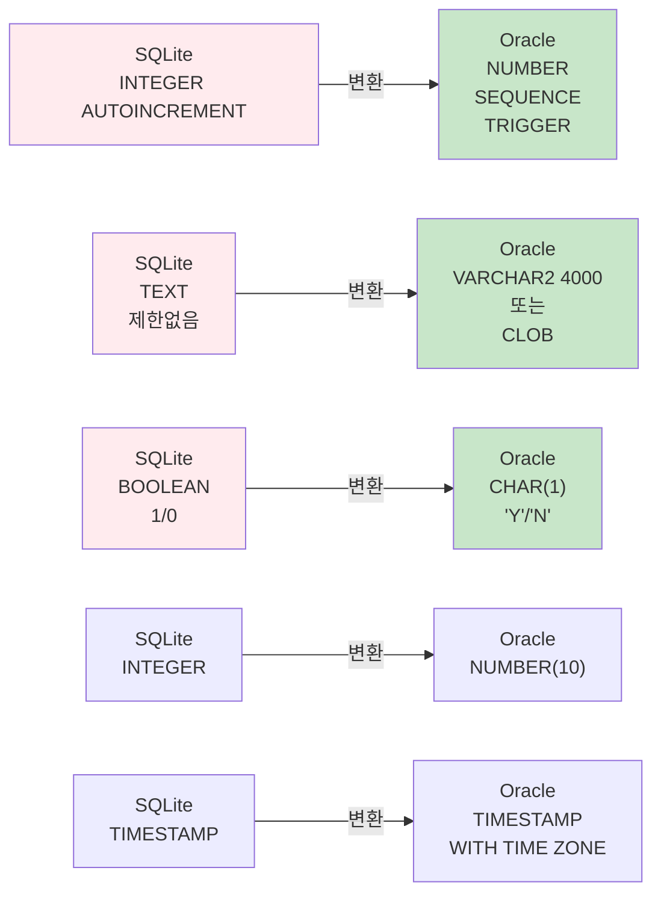

# Unit Spec: SQLite → Oracle Database 마이그레이션

**작성자**: Development Team
**작성일**: 2025-11-11
**최종 검토일**: YYYY-MM-DD
**승인자**: [팀리더/PM]

---

## 📋 1. 개요 (Overview)

### 1.1 기능명
**SQLite → Oracle Database 마이그레이션 (데이터 이관 제외)**

### 1.2 목적 (Purpose)
현재 SQLite 기반으로 운영 중인 HWP Report Generator의 데이터베이스를 Oracle로 변경하여 엔터프라이즈급 성능, 안정성, 확장성을 확보하고, 기존 데이터는 SQLite에서 관리하면서 점진적으로 전환할 수 있도록 함.

### 1.3 유형 (Type)
- ☑ 신규 기능 (New Feature)
- ☐ 기능 개선 (Enhancement)
- ☐ 버그 수정 (Bug Fix)
- ☐ 리팩토링 (Refactoring)

**하위 유형**: 인프라 마이그레이션

### 1.4 우선순위 (Priority)
- ☐ P0 (즉시 필요)
- ☑ P1 (중요)
- ☐ P2 (좋으면 좋음)

### 1.5 예상 복잡도 (Complexity)
- ☐ Low (1-2일)
- ☐ Medium (3-5일)
- ☑ High (1-2주)
- ☐ Very High (2주 이상)

**예상 소요 기간**: 10-14일 (2주)

---

## 🎯 2. 상세 요구사항 (Requirements)

### 2.1 핵심 요구사항 (Core Requirements)

#### 입력 (Input)
**마이그레이션 기본 설정**

| 파라미터 | 타입 | 필수 | 설명 | 예시 |
|---------|------|------|------|------|
| ORACLE_HOST | str | ✓ | Oracle 서버 호스트명 | localhost 또는 prod-oracle-db.xxx.rds.amazonaws.com |
| ORACLE_PORT | int | ✓ | Oracle 포트 | 1521 |
| ORACLE_SERVICE_NAME | str | ✓ | Oracle 서비스명 | XEPDB1 또는 ORCL |
| ORACLE_USER | str | ✓ | Oracle 사용자명 | hwp_app |
| ORACLE_PASSWORD | str | ✓ | Oracle 비밀번호 | secure_password_123 |

#### 출력 (Output)
**마이그레이션 완료 상태**

```
성공 상태:
- ✅ Oracle 인스턴스 접속 가능
- ✅ 12개 테이블 생성됨
- ✅ 12개 시퀀스 생성됨
- ✅ 12개 트리거 생성됨
- ✅ 모든 외래키 제약 활성화됨
- ✅ 모든 인덱스 생성됨
- ✅ 모든 SQL 쿼리 Oracle 호환 변환됨
- ✅ Unit Test 커버리지 80% 이상
- ✅ Integration Test 100% 통과
- ✅ API Test 100% 통과
```

#### 예외 & 제약사항 (Exceptions & Constraints)

| 에러 코드 | 조건 | 대응 방법 |
|-----------|------|---------|
| ORACLE_CONNECTION_FAILED | Oracle 서버 연결 불가 | .env 설정 확인, 방화벽 확인 |
| SCHEMA_CREATION_FAILED | DDL 실행 실패 | 기존 테이블 확인, 권한 확인 |
| INCOMPATIBLE_SQL | Oracle에 호환되지 않는 SQL 발견 | 수동으로 변환, 테스트 |
| DATA_TYPE_MISMATCH | 데이터 타입 변환 오류 | 변환 함수 검증 |
| SEQUENCE_MISMATCH | 시퀀스 동기화 실패 | 트리거 로직 검증 |

#### 제약사항 (Constraints)

**기술 제약**:
- Oracle Database 11g 이상 필수
- Python 3.12 이상 필수
- oracledb 2.0+ 드라이버 필수

**운영 제약**:
- 마이그레이션 중 기존 SQLite 데이터 보존 필수
- 기존 사용자 서비스 중단 불가 (점진적 전환)
- 모든 변경사항 테스트 후 배포

**성능 제약**:
- 평균 응답 시간 < 500ms (claudeAPI 제외)
- P95 응답 시간 < 1초
- 동시 사용자 100명 이상 처리 가능

#### 처리 흐름 요약 (Process Summary)

```
1단계: 준비 및 분석 (2-3일)
  → SQLite 스키마 분석
  → Oracle 환경 구성
  → 드라이버 검증

2단계: 드라이버 & 환경 설정 (2-3일)
  → requirements.txt 업데이트 (sqlite3 → oracledb)
  → .env 파일 생성 (Oracle 연결정보)
  → connection.py 재작성

3단계: Oracle 스키마 설계 & 생성 (3-4일)
  → SQLite 데이터 타입 → Oracle 타입 변환
  → 12개 테이블 DDL 작성
  → 12개 시퀀스/트리거 생성
  → 인덱스 생성 및 최적화

4단계: CRUD 레이어 수정 (3-4일)
  → 파라미터 바인딩 변경 (? → :param)
  → LIMIT/OFFSET 구문 변환
  → BOOLEAN 처리 함수 작성
  → 자동증가 ID 처리 변경

5단계: 테스트 & 검증 (2-3일)
  → Unit Test (커버리지 80%+)
  → Integration Test (전체 시나리오)
  → API Test (모든 엔드포인트)
  → 성능 테스트

6단계: 배포 준비 & 문서화 (2-3일)
  → 프로덕션 Oracle 환경 구성
  → 배포 자동화 스크립트
  → 운영 문서화
  → 팀 교육
```

### 2.2 비기능 요구사항 (Non-Functional Requirements)

| 항목 | 요구사항 |
|------|---------|
| **성능** | 평균 응답 시간 < 500ms (DB/Claude 제외), 동시 사용자 100명 이상 |
| **신뢰성** | ACID 트랜잭션 준수, 100% 데이터 무결성 |
| **보안** | JWT 인증 유지, SQL Injection 방지, 민감정보 암호화 |
| **확장성** | 대용량 데이터 처리 가능, 인덱싱 전략 적용 |
| **유지보수성** | 명확한 주석, 문서화 완료, 운영 가이드 제공 |
| **호환성** | SQLite와 동일한 API 계약 유지 |

---

## 🗂️ 3. 구현 대상 파일 (Implementation Scope)

### 3.1 신규 파일 (New)

| 파일 경로 | 설명 | 주요 내용 |
|-----------|------|---------|
| `backend/db/oracle_schema.sql` | Oracle DDL 스크립트 | 12개 테이블, 12개 시퀀스/트리거, 인덱스 |
| `backend/scripts/init_oracle_schema.py` | 스키마 자동 생성 | DDL 실행 자동화 |
| `backend/app/utils/converters.py` | 데이터 타입 변환 함수 | bool_to_oracle(), oracle_to_bool() 등 |
| `backend/.env` | Oracle 연결 설정 | ORACLE_HOST, USER, PASSWORD 등 |
| `backend/tests/test_oracle_*.py` (7개) | Oracle 기반 테스트 | Unit, Integration, API 테스트 |
| `docs/ORACLE_DEPLOYMENT.md` | 배포 가이드 | Oracle 프로덕션 환경 설정 |
| `docs/ORACLE_OPERATIONS.md` | 운영 가이드 | 백업, 모니터링, 트러블슈팅 |

### 3.2 변경 파일 (Modified)

| 파일 경로 | 변경사항 | 영향도 | 주요 변경 |
|-----------|---------|--------|---------|
| `backend/requirements.txt` | 드라이버 추가 | 낮음 | oracledb>=2.0.0 추가 |
| `backend/app/database/connection.py` | 전체 재작성 | 높음 | sqlite3 → oracledb 드라이버 |
| `backend/app/database/user_db.py` | CRUD 수정 | 중간 | 파라미터 바인딩, 쿼리 변환 |
| `backend/app/database/topic_db.py` | CRUD 수정 | 중간 | 파라미터 바인딩, LIMIT/OFFSET |
| `backend/app/database/message_db.py` | CRUD 수정 | 낮음 | 파라미터 바인딩 |
| `backend/app/database/artifact_db.py` | CRUD 수정 | 낮음 | 파라미터 바인딩 |
| `backend/app/database/ai_usage_db.py` | CRUD 수정 | 낮음 | 파라미터 바인딩 |
| `backend/app/database/template_db.py` | CRUD 수정 | 낮음 | 파라미터 바인딩 |
| `backend/app/database/token_usage_db.py` | CRUD 수정 | 낮음 | 파라미터 바인딩 |
| `backend/app/database/report_db.py` | CRUD 수정 | 낮음 | 파라미터 바인딩 |
| `backend/app/database/transformation_db.py` | CRUD 수정 | 낮음 | 파라미터 바인딩 |

### 3.3 참조 파일 (Reference - 변경 없음)

| 파일 경로 | 이유 |
|-----------|------|
| `backend/app/routers/*` | API 로직은 변경 없음, CRUD 호출만 수정 |
| `backend/app/models/*` | Pydantic 모델은 변경 없음 |
| `backend/app/utils/prompts.py` | System Prompt 로직은 변경 없음 |
| `backend/CLAUDE.md` | 개발 가이드라인 참고만 |

---

## 📊 4. 동작 플로우 (Flow Diagram)

### 4.1 마이그레이션 전체 흐름

```mermaid
flowchart TD
    A["Phase 1: 준비 & 분석"] -->|2-3일| B["SQLite 스키마 분석"]
    B --> C["Oracle 환경 구성"]
    C --> D["드라이버 검증"]

    D --> E["Phase 2: 드라이버 & 환경 설정"]
    E -->|2-3일| F["requirements.txt 수정"]
    F --> G["connection.py 재작성"]
    G --> H["환경변수 설정"]

    H --> I["Phase 3: 스키마 설계"]
    I -->|3-4일| J["데이터 타입 매핑"]
    J --> K["DDL 작성<br/>12 테이블<br/>12 시퀀스/트리거"]
    K --> L["Oracle에서 테이블 생성"]

    L --> M["Phase 4: CRUD 수정"]
    M -->|3-4일| N["파라미터 바인딩 변경<br/>150개 쿼리"]
    N --> O["LIMIT/OFFSET 변환<br/>20개 쿼리"]
    O --> P["BOOLEAN 처리<br/>30개 위치"]
    P --> Q["자동증가 ID 처리"]

    Q --> R["Phase 5: 테스트"]
    R -->|2-3일| S["Unit Test<br/>커버리지 80%+"]
    S --> T["Integration Test<br/>5-7개 시나리오"]
    T --> U["API Test<br/>20개 엔드포인트"]

    U --> V["Phase 6: 배포 준비"]
    V -->|2-3일| W["프로덕션 Oracle 구성"]
    W --> X["배포 자동화"]
    X --> Y["문서화 & 교육"]

    Y --> Z["✅ 마이그레이션 완료"]

    style A fill:#e1f5ff
    style E fill:#e1f5ff
    style I fill:#fff3e0
    style M fill:#fff3e0
    style R fill:#f3e5f5
    style V fill:#e8f5e9
    style Z fill:#c8e6c9
```



### 4.2 데이터 타입 매핑 (SQLite → Oracle)



---

## 🧪 5. 테스트 계획 (Test Plan)

### 5.1 테스트 원칙

- **TDD (Test-Driven Development)**: 코드 작성 전 테스트 케이스 작성
- **계층별 테스트**: Unit → Integration → API 순서
- **독립성**: 외부 의존성(Claude API)은 모킹
- **명확성**: 각 테스트는 하나의 시나리오만 검증
- **재현성**: 동일 입력 → 동일 결과

### 5.2 테스트 항목 (Test Cases)

#### 5.2.1 Database 계층 (Unit Test)

| TC ID | 함수 | 시나리오 | 입력 | 기대 결과 | 목적 |
|-------|------|---------|------|---------|------|
| **TC-DB-001** | `UserDB.create_user()` | 사용자 생성 | email, username, password | id 자동생성, is_active='N' | 기본 CRUD |
| **TC-DB-002** | `UserDB.get_user_by_email()` | 이메일로 사용자 조회 | email="test@example.com" | User 객체 반환 | 조회 기능 |
| **TC-DB-003** | `MessageDB.create_message()` | 메시지 생성 | topic_id, role, content | seq_no 자동 할당 | seq_no 관리 |
| **TC-DB-004** | `MessageDB.create_message()` | 연속 메시지 생성 | 동일 topic에 3개 메시지 | seq_no=1,2,3 증가 | 자동 순번 |
| **TC-DB-005** | `ArtifactDB.create_artifact()` | artifact 저장 | topic_id, kind='MD' | version=1부터 시작 | 버전 관리 |
| **TC-DB-006** | `TemplateDB.create_template_with_transaction()` | Template 생성 (트랜잭션) | template_data, placeholders | Template + Placeholders 저장 | ACID 보장 |
| **TC-DB-007** | converters 함수들 | BOOLEAN 변환 | True, False, 'Y', 'N' | 올바른 변환 | 타입 변환 |

#### 5.2.2 Integration 테스트

| TC ID | 시나리오 | 단계 | 기대 결과 | 목적 |
|-------|---------|------|---------|------|
| **TC-INT-001** | 메시지 체이닝 | 1.토픽 생성 2.메시지 생성 3.메시지 조회 | seq_no 정렬, 모두 조회 | 메시지 흐름 검증 |
| **TC-INT-002** | 트랜잭션 (성공) | 1.Template 생성 2.Placeholder 추가 | Template + 2개 Placeholder 저장됨 | 트랜잭션 성공 |
| **TC-INT-003** | 트랜잭션 (실패) | 1.Template 생성 중 2.Placeholder 저장 실패 | Template 생성 안 됨 (롤백) | 자동 롤백 |
| **TC-INT-004** | artifact 버전 | 1.artifact v1 생성 2.artifact v2 생성 | v1, v2 모두 존재, 최신=v2 | 버전 관리 |

#### 5.2.3 API 테스트

| TC ID | 엔드포인트 | 시나리오 | 입력 | 기대 결과 | 목적 |
|-------|-----------|---------|------|---------|------|
| **TC-API-001** | `POST /api/auth/register` | 회원가입 성공 | email, username, password | 201, user_id 포함 | 가입 API |
| **TC-API-002** | `POST /api/auth/login` | 로그인 성공 | email, password | 200, access_token | 로그인 API |
| **TC-API-003** | `POST /api/topics` | 토픽 생성 | input_prompt | 201, topic_id | topic CRUD |
| **TC-API-004** | `GET /api/topics/{id}` | 토픽 조회 | topic_id | 200, topic 정보 | 조회 API |
| **TC-API-005** | `POST /api/topics/{id}/ask` | 메시지 (ask) | content, template_id | 201, message+artifact | ask API |
| **TC-API-006** | `GET /api/artifacts/{id}` | artifact 조회 | artifact_id | 200, artifact 메타정보 | 아티팩트 조회 |

### 5.3 테스트 커버리지 목표

| 계층 | 목표 | 파일 |
|------|------|------|
| **Unit (Database)** | 80% 이상 | 9개 db_*.py 모듈 |
| **Unit (Utils)** | 80% 이상 | converters.py 등 |
| **Integration** | 모든 주요 흐름 | 4개 이상 시나리오 |
| **API** | 모든 엔드포인트 | 20개 이상 경로 |
| **전체** | 80% 이상 | backend/app 전체 |

### 5.4 샘플 테스트 코드

```python
# backend/tests/test_oracle_db.py

import pytest
from app.database.user_db import UserDB
from app.database.message_db import MessageDB
from app.utils.converters import bool_to_oracle, oracle_to_bool

class TestUserDBOracle:
    """Oracle 기반 User DB 테스트"""

    def test_create_user(self):
        """TC-DB-001: 사용자 생성"""
        # Arrange
        email = "test@example.com"
        username = "testuser"
        password = "hashed_password"

        # Act
        user = UserDB.create_user(email, username, password)

        # Assert
        assert user.id is not None
        assert user.email == email
        assert user.username == username
        assert user.is_active == False

        # Cleanup
        UserDB.delete_user(user.id)

    def test_message_seq_no(self):
        """TC-DB-004: 메시지 seq_no 자동 증가"""
        # Arrange
        topic_id = 1

        # Act
        msg1 = MessageDB.create_message(topic_id, "user", "Q1")
        msg2 = MessageDB.create_message(topic_id, "assistant", "A1")
        msg3 = MessageDB.create_message(topic_id, "user", "Q2")

        # Assert
        assert msg1.seq_no == 1
        assert msg2.seq_no == 2
        assert msg3.seq_no == 3

    def test_boolean_conversion(self):
        """TC-DB-007: BOOLEAN 변환 테스트"""
        # Test Oracle format
        assert bool_to_oracle(True) == 'Y'
        assert bool_to_oracle(False) == 'N'

        # Test reverse conversion
        assert oracle_to_bool('Y') == True
        assert oracle_to_bool('N') == False

class TestOracleIntegration:
    """Oracle 통합 테스트"""

    def test_topic_message_chain(self):
        """TC-INT-001: 메시지 체이닝"""
        from app.database.topic_db import TopicDB

        # 1. 토픽 생성
        topic = TopicDB.create_topic(user_id=1, input_prompt="Test", language="ko")

        # 2. 메시지 생성
        msg1 = MessageDB.create_message(topic.id, "user", "Q1")
        msg2 = MessageDB.create_message(topic.id, "assistant", "A1")

        # 3. 조회
        messages = MessageDB.get_messages_by_topic(topic.id)

        # 검증
        assert len(messages) == 2
        assert messages[0].seq_no == 1
        assert messages[1].seq_no == 2

        # Cleanup
        TopicDB.delete_topic(topic.id)

class TestOracleAPI:
    """Oracle 기반 API 테스트"""

    def test_register_api(self):
        """TC-API-001: 회원가입 API"""
        from fastapi.testclient import TestClient
        from app.main import app

        client = TestClient(app)

        # Act
        response = client.post("/api/auth/register", json={
            "email": "newuser@example.com",
            "username": "newuser",
            "password": "password123"
        })

        # Assert
        assert response.status_code == 201
        assert response.json()["email"] == "newuser@example.com"
```

---

## 🔄 6. 요구사항 명확화 이력 (Requirements Traceability)

### 6.1 원본 요청 (Original Request)

**작성일**: 2025-11-10
**요청자**: Development Team

```
SQLite 기반의 HWP Report Generator를 Oracle Database로 마이그레이션해야 함.
단, 기존 데이터는 SQLite에서 유지하고, 스키마와 CRUD 레이어만 변경.
데이터 이관은 불필요 (기존 SQLite DB 그대로 사용).
```

### 6.2 Claude 분석 (Claude Analysis)

```
주요 고려사항:
1. SQLite와 Oracle의 데이터 타입 차이 (AUTOINCREMENT, BOOLEAN 등)
2. SQL 문법 차이 (파라미터 바인딩, LIMIT/OFFSET 등)
3. 드라이버 변경 (sqlite3 → oracledb)
4. 트랜잭션 처리 차이
5. 테스트 계획 (Unit, Integration, API)
6. 배포 전략 (프로덕션 환경 구성)
```

### 6.3 사용자 명확화 (User Clarification)

**날짜**: 2025-11-11

```
데이터 마이그레이션은 제외. 스키마 변경과 코드 수정만 진행.
마이그레이션 계획을 Unit Spec 양식에 맞춰 작성.
```

### 6.4 최종 합의사항 (Final Agreement)

- ✅ SQLite 데이터는 그대로 유지
- ✅ Oracle 스키마 새로 생성 (12개 테이블)
- ✅ SQL 쿼리 100% Oracle 호환으로 변환
- ✅ 자동증가 ID: SEQUENCE + TRIGGER 사용
- ✅ BOOLEAN: 'Y'/'N' 문자열 사용
- ✅ 파라미터 바인딩: Named Parameters (:param) 사용
- ✅ Unit Test 커버리지 80% 이상
- ✅ 응답 시간 < 500ms (Claude 제외)
- ✅ 예상 소요: 10-14일 (2주)

---

## 📝 7. 기타 사항 (Miscellaneous)

### 7.1 의존성 (Dependencies)

**필수 라이브러리**:
- oracledb >= 2.0.0 (Oracle 드라이버)
- python-dotenv >= 1.0.0 (환경변수 관리)
- pytest >= 8.0.0 (테스트 프레임워크)
- FastAPI >= 0.104.1 (API 프레임워크)

**데이터베이스**:
- Oracle Database 11g 이상
- SQLite 3.x (기존 데이터 유지)

### 7.2 알려진 제약사항 (Known Limitations)

1. **Claude API 응답 시간**: 2-5초 (통제 불가, 마이그레이션 범위 외)
2. **대용량 파일 처리**: 성능 저하 가능 (별도 최적화 필요)
3. **트랜잭션 격리**: READ COMMITTED 수준 (추후 필요시 높일 수 있음)
4. **Oracle 클라이언트**: 로컬 설치 필요 가능 (oracledb Thin Client 권장)

### 7.3 향후 개선사항 (Future Enhancements)

- [ ] 캐싱 계층 추가 (Redis)
- [ ] 읽기 전용 복제본 (Read Replica)
- [ ] 파티셔닝 (대용량 테이블)
- [ ] 압축 (저장소 최적화)
- [ ] GraphQL API 지원
- [ ] 성능 모니터링 대시보드

### 7.4 참고자료 (References)

- [CLAUDE.md](../CLAUDE.md) - 백엔드 개발 가이드
- [Backend_UnitSpec.md](Backend_UnitSpec.md) - Unit Spec 양식
- [BACKEND_TEST.md](../BACKEND_TEST.md) - 테스트 작성 가이드
- [Oracle SQL Reference](https://docs.oracle.com/en/database/oracle/oracle-database/21/sqlrf/)
- [oracledb Python Driver](https://python-oracledb.readthedocs.io/)

---

## ✅ 검토 및 승인

| 역할 | 이름 | 검토 결과 | 날짜 |
|------|------|---------|------|
| 개발자 | Development Team | ☐ 승인 | YYYY-MM-DD |
| 팀리더 | [팀리더 이름] | ☐ 승인 | YYYY-MM-DD |
| PM | [PM 이름] | ☐ 승인 | YYYY-MM-DD |

---

## 📌 마이그레이션 체크리스트

### Phase 1: 준비 및 분석
- [ ] SQLite 스키마 12개 테이블 분석 완료
- [ ] Oracle 인스턴스 생성 완료
- [ ] 테스트 연결 성공
- [ ] oracledb 드라이버 설치 완료

### Phase 2: 드라이버 & 환경 설정
- [ ] requirements.txt 수정 (oracledb 추가)
- [ ] backend/.env 파일 생성
- [ ] connection.py 재작성 (sqlite3 → oracledb)
- [ ] 연결 테스트 성공

### Phase 3: Oracle 스키마 설계 & 생성
- [ ] 데이터 타입 매핑표 작성
- [ ] 12개 테이블 DDL 작성 완료
- [ ] 12개 시퀀스 생성 확인
- [ ] 12개 트리거 생성 확인
- [ ] 인덱스 생성 확인
- [ ] 외래키 제약 활성화 확인

### Phase 4: CRUD 레이어 수정
- [ ] user_db.py 파라미터 바인딩 변경
- [ ] topic_db.py 파라미터 바인딩 변경
- [ ] message_db.py 파라미터 바인딩 변경
- [ ] artifact_db.py 파라미터 바인딩 변경
- [ ] ai_usage_db.py 파라미터 바인딩 변경
- [ ] template_db.py 파라미터 바인딩 변경
- [ ] token_usage_db.py 파라미터 바인딩 변경
- [ ] report_db.py 파라미터 바인딩 변경
- [ ] transformation_db.py 파라미터 바인딩 변경
- [ ] LIMIT/OFFSET 변경 완료
- [ ] BOOLEAN 처리 함수 작성 및 적용
- [ ] 자동증가 ID 처리 변경 완료

### Phase 5: 테스트 & 검증
- [ ] Unit Test 작성 (커버리지 80%+)
- [ ] Unit Test 모두 통과
- [ ] Integration Test 작성 (4개 이상)
- [ ] Integration Test 모두 통과
- [ ] API Test 작성 (20개 이상)
- [ ] API Test 모두 통과
- [ ] 성능 테스트 완료 (응답시간 < 500ms)

### Phase 6: 배포 준비 & 문서화
- [ ] 프로덕션 Oracle 인스턴스 준비 완료
- [ ] 배포 자동화 스크립트 작성
- [ ] ORACLE_DEPLOYMENT.md 작성
- [ ] ORACLE_OPERATIONS.md 작성
- [ ] 팀 교육 실시
- [ ] 최종 테스트 완료

**모든 항목이 체크되면 마이그레이션 완료!**

---

**마이그레이션 상태**: 📋 계획 수립 완료
**다음 단계**: Phase 1 시작 (준비 및 분석)
**예상 완료 일정**: 약 2주 (2025-11-24)
**문서 버전**: 1.0
**최종 업데이트**: 2025-11-11
