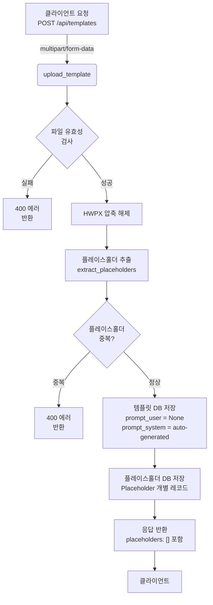
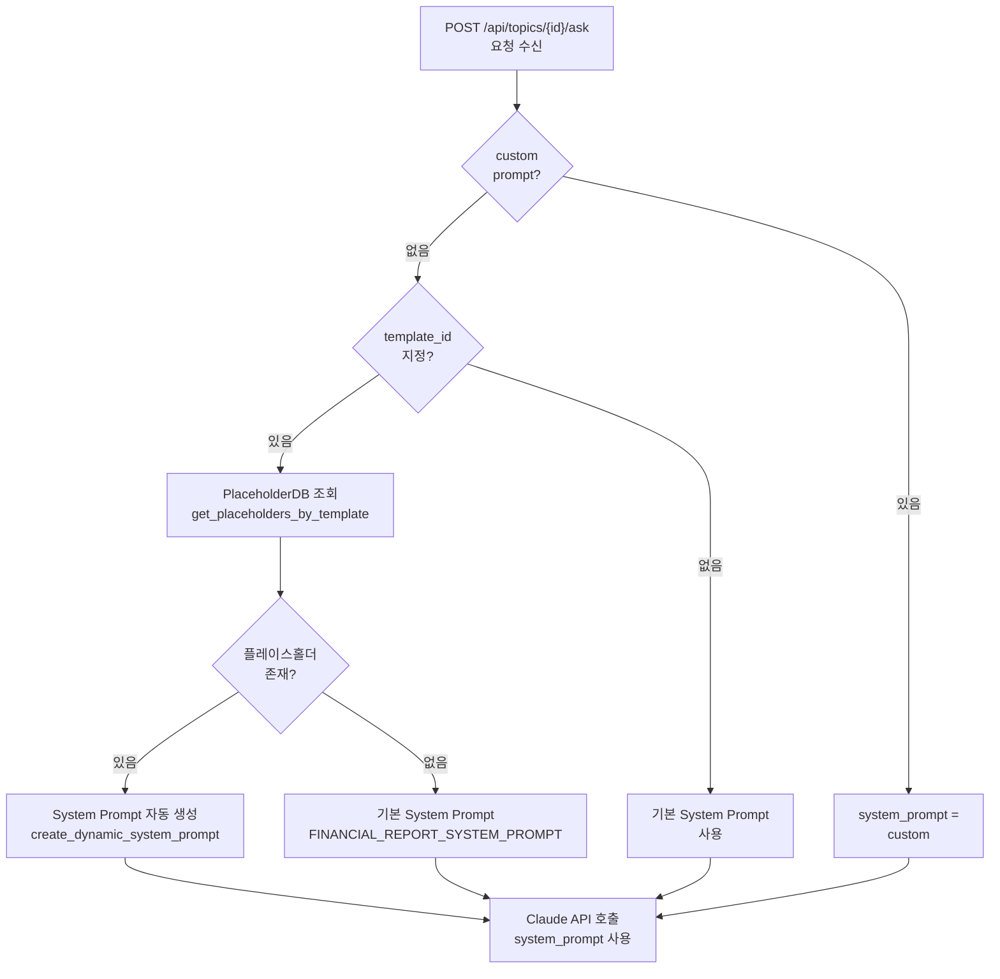

# Unit Spec: prompt_user 필드 용도 개선 및 Placeholder DB 활용

## 1. 요구사항 요약

- **목적:** Template 업로드 시 `prompt_user` 필드의 용도를 명확히 하고, 플레이스홀더는 Placeholder DB 테이블에서만 관리하여 데이터 중복을 제거
- **유형:** ☑ 변경
- **핵심 요구사항:**
  - 입력:
    - Template 업로드 요청 (multipart/form-data)
    - 선택: 사용자 커스텀 System Prompt (prompt_user)
  - 출력:
    - 업로드 응답 (JSON)
    - Template DB: prompt_user는 None으로 저장 (사용자가 나중에 등록하는 용도로 예약)
    - Placeholder DB: 모든 플레이스홀더 개별 저장 (기존과 동일)
  - 예외/제약:
    - prompt_user는 선택 필드 (없으면 None)
    - Placeholder 추출 실패 시 400 반환
    - Placeholder 중복 시 400 반환
  - 처리흐름 요약: HWPX 파일 업로드 → 파일 검증 → 플레이스홀더 추출 → DB 저장 (prompt_user=None) → 동적 System Prompt 자동 생성 → 응답

---

## 2. 구현 대상 파일

| 구분 | 경로                                  | 설명                                       |
| ---- | ------------------------------------- | ------------------------------------------ |
| 변경 | backend/app/models/template.py        | TemplateCreate, UploadTemplateResponse 설명 수정 |
| 변경 | backend/app/routers/templates.py      | upload_template 로직 수정 (prompt_user 제거) |
| 변경 | backend/app/utils/prompts.py          | System Prompt 생성 시 Placeholder DB 사용  |
| 변경 | backend/app/routers/topics.py         | System Prompt 선택 로직 (custom > auto)    |
| 참조 | backend/app/database/template_db.py   | Template CRUD (변경 불필요)               |
| 참조 | backend/app/database/placeholder_db.py| Placeholder 조회 (변경 불필요)            |

---

## 3. 동작 플로우 (Mermaid)

### 3.1 Template 업로드 플로우



### 3.2 System Prompt 선택 로직 (Topics)



---

## 4. 테스트 계획

### 4.1 원칙

- **테스트 우선(TDD)**: 각 테스트 케이스 구현 후 코드 작성
- **계층별 커버리지**: API → Database → Utils 순서로 진행
- **독립성**: 각 테스트는 DB 트랜잭션으로 격리하여 재현성 보장
- **판정 기준**: HTTP 상태코드, JSON 응답 스키마, DB 저장 상태 검증

### 4.2 테스트 케이스

#### API 계층 (routers/templates.py)

| TC ID      | 시나리오                | 목적                                | 입력/사전조건                    | 기대결과                                                  |
| ---------- | ----------------------- | ----------------------------------- | -------------------------------- | --------------------------------------------------------- |
| TC-API-001 | 정상 Template 업로드    | API 상태코드, 응답 스키마 검증     | 유효한 HWPX 파일 + title        | 201, placeholders 배열 포함, prompt_user=null (응답에 제외 또는 null) |
| TC-API-002 | prompt_user 제거됨 검증 | 응답에 prompt_user이 없거나 null임 | 유효한 HWPX 파일                | 응답의 placeholders만 포함, prompt_user 필드 제거 또는 null |
| TC-API-003 | 플레이스홀더 중복 발견  | 중복 플레이스홀더 거부             | HWPX에 {{TITLE}}×2             | 400, ErrorCode: TEMPLATE_DUPLICATE_PLACEHOLDER          |
| TC-API-004 | 파일 유효성 실패        | 잘못된 파일 거부                   | 비HWPX 파일 또는 손상 파일      | 400, ErrorCode: VALIDATION_INVALID_FORMAT 또는 TEMPLATE_INVALID_FORMAT |

#### Database 계층 (database/template_db.py)

| TC ID       | 시나리오                        | 목적                          | 입력/사전조건                              | 기대결과                          |
| ----------- | ------------------------------- | ----------------------------- | ------------------------------------------ | --------------------------------- |
| TC-DB-005   | Template 저장 (prompt_user=None) | prompt_user가 None으로 저장됨 | TemplateCreate(prompt_user=None) 전달     | DB: prompt_user=NULL            |
| TC-DB-006   | Placeholder 개별 저장            | 모든 플레이스홀더 저장됨      | placeholder_list=["{{A}}", "{{B}}"]       | Placeholder 테이블: 2개 레코드   |
| TC-DB-007   | 트랜잭션 일관성                 | 실패 시 모두 롤백             | DB 제약 위반 시나리오 시뮬레이션          | Template과 Placeholder 모두 저장 안 됨 |

#### Utils 계층 (utils/prompts.py)

| TC ID       | 시나리오                                | 목적                                    | 입력/사전조건                                      | 기대결과                                        |
| ----------- | --------------------------------------- | --------------------------------------- | -------------------------------------------------- | ----------------------------------------------- |
| TC-UTIL-008 | Placeholder로부터 System Prompt 생성    | 플레이스홀더 기반 동적 프롬프트         | placeholders=[Placeholder(key="{{TITLE}}", ...) ] | 결과 문자열에 "{{TITLE}}" 포함                  |
| TC-UTIL-009 | 플레이스홀더 없을 때 기본 Prompt 반환  | 플레이스홀더 부재 시 기본값 사용        | placeholders=[]                                    | FINANCIAL_REPORT_SYSTEM_PROMPT 반환            |

#### Topics 계층 (routers/topics.py)

| TC ID       | 시나리오                                    | 목적                                | 입력/사전조건                                        | 기대결과                                       |
| ----------- | ------------------------------------------- | ----------------------------------- | ---------------------------------------------------- | ---------------------------------------------- |
| TC-TOPIC-010 | POST /ask: custom prompt 우선               | custom > template_id > default      | AskRequest(system_prompt="custom", template_id=1)  | system_prompt="custom" 사용됨                  |
| TC-TOPIC-011 | POST /ask: template_id 기반 System Prompt   | Placeholder DB 조회 → 동적 생성    | AskRequest(template_id=1, placeholders 존재)       | 동적 생성된 prompt 사용, Claude API 호출됨     |
| TC-TOPIC-012 | POST /ask: template_id 없을 때 기본 사용    | 기본 System Prompt 사용             | AskRequest(template_id=None)                       | FINANCIAL_REPORT_SYSTEM_PROMPT 사용            |

### 4.3 샘플 테스트 코드 (pytest)

#### Test 1: Template 업로드 - prompt_user 제거 검증

```python
# backend/tests/test_templates_prompt_user_refactor.py

import pytest
from fastapi.testclient import TestClient
from app.main import app

client = TestClient(app)

@pytest.fixture
def auth_header(user_token):
    """인증 헤더 생성"""
    return {"Authorization": f"Bearer {user_token}"}

def test_upload_template_prompt_user_none(auth_header, hwpx_file):
    """
    TC-API-001: Template 업로드 시 prompt_user가 None으로 저장됨
    """
    response = client.post(
        "/api/templates",
        files={"file": hwpx_file},
        data={"title": "Test Template"},
        headers=auth_header
    )

    assert response.status_code == 201
    data = response.json()
    assert data["success"] is True

    # prompt_user가 응답에서 제외되거나 null이어야 함
    assert "prompt_user" not in data["data"] or data["data"]["prompt_user"] is None

    # placeholders 배열은 존재해야 함
    assert "placeholders" in data["data"]
    assert len(data["data"]["placeholders"]) > 0


def test_upload_template_placeholders_stored_in_db(auth_header, hwpx_file, db_session):
    """
    TC-DB-006: 플레이스홀더가 Placeholder DB에 개별 저장됨
    """
    response = client.post(
        "/api/templates",
        files={"file": hwpx_file},
        data={"title": "Test Template"},
        headers=auth_header
    )

    template_id = response.json()["data"]["id"]

    # Placeholder DB 조회
    placeholders = PlaceholderDB.get_placeholders_by_template(template_id)

    assert len(placeholders) == 3  # HWPX에 3개 플레이스홀더 포함
    assert placeholders[0].placeholder_key == "{{TITLE}}"
    assert placeholders[1].placeholder_key == "{{SUMMARY}}"


def test_upload_template_duplicate_placeholder_rejected(auth_header, hwpx_file_with_duplicates):
    """
    TC-API-003: 중복 플레이스홀더 거부
    """
    response = client.post(
        "/api/templates",
        files={"file": hwpx_file_with_duplicates},  # {{TITLE}}×2 포함
        data={"title": "Test Template"},
        headers=auth_header
    )

    assert response.status_code == 400
    data = response.json()
    assert data["error"]["code"] == "TEMPLATE.DUPLICATE_PLACEHOLDER"
```

#### Test 2: Topics - System Prompt 선택 로직 검증

```python
def test_ask_system_prompt_priority_custom(auth_header, db_session):
    """
    TC-TOPIC-010: custom prompt > template_id > default
    """
    # 사전조건: topic, template 준비
    topic = create_test_topic(user_id=1)
    template = create_test_template(user_id=1)

    # ask 요청: custom prompt 포함
    response = client.post(
        f"/api/topics/{topic.id}/ask",
        json={
            "content": "테스트 질문",
            "system_prompt": "CUSTOM PROMPT",
            "template_id": template.id
        },
        headers=auth_header
    )

    assert response.status_code == 200

    # Claude API 호출 확인 (mock)
    # → system_prompt가 "CUSTOM PROMPT"이어야 함


def test_ask_system_prompt_from_template_placeholders(auth_header, db_session):
    """
    TC-TOPIC-011: template_id 기반 System Prompt (Placeholder DB 조회)
    """
    topic = create_test_topic(user_id=1)
    template = create_test_template(user_id=1)

    # Placeholder 미리 생성
    PlaceholderDB.create_placeholder(
        template_id=template.id,
        placeholder_key="{{TITLE}}"
    )

    response = client.post(
        f"/api/topics/{topic.id}/ask",
        json={
            "content": "테스트 질문",
            "template_id": template.id
            # system_prompt 없음
        },
        headers=auth_header
    )

    assert response.status_code == 200

    # Claude API 호출 시 동적 생성된 prompt 사용
    # → "{{TITLE}}" 포함된 prompt가 사용되어야 함


def test_ask_system_prompt_default_when_no_template(auth_header, db_session):
    """
    TC-TOPIC-012: template_id 없을 때 기본 System Prompt 사용
    """
    topic = create_test_topic(user_id=1)

    response = client.post(
        f"/api/topics/{topic.id}/ask",
        json={
            "content": "테스트 질문"
            # template_id 없음
            # system_prompt 없음
        },
        headers=auth_header
    )

    assert response.status_code == 200

    # Claude API 호출 시 FINANCIAL_REPORT_SYSTEM_PROMPT 사용
    # → 기본 프롬프트가 사용되어야 함
```

---

## 5. 사용자 요청 프롬프트

### Original User Request

```
prompt_user의 경우 사용자들이 각자 자신이 원하는 prompt를 등록하기 위해 있는 곳이야.
PlaceHolder라는 DB 테이블이 따로 있으니 해당 데이터를 통해 사용할 수 있도록 개선하는건 어떻게 생각해?
```

### Claude 분석 및 제안

```
현재 구조 분석:
- prompt_user: Template 업로드 시 "{{TITLE}}, {{SUMMARY}}, ..." 형태로 플레이스홀더 목록이 저장됨
- Placeholder DB: 개별 플레이스홀더 레코드가 저장됨
→ 중복 저장 상태

개선 방안 3가지 제시:
- 옵션 1: prompt_user 필드 삭제
- 옵션 2: prompt_user 용도 변경 (사용자 커스텀 프롬프트용) ← 추천
- 옵션 3: 스키마 재설계

옵션 2 이유:
1. 당신의 원래 의도 반영
2. 현재 DB 구조와 호환
3. 향후 확장성 높음
```

### User Clarification

```
옵션 2로 변경하는 unit spec을 작성해줘.
```

### 최종 명확화 (통합)

- ✅ `prompt_user`의 용도를 "사용자 커스텀 System Prompt 등록용"으로 변경
- ✅ Template 업로드 시 `prompt_user=None`으로 저장 (사용자가 나중에 등록)
- ✅ 플레이스홀더는 **Placeholder DB 테이블에서만 관리**
- ✅ System Prompt 생성 시 Placeholder DB에서 직접 조회 (`create_dynamic_system_prompt`)
- ✅ Topics의 ask 요청에서 우선순위: custom > template_id (Placeholder 기반) > default
- ✅ 모델 설명, 라우터 로직, Utils 함수 수정
- ✅ API/DB/Utils/Topics 4개 계층의 테스트 케이스 작성

---

**요청 일시:** 2025-11-11

**컨텍스트/배경:**
- 프로젝트: HWP Report Generator v2.3
- 현재 상태: Template-Placeholder 관계에서 데이터 중복 저장 중
- 목표: 데이터 일관성 개선 및 prompt_user의 원래 의도 구현

---

## 6. 구현 상세 내용

### 6.1 변경 1: models/template.py - 모델 설명 수정

**변경 전:**
```python
class TemplateCreate(TemplateBase):
    prompt_user: Optional[str] = Field(None, description="플레이스홀더 목록 (쉼표로 구분)")
```

**변경 후:**
```python
class TemplateCreate(TemplateBase):
    prompt_user: Optional[str] = Field(None, description="사용자가 정의한 커스텀 System Prompt (선택)")
```

### 6.2 변경 2: routers/templates.py - upload_template 로직

**변경 전:**
```python
# 플레이스홀더 목록을 prompt_user에 저장
placeholder_list = sorted(placeholders)
prompt_user = ", ".join(placeholder_list)

template_data = TemplateCreate(
    ...
    prompt_user=prompt_user,         # "{{TITLE}}, {{SUMMARY}}, ..."
    prompt_system=system_prompt
)
```

**변경 후:**
```python
# prompt_user는 None으로 유지 (사용자 커스텀 프롬프트용으로 예약)
placeholder_list = sorted(placeholders)

# System Prompt 자동 생성 (Placeholder DB 기반)
system_prompt = create_dynamic_system_prompt_from_placeholder_keys(placeholder_list)

template_data = TemplateCreate(
    ...
    prompt_user=None,                # ✅ None으로 저장
    prompt_system=system_prompt      # 자동 생성된 System Prompt
)
```

### 6.3 변경 3: utils/prompts.py - 함수 개선

**신규 함수 추가:**
```python
def create_dynamic_system_prompt_from_placeholder_keys(placeholder_keys: List[str]) -> str:
    """
    플레이스홀더 키 리스트로부터 동적 System Prompt를 생성합니다.

    Args:
        placeholder_keys: ["{{TITLE}}", "{{SUMMARY}}", ...] 형태의 리스트

    Returns:
        동적으로 생성된 System Prompt 텍스트
    """
    if not placeholder_keys:
        return FINANCIAL_REPORT_SYSTEM_PROMPT

    # 기존 로직 사용
    # ...
```

**기존 함수 개선:**
```python
def create_dynamic_system_prompt(placeholders: List[Placeholder]) -> str:
    """
    Placeholder DB 객체 리스트로부터 동적 System Prompt를 생성합니다.

    Topics에서 template_id로 조회한 Placeholder 객체 리스트를 받음.
    """
    if not placeholders:
        return FINANCIAL_REPORT_SYSTEM_PROMPT

    placeholder_keys = [p.placeholder_key for p in placeholders]
    return create_dynamic_system_prompt_from_placeholder_keys(placeholder_keys)
```

### 6.4 변경 4: routers/topics.py - System Prompt 선택 로직

**POST /api/topics/generate:**
```python
# System Prompt 결정 (우선순위: custom > template > default)
system_prompt = FINANCIAL_REPORT_SYSTEM_PROMPT

if topic_data.template_id:
    template = TemplateDB.get_template_by_id(topic_data.template_id)
    if template:
        placeholders = PlaceholderDB.get_placeholders_by_template(template.id)
        if placeholders:
            # ✅ Placeholder DB에서 조회하여 동적 생성
            system_prompt = create_dynamic_system_prompt(placeholders)
```

**POST /api/topics/{id}/ask:**
```python
# System Prompt 결정 (우선순위: custom > template > default)
system_prompt = FINANCIAL_REPORT_SYSTEM_PROMPT

if body.system_prompt:
    system_prompt = body.system_prompt  # 1순위: 사용자 커스텀
elif body.template_id:
    template = TemplateDB.get_template_by_id(body.template_id)
    if template:
        placeholders = PlaceholderDB.get_placeholders_by_template(template.id)
        if placeholders:
            # 2순위: Template 기반 동적 생성 (✅ Placeholder DB 활용)
            system_prompt = create_dynamic_system_prompt(placeholders)
# else: 3순위: 기본값 사용
```

---

## 7. 예상 영향도

### 7.1 변경 영역

| 영역 | 변경 내용 | 영향도 | 호환성 |
| ---- | -------- | ------ | ------ |
| Template 업로드 | prompt_user=None으로 변경 | 중 | 데이터 호환 (기존 데이터는 유지, 새 업로드는 None) |
| System Prompt 생성 | Placeholder DB 직접 조회 | 중 | 기존 prompt_system은 유지 |
| Topics ask | System Prompt 선택 로직 | 소 | 기존 동작과 동일 |

### 7.2 마이그레이션

**필요 없음** - 기존 데이터 유지
- 기존 Template의 prompt_user: 이미 저장된 값 유지
- Placeholder DB: 변경 없음
- 신규 업로드: prompt_user=None으로 저장

### 7.3 하위 호환성

✅ **완벽한 하위 호환성 유지**
- 기존 API 응답 스키마 유지
- 기존 Database 구조 유지
- 기존 prompt_system 값 활용 가능

---

## 8. 승인 체크리스트

- [ ] 요구사항 명확함
- [ ] 테스트 계획 타당함
- [ ] 구현 범위 적절함
- [ ] 영향도 분석 완료
- [ ] 승인 (사용자)
