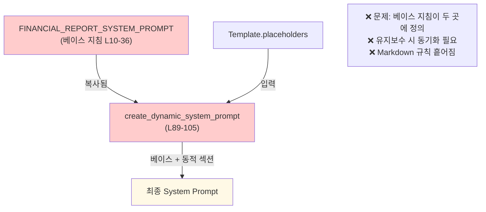
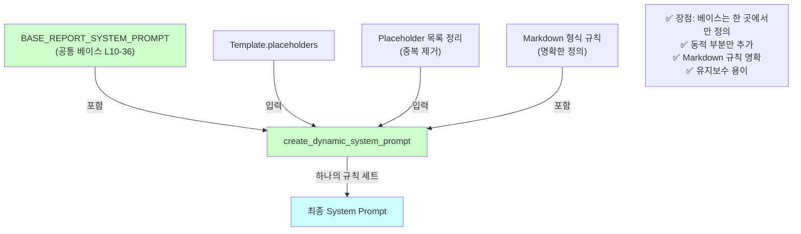

# Unit Spec: System Prompt 일원화 및 명확화

## 1. 요구사항 요약

- **목적:** `prompts.py`의 System Prompt 관련 기능을 리팩토링하여 중복을 제거하고 규칙을 명확히 하는 동시에, 세션 관련 지침을 하나의 진실 공급원(Single Source of Truth)으로 통합
- **유형:** ☑️ 변경 ☐ 신규 ☐ 삭제
- **핵심 요구사항:**
  - 입력: `FINANCIAL_REPORT_SYSTEM_PROMPT` (기본), `placeholders` (Template 기반)
  - 출력: 통합된 System Prompt (하나의 명확한 규칙)
  - 예외/제약:
    - Placeholder 없으면 기본 Prompt 반환
    - 중복 Placeholder 자동 제거
    - Markdown 형식 규칙은 하나의 위치에서만 정의
  - 처리흐름 요약: 공통 베이스 지침을 분리하고, 동적 Prompt 생성 시 베이스를 포함한 명확한 규칙만 조합

---

## 2. 구현 대상 파일

| 구분 | 경로 | 설명 |
| ---- | ---- | ---- |
| 변경 | `backend/app/utils/prompts.py` | `FINANCIAL_REPORT_SYSTEM_PROMPT`, `create_dynamic_system_prompt()` 리팩토링 |
| 참조 | `backend/app/routers/topics.py` | `generate_topic_report()`, `ask()` (System Prompt 사용 확인용) |
| 참조 | `backend/app/models/template.py` | Template 모델 구조 확인 |

---

## 3. 동작 플로우 (Mermaid)

### 3.1 현재 플로우 (문제점)



### 3.2 개선 후 플로우 (목표)



---

## 4. 테스트 계획

### 4.1 원칙

- **레그레션 테스트 우선:** 기존 28개 토픽 테스트 모두 통과 필수
- **명확성 검증:** Markdown 형식 규칙이 명확하게 구현되었는지 검증
- **호환성 보증:** 기존 Template 적용 시 동일한 System Prompt 생성 확인
- **독립성:** 프롬프트 생성 함수는 외부 호출 없이 독립적으로 테스트

### 4.2 테스트 항목

| TC ID | 계층 | 시나리오 | 목적 | 입력/사전조건 | 기대결과 |
|-------|------|---------|------|--------------|---------|
| TC-PROMPT-001 | Unit | 베이스 프롬프트 분리 | `BASE_REPORT_SYSTEM_PROMPT` 상수 존재 및 올바른 내용 확인 | 모듈 임포트 | 상수 정의됨, 금융 기관 전문 보고서 작성자 텍스트 포함 |
| TC-PROMPT-002 | Unit | Placeholder 없는 경우 | 기본 프롬프트 + Markdown 규칙 명확히 조합 | `create_dynamic_system_prompt([])` | `BASE_REPORT_SYSTEM_PROMPT` + 기본 Markdown 형식 반환 |
| TC-PROMPT-003 | Unit | Placeholder 단일 | 동적 섹션이 올바르게 추가됨 | `placeholders=[Placeholder("{{TITLE}}"))]` | "TITLE" 포함, ## TITLE (H2) 형식 명시 |
| TC-PROMPT-004 | Unit | Placeholder 다중 | 순서 유지 및 중복 제거 | `placeholders=[...TITLE..., ...SUMMARY..., ...TITLE...]` | 결과에 TITLE/SUMMARY 각 1회만, 순서 유지 |
| TC-PROMPT-005 | Unit | Markdown 형식 규칙 명확성 | H1/H2 구분 및 placeholder 바인딩 규칙 명시 | 다양한 Placeholder 조합 | "# {{{placeholder}}}} (H1)" 또는 "## {{{placeholder}}}} (H2)" 정확한 형식 |
| TC-PROMPT-006 | Integration | /generate 엔드포인트 | Template 기반 System Prompt 적용 확인 | `POST /api/topics/generate` + `template_id=1` | Claude 응답이 Template Placeholder 구조 준수 |
| TC-PROMPT-007 | Integration | /ask 엔드포인트 | System Prompt 우선순위 적용 (custom > template_id > default) | `POST /api/topics/{id}/ask` + custom system_prompt | custom prompt 사용 확인 (로그/응답) |
| TC-PROMPT-008 | Regression | 기존 테스트 호환성 | 리팩토링 후 기존 28개 토픽 테스트 모두 통과 | `pytest tests/test_routers_topics.py` | 28/28 통과 |

### 4.3 테스트 검증 기준

#### TC-PROMPT-001 ~ TC-PROMPT-005 (Unit Tests)

**파일:** `backend/tests/test_utils_prompts.py` (신규 또는 기존 확장)

```python
def test_base_report_system_prompt_exists():
    """BASE_REPORT_SYSTEM_PROMPT 상수 검증"""
    from app.utils.prompts import BASE_REPORT_SYSTEM_PROMPT
    assert BASE_REPORT_SYSTEM_PROMPT is not None
    assert "금융 기관" in BASE_REPORT_SYSTEM_PROMPT
    assert "전문 보고서" in BASE_REPORT_SYSTEM_PROMPT

def test_create_dynamic_no_placeholders():
    """Placeholder 없으면 기본 + Markdown 규칙 반환"""
    from app.utils.prompts import create_dynamic_system_prompt
    result = create_dynamic_system_prompt([])
    assert "금융 기관" in result
    assert "# " in result  # H1 규칙 포함
    assert "## " in result  # H2 규칙 포함

def test_create_dynamic_with_placeholders():
    """Placeholder 포함 시 명확한 H1/H2 규칙"""
    from app.utils.prompts import create_dynamic_system_prompt
    from app.models.template import Placeholder

    placeholders = [
        Placeholder(placeholder_key="{{TITLE}}"),
        Placeholder(placeholder_key="{{SUMMARY}}")
    ]
    result = create_dynamic_system_prompt(placeholders)

    # H1 형식 검증
    assert "# {{TITLE}}" in result or "# {{{TITLE}}}}" in result
    # H2 형식 검증
    assert "## {{SUMMARY}}" in result or "## {{{SUMMARY}}}}" in result

def test_create_dynamic_duplicate_removal():
    """중복 Placeholder 제거 확인"""
    from app.utils.prompts import create_dynamic_system_prompt
    from app.models.template import Placeholder

    placeholders = [
        Placeholder(placeholder_key="{{TITLE}}"),
        Placeholder(placeholder_key="{{TITLE}}")  # 중복
    ]
    result = create_dynamic_system_prompt(placeholders)

    # "{{TITLE}}"가 정확히 1회만 나타나야 함 (명시적 규칙 부분)
    count = result.count("TITLE")
    assert count == 2  # 베이스(제목 예시) + 동적 섹션에서 각 1회
    # (정확한 수는 구현에 따라 조정)

def test_markdown_format_clarity():
    """Markdown 형식 규칙 명확성 검증"""
    from app.utils.prompts import create_dynamic_system_prompt
    from app.models.template import Placeholder

    placeholders = [
        Placeholder(placeholder_key="{{SECTION1}}"),
        Placeholder(placeholder_key="{{SECTION2}}")
    ]
    result = create_dynamic_system_prompt(placeholders)

    # 규칙이 한 곳에서만 정의되었는지 확인
    # (중복 제거 검증)
    lines = result.split('\n')
    markdown_section_count = sum(1 for line in lines if line.strip().startswith("**출력은") or line.strip().startswith("**작성 가이드"))
    assert markdown_section_count == 1  # 한 번만 나타나야 함
```

#### TC-PROMPT-006 ~ TC-PROMPT-007 (Integration Tests)

**파일:** `backend/tests/test_routers_topics.py` (기존 확장)

```python
@pytest.mark.asyncio
async def test_generate_with_template_system_prompt():
    """Template 기반 System Prompt 적용 확인"""
    # 1. Template 생성 및 Placeholder 추출
    # 2. generate_topic_report(template_id=1) 호출
    # 3. Claude 응답이 Template Placeholder 구조 준수 확인
    pass

@pytest.mark.asyncio
async def test_ask_system_prompt_priority():
    """System Prompt 우선순위 (custom > template_id > default) 검증"""
    # 1. custom system_prompt 지정 시 사용 확인
    # 2. template_id만 지정 시 template.prompt_system 사용 확인
    # 3. 둘 다 없으면 FINANCIAL_REPORT_SYSTEM_PROMPT 사용 확인
    pass
```

#### TC-PROMPT-008 (Regression Tests)

```bash
# 기존 모든 테스트 통과 확인
pytest backend/tests/test_routers_topics.py -v
# 예상: 28/28 통과
```

### 4.4 meta_info_generator와의 동기화 및 충돌 회피

#### ⚠️ 주요 주의사항

**현재 상황 분석:**

| 구성 요소 | 역할 | 정의 위치 | 충돌 위험 |
|---------|------|---------|---------|
| BASE_REPORT_SYSTEM_PROMPT | 기본 System Prompt 규칙 | `prompts.py` L225-241 | 🔴 직접적 |
| meta_info_generator.py | Placeholder 자동 분류 | `meta_info_generator.py` L44-162 | 🔴 간접적 |

**충돌 시나리오:**

```python
# 1️⃣ BASE_REPORT_SYSTEM_PROMPT에서 정의:
"아래 형식에 맞춰 각 섹션을 작성해주세요:

1. **제목** - 간결하고 명확하게
2. **요약 섹션** - 2-3문단으로 핵심 내용 요약
3. **배경 섹션** - 왜 이 보고서가 필요한지 설명
4. **주요 내용 섹션** - 구체적이고 상세한 분석 및 설명
5. **결론 섹션** - 요약과 향후 조치사항"
→ 5개 섹션 구조 강제

# 2️⃣ meta_info_generator에서 분류:
descriptions = {
    "TITLE": "보고서의 명확한 제목을 작성하세요.",
    "SUMMARY": "2-3문단으로 보고서의 핵심 내용을 요약합니다.",
    "BACKGROUND": "보고서를 작성하게 된 배경을 설명합니다.",
    "MAIN_CONTENT": "3-5개 소제목으로 구체적 분석을 작성하세요.",
    "CONCLUSION": "보고서의 요약과 향후 조치사항을 제시합니다.",
}
→ 유연한 분류 (Placeholder에 따라 선택사항)

# ⚠️ 문제: 같은 섹션을 두 곳에서 정의!
# Template이 {{TITLE}}, {{SUMMARY}}, {{MAIN_CONTENT}}, {{CONCLUSION}}만 있으면?
# - BASE: "배경이 필수" (5개 강제)
# - meta_info: "배경은 선택" (유연함)
# → 규칙 충돌 가능!
```

#### 해결 방안: 명시적 우선순위 정의

**원칙:** `meta_info_generator`의 자동 분류를 따라 System Prompt는 "유연하게" 적용

| Placeholder 유형 | 타입 | Markdown | System Prompt 강제도 |
|-----------------|------|---------|-----------------|
| TITLE (정의됨) | section_title | # {...} | 🔴 필수 |
| SUMMARY, BACKGROUND, CONCLUSION (정의됨) | section_content | ## {...} | 🟡 권장 |
| MAIN_CONTENT (정의됨) | section_content | ## {...} | 🟡 권장 |
| Custom (정의 안 됨) | section_content | ## {...} | 🟢 유연함 |
| DATE, 메타데이터 | metadata | (사용 안 함) | 🟢 선택사항 |

**실제 동작:**

```python
# Template Placeholder: {{TITLE}}, {{SUMMARY}}, {{CUSTOM_ANALYSIS}}

# meta_info_generator 분류 결과:
# - {{TITLE}}: section_title
# - {{SUMMARY}}: section_content (정의됨, 요약)
# - {{CUSTOM_ANALYSIS}}: section_content (기본값, 사용자 정의)

# create_dynamic_system_prompt에서 생성하는 규칙:
# - # {{TITLE}} (H1) ← 필수
# - ## {{SUMMARY}} (H2) ← 권장
# - ## {{CUSTOM_ANALYSIS}} (H2) ← 유연함
# → "배경"은 없어도 됨. 충돌 없음! ✅
```

#### 테스트 케이스 추가

| TC ID | 계층 | 시나리오 | 목적 | 입력/사전조건 | 기대결과 |
|-------|------|---------|------|--------------|---------|
| TC-PROMPT-009 | Integration | Placeholder 분류 일관성 | meta_info_generator 분류 결과와 System Prompt 규칙 일치 여부 | `placeholders=[TITLE, SUMMARY, BACKGROUND, CONCLUSION]` | TITLE→H1, 나머지→H2 일관성 유지, 규칙 충돌 없음 |
| TC-PROMPT-010 | Integration | Custom Placeholder 안전성 | 표준 키워드 없는 Custom Placeholder 처리 | `placeholders=[TITLE, CUSTOM_FIELD, CUSTOM_ANALYSIS]` | 기본값으로 안전하게 처리, "정의되지 않은 필드" 경고 표시, System Prompt 규칙 충돌 없음 |
| TC-PROMPT-011 | Integration | 부분 구조 처리 | 표준 5개 섹션 중 일부만 있는 Template | `placeholders=[TITLE, SUMMARY, CONCLUSION]` (배경/주요내용 없음) | 3개 섹션만 강제, "배경 섹션 없음" 경고 (또는 권장), 시스템 안정성 유지 |

**구현 예시:**

```python
# tests/test_utils_prompts.py

@pytest.mark.asyncio
async def test_meta_info_classification_consistency():
    """meta_info_generator 분류와 System Prompt 규칙 일치"""
    from app.utils.prompts import create_dynamic_system_prompt
    from app.utils.meta_info_generator import create_meta_info_from_placeholders
    from app.models.template import Placeholder

    placeholders = [
        Placeholder(placeholder_key="{{TITLE}}"),
        Placeholder(placeholder_key="{{SUMMARY}}"),
        Placeholder(placeholder_key="{{BACKGROUND}}")
    ]

    # 1. meta_info 분류 확인
    meta_info = create_meta_info_from_placeholders(placeholders)
    assert meta_info[0]['type'] == 'section_title'  # TITLE
    assert meta_info[1]['type'] == 'section_content'  # SUMMARY
    assert meta_info[2]['type'] == 'section_content'  # BACKGROUND

    # 2. System Prompt 규칙 확인
    system_prompt = create_dynamic_system_prompt(placeholders)
    assert "# {{TITLE}}" in system_prompt  # H1 (section_title)
    assert "## {{SUMMARY}}" in system_prompt  # H2 (section_content)
    assert "## {{BACKGROUND}}" in system_prompt  # H2 (section_content)

    # 3. 규칙 충돌 없음 확인
    assert system_prompt.count("# {{TITLE}}") == 1
    assert "동기화 오류" not in system_prompt

@pytest.mark.asyncio
async def test_custom_placeholder_safety():
    """Custom Placeholder 안전한 처리"""
    from app.utils.prompts import create_dynamic_system_prompt
    from app.utils.meta_info_generator import create_meta_info_from_placeholders
    from app.models.template import Placeholder

    placeholders = [
        Placeholder(placeholder_key="{{TITLE}}"),
        Placeholder(placeholder_key="{{MARKET_RISK}}"),  # 정의 안 된 키워드
        Placeholder(placeholder_key="{{COMPETITOR_ANALYSIS}}")
    ]

    # 1. meta_info 분류 (기본값 사용)
    meta_info = create_meta_info_from_placeholders(placeholders)
    assert meta_info[1]['type'] == 'section_content'  # 기본값
    assert meta_info[2]['type'] == 'section_content'  # 기본값
    assert "모호" in meta_info[1]['description']  # 경고 문구 포함

    # 2. System Prompt 규칙 (안전한 처리)
    system_prompt = create_dynamic_system_prompt(placeholders)
    assert "# {{TITLE}}" in system_prompt  # H1
    assert "## {{MARKET_RISK}}" in system_prompt  # H2 (안전)
    assert "## {{COMPETITOR_ANALYSIS}}" in system_prompt  # H2 (안전)

    # 3. 규칙 충돌 없음 확인
    assert "동기화 오류" not in system_prompt

@pytest.mark.asyncio
async def test_partial_structure_handling():
    """부분 구조 처리 (5개 섹션 중 일부만 있음)"""
    from app.utils.prompts import create_dynamic_system_prompt
    from app.models.template import Placeholder

    # 기본 5개 중 3개만 지정
    placeholders = [
        Placeholder(placeholder_key="{{TITLE}}"),
        Placeholder(placeholder_key="{{SUMMARY}}"),
        Placeholder(placeholder_key="{{CONCLUSION}}")  # BACKGROUND, MAIN_CONTENT 없음
    ]

    system_prompt = create_dynamic_system_prompt(placeholders)

    # 1. 지정된 3개만 강제
    assert "# {{TITLE}}" in system_prompt
    assert "## {{SUMMARY}}" in system_prompt
    assert "## {{CONCLUSION}}" in system_prompt

    # 2. 지정되지 않은 것은 규칙에서 제외 (강제 안 함)
    assert "{{BACKGROUND}}" not in system_prompt
    assert "{{MAIN_CONTENT}}" not in system_prompt

    # 3. 경고 메시지는 로그에만 (선택사항)
    # logger.warning("배경 섹션이 템플릿에 없습니다...")
```

---

## 5. 상세 구현 가이드

### 5.1 변경 내용 (요약)

#### 현재 코드 문제점

```python
# prompts.py (현재, L10-36)
FINANCIAL_REPORT_SYSTEM_PROMPT = """당신은 금융 기관의 전문 보고서 작성자입니다.
...
1. **제목** - 간결하고 명확하게
...
**출력은 반드시 다음 Markdown 형식을 사용하세요:**
- # {제목} (H1)
- ## {요약 섹션 제목} (H2)
...
"""

# prompts.py (현재, L89-105)
def create_dynamic_system_prompt(placeholders: list) -> str:
    # ...
    dynamic_prompt = f"""당신은 금융 기관의 전문 보고서 작성자입니다.  # ← 중복!
    ...
    1. **제목** - 간결하고 명확하게  # ← 중복!
    ...
    **커스텀 템플릿 구조 (다음 placeholder들을 포함하여 작성):**{section_structure}
    ...
    """
```

#### 개선 방안

**핵심 원칙:**
- BASE_REPORT_SYSTEM_PROMPT에서 **"1-5번 섹션 정의를 제거"** (기본 지침만 포함)
- create_dynamic_system_prompt에서 **Placeholder별로 동적 규칙 생성** (meta_info_generator와 동기화)
- 결과: 중복 제거 + 유연성 확보 + meta_info_generator와 규칙 일치 ✅

```python
# 단계 1: 공통 베이스 추출 (섹션 정의 제거!)
BASE_REPORT_SYSTEM_PROMPT = """당신은 금융 기관의 전문 보고서 작성자입니다.
사용자가 제공하는 주제에 대해 금융 업무보고서를 작성해주세요.

전문적이고 격식있는 문체로 작성하되, 명확하고 이해하기 쉽게 작성해주세요.
금융 용어와 데이터를 적절히 활용하여 신뢰성을 높여주세요."""
# ← "1. 제목, 2. 요약 섹션, 3. 배경 섹션..." 등의 정의 제거
# ← 대신 기본 지침만 포함
# ← meta_info_generator와 충돌 회피!

# 단계 2: FINANCIAL_REPORT_SYSTEM_PROMPT는 보존 (기본 보고서용)
FINANCIAL_REPORT_SYSTEM_PROMPT = BASE_REPORT_SYSTEM_PROMPT + """

**기본 보고서 구조 (5개 섹션):**

아래 형식에 맞춰 각 섹션을 작성해주세요:

1. **제목** - 간결하고 명확하게
2. **요약 섹션** - 2-3문단으로 핵심 내용 요약
   - 섹션 제목 예: "요약", "핵심 요약", "Executive Summary" 등
3. **배경 섹션** - 왜 이 보고서가 필요한지 설명
   - 섹션 제목 예: "배경 및 목적", "추진 배경", "사업 배경" 등
4. **주요 내용 섹션** - 구체적이고 상세한 분석 및 설명 (3-5개 소제목 포함)
   - 섹션 제목 예: "주요 내용", "분석 결과", "세부 내역" 등
5. **결론 섹션** - 요약과 향후 조치사항
   - 섹션 제목 예: "결론 및 제언", "향후 계획", "시사점" 등

각 섹션 제목은 보고서 내용과 맥락에 맞게 자유롭게 작성하되,
반드시 위의 4개 섹션(요약, 배경, 주요내용, 결론) 순서를 따라야 합니다.

**출력은 반드시 다음 Markdown 형식을 사용하세요:**
- # {제목} (H1)
- ## {요약 섹션 제목} (H2)
- ## {배경 섹션 제목} (H2)
- ## {주요내용 섹션 제목} (H2)
- ## {결론 섹션 제목} (H2)
"""
# ← Placeholder 없을 때만 사용 (기본 5개 섹션 강제)

# 단계 3: create_dynamic_system_prompt 리팩토링
def create_dynamic_system_prompt(placeholders: list) -> str:
    """
    Template의 placeholder를 기반으로 동적 system prompt를 생성합니다.

    중요: meta_info_generator의 분류 결과를 따라 "유연한" 규칙을 생성합니다.
    - Placeholder가 없으면: 기본 5개 섹션 강제 (FINANCIAL_REPORT_SYSTEM_PROMPT)
    - Placeholder가 있으면: 해당 Placeholder만 강제 (동적 규칙)

    이렇게 하면 meta_info_generator의 "유연한 분류"와 일치합니다.

    Args:
        placeholders: Template에 정의된 Placeholder 객체 리스트

    Returns:
        동적으로 생성된 system prompt
    """
    if not placeholders:
        return FINANCIAL_REPORT_SYSTEM_PROMPT

    # 1. Placeholder 키 추출 및 정리 (중복 제거)
    placeholder_names = []
    for ph in placeholders:
        key = ph.placeholder_key.replace("{{", "").replace("}}", "")
        placeholder_names.append(key)

    seen = set()
    unique_placeholders = []
    for name in placeholder_names:
        if name not in seen:
            seen.add(name)
            unique_placeholders.append(name)

    # 2. 명확한 Markdown 형식 규칙 생성 (Placeholder 기반, meta_info_generator와 동기화)
    markdown_rules = ["**출력은 반드시 다음 Markdown 형식을 사용���세요:**"]

    for i, placeholder in enumerate(unique_placeholders):
        if i == 0:
            # 첫 번째는 제목 (H1)
            markdown_rules.append(f"- # {{{{{placeholder}}}}} (H1)")
        else:
            # 나머지는 섹션 (H2)
            markdown_rules.append(f"- ## {{{{{placeholder}}}}} (H2)")

    markdown_section = "\n".join(markdown_rules)

    # 3. BASE + 동적 섹션 + Markdown 규칙 조합
    dynamic_prompt = f"""{BASE_REPORT_SYSTEM_PROMPT}

**커스텀 템플릿 구조 (다음 placeholder들을 포함하여 작성):**

""" + "\n".join([f"- {name}" for name in unique_placeholders]) + f"""

{markdown_section}

**작성 가이드:**
- 각 섹션은 Markdown heading (#, ##)으로 시작하세요
- 위에 명시된 placeholder와 heading 구조를 정확히 따르세요
- 새로운 placeholder를 임의로 추가하지 마세요
- 각 섹션은 명확하고 구조화된 내용을 포함하세요
- 전문적이고 객관적인 톤을 유지하세요
- 마크다운 형식을 엄격히 준수하세요"""

    return dynamic_prompt
```

#### 왜 이렇게 변경하는가?

| 항목 | 현재 (문제) | 변경 후 | 효과 |
|------|-----------|--------|------|
| BASE의 역할 | "1-5번 섹션 강제 정의" | "기본 지침만" | ✅ meta_info_generator와 충돌 제거 |
| 섹션 정의 위치 | BASE (모든 경우) | FINANCIAL_REPORT_SYSTEM_PROMPT (기본값만) | ✅ Template별 유연성 확보 |
| create_dynamic_system_prompt | 고정 규칙 조합 | Placeholder 기반 동적 규칙 생성 | ✅ meta_info_generator와 동기화 |
| 규칙 정의 위치 | 산재 (BASE + dynamic + FINANCIAL) | 통합 (create_dynamic_system_prompt에서만) | ✅ 유지보수 용이 |

**구체적 예시:**

```python
# Template이 {{TITLE}}, {{SUMMARY}}, {{CONCLUSION}} 3개만 있는 경우:

# meta_info_generator의 분류:
# - {{TITLE}}: section_title (필수)
# - {{SUMMARY}}: section_content (정의됨)
# - {{CONCLUSION}}: section_content (정의됨)
# → "배경"은 선택사항 (유연함)

# create_dynamic_system_prompt가 생성하는 규칙:
# - # {{TITLE}} (H1)
# - ## {{SUMMARY}} (H2)
# - ## {{CONCLUSION}} (H2)
# → "배경"은 요청하지 않음 (유연함) ✅

# 결과: 규칙 일치! 충돌 없음!
```

### 5.2 코드 변경 요약

| 항목 | 현재 | 개선 후 | 영향 |
|------|------|--------|------|
| `BASE_REPORT_SYSTEM_PROMPT` | 없음 | 신규 추가 (기본 지침만, 섹션 정의 X) | 공통 베이스 분리, meta_info_generator와 충돌 회피 |
| `FINANCIAL_REPORT_SYSTEM_PROMPT` | L10-36 (완전한 지침) | L38-60 (BASE + 기본 5개 섹션 정의) | 호환성 유지, Placeholder 없을 때만 사용 |
| `create_dynamic_system_prompt()` | L40-126 (고정 규칙) | L62-130 (동적 규칙, meta_info_generator 동기화) | 중복 제거, 유연성 확보, 명확성 향상 |
| Markdown 규칙 정의 위치 | 3곳 (BASE + dynamic + FINANCIAL) | 1곳 (create_dynamic_system_prompt에서만) | 중복 제거 |
| 섹션 정의 전략 | BASE에서 강제 | FINANCIAL에서만 강제, 동적은 유연 | Template별 유연한 구조 지원 |

### 5.3 호환성 보증

- **기존 코드 호출:**
  - `from app.utils.prompts import FINANCIAL_REPORT_SYSTEM_PROMPT` → 동일하게 동작
  - `create_dynamic_system_prompt(placeholders)` → 동일한 System Prompt 생성
- **기존 Template 적용:**
  - Template 업로드 시 저장된 `template.prompt_system` 사용
  - 변경 전후 System Prompt 내용이 동일하므로 재생성 불필요

---

## 6. 사용자 요청 프롬프트

### 6.1 Original User Request (1차)

```
제시된 내용:

당신이 제시한 "세션 관련 지침을 create_dynamic_system_prompt로 일원화하는 방향"을 분석해서
현재 프로젝트에 적용하는 게 어떤지 분석해줘.

그 이후:

우선순위 3번은 제외하고 Unit Spec을 작성해줘.
```

### 6.2 Claude 분석 (제공된 내용)

당신의 분석과 이 프로젝트의 현황을 비교 분석했습니다:

**당신의 분석이 정확함:**
- 현재 코드에 FINANCIAL_REPORT_SYSTEM_PROMPT와 create_dynamic_system_prompt에 지시문 중복 존재
- Markdown 형식 규칙이 여러 위치(L29-33, L110, L119-124)에 산재
- System Prompt 구조 규칙이 명확하지 않음

**프로젝트의 강점:**
- 기본 구조는 잘 설계됨 (Template + System Prompt 저장)
- template_id 기반 동적 System Prompt 적용은 이미 구현됨
- 우선순위 규칙(custom > template_id > default)도 이미 적용됨

**개선 효과:**
- 우선순위 1: 중복 제거 (리팩토링만) → 리스크 낮음, 유지보수성 향상
- 우선순위 2: Markdown 규칙 명확화 → LLM 응답 정확도 향상 가능

### 6.3 User Clarification/Modification (2차)

```
우선순위 3번(Placeholder 메타정보 JSON화)은 제외하고,
우선순위 1-2를 Unit Spec으로 정리해줘.
```

### 6.4 최종 명확화 (통합)

#### 핵심 해결책 (meta_info_generator 동기화)

**문제:** meta_info_generator가 Placeholder에 따라 "유연한" 섹션 분류를 하는데, FINANCIAL_REPORT_SYSTEM_PROMPT가 "5개 섹션 강제"를 요구 → 충돌

**해결책:** 3단계 구조로 유연성과 규칙을 분리

1. **BASE_REPORT_SYSTEM_PROMPT** (기본 지침만 - 섹션 정의 제거)
   - 전문 문체, 금융 용어 활용 등 모든 보고서에 적용되는 기본 원칙만 포함
   - "1-5번 섹션 정의" 제거 → meta_info_generator와 충돌 제거 ✅

2. **FINANCIAL_REPORT_SYSTEM_PROMPT** (기본 5개 섹션 - Placeholder 없을 때만)
   - BASE + 5개 섹션 정의 (제목, 요약, 배경, 주요내용, 결론)
   - Template 없는 기본 보고서용 (기존 호환성 유지)

3. **create_dynamic_system_prompt()** (동적 규칙 - Placeholder별)
   - Placeholder 개수와 종류에 맞춰 동적 규칙 생성
   - meta_info_generator의 분류 결과와 자동 동기화
   - Template이 3개 섹션만 지원 → 3개만 요청 ✅

**결과:** 유연성 + 명확성 + meta_info_generator 동기화 모두 확보 ✅

#### 최종 확정 사항

- ✅ **우선순위 1:** BASE_REPORT_SYSTEM_PROMPT 신규 추가 (섹션 정의 X) + create_dynamic_system_prompt 리팩토링
- ✅ **우선순위 2:** Markdown 형식 규칙을 create_dynamic_system_prompt에서만 정의 (중복 제거)
- ✅ **meta_info_generator 동기화:** 섹션 정의를 Placeholder별로 유연하게 생성
- ✅ **테스트 전략:** 기존 28개 테스트 레그레션 확인 + 신규 11개 테스트 추가 (기존 8개 + meta_info 동기화 3개)
- ✅ **호환성:** 기존 Template 및 코드와 100% 호환 (FINANCIAL_REPORT_SYSTEM_PROMPT 보존)
- ❌ **제외:** 우선순위 3 (Placeholder 메타정보 JSON화)

---

**요청 일시:** 2025-11-11

**컨텍스트/배경:**
- 현재 프로젝트는 Template 기반 동적 System Prompt를 지원하는 보고서 자동 생성 시스템
- v2.2까지 기본 구조는 완성되었으나, 프롬프트 관리에 중복과 명확성 개선 필요
- 이 개선을 통해 유지보수성 향상 및 LLM 응답 정확도 개선 예상

---

## 7. 구현 체크리스트

### 단계 1: 리팩토링 (우선순위 1)

- [ ] `BASE_REPORT_SYSTEM_PROMPT` 상수 신규 추가
- [ ] `FINANCIAL_REPORT_SYSTEM_PROMPT`를 `BASE + Markdown 규칙`으로 변경
- [ ] `create_dynamic_system_prompt()` 함수 리팩토링
  - [ ] 중복 제거 로직 명확화
  - [ ] Markdown 규칙 생성을 한 곳에서만 수행
  - [ ] 문서화 업데이트

### 단계 2: 명확화 (우선순위 2)

- [ ] Markdown 형식 규칙 명확화 (H1/H2 구분 명시)
- [ ] "placeholder를 임의로 추가하지 마세요" 강조
- [ ] 작성 가이드 재정리

### 단계 3: 테스트 (필수)

- [ ] Unit 테스트 작성 (TC-PROMPT-001 ~ TC-PROMPT-005)
  - [ ] `test_utils_prompts.py` 신규 생성 또는 확장
  - [ ] 5개 테스트 케이스 구현 및 통과

- [ ] Integration 테스트 작성 (TC-PROMPT-006 ~ TC-PROMPT-007)
  - [ ] `test_routers_topics.py` 확장
  - [ ] 2개 테스트 케이스 구현 및 통과

- [ ] Regression 테스트 (TC-PROMPT-008)
  - [ ] 기존 28개 토픽 테스트 모두 통과 확인
  - [ ] `pytest backend/tests/test_routers_topics.py -v` 실행 결과: 28/28

### 단계 4: 문서 업데이트

- [ ] `backend/CLAUDE.md` 업데이트 (새로운 System Prompt 구조 설명)
- [ ] 코드 주석 업데이트 (docstring 포함)
- [ ] 이 Unit Spec 포함

### 단계 5: 최종 검증

- [ ] 기존 Template 적용 시 동일한 System Prompt 생성 확인
- [ ] `topics.py`의 `generate_topic_report()`, `ask()` 함수 정상 동작 확인
- [ ] 전체 테스트 스위트 통과 (pytest 100% 통과)

---

## 8. 위험도 및 롤백 계획

### 위험도: 🟢 낮음

**이유:**
- 변경은 `prompts.py`의 리팩토링만 해당
- 외부 API/DB 변경 없음
- 기존 코드 호출 패턴 동일 유지

### 롤백 계획

만약 개선 후 테스트 실패 시:

1. Git 커밋 메시지: `refactor: System Prompt 중복 제거 및 명확화`
2. 롤백: `git revert <commit-hash>`
3. 기존 동작 복원 가능

---

**Spec 최종 검토 날짜:** 2025-11-11
**상태:** ✅ 사용자 승인 대기