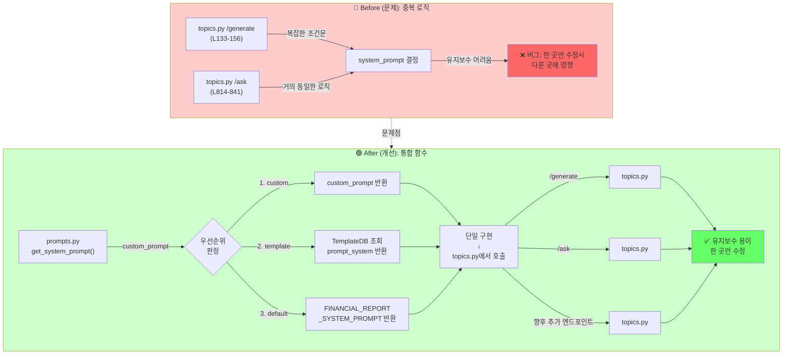

# Unit Spec: System Prompt 통합 및 세션 중복 제거

## 1. 요구사항 요약

- **목적:** `topics.py` 라우터에서 중복된 system prompt 선택 로직을 `prompts.py`의 통합 함수로 리팩토링하여 코드 중복을 제거하고, 향후 세션/컨텍스트 관리 시 발생할 문제점을 사전에 방지
- **유형:** ☑️ 변경 (리팩토링)
- **핵심 요구사항:**
  - 입력:
    - 1️⃣ `custom_prompt` (사용자가 직접 입력한 system prompt)
    - 2️⃣ `template_id` (Template DB에서 저장된 prompt_system 조회용)
    - 3️⃣ `user_id` (권한 검증용)
  - 출력:
    - 최종 사용할 system prompt 문자열 (우선순위 적용)
  - 예외/제약:
    - `template_id` 존재하지 않음 → `ErrorResponse` 발생 (호출자가 처리)
    - 우선순위: custom > template > default
    - 마크다운 형식 검증 강화 (`create_dynamic_system_prompt()` 개선)
  - 처리흐름 요약:
    - `get_system_prompt(custom, template_id, user_id)` 함수로 우선순위 기반 prompt 선택 통합
    - `/generate`, `/ask`, `/ask_with_follow_up` 엔드포인트에서 중복 로직 제거
    - Import 중복 제거 (topics.py L24, L31)

---

## 2. 구현 대상 파일

| 구분 | 경로 | 설명 |
|------|------|------|
| 변경 | `backend/app/utils/prompts.py` | `get_system_prompt()` 함수 추가, `create_dynamic_system_prompt()` 마크다운 형식 개선 |
| 변경 | `backend/app/routers/topics.py` | `/generate`, `/ask` 엔드포인트에서 `get_system_prompt()` 사용, Import 중복 제거 |
| 참조 | `backend/app/database/template_db.py` | Template 조회 메서드 활용 |
| 변경 | `backend/tests/test_prompts.py` | `get_system_prompt()` 단위 테스트 추가 |
| 변경 | `backend/tests/test_topics.py` | 엔드포인트별 통합 테스트 수정 (로직 일관성 검증) |

---

## 3. 동작 플로우 (Mermaid)



---

## 4. 상세 구현 로직

### 4.1 새로운 함수: `get_system_prompt()`

**위치:** `backend/app/utils/prompts.py`

```python
def get_system_prompt(
    custom_prompt: Optional[str] = None,
    template_id: Optional[int] = None,
    user_id: Optional[int] = None,
) -> str:
    """
    System Prompt 우선순위에 따라 최종 prompt를 반환합니다.

    우선순위:
    1. custom_prompt (사용자가 직접 입력한 custom system prompt)
    2. template_id 기반 저장된 prompt_system (Template DB 조회)
    3. FINANCIAL_REPORT_SYSTEM_PROMPT (기본값)

    이 함수는 /generate, /ask, /ask_with_follow_up 등
    모든 엔드포인트에서 system prompt를 선택할 때 사용됩니다.

    Args:
        custom_prompt (Optional[str]): 사용자가 직접 입력한 custom system prompt
                                       None이면 무시되고 다음 우선순위로 넘어감
        template_id (Optional[int]): Template ID (DB에서 prompt_system 조회용)
                                      None이면 무시되고 다음 우선순위로 넘어감
        user_id (Optional[int]): 권한 검증용 (template_id가 현재 사용자 소유인지 확인)
                                 template_id가 지정된 경우 필수

    Returns:
        str: 최종 사용할 system prompt 문자열

    Raises:
        InvalidTemplateError: template_id가 주어졌으나 존재하지 않거나 접근 권한 없음
        ValueError: template_id는 지정되었으나 user_id 누락

    Examples:
        >>> # 1. Custom prompt 사용 (최우선)
        >>> prompt = get_system_prompt(
        ...     custom_prompt="당신은 마케팅 전문가입니다."
        ... )
        >>> "마케팅" in prompt
        True

        >>> # 2. Template 기반 prompt 사용
        >>> prompt = get_system_prompt(template_id=1, user_id=42)
        >>> "금융" in prompt  # Template에서 저장된 prompt 사용
        True

        >>> # 3. 기본 prompt 사용 (아무것도 지정 안 함)
        >>> prompt = get_system_prompt()
        >>> "금융 기관" in prompt  # FINANCIAL_REPORT_SYSTEM_PROMPT
        True

        >>> # 4. Template 없을 시 기본값으로 fallback
        >>> prompt = get_system_prompt(template_id=999, user_id=42)
        # 999번 Template 없으면 InvalidTemplateError 발생
    """
    from app.database.template_db import TemplateDB
    from app.utils.response_helper import ErrorCode

    logger = logging.getLogger(__name__)

    # === 1순위: Custom Prompt ===
    if custom_prompt:
        logger.info(f"Using custom system prompt - length={len(custom_prompt)}")
        return custom_prompt

    # === 2순위: Template 기반 Prompt ===
    if template_id:
        if not user_id:
            raise ValueError(
                "user_id is required when template_id is specified"
            )

        logger.info(f"Fetching template - template_id={template_id}, user_id={user_id}")

        try:
            template = TemplateDB.get_template_by_id(template_id, user_id)

            if not template:
                logger.warning(
                    f"Template not found - template_id={template_id}, user_id={user_id}"
                )
                raise InvalidTemplateError(
                    code=ErrorCode.TEMPLATE_NOT_FOUND,
                    http_status=404,
                    message=f"Template #{template_id}을(를) 찾을 수 없습니다.",
                    hint="존재하는 template_id를 확인하거나 template_id 없이 요청해주세요."
                )

            # Template의 prompt_system이 설정되어 있으면 사용
            if template.prompt_system:
                logger.info(
                    f"Using pre-generated prompt from template - "
                    f"template_id={template_id}, prompt_length={len(template.prompt_system)}"
                )
                return template.prompt_system
            else:
                logger.warning(
                    f"Template has no prompt_system, falling back to default - "
                    f"template_id={template_id}"
                )

        except Exception as e:
            logger.error(f"Error fetching template - template_id={template_id}, error={str(e)}")
            raise

    # === 3순위: 기본 Prompt ===
    logger.info("Using default financial report system prompt")
    return FINANCIAL_REPORT_SYSTEM_PROMPT
```

### 4.2 기존 함수 개선: `create_dynamic_system_prompt()`

**문제점:**
- L114에서 생성하는 마크다운 형식이 부정확함
- Bullet list 사용 (`- ## ...`) → 실제 마크다운 구조 망침

**개선안:**

```python
def create_dynamic_system_prompt(placeholders: list) -> str:
    """Template의 placeholder를 기반으로 동적 system prompt를 생성합니다.

    이 함수는 Template 등록 시점(POST /api/templates/)에서만 호출됩니다.
    Topic 생성 시에는 호출되지 않으며, 저장된 prompt_system을
    get_system_prompt()를 통해 조회하여 사용합니다.

    마크다운 형식:
    - H1: # 제목 (1개)
    - H2: ## 섹션명 (placeholder 개수)
    - 본문: [섹션명 내용을 작성하세요]

    Placeholder가 없는 경우 FINANCIAL_REPORT_SYSTEM_PROMPT 반환합니다.

    Args:
        placeholders: Template에 정의된 Placeholder 객체 리스트
                     각 Placeholder는 placeholder_key 속성 (예: "{{TITLE}}")을 가짐

    Returns:
        동적으로 생성된 system prompt (Markdown 형식 지시사항 포함)

    Raises:
        ValueError: placeholders 리스트가 비어있거나 잘못된 형식

    Examples:
        >>> class MockPlaceholder:
        ...     def __init__(self, key):
        ...         self.placeholder_key = key
        >>> placeholders = [
        ...     MockPlaceholder("{{TITLE}}"),
        ...     MockPlaceholder("{{SUMMARY}}")
        ... ]
        >>> prompt = create_dynamic_system_prompt(placeholders)
        >>> "TITLE" in prompt and "SUMMARY" in prompt
        True
        >>> "## TITLE" in prompt  # 정확한 마크다운 형식
        True
    """
    if not placeholders:
        return FINANCIAL_REPORT_SYSTEM_PROMPT

    # Placeholder 키에서 {{ }} 제거하여 항목명 추출
    placeholder_names = []
    for ph in placeholders:
        # placeholder_key에서 {{ }} 제거
        key = ph.placeholder_key.replace("{{", "").replace("}}", "")
        placeholder_names.append(key)

    # 중복 제거 (순서 유지)
    seen = set()
    unique_placeholders = []
    for name in placeholder_names:
        if name not in seen:
            seen.add(name)
            unique_placeholders.append(name)

    # === 개선: 마크다운 형식 정확도 ===
    section_structure = ""
    for placeholder in unique_placeholders:
        section_structure += f"\n## {placeholder}\n[{placeholder} 내용을 작성하세요]\n"

    # 기본 지시사항과 동적 구조 결합
    dynamic_prompt = f"""당신은 금융 기관의 전문 보고서 작성자입니다.
사용자가 제공하는 주제에 대해 금융 업무보고서를 작성해주세요.

아래 형식에 맞춰 각 섹션을 작성해주세요:

1. **제목** - 간결하고 명확하게
2. **요약 섹션** - 2-3문단으로 핵심 내용 요약
   - 섹션 제목 예: "요약", "핵심 요약", "Executive Summary" 등
3. **배경 섹션** - 왜 이 보고서가 필요한지 설명
   - 섹션 제목 예: "배경 및 목적", "추진 배경", "사업 배경" 등
4. **주요 내용 섹션** - 구체적이고 상세한 분석 및 설명 (3-5개 소제목 포함)
   - 섹션 제목 예: "주요 내용", "분석 결과", "세부 내역" 등
5. **결론 섹션** - 요약과 향후 조치사항
   - 섹션 제목 예: "결론 및 제언", "향후 계획", "시사점" 등

전문적이고 격식있는 문체로 작성하되, 명확하고 이해하기 쉽게 작성해주세요.
금융 용어와 데이터를 적절히 활용하여 신뢰성을 높여주세요.

**커스텀 템플릿 구조 (다음 placeholder들을 포함하여 작성):**{section_structure}

**출력은 반드시 다음 Markdown 형식을 사용하세요:**
- # {{제목}} (H1)"""

    # === 개선: 마크다운 형식 정규화 (bullet list 제거) ===
    for placeholder in unique_placeholders:
        dynamic_prompt += f"\n- ## {placeholder} (H2)"

    dynamic_prompt += """

**작성 가이드:**
- 각 섹션은 H2(##)로 시작하세요
- 각 섹션은 명확하고 구조화된 내용을 포함하세요
- 전문적이고 객관적인 톤을 유지하세요
- 불필요한 장식적 표현은 피하세요
- 마크다운 형식을 엄격히 준수하세요
- 모든 섹션이 의미 있는 내용을 포함해야 합니다"""

    # === 추가: 마크다운 형식 검증 ===
    _validate_markdown_format(dynamic_prompt, unique_placeholders)

    return dynamic_prompt


def _validate_markdown_format(prompt: str, expected_placeholders: list) -> None:
    """동적 생성된 prompt의 마크다운 형식 검증 (선택사항)

    Args:
        prompt: 검증할 prompt 문자열
        expected_placeholders: 포함되어야 할 placeholder 목록

    Raises:
        ValueError: 마크다운 형식이 부정확한 경우
    """
    logger = logging.getLogger(__name__)

    # H2 헤더 존재 확인
    h2_headers = [line for line in prompt.split('\n') if line.startswith('##')]
    if len(h2_headers) != len(expected_placeholders):
        logger.warning(
            f"H2 header count mismatch - expected={len(expected_placeholders)}, "
            f"found={len(h2_headers)}"
        )

    # 각 placeholder가 포함되어 있는지 확인
    for placeholder in expected_placeholders:
        if f"## {placeholder}" not in prompt:
            logger.warning(f"Placeholder '{placeholder}' not found in expected format")

    # 필수 가이드 문구 확인
    required_keywords = ["작성 가이드", "마크다운 형식"]
    for keyword in required_keywords:
        if keyword not in prompt:
            logger.warning(f"Missing required keyword '{keyword}' in dynamic prompt")
```

### 4.3 라우터 수정: `topics.py`

**변경 대상:**

#### A. Import 중복 제거 (L24, L31)

```python
# ❌ 변경 전
from app.utils.prompts import FINANCIAL_REPORT_SYSTEM_PROMPT, create_topic_context_message
from app.utils.prompts import FINANCIAL_REPORT_SYSTEM_PROMPT, create_topic_context_message  # 중복

# ✅ 변경 후
from app.utils.prompts import (
    FINANCIAL_REPORT_SYSTEM_PROMPT,
    create_topic_context_message,
    get_system_prompt,  # 신규 추가
)
```

#### B. `/generate` 엔드포인트 (L133-156 제거, 간단히)

```python
# ❌ 변경 전
system_prompt = FINANCIAL_REPORT_SYSTEM_PROMPT

if topic_data.template_id:
    logger.info(f"[GENERATE] Loading template - template_id={topic_data.template_id}")

    template = TemplateDB.get_template_by_id(topic_data.template_id, current_user.id)
    if not template:
        logger.warning(f"[GENERATE] Template not found - template_id={topic_data.template_id}")
        return error_response(
            code=ErrorCode.TEMPLATE_NOT_FOUND,
            http_status=404,
            message="템플릿을 찾을 수 없습니다.",
            hint="템플릿 ID를 확인하거나 template_id 없이 요청해주세요."
        )

    logger.info(f"[GENERATE] Template found - template_id={template.id}")

    if template.prompt_system:
        system_prompt = template.prompt_system
        logger.info(f"[GENERATE] Using pre-generated prompt - template_id={template.id}")
    else:
        logger.warning(f"[GENERATE] Template has no prompt_system - template_id={template.id}")
        system_prompt = FINANCIAL_REPORT_SYSTEM_PROMPT

# ✅ 변경 후 (통합 함수 사용)
try:
    system_prompt = get_system_prompt(
        template_id=topic_data.template_id,
        user_id=current_user.id
    )
except InvalidTemplateError as e:
    logger.warning(f"[GENERATE] Template error - {str(e)}")
    return error_response(
        code=e.code,
        http_status=e.http_status,
        message=e.message,
        hint=e.hint
    )
```

#### C. `/ask` 엔드포인트 (L814-841 수정)

```python
# ❌ 변경 전
if body.system_prompt:
    system_prompt = body.system_prompt
    logger.info(f"[ASK] Using custom system prompt - length={len(system_prompt)}")
elif body.template_id:
    template = TemplateDB.get_template(body.template_id, current_user.id)
    if not template:
        return error_response(
            code=ErrorCode.TEMPLATE_NOT_FOUND,
            http_status=404,
            message=f"Template #{body.template_id} not found"
        )

    if template.prompt_system:
        system_prompt = template.prompt_system
        logger.info(f"[ASK] Using pre-generated prompt - template_id={template.id}")
    else:
        system_prompt = FINANCIAL_REPORT_SYSTEM_PROMPT
else:
    system_prompt = FINANCIAL_REPORT_SYSTEM_PROMPT

# ✅ 변경 후 (통합 함수 사용)
try:
    system_prompt = get_system_prompt(
        custom_prompt=body.system_prompt,
        template_id=body.template_id,
        user_id=current_user.id
    )
except InvalidTemplateError as e:
    logger.warning(f"[ASK] Template error - {str(e)}")
    return error_response(
        code=e.code,
        http_status=e.http_status,
        message=e.message,
        hint=e.hint
    )
```

---

## 5. 테스트 계획

### 5.1 원칙

- **테스트 우선(TDD)**: 각 테스트 케이스를 먼저 작성
- **계층별 커버리지**: Unit → Integration → API 순서
- **독립성**: Template DB는 모킹 또는 트랜잭션 롤백
- **판정 기준**: 반환값, 로그, 에러 코드를 명시적으로 검증

### 5.2 테스트 항목

| TC ID | 계층 | 시나리오 | 목적 | 입력 | 기대결과 |
|-------|------|---------|------|------|---------|
| **TC-UNIT-001** | Unit | `get_system_prompt()`: Custom prompt 사용 | 1순위 우선순위 검증 | `custom_prompt="커스텀"`, `template_id=None` | Custom prompt 반환 |
| **TC-UNIT-002** | Unit | `get_system_prompt()`: Template prompt 사용 | 2순위 우선순위 검증 | `custom_prompt=None`, `template_id=1`, `user_id=42` | Template의 `prompt_system` 반환 |
| **TC-UNIT-003** | Unit | `get_system_prompt()`: 기본 prompt 사용 | 3순위 우선순위 검증 | 모든 파라미터 None | `FINANCIAL_REPORT_SYSTEM_PROMPT` 반환 |
| **TC-UNIT-004** | Unit | `get_system_prompt()`: Template 미존재 | 권한 검증 및 에러 처리 | `template_id=999`, `user_id=42` | `InvalidTemplateError` 발생, 에러코드 `TEMPLATE_NOT_FOUND` |
| **TC-UNIT-005** | Unit | `get_system_prompt()`: user_id 누락 | 입력 검증 | `template_id=1`, `user_id=None` | `ValueError` 발생 |
| **TC-UNIT-006** | Unit | `create_dynamic_system_prompt()`: 마크다운 형식 | 형식 정확도 검증 | 2개 placeholder | 모든 placeholder가 "## NAME" 형식 포함 |
| **TC-UNIT-007** | Unit | `_validate_markdown_format()`: 검증 함수 | 형식 검증 로직 | 부정확한 형식 prompt | 경고 로그 발생 (ValueError 아님) |
| **TC-API-008** | API | `/generate` + Template | 엔드포인트에서 통합 함수 사용 검증 | `input_prompt="주제"`, `template_id=1` | 201, Claude API 호출 시 template의 prompt 사용 |
| **TC-API-009** | API | `/generate` + 기본 prompt | Template 없을 시 기본값 fallback | `input_prompt="주제"`, `template_id=None` | 201, 기본 prompt 사용 |
| **TC-API-010** | API | `/ask` + Custom prompt | Custom prompt 우선순위 검증 | `content="질문"`, `system_prompt="커스텀"`, `template_id=1` | 200, Custom prompt 사용 (template 무시) |
| **TC-API-011** | API | `/ask` + Template prompt | Template 우선순위 검증 | `content="질문"`, `system_prompt=None`, `template_id=1` | 200, Template prompt 사용 |
| **TC-API-012** | API | `/ask` + 기본 prompt | 모두 없을 시 기본값 fallback | `content="질문"`, `system_prompt=None`, `template_id=None` | 200, 기본 prompt 사용 |
| **TC-API-013** | API | `/ask` + Template 미존재 | 에러 처리 | `template_id=999` | 404, `TEMPLATE_NOT_FOUND` |
| **TC-INT-014** | Integration | Import 중복 제거 | 리팩토링 검증 | topics.py 임포트 문 | `from app.utils.prompts import ...` 1번만 존재 |
| **TC-INT-015** | Integration | 전체 라우터 테스트 | 기존 기능 호환성 | 기존 테스트 케이스 재실행 | 모든 기존 테스트 통과 |

---

## 6. 데이터 구조 & 예외 처리

### 6.1 새로운 예외: `InvalidTemplateError`

```python
# backend/app/utils/response_helper.py 또는 별도 파일에 추가

class InvalidTemplateError(Exception):
    """Template 조회 실패 시 발생하는 예외"""

    def __init__(self, code: str, http_status: int, message: str, hint: str = None):
        self.code = code
        self.http_status = http_status
        self.message = message
        self.hint = hint
        super().__init__(message)
```

---

## 7. 구현 체크리스트

### Phase 1: 함수 구현

- [ ] `backend/app/utils/prompts.py`
  - [ ] `get_system_prompt()` 함수 구현
  - [ ] `_validate_markdown_format()` 헬퍼 함수 추가
  - [ ] `create_dynamic_system_prompt()` 마크다운 형식 개선
  - [ ] Import 추가 (logging, Optional 등)

- [ ] `backend/app/utils/response_helper.py` (필요시)
  - [ ] `InvalidTemplateError` 클래스 추가

### Phase 2: 라우터 수정

- [ ] `backend/app/routers/topics.py`
  - [ ] Import 정리 (L24, L31 중복 제거, `get_system_prompt` 추가)
  - [ ] `/generate` 엔드포인트 수정 (L133-156 제거, `get_system_prompt()` 호출)
  - [ ] `/ask` 엔드포인트 수정 (L814-841 수정, `get_system_prompt()` 호출)
  - [ ] 에러 처리 추가 (InvalidTemplateError catch)

### Phase 3: 테스트 작성

- [ ] `backend/tests/test_prompts.py`
  - [ ] TC-UNIT-001~007 구현
  - [ ] Mock TemplateDB 설정

- [ ] `backend/tests/test_topics.py`
  - [ ] TC-API-008~013 구현 (기존 테스트 통합)
  - [ ] TC-INT-014, TC-INT-015 구현

### Phase 4: 검증 및 문서화

- [ ] 전체 테스트 실행 (`pytest tests/ -v`)
- [ ] 커버리지 확인 (목표: 80% 이상)
- [ ] CLAUDE.md 업데이트 (함수 설명 추가)
- [ ] 기존 기능 호환성 검증

---

## 8. 사용자 요청 기록

### Original User Request:

```
@backend/app/utils/prompts.py을 개선 하는건 어떻게 생각하는지 확인해줘.
개선요청 사항 : 세션에 대한 부분 create_dynamic_system_prompt 로 돌아오는 응답으로 대처
개선 배경사항 : 세션에 대한 부분이 중복으로 선언되어 추후 문제점이 발생될 가능성이 있음.
추가 고려사항 : create_dynamic_system_prompt로 대처시 마크다운 형식에 대한 응답이 정확하지 않을 수 있음.
```

### 분석 및 명확화:

초기 요청의 "세션에 대한 부분"은 다음을 의미하는 것으로 파악됨:
- **topics.py 여러 엔드포인트에서 중복된 system prompt 선택 로직**
- `/generate` (L133-156), `/ask` (L814-841) 등에서 거의 동일한 조건문
- Import 중복 (L24, L31)

### 최종 명확화 (통합):

- ✅ **System Prompt 통합 함수**: `get_system_prompt(custom_prompt, template_id, user_id)` 추가
- ✅ **우선순위 기반**: custom > template > default
- ✅ **Import 중복 제거**: topics.py의 중복 import문 정리
- ✅ **마크다운 형식 개선**: `create_dynamic_system_prompt()` 형식 정규화
- ✅ **마크다운 검증**: `_validate_markdown_format()` 함수 추가 (로깅 기반)
- ✅ **에러 처리**: Template 미존재 시 `InvalidTemplateError` 발생, 호출자가 처리
- ✅ **라우터 간소화**: `/generate`, `/ask`에서 복잡한 로직 제거, 함수 호출로 대체
- ✅ **유지보수성**: 한 곳 수정 → 모든 엔드포인트에 적용

---

**요청 일시:** 2025-11-11

**컨텍스트/배경:**
- HWP Report Generator v2.3 (Template 기반 동적 System Prompt 지원)
- 현재 `/generate`, `/ask` 엔드포인트에서 system prompt 선택 로직이 중복됨
- 향후 세션/컨텍스트 관리 기능 추가 시 유지보수 어려움 예상
- 마크다운 형식 정확도 개선도 함께 요청

**관련 파일:**
- `backend/app/routers/topics.py`: 중복 로직 (L24-31, L133-156, L814-841)
- `backend/app/utils/prompts.py`: 기존 함수 (`FINANCIAL_REPORT_SYSTEM_PROMPT`, `create_dynamic_system_prompt`)
- `backend/app/database/template_db.py`: Template 조회 메서드

---

## 검토 항목

- [ ] 요구사항이 명확한가? (우선순위, 에러 처리, 마크다운 형식)
- [ ] 구현 범위(Scope)가 명확한가? (함수 추가, 라우터 수정, 테스트)
- [ ] 테스트 계획이 충분한가? (Unit, API, Integration 포함)
- [ ] 기존 기능 호환성이 보장되는가? (Import, 엔드포인트)
- [ ] 성능/유지보수성 개선이 달성되는가?

**승인자 명:** _______________
**승인 일시:** _______________
