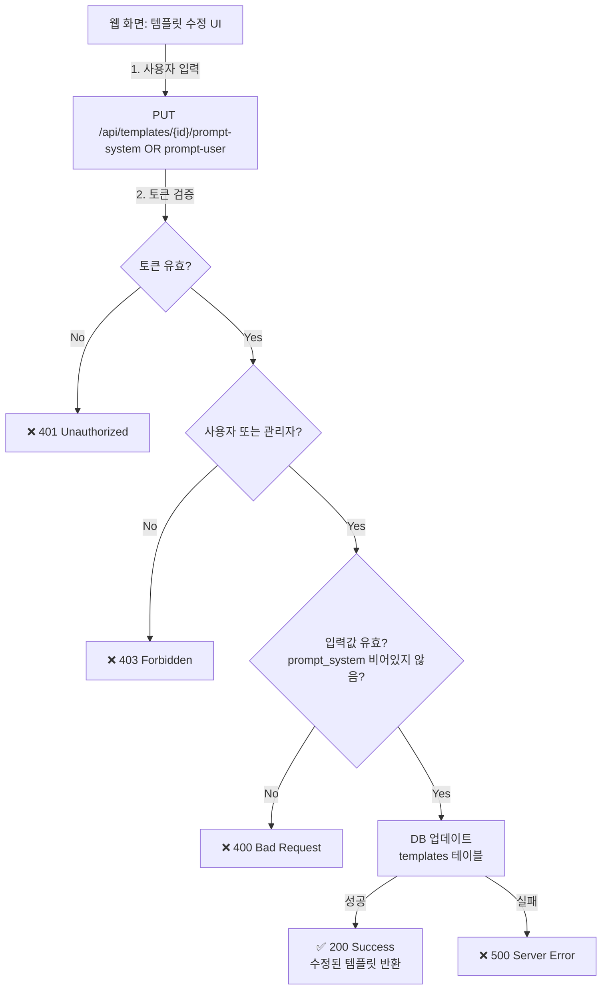
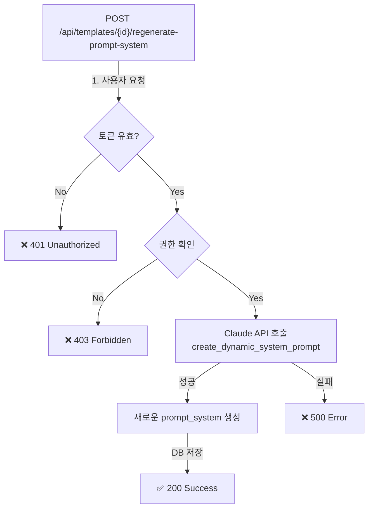

# Unit Spec: Template Prompt 수정 기능

**작성일**: 2025-11-11
**버전**: 1.0
**상태**: 승인 대기

---

## 📋 요구사항 요약

### Purpose
사용자가 웹 화면에서 자신의 템플릿에 포함된 `prompt_system`과 `prompt_user`를 수정할 수 있는 기능을 제공합니다.

### Type
신규 기능 (3개 API 엔드포인트)

### Core Requirements
1. `prompt_system` 수정 API: PUT /api/templates/{id}/prompt-system
2. `prompt_user` 수정 API: PUT /api/templates/{id}/prompt-user
3. `prompt_system` 재생성 API: POST /api/templates/{id}/regenerate-prompt-system
4. 권한 검증: 일반 사용자는 자신의 템플릿만, 관리자는 모든 템플릿 수정 가능
5. 제약사항: `prompt_system`은 빈 값 불가

---

## 📁 구현 대상 파일

| 파일 | 타입 | 설명 |
|------|------|------|
| `backend/app/routers/templates.py` | Change | 3개 새로운 API 엔드포인트 추가 |
| `backend/app/models/template.py` | Change | Request/Response 모델 추가 |
| `backend/app/database/template_db.py` | Change | `prompt_system`, `prompt_user` 업데이트 메서드 추가 |
| `backend/app/utils/prompts.py` | Reference | 동적 프롬프트 생성 로직 참조 |
| `backend/tests/test_templates.py` | Change | 신규 엔드포인트 테스트 추가 |

---

## 🔄 흐름도

### prompt_system 또는 prompt_user 수정 흐름



### prompt_system 재생성 흐름



---

## 🧪 테스트 계획

### Layer 1: 데이터베이스 레이어

| # | TC | Input | Expected |
|----|------|--------|----------|
| 1.1 | template_db.update_prompt_system() | valid template_id, new_prompt | DB 업데이트, 성공 |
| 1.2 | template_db.update_prompt_user() | valid template_id, new_prompt | DB 업데이트, 성공 |
| 1.3 | template_db.update_prompt_system() | 존재하지 않는 template_id | None 또는 에러 |

### Layer 2: API 레이어 - 권한 검증

| # | TC | User | Template Owner | Action | Expected |
|----|------|------|--------|--------|----------|
| 2.1 | 일반 사용자 자신 템플릿 수정 | user1 | user1 | PUT prompt-system | ✅ 200 Success |
| 2.2 | 일반 사용자 타인 템플릿 수정 | user1 | user2 | PUT prompt-system | ❌ 403 Forbidden |
| 2.3 | 관리자 타인 템플릿 수정 | admin | user1 | PUT prompt-system | ✅ 200 Success |
| 2.4 | 관리자 자신 템플릿 수정 | admin | admin | PUT prompt-system | ✅ 200 Success |

### Layer 3: 입력값 검증

| # | TC | Input | Expected |
|----|------|--------|----------|
| 3.1 | prompt_system 빈 값 | "" | ❌ 400 Bad Request |
| 3.2 | prompt_system 공백만 | "   " | ❌ 400 Bad Request |
| 3.3 | prompt_user 빈 값 | "" | ✅ 200 (선택사항) |
| 3.4 | prompt_system 유효한 값 | "새로운 프롬프트" | ✅ 200 Success |

### Layer 4: 재생성 기능

| # | TC | Scenario | Expected |
|----|------|----------|----------|
| 4.1 | prompt_system 재생성 | 유효한 template_id | ✅ Claude API 호출 후 업데이트 |
| 4.2 | prompt_system 재생성 실패 | Claude API 오류 | ❌ 500 Server Error |
| 4.3 | prompt_system 재생성 권한 부족 | 타인 템플릿 | ❌ 403 Forbidden |

---

## 📝 Request/Response 스키마

### 1. PUT /api/templates/{id}/prompt-system

**Request**:
```json
{
  "prompt_system": "새로운 시스템 프롬프트 텍스트"
}
```

**Response (Success - 200)**:
```json
{
  "success": true,
  "message": "System prompt updated successfully",
  "data": {
    "id": "template_uuid",
    "name": "Template Name",
    "prompt_system": "새로운 시스템 프롬프트",
    "prompt_user": "existing user prompt",
    "updated_at": "2025-11-11T10:30:00"
  }
}
```

**Response (Error - 400)**:
```json
{
  "success": false,
  "error_code": "TEMPLATE.INVALID_PROMPT",
  "message": "System prompt cannot be empty",
  "data": null
}
```

---

### 2. PUT /api/templates/{id}/prompt-user

**Request**:
```json
{
  "prompt_user": "새로운 사용자 프롬프트 텍스트"
}
```

**Response (Success - 200)**:
```json
{
  "success": true,
  "message": "User prompt updated successfully",
  "data": {
    "id": "template_uuid",
    "name": "Template Name",
    "prompt_system": "existing system prompt",
    "prompt_user": "새로운 사용자 프롬프트",
    "updated_at": "2025-11-11T10:30:00"
  }
}
```

---

### 3. POST /api/templates/{id}/regenerate-prompt-system

**Request**: Body 없음

**Response (Success - 200)**:
```json
{
  "success": true,
  "message": "System prompt regenerated successfully",
  "data": {
    "id": "template_uuid",
    "prompt_system": "Claude API로 생성된 새로운 프롬프트",
    "regenerated_at": "2025-11-11T10:35:00"
  }
}
```

---

## ⚠️ 에러 처리 시나리오

| HTTP Code | ErrorCode | 시나리오 | 메시지 |
|-----------|-----------|---------|--------|
| 400 | TEMPLATE.INVALID_PROMPT | prompt_system이 빈 값 | "System prompt cannot be empty" |
| 401 | AUTH.UNAUTHORIZED | 토큰 없음 | "Unauthorized" |
| 403 | TEMPLATE.FORBIDDEN | 권한 부족 (자신 템플릿 아님) | "Forbidden: Cannot modify other user's template" |
| 404 | TEMPLATE.NOT_FOUND | 템플릿 없음 | "Template not found" |
| 500 | TEMPLATE.GENERATION_FAILED | Claude API 호출 실패 | "Failed to regenerate system prompt" |

---

## 🔐 권한 검증 로직

```python
def check_template_edit_permission(user_id: str, user_is_admin: bool, template_owner_id: str) -> bool:
    """
    템플릿 수정 권한 검증

    Args:
        user_id: 현재 사용자 ID
        user_is_admin: 관리자 여부
        template_owner_id: 템플릿 소유자 ID

    Returns:
        True if user can edit, False otherwise
    """
    if user_is_admin:
        return True  # 관리자는 모든 템플릿 수정 가능
    if user_id == template_owner_id:
        return True  # 일반 사용자는 자신의 템플릿만 수정 가능
    return False  # 그 외 경우 권한 없음
```

---

## 📊 데이터베이스 변경사항

**templates 테이블** (기존 컬럼 사용, 추가 변경 없음):
- `prompt_system`: TEXT - 시스템 프롬프트 (업데이트 대상)
- `prompt_user`: TEXT - 사용자 프롬프트 (업데이트 대상)
- `updated_at`: DATETIME - 자동 업데이트 (기존 구현)

---

## ✅ 구현 검증 체크리스트

- [ ] 3개 API 엔드포인트 모두 구현
- [ ] 권한 검증 로직 적용 (일반 사용자 vs 관리자)
- [ ] prompt_system 빈 값 검증
- [ ] 모든 테스트 케이스 통과
- [ ] 에러 응답 표준화 (ErrorCode 사용)
- [ ] 로깅 추가
- [ ] DocString 작성 (Google 스타일)

---

**마지막 업데이트**: 2025-11-11
