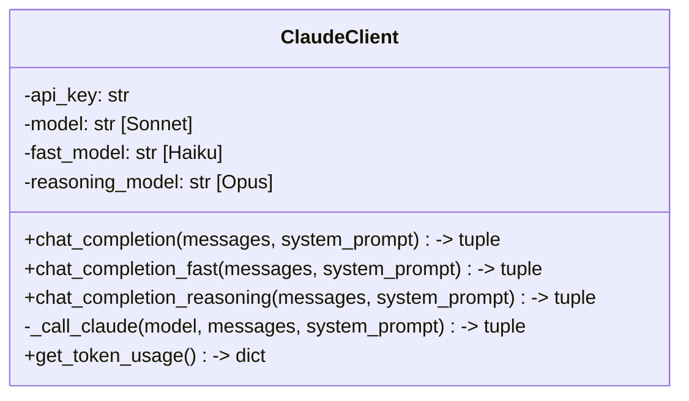

# Unit Spec: 빠른 응답을 위한 Claude API 모델 동적 선택

## 1. 요구사항 요약

- **목적:** API 요청 시 빠른 응답이 필요한 엔드포인트에서 더 가벼운 Claude 모델을 사용하여 응답 시간 단축
- **유형:** ☐ 신규 ☒ 개선
- **핵심 요구사항:**
  - **입력:** `.env` 파일에서 모델 버전 지정 (빠른 모델, 추론 모델)
  - **관리 위치:** `backend/app/utils/claude_client.py` 중앙 관리
  - **기본값:** Sonnet 4.5 (고품질)
  - **환경변수:** CLAUDE_FAST_MODEL, CLAUDE_REASONING_MODEL
  - **메서드:** chat_completion(), chat_completion_fast(), chat_completion_reasoning()

---

## 2. 구현 대상 파일

| 구분 | 경로 | 설명 |
|------|------|------|
| 변경 | `backend/app/utils/claude_client.py` | 세 가지 메서드 추가 |
| 변경 | `backend/shared/constants.py` | 모델 정의 상수 추가 |
| 참조 | `.env.example` | 환경변수 예시 추가 |

---

## 3. 모델 정의

### 3.1 지원하는 Claude 모델

| 모델명 | 모델 ID | 용도 | 응답시간 |
|--------|--------|------|---------|
| **Claude Sonnet 4.5** | `claude-sonnet-4-5-20250929` | 기본/보고서 생성 | 5-10초 |
| **Claude Haiku 4.5** | `claude-haiku-4-5-20251001` | 빠른 응답/개요/계획 | 1-3초 |
| **Claude Opus** | `claude-opus-4-1-20250805` | 복잡 추론 | 10-15초 |

### 3.2 환경변수 설정

```bash
# 기본 모델 (Sonnet 4.5)
CLAUDE_MODEL=claude-sonnet-4-5-20250929

# 빠른 응답용 모델 (Haiku 4.5)
CLAUDE_FAST_MODEL=claude-haiku-4-5-20251001

# 복잡 추론용 모델 (Opus)
CLAUDE_REASONING_MODEL=claude-opus-4-1-20250805
```

---

## 4. 동작 플로우

### 4.1 클래스 구조 (Mermaid)



### 4.2 실행 플로우

```
API 요청
  ├─ 기본 모델 (Sonnet) 필요
  │   └─ claude.chat_completion(messages)
  │       └─ self.model (CLAUDE_MODEL)
  │
  ├─ 빠른 응답 (Haiku) 필요
  │   └─ claude.chat_completion_fast(messages)
  │       └─ self.fast_model (CLAUDE_FAST_MODEL)
  │
  └─ 복잡 추론 (Opus) 필요
      └─ claude.chat_completion_reasoning(messages)
          └─ self.reasoning_model (CLAUDE_REASONING_MODEL)
```

---

## 5. 테스트 계획

### 5.1 테스트 항목

| TC ID | 계층 | 시나리오 | 목적 | 입력 | 기대결과 |
|-------|------|---------|------|------|---------|
| TC-INIT-001 | Unit | 초기화 (Sonnet) | 기본 모델 로드 | ClaudeClient() | self.model = CLAUDE_MODEL |
| TC-INIT-002 | Unit | 초기화 (Haiku) | 빠른 모델 로드 | ClaudeClient() | self.fast_model = CLAUDE_FAST_MODEL |
| TC-INIT-003 | Unit | 초기화 (Opus) | 추론 모델 로드 | ClaudeClient() | self.reasoning_model = CLAUDE_REASONING_MODEL |
| TC-METHOD-001 | Unit | chat_completion | Sonnet 호출 | chat_completion(messages) | 모델=Sonnet |
| TC-METHOD-002 | Unit | chat_completion_fast | Haiku 호출 | chat_completion_fast(messages) | 모델=Haiku |
| TC-METHOD-003 | Unit | chat_completion_reasoning | Opus 호출 | chat_completion_reasoning(messages) | 모델=Opus |
| TC-TOKEN-001 | Unit | 토큰 사용량 | 정상 기록 | API 응답 | get_token_usage() 정상 |
| TC-COMPAT-001 | Integration | 호환성 | Breaking change 없음 | 기존 호출 | 정상 동작 |

---

## 6. 코드 구현 가이드

### 6.1 Constants 정의

**backend/shared/constants.py**

```python
# Claude 모델 정의
class ClaudeConfig:
    MODEL = "claude-sonnet-4-5-20250929"
    FAST_MODEL = "claude-haiku-4-5-20251001"
    REASONING_MODEL = "claude-opus-4-1-20250805"
    MAX_TOKENS = 4096
```

### 6.2 ClaudeClient 수정

**backend/app/utils/claude_client.py**

```python
"""
Claude API 클라이언트
세 가지 메서드 지원:
- chat_completion(): 기본 모델 (Sonnet 4.5)
- chat_completion_fast(): 빠른 모델 (Haiku 4.5)
- chat_completion_reasoning(): 추론 모델 (Opus)
"""
import os
import logging
from typing import Dict
from anthropic import Anthropic

from shared.constants import ClaudeConfig
from app.utils.prompts import FINANCIAL_REPORT_SYSTEM_PROMPT

logger = logging.getLogger(__name__)

class ClaudeClient:
    """Claude API를 사용하여 보고서 내용을 생성하는 클라이언트"""

    def __init__(self):
        """Claude 클라이언트 초기화 - 세 가지 모델 로드"""
        self.api_key = os.getenv("CLAUDE_API_KEY")

        if not self.api_key:
            raise ValueError("CLAUDE_API_KEY 환경 변수가 설정되지 않았습니다.")

        # 기본 모델 (Sonnet)
        self.model = os.getenv("CLAUDE_MODEL", ClaudeConfig.MODEL)

        # 빠른 모델 (Haiku)
        self.fast_model = os.getenv("CLAUDE_FAST_MODEL", ClaudeConfig.FAST_MODEL)

        # 추론 모델 (Opus)
        self.reasoning_model = os.getenv(
            "CLAUDE_REASONING_MODEL",
            ClaudeConfig.REASONING_MODEL
        )

        self.max_tokens = ClaudeConfig.MAX_TOKENS
        self.client = Anthropic(api_key=self.api_key)

        # 토큰 사용량 추적
        self.last_input_tokens = 0
        self.last_output_tokens = 0
        self.last_total_tokens = 0

        logger.info(f"ClaudeClient 초기화 완료")
        logger.info(f"  - 기본 모델: {self.model}")
        logger.info(f"  - 빠른 모델: {self.fast_model}")
        logger.info(f"  - 추론 모델: {self.reasoning_model}")

    def chat_completion(
        self,
        messages: list[Dict[str, str]],
        system_prompt: str = None,
        isWebSearch: bool = False
    ) -> tuple[str, int, int]:
        """기본 모델(Sonnet)을 사용한 Chat completion

        Args:
            messages: 메시지 리스트
            system_prompt: 시스템 프롬프트
            isWebSearch: 웹 검색 활성화 여부

        Returns:
            (응답 텍스트, input_tokens, output_tokens)
        """
        return self._call_claude(
            model=self.model,
            messages=messages,
            system_prompt=system_prompt,
            isWebSearch=isWebSearch,
            model_name="Sonnet (기본)"
        )

    def chat_completion_fast(
        self,
        messages: list[Dict[str, str]],
        system_prompt: str = None,
        isWebSearch: bool = False
    ) -> tuple[str, int, int]:
        """빠른 모델(Haiku)을 사용한 Chat completion

        Args:
            messages: 메시지 리스트
            system_prompt: 시스템 프롬프트
            isWebSearch: 웹 검색 활성화 여부

        Returns:
            (응답 텍스트, input_tokens, output_tokens)
        """
        return self._call_claude(
            model=self.fast_model,
            messages=messages,
            system_prompt=system_prompt,
            isWebSearch=isWebSearch,
            model_name="Haiku (빠른)"
        )

    def chat_completion_reasoning(
        self,
        messages: list[Dict[str, str]],
        system_prompt: str = None,
        isWebSearch: bool = False
    ) -> tuple[str, int, int]:
        """추론 모델(Opus)을 사용한 Chat completion

        Args:
            messages: 메시지 리스트
            system_prompt: 시스템 프롬프트
            isWebSearch: 웹 검색 활성화 여부

        Returns:
            (응답 텍스트, input_tokens, output_tokens)
        """
        return self._call_claude(
            model=self.reasoning_model,
            messages=messages,
            system_prompt=system_prompt,
            isWebSearch=isWebSearch,
            model_name="Opus (추론)"
        )

    def _call_claude(
        self,
        model: str,
        messages: list[Dict[str, str]],
        system_prompt: str = None,
        isWebSearch: bool = False,
        model_name: str = "Unknown"
    ) -> tuple[str, int, int]:
        """공통 Claude API 호출 로직

        Args:
            model: 사용할 모델 ID
            messages: 메시지 리스트
            system_prompt: 시스템 프롬프트
            isWebSearch: 웹 검색 활성화
            model_name: 로깅용 모델명

        Returns:
            (응답 텍스트, input_tokens, output_tokens)
        """
        if system_prompt is None:
            system_prompt = FINANCIAL_REPORT_SYSTEM_PROMPT

        try:
            logger.info(f"Claude API 호출 - 모델: {model_name}, 메시지: {len(messages)}")

            # API call 파라미터
            api_params = {
                "model": model,
                "max_tokens": self.max_tokens,
                "system": system_prompt,
                "messages": messages
            }

            # 웹 검색 활성화 시
            if isWebSearch:
                api_params["tools"] = [{"type": "web_search_20250131"}]
                logger.info("웹 검색 도구 활성화")

            # API call
            response = self.client.messages.create(**api_params)

            # 응답 검증
            if not response.content:
                raise ValueError(f"Claude API 응답이 비어있습니다")

            text_content = None
            for content_block in response.content:
                if hasattr(content_block, 'text'):
                    text_content = content_block.text
                    break

            if not text_content:
                raise ValueError(f"Claude API에서 텍스트를 찾을 수 없습니다")

            # 토큰 저장
            input_tokens = response.usage.input_tokens
            output_tokens = response.usage.output_tokens

            self.last_input_tokens = input_tokens
            self.last_output_tokens = output_tokens
            self.last_total_tokens = input_tokens + output_tokens

            logger.info(f"응답 완료 - {model_name}, Input: {input_tokens}, Output: {output_tokens}")

            return text_content, input_tokens, output_tokens

        except Exception as e:
            logger.error(f"Claude API 오류 ({model_name}): {str(e)}")
            raise Exception(f"Claude API 오류 ({model_name}): {str(e)}")

    def get_token_usage(self) -> Dict[str, int]:
        """마지막 API 호출의 토큰 사용량 반환

        Returns:
            {'input_tokens': int, 'output_tokens': int, 'total_tokens': int}
        """
        return {
            "input_tokens": self.last_input_tokens,
            "output_tokens": self.last_output_tokens,
            "total_tokens": self.last_total_tokens
        }

    def generate_report(self, topic: str) -> str:
        """주제를 받아 금융 업무보고서를 생성합니다 (기본 Sonnet)

        Args:
            topic: 보고서 주제

        Returns:
            str: Markdown 형식의 보고서
        """
        user_message = f"다음 주제로 금융 업무보고서를 작성해주세요:\n\n{topic}"

        try:
            logger.info(f"보고서 생성 시작 - 주제: {topic}")

            message = self.client.messages.create(
                model=self.model,
                max_tokens=self.max_tokens,
                system=FINANCIAL_REPORT_SYSTEM_PROMPT,
                messages=[
                    {"role": "user", "content": user_message}
                ]
            )

            if not message.content:
                raise ValueError(f"Claude API 응답이 비어있습니다")

            text_content = None
            for content_block in message.content:
                if hasattr(content_block, 'text'):
                    text_content = content_block.text
                    break

            if not text_content:
                raise ValueError(f"Claude API에서 텍스트를 찾을 수 없습니다")

            # 토큰 저장
            self.last_input_tokens = message.usage.input_tokens
            self.last_output_tokens = message.usage.output_tokens
            self.last_total_tokens = self.last_input_tokens + self.last_output_tokens

            logger.info(f"보고서 생성 완료 - 길이: {len(text_content)}")

            return text_content

        except Exception as e:
            logger.error(f"보고서 생성 오류: {str(e)}")
            raise Exception(f"보고서 생성 오류: {str(e)}")
```

---

## 7. 환경변수 설정

**.env 파일**

```bash
# Claude API 키 (필수)
CLAUDE_API_KEY=sk-ant-xxxxx

# 기본 모델 (선택, 기본값: claude-sonnet-4-5-20250929)
CLAUDE_MODEL=claude-sonnet-4-5-20250929

# 빠른 모델 (선택, 기본값: claude-haiku-4-5-20251001)
CLAUDE_FAST_MODEL=claude-haiku-4-5-20251001

# 추론 모델 (선택, 기본값: claude-opus-4-1-20250805)
CLAUDE_REASONING_MODEL=claude-opus-4-1-20250805
```

**.env.example 업데이트**

```bash
# Claude API 설정
CLAUDE_API_KEY=your_api_key_here

# Claude 모델 선택 (기본값 사용 권장)
# - CLAUDE_MODEL: 기본/보고서 생성 (Sonnet 4.5)
# - CLAUDE_FAST_MODEL: 빠른 응답/개요/계획 (Haiku 4.5)
# - CLAUDE_REASONING_MODEL: 복잡 분석 (Opus)

# CLAUDE_MODEL=claude-sonnet-4-5-20250929
# CLAUDE_FAST_MODEL=claude-haiku-4-5-20251001
# CLAUDE_REASONING_MODEL=claude-opus-4-1-20250805
```

---

## 8. API 엔드포인트별 사용 모델

| 엔드포인트 | 메서드 | 모델 | 이유 |
|-----------|--------|------|------|
| `/api/topics/generate` | `chat_completion()` | Sonnet | 상세 보고서 |
| `/api/topics/{id}/ask` | `chat_completion()` | Sonnet | 컨텍스트 기반 응답 |
| `/api/topics/plan` | `chat_completion_fast()` | Haiku | 빠른 계획 생성 |

---

## 9. 사용자 요청 프롬프트

### 9.1 Original Request

```
기능을 수정 해줘.
요구사항:
1. claude api 관련 접속 기능은 @backend/app/utils/claude_client.py 에서 관리한다.
2. 기본값은 sonnet 으로 한다.
3. .env에 버전을 지정 할 수 있어야 된다 ( 빠른 모델, 추론모델 )
```

### 9.2 최종 명확화

- ✅ ClaudeClient.py 중앙 관리
- ✅ 기본 모델: Sonnet 4.5
- ✅ 세 가지 메서드:
  - `chat_completion()` → Sonnet (기본)
  - `chat_completion_fast()` → Haiku (빠른)
  - `chat_completion_reasoning()` → Opus (추론)
- ✅ 환경변수 지원:
  - CLAUDE_MODEL (기본)
  - CLAUDE_FAST_MODEL (빠른)
  - CLAUDE_REASONING_MODEL (추론)

---

## 10. 구현 체크리스트

### Step 1: 코드 작성

- [ ] `backend/shared/constants.py` 수정
- [ ] `backend/app/utils/claude_client.py` 수정
- [ ] `.env.example` 업데이트

### Step 2: 테스트 작성

- [ ] Unit 테스트 8개 (TC-INIT-001 ~ TC-COMPAT-001)
- [ ] 기존 테스트 호환성 확인

### Step 3: 검증

- [ ] 모든 테스트 통과
- [ ] 로깅 확인
- [ ] CLAUDE.md 업데이트

---

**요청 일시:** 2025-11-12
**상태:** ✅ Unit Spec 작성 완료
