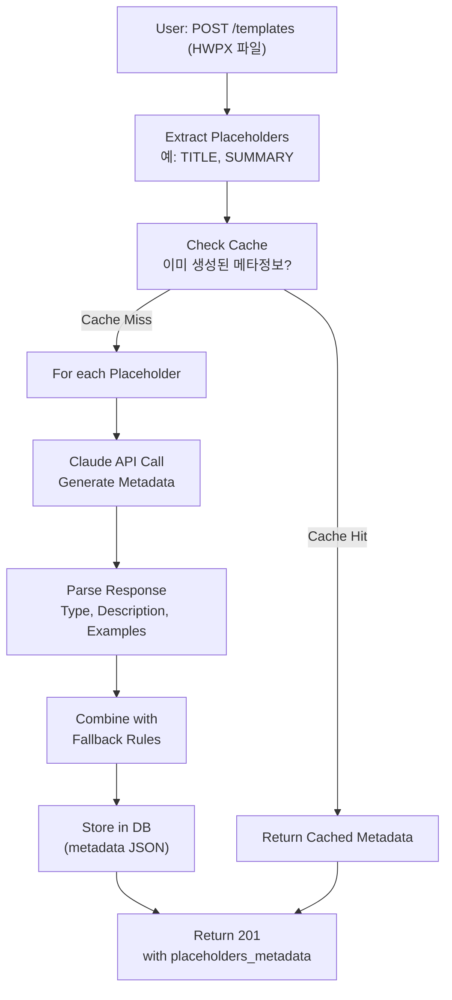

# Unit Spec: Claude API 기반 Placeholder 메타정보 고도화

## 1. 요구사항 요약

- **목적:** Template 업로드 시 각 Placeholder에 대한 상세 메타정보를 Claude API를 통해 자동 생성하여 정확성 및 설명의 질 향상
- **유형:** ☐ 신규 ☒ 변경 ☐ 삭제
- **핵심 요구사항:**
  - 입력: Template에서 추출된 Placeholder 목록 (예: {{TITLE}}, {{SUMMARY}}, {{CUSTOM_PLACEHOLDER}})
  - 출력: Claude가 생성한 상세 메타정보 (type, description, examples, max_length 등)
  - 예외/제약:
    - Claude API 응답시간: < 5초 (Template 업로드 시)
    - 폴백: Claude API 실패 시 기본 규칙 사용
    - 캐싱: 동일 Placeholder에 대한 중복 API 호출 방지
  - 처리흐름 요약:
    1. HWPX에서 Placeholder 추출
    2. 각 Placeholder에 대해 Claude API 호출
    3. Claude 응답 파싱 및 메타정보 생성
    4. DB에 저장 및 응답

---

## 2. 구현 대상 파일

| 구분 | 경로 | 설명 |
|------|------|------|
| **신규** | `backend/app/utils/placeholder_metadata_generator.py` | Claude API 기반 메타정보 생성 |
| **변경** | `backend/app/utils/meta_info_generator.py` | 기존 규칙 기반 생성 강화 |
| **변경** | `backend/app/routers/templates.py` | Template 업로드 시 Claude API 호출 통합 |
| **참조** | `backend/app/utils/claude_client.py` | Claude API 호출 |
| **참조** | `backend/app/models/placeholder.py` | PlaceholderMetadata 모델 |

---

## 3. 동작 플로우 (Mermaid)



---

## 4. Claude Prompt 설계

### 시스템 프롬프트
```
당신은 문서 템플릿 설계 전문가입니다.
주어진 Placeholder 이름을 분석하여 다음 정보를 JSON으로 제공하세요:
- type: section_title, section_content, field, meta 중 하나
- description: Placeholder의 용도와 작성 가이드 (2-3문장)
- examples: 2-3개의 실제 예시
- max_length: 권장 최대 길이 (없으면 null)
- min_length: 권장 최소 길이 (없으면 null)
- required: 필수 여부 (true/false)
```

### 사용자 프롬프트
```json
{
  "placeholder_key": "{{TITLE}}",
  "placeholder_name": "TITLE",
  "template_context": "금융 보고서 작성용 템플릿",
  "existing_placeholders": ["{{TITLE}}", "{{SUMMARY}}", "{{DATE}}"]
}
```

### 기대 응답
```json
{
  "type": "section_title",
  "description": "보고서의 명확하고 간결한 제목을 작성하세요. 주요 주제를 한 문장으로 표현해야 하며, 독자의 관심을 끌 수 있는 명확한 표현이 중요합니다.",
  "examples": [
    "2025년 디지털뱅킹 시장 트렌드 분석",
    "모바일 결제 확대에 따른 금융 환경 변화",
    "AI 기술 도입이 금융권에 미치는 영향"
  ],
  "max_length": 200,
  "min_length": 10,
  "required": true
}
```

---

## 5. 테스트 계획

### 5.1 원칙
- Claude API 호출 성공/실패 모두 처리
- 폴백 메커니즘 검증 (기본 규칙)
- 캐싱 효율성 검증
- 기존 기능과의 호환성 보장

### 5.2 테스트 케이스

| TC ID | 계층 | 시나리오 | 목적 | 기대결과 |
|-------|------|---------|------|---------|
| TC-001 | Unit | Claude API 성공 호출 | 메타정보 정확성 | JSON 파싱 성공, 필드 완전 |
| TC-002 | Unit | Claude API 실패 (timeout) | 폴백 작동 | 기본 규칙 적용, 경고 로깅 |
| TC-003 | Unit | 캐싱된 메타정보 조회 | 중복 호출 방지 | DB에서 즉시 반환, API 미호출 |
| TC-004 | Integration | Template 업로드 (1개 Placeholder) | E2E 플로우 | 201 응답, placeholders_metadata 포함 |
| TC-005 | Integration | Template 업로드 (10개 Placeholder) | 대량 처리 | 모든 Placeholder 메타정보 생성 |
| TC-006 | Integration | 이미 존재하는 Placeholder | 캐시 활용 | 새 API 호출 없음 |
| TC-007 | API | Template 업로드 성공 | API 계약 검증 | 201, 메타정보 JSON 정확 |
| TC-008 | API | Claude API 실패 | 우아한 실패 | 200/201, 기본 메타정보로 진행 |

---

## 6. 구현 상세

### 6.1 새로운 함수: `placeholder_metadata_generator.py`

```python
import asyncio
from typing import Dict, List, Optional
from app.utils.claude_client import ClaudeClient
from app.models.placeholder import PlaceholderMetadata
import json
import logging

logger = logging.getLogger(__name__)

async def generate_metadata_with_claude(
    placeholder_key: str,
    placeholder_name: str,
    template_context: str,
    existing_placeholders: List[str],
    timeout: float = 5.0
) -> Dict[str, any]:
    """
    Claude API를 사용하여 Placeholder의 상세 메타정보 생성

    Args:
        placeholder_key: Placeholder 키 (예: "{{TITLE}}")
        placeholder_name: Placeholder 이름 (예: "TITLE")
        template_context: 템플릿 컨텍스트 (예: "금융 보고서")
        existing_placeholders: 템플릿의 전체 Placeholder 목록
        timeout: API 호출 타임아웃 (초)

    Returns:
        {
            "type": "section_title" | "section_content" | "field" | "meta",
            "description": "...",
            "examples": ["...", "...", "..."],
            "max_length": 200,
            "min_length": 10,
            "required": true
        }

    Raises:
        asyncio.TimeoutError: 타임아웃 발생 시
        JSONDecodeError: 응답 파싱 실패 시
    """
    system_prompt = _build_system_prompt()
    user_prompt = _build_user_prompt(
        placeholder_key,
        placeholder_name,
        template_context,
        existing_placeholders
    )

    try:
        # Claude API 호출
        client = ClaudeClient()

        # 비동기 작업으로 타임아웃 설정
        metadata_json = await asyncio.wait_for(
            asyncio.to_thread(
                client.call_claude,
                system_prompt=system_prompt,
                user_prompt=user_prompt,
                max_tokens=500
            ),
            timeout=timeout
        )

        # JSON 파싱
        metadata = json.loads(metadata_json)
        logger.info(f"Generated metadata for {placeholder_key} via Claude API")
        return metadata

    except asyncio.TimeoutError:
        logger.warning(f"Claude API timeout for {placeholder_key}")
        raise

    except json.JSONDecodeError as e:
        logger.error(f"Failed to parse Claude response for {placeholder_key}: {e}")
        raise

    except Exception as e:
        logger.error(f"Claude API error for {placeholder_key}: {e}", exc_info=True)
        raise


def _build_system_prompt() -> str:
    """Claude 시스템 프롬프트 구성"""
    return """당신은 문서 템플릿 설계 전문가입니다.
주어진 Placeholder 이름을 분석하여 다음 정보를 JSON으로 제공하세요:

- type: "section_title", "section_content", "field", "meta" 중 하나
- description: Placeholder의 용도와 작성 가이드 (2-3문장)
- examples: 2-3개의 실제 예시 (배열)
- max_length: 권장 최대 길이 (없으면 null)
- min_length: 권장 최소 길이 (없으면 null)
- required: 필수 여부 (true/false)

응답은 반드시 유효한 JSON만 포함하세요."""


def _build_user_prompt(
    placeholder_key: str,
    placeholder_name: str,
    template_context: str,
    existing_placeholders: List[str]
) -> str:
    """Claude 사용자 프롬프트 구성"""
    return f"""다음 Placeholder에 대한 메타정보를 생성해주세요:

{{
  "placeholder_key": "{placeholder_key}",
  "placeholder_name": "{placeholder_name}",
  "template_context": "{template_context}",
  "existing_placeholders": {json.dumps(existing_placeholders)}
}}

JSON 형식으로 응답해주세요."""


async def batch_generate_metadata(
    placeholders: List[str],
    template_context: str,
    timeout_per_item: float = 5.0
) -> Dict[str, Dict]:
    """
    여러 Placeholder에 대해 병렬로 메타정보 생성

    Args:
        placeholders: Placeholder 키 목록
        template_context: 템플릿 컨텍스트
        timeout_per_item: 각 항목의 타임아웃

    Returns:
        {
            "{{TITLE}}": {...메타정보...},
            "{{SUMMARY}}": {...메타정보...},
            ...
        }
    """
    tasks = []

    for ph_key in placeholders:
        ph_name = ph_key.replace("{{", "").replace("}}", "")
        task = generate_metadata_with_claude(
            placeholder_key=ph_key,
            placeholder_name=ph_name,
            template_context=template_context,
            existing_placeholders=placeholders,
            timeout=timeout_per_item
        )
        tasks.append((ph_key, task))

    results = {}

    for ph_key, task in tasks:
        try:
            metadata = await task
            results[ph_key] = metadata
        except Exception as e:
            logger.warning(f"Failed to generate metadata for {ph_key}: {e}")
            results[ph_key] = None  # 실패한 항목은 None으로 표시

    return results
```

### 6.2 기존 함수 강화: `meta_info_generator.py`

```python
async def generate_placeholder_metadata_with_claude(
    raw_placeholders: List[str],
    template_context: str = "보고서"
) -> PlaceholdersMetadataCollection:
    """
    Claude API를 통해 Placeholder 메타정보 생성.
    실패 시 기본 규칙으로 폴백.

    Args:
        raw_placeholders: Placeholder 키 목록
        template_context: 템플릿 컨텍스트

    Returns:
        PlaceholdersMetadataCollection
    """
    from app.utils.placeholder_metadata_generator import batch_generate_metadata

    # Claude API로 메타정보 생성 시도
    try:
        claude_metadata = await batch_generate_metadata(
            placeholders=raw_placeholders,
            template_context=template_context,
            timeout_per_item=5.0
        )
    except Exception as e:
        logger.warning(f"Claude API failed, using default rules: {e}")
        claude_metadata = {}

    # 각 Placeholder에 대해 메타정보 생성 (Claude + 기본 규칙 혼합)
    metadatas: List[PlaceholderMetadata] = []
    required_count = 0
    optional_count = 0

    for position, ph_key in enumerate(raw_placeholders):
        ph_name = ph_key.replace("{{", "").replace("}}", "")

        # Claude 메타정보 조회
        claude_info = claude_metadata.get(ph_key)

        if claude_info:
            # Claude 응답 사용
            metadata = PlaceholderMetadata(
                name=ph_name,
                placeholder_key=ph_key,
                type=claude_info.get("type", "section_content"),
                description=claude_info.get("description", ""),
                example=claude_info.get("examples", [None])[0],
                max_length=claude_info.get("max_length"),
                min_length=claude_info.get("min_length"),
                required=claude_info.get("required", True),
                position=position
            )
        else:
            # 기본 규칙 사용
            metadata = _create_default_metadata(ph_name, ph_key, position)

        metadatas.append(metadata)

        if metadata.required:
            required_count += 1
        else:
            optional_count += 1

    return PlaceholdersMetadataCollection(
        placeholders=metadatas,
        total_count=len(raw_placeholders),
        required_count=required_count,
        optional_count=optional_count
    )
```

### 6.3 Template 업로드 수정

```python
@router.post("", summary="Upload template")
async def upload_template(
    file: UploadFile = File(...),
    title: str = Form(...),
    current_user: User = Depends(get_current_active_user)
):
    """Template 업로드 - Claude API 기반 메타정보 생성"""

    try:
        # 1. 파일 검증 및 Placeholder 추출
        placeholders = extract_placeholders(file)

        # 2. Claude API로 메타정보 생성 (async)
        logger.info(f"[UPLOAD] Generating metadata with Claude - count={len(placeholders)}")
        metadata_collection = await generate_placeholder_metadata_with_claude(
            raw_placeholders=placeholders,
            template_context=title
        )
        logger.info(f"[UPLOAD] Metadata generated - count={len(metadata_collection.placeholders)}")

        # 3. Template 저장
        template = TemplateDB.create_template(...)

        # 4. Placeholders 저장
        metadata_json = metadata_collection.to_json()
        for placeholder in metadata_collection.placeholders:
            PlaceholderDB.create_placeholder(
                template_id=template.id,
                placeholder_key=placeholder.placeholder_key,
                metadata=placeholder.model_dump()
            )

        return success_response({
            "template_id": template.id,
            "placeholders_metadata": [p.model_dump() for p in metadata_collection.placeholders]
        }, status_code=201)

    except Exception as e:
        logger.error(f"[UPLOAD] Error: {e}", exc_info=True)
        return error_response(...)
```

---

## 7. 캐싱 전략

```python
# 동일 Placeholder에 대한 메타정보 캐싱
# (같은 이름의 Placeholder는 항상 같은 메타정보를 가짐)

placeholder_metadata_cache = {}  # {"{{TITLE}}": {...}, ...}

async def get_or_generate_metadata(ph_key: str, template_context: str):
    """캐시 우선 조회, 없으면 생성"""
    if ph_key in placeholder_metadata_cache:
        return placeholder_metadata_cache[ph_key]

    metadata = await generate_metadata_with_claude(...)
    placeholder_metadata_cache[ph_key] = metadata
    return metadata
```

---

## 8. 에러 처리 및 폴백

```python
# 우아한 실패 (Graceful Fallback)

1. Claude API 타임아웃 → 기본 규칙 사용, 경고 로깅
2. JSON 파싱 실패 → 기본 규칙 사용, 에러 로깅
3. 네트워크 에러 → 기본 규칙 사용, 에러 로깅

result = {
    "source": "claude" | "default",  # 메타정보 출처
    "metadata": {...},
    "warning": "Claude API failed, using default rules" | None
}
```

---

## 9. 구현 체크리스트

### Phase 1: 새로운 모듈 구현
- [ ] `placeholder_metadata_generator.py` 작성
  - [ ] `generate_metadata_with_claude()` 함수
  - [ ] `batch_generate_metadata()` 함수
  - [ ] Claude 프롬프트 설계

### Phase 2: 기존 모듈 강화
- [ ] `meta_info_generator.py` 수정
  - [ ] `generate_placeholder_metadata_with_claude()` 함수 추가
  - [ ] Claude + 기본 규칙 혼합 로직

### Phase 3: 라우터 통합
- [ ] `routers/templates.py` 수정
  - [ ] POST `/templates` 엔드포인트에 Claude API 호출 통합
  - [ ] 에러 처리 및 로깅

### Phase 4: 테스트 작성
- [ ] Unit tests (Claude API 호출, 파싱)
- [ ] Integration tests (Template 업로드)
- [ ] Mock Claude API 응답

### Phase 5: 검증
- [ ] 모든 테스트 통과
- [ ] 기존 기능 회귀 없음
- [ ] 응답시간 < 5초 검증

---

## 10. 응답시간 제약

| 항목 | 제약 | 설명 |
|------|------|------|
| 단일 Claude API 호출 | < 5초 | Timeout 설정 |
| 10개 Placeholder 처리 | < 30초 | 병렬 처리 (asyncio) |
| Template 업로드 전체 | < 60초 | 포함: 파일 검증, API, DB 저장 |

---

**마지막 업데이트:** 2025-11-12
**상태:** Unit Spec 작성 완료, 사용자 승인 대기
