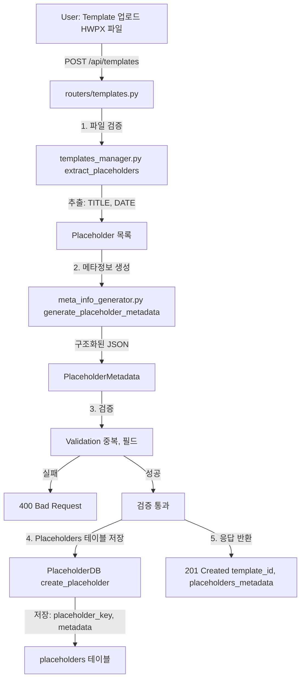

# Unit Spec: Placeholder 메타정보 JSON 구조화

## 1. 요구사항 요약

- **목적**: Template 업로드 시 HWPX에서 추출된 Placeholder 정보를 JSON 구조화하여 메타정보 활용성 극대화 및 검증 강화
- **유형**: ☑️ 신규 (개선)
- **핵심 요구사항**:
  - **입력**: Template 업로드 시 HWPX 파일에서 자동 추출된 Placeholder ({{TITLE}}, {{DATE}} 등)
  - **출력**: Placeholders 테이블에 저장된 구조화된 JSON 메타정보 (각 Placeholder당 타입, 필수여부, 길이제한, 설명 등)
  - **예외/제약**:
    - `template.prompt_user`: **사용자가 직접 입력하는 필드** (Placeholder와 무관)
    - Placeholder 검색: **Placeholders 테이블에서 조회** (template_id 기준)
    - `placeholders_metadata`: Placeholders 테이블의 메타정보를 JSON으로 집계 (응답용)
    - 검증 강화: 중복, 잘못된 형식 감지 및 오류 반환
  - **처리흐름 요약**: Template 업로드 → HWPX에서 Placeholder 추출 → 메타정보 JSON 생성 → Placeholders 테이블 저장 → 검증 → 응답

---

## 2. 구현 대상 파일

| 구분 | 경로 | 설명 |
|------|------|------|
| **신규** | `backend/app/models/placeholder.py` | PlaceholderMetadata Pydantic 모델 |
| **변경** | `backend/app/utils/meta_info_generator.py` | Placeholder 메타정보 생성 로직 강화 |
| **변경** | `backend/app/routers/templates.py` | Template 업로드 시 Placeholders 테이블에 메타정보 저장 |
| **변경** | `backend/app/database/placeholder_db.py` | Placeholder CRUD (메타정보 JSON 저장) |
| **참조** | `backend/app/utils/prompts.py` | Placeholders 테이블 조회하여 System Prompt 생성 |
| **참조** | `backend/app/models/template.py` | `placeholders_metadata` 응답 필드 (읽기용) |

---

## 3. 동작 플로우 (Mermaid)



---

## 4. 테스트 계획

### 4.1 원칙

- **계층별 커버리지**: Unit → Integration → API 순서로
- **데이터 검증**: 각 필드의 타입, 범위, 필수 여부 검증
- **호환성**: 기존 `prompt_user` 문자열 형식도 함께 테스트
- **엣지 케이스**: 중복, 빈 값, 특수문자 등

### 4.2 구현 예상 테스트 항목

| TC ID | 계층 | 시나리오 | 목적 | 입력/사전조건 | 기대결과 |
|-------|------|---------|------|--------------|---------|
| **TC-API-001** | API | 정상 Template 업로드 | API 계약/응답 스키마 | HWPX 파일 + 4개 Placeholder | 201, placeholders_metadata JSON 포함 |
| **TC-API-002** | API | 중복 Placeholder 업로드 | 오류 감지 및 검증 | 같은 Placeholder 2회 포함 HWPX | 400, 중복 오류 메시지 |
| **TC-API-003** | API | 빈 Placeholder 문자열 | 에지 케이스 | Placeholder 목록 empty | 400 또는 201 (요구사항 확인) |
| **TC-UNIT-004** | Unit | PlaceholderMetadata 모델 생성 | Pydantic 모델 검증 | name="TITLE", type="section_title", required=True | PlaceholderMetadata 객체 생성 성공 |
| **TC-UNIT-005** | Unit | 메타정보 생성 함수 | 파서 로직 | raw_placeholders=["{{TITLE}}", "{{SUMMARY}}"] | List[PlaceholderMetadata] 반환 |
| **TC-UNIT-006** | Unit | Placeholder 검증 | 중복/필수필드 체크 | placeholders=["{{TITLE}}", "{{TITLE}}", "{{INVALID}}"] | ValidationError 반발 |
| **TC-INTG-007** | Integration | Template 저장 → 메타정보 조회 | E2E 흐름 | Template 업로드 → GET /templates/{id} | placeholders_metadata JSON 정확히 반환 |
| **TC-INTG-008** | Integration | 메타정보 → System Prompt 생성 | 메타정보 활용 | placeholders_metadata + template_id | dynamic System Prompt에 메타정보 반영 |

### 4.3 샘플 테스트 코드

```python
# tests/test_placeholder_metadata.py

import pytest
from app.models.placeholder import PlaceholderMetadata, PlaceholdersMetadataCollection
from app.utils.meta_info_generator import generate_placeholder_metadata
from app.routers.templates import upload_template

class TestPlaceholderMetadata:
    """Placeholder 메타정보 JSON 구조화 테스트"""

    def test_placeholder_metadata_model_creation(self):
        """PlaceholderMetadata Pydantic 모델 생성"""
        metadata = PlaceholderMetadata(
            name="TITLE",
            placeholder_key="{{TITLE}}",
            type="section_title",
            required=True,
            max_length=200,
            description="보고서 제목",
            position=0
        )
        assert metadata.name == "TITLE"
        assert metadata.required is True
        assert metadata.position == 0

    def test_generate_placeholder_metadata(self):
        """메타정보 생성 함수 테스트"""
        raw_placeholders = ["{{TITLE}}", "{{SUMMARY}}", "{{DATE}}"]
        result = generate_placeholder_metadata(raw_placeholders)

        assert len(result) == 3
        assert result[0].placeholder_key == "{{TITLE}}"
        assert result[0].type == "section_title"
        assert result[2].placeholder_key == "{{DATE}}"

    def test_duplicate_placeholder_detection(self):
        """중복 Placeholder 감지"""
        raw_placeholders = ["{{TITLE}}", "{{TITLE}}", "{{SUMMARY}}"]

        with pytest.raises(ValueError, match="중복된 Placeholder"):
            generate_placeholder_metadata(raw_placeholders)

    def test_template_upload_with_metadata(self, client, auth_headers):
        """Template 업로드 시 메타정보 JSON 포함"""
        with open("tests/fixtures/template.hwpx", "rb") as f:
            response = client.post(
                "/api/templates",
                files={"file": f},
                data={"title": "테스트 템플릿"},
                headers=auth_headers
            )

        assert response.status_code == 201
        data = response.json()["data"]

        # 메타정보 JSON 포함 확인
        assert "placeholders_metadata" in data
        assert isinstance(data["placeholders_metadata"], list)
        assert len(data["placeholders_metadata"]) >= 1
        assert "name" in data["placeholders_metadata"][0]
        assert "type" in data["placeholders_metadata"][0]

    def test_metadata_validation_error(self, client, auth_headers):
        """검증 실패 시 400 반환"""
        # 중복 Placeholder 포함 HWPX 파일 사용
        with open("tests/fixtures/duplicate_placeholder_template.hwpx", "rb") as f:
            response = client.post(
                "/api/templates",
                files={"file": f},
                data={"title": "잘못된 템플릿"},
                headers=auth_headers
            )

        assert response.status_code == 400
        assert "중복" in response.json()["message"]
```

---

## 5. PlaceholderMetadata 모델 정의

### Pydantic 모델 구조

```python
# backend/app/models/placeholder.py

from pydantic import BaseModel, Field
from typing import Optional, List

class PlaceholderMetadata(BaseModel):
    """개별 Placeholder의 메타정보"""

    # 필수 필드
    name: str = Field(
        ...,
        min_length=1,
        max_length=50,
        description="Placeholder 이름 (예: TITLE, SUMMARY)"
    )
    placeholder_key: str = Field(
        ...,
        pattern=r"^\{\{[A-Z_]+\}\}$",
        description="Placeholder 키 (예: {{TITLE}})"
    )
    type: str = Field(
        ...,
        regex="^(section_title|section_content|field|table|meta)$",
        description="Placeholder 타입"
    )
    required: bool = Field(
        default=True,
        description="필수 여부"
    )
    position: int = Field(
        default=0,
        ge=0,
        description="순서 위치"
    )

    # 선택 필드 (타입별로 다름)
    max_length: Optional[int] = Field(
        default=None,
        ge=1,
        description="최대 문자 길이"
    )
    min_length: Optional[int] = Field(
        default=None,
        ge=0,
        description="최소 문자 길이"
    )
    description: Optional[str] = Field(
        default=None,
        max_length=500,
        description="Placeholder 설명"
    )
    example: Optional[str] = Field(
        default=None,
        description="예시 값"
    )
    allowed_values: Optional[List[str]] = Field(
        default=None,
        description="허용된 값 목록 (enum)"
    )

    class Config:
        json_schema_extra = {
            "example": {
                "name": "TITLE",
                "placeholder_key": "{{TITLE}}",
                "type": "section_title",
                "required": True,
                "position": 0,
                "max_length": 200,
                "description": "보고서 제목"
            }
        }


class PlaceholdersMetadataCollection(BaseModel):
    """Template의 모든 Placeholder 메타정보"""

    placeholders: List[PlaceholderMetadata]
    total_count: int
    required_count: int
    optional_count: int

    def to_json(self) -> str:
        """JSON 문자열로 직렬화"""
        return self.model_dump_json()

    @classmethod
    def from_json(cls, json_str: str) -> "PlaceholdersMetadataCollection":
        """JSON 문자열에서 복원"""
        return cls.model_validate_json(json_str)
```

### 저장 형식 (DB)

```json
{
  "placeholders": [
    {
      "name": "TITLE",
      "placeholder_key": "{{TITLE}}",
      "type": "section_title",
      "required": true,
      "position": 0,
      "max_length": 200,
      "description": "보고서 제목"
    },
    {
      "name": "SUMMARY",
      "placeholder_key": "{{SUMMARY}}",
      "type": "section_content",
      "required": true,
      "position": 1,
      "min_length": 100,
      "max_length": 1000,
      "description": "보고서 요약"
    },
    {
      "name": "DATE",
      "placeholder_key": "{{DATE}}",
      "type": "meta",
      "required": false,
      "position": 5,
      "example": "2025-11-12"
    }
  ],
  "total_count": 3,
  "required_count": 2,
  "optional_count": 1
}
```

---

## 6. 에러 처리 시나리오

### 6.1 Placeholder 검증 오류

```python
# 오류 코드: TEMPLATE.PLACEHOLDER_VALIDATION_ERROR

{
  "success": false,
  "error": {
    "code": "TEMPLATE.PLACEHOLDER_VALIDATION_ERROR",
    "message": "Template Placeholder 검증 실패",
    "details": {
      "type": "duplicate_placeholder",
      "placeholder_key": "{{TITLE}}",
      "error_message": "{{TITLE}}이(가) 2번 이상 중복되었습니다."
    }
  }
}
```

### 6.2 메타정보 생성 실패

```python
# 오류 코드: TEMPLATE.METADATA_GENERATION_FAILED

{
  "success": false,
  "error": {
    "code": "TEMPLATE.METADATA_GENERATION_FAILED",
    "message": "Placeholder 메타정보 생성 실패",
    "details": {
      "raw_placeholders": ["{{TITLE}}", "{{UNKNOWN_TYPE}}"],
      "error_message": "{{UNKNOWN_TYPE}}의 타입을 결정할 수 없습니다."
    }
  }
}
```

---

## 7. 마이그레이션 전략 (기존 데이터)

### Phase 1: 신규 저장 (선택)
- `placeholders_metadata` 컬럼 추가 (nullable)
- 새 Template부터 메타정보 JSON 저장

### Phase 2: 기존 데이터 마이그레이션 (선택)
```python
# 마이그레이션 스크립트
def migrate_existing_templates():
    """기존 Template의 prompt_user → placeholders_metadata 변환"""
    templates = TemplateDB.get_all_templates()

    for template in templates:
        if template.prompt_user and not template.placeholders_metadata:
            # prompt_user: "TITLE, SUMMARY, DATE" → JSON
            names = [n.strip() for n in template.prompt_user.split(",")]
            metadata = generate_placeholder_metadata_from_names(names)
            TemplateDB.update_metadata(template.id, metadata)
```

---

## 8. 사용자 요청 프롬프트

### Original User Request (1차)

```
현재 Template 업로드 시 Placeholder 정보가 단순 쉼표 구분 문자열로 저장되고 있습니다:
template.prompt_user = "TITLE, SUMMARY, BACKGROUND, MAIN_CONTENT, CONCLUSION"

이를 JSON 구조화하여:
1. 각 Placeholder의 메타정보 (타입, 필수여부, 길이제한 등) 포함
2. Placeholder 검증 강화 (중복, 형식)
3. System Prompt 생성 시 메타정보 활용 가능하도록 개선
```

### 최종 명확화 (통합)

- ✅ PlaceholderMetadata Pydantic 모델 생성
- ✅ 메타정보 JSON 저장 (DB)
- ✅ Placeholder 검증 강화 (중복, 필수필드)
- ✅ API 응답에 메타정보 포함
- ✅ 기존 `prompt_user` 문자열 형식 호환성 유지
- ✅ Unit + Integration 테스트 포함
- ✅ 마이그레이션 전략 제시

---

## 9. 구현 체크리스트

### Step 0: 설계 (1시간)
- [ ] PlaceholderMetadata 모델 설계
- [ ] DB 스키마 변경 계획 (ALTER TABLE)
- [ ] 마이그레이션 전략 확정

### Step 1: 모델 정의 (1시간)
- [ ] `backend/app/models/placeholder.py` 생성
- [ ] PlaceholderMetadata, PlaceholdersMetadataCollection 구현
- [ ] 단위 테스트 (Pydantic 모델)

### Step 2: 메타정보 생성 로직 (2시간)
- [ ] `meta_info_generator.py` 강화
- [ ] `generate_placeholder_metadata()` 함수 구현
- [ ] Placeholder 타입 자동 감지 로직
- [ ] 검증 함수 구현 (중복, 필수필드)

### Step 3: Template 업로드 수정 (1.5시간)
- [ ] `routers/templates.py` 수정
- [ ] 메타정보 생성 + 검증 통합
- [ ] API 응답에 메타정보 포함

### Step 4: DB 수정 (1시간)
- [ ] `template_db.py` 수정
- [ ] `placeholders_metadata` 컬럼 추가
- [ ] Template 저장 시 메타정보 JSON 저장

### Step 5: 테스트 (2시간)
- [ ] Unit 테스트 (모델, 함수)
- [ ] API 테스트
- [ ] Integration 테스트
- [ ] 호환성 테스트 (기존 prompt_user)

### Step 6: 검증 및 커밋 (1시간)
- [ ] 전체 테스트 통과
- [ ] 문서 업데이트
- [ ] Git 커밋

**총 소요시간: 8-9시간 (1일)**

---

## 10. 성공 기준

✅ **기술적 성공 기준**
- [ ] 모든 TC 통과 (8/8)
- [ ] 기존 테스트 회귀 없음
- [ ] 코드 커버리지 80% 이상

✅ **함수형 성공 기준**
- [ ] Template 업로드 시 placeholders_metadata JSON 저장
- [ ] API 응답에 메타정보 포함
- [ ] Placeholder 중복 감지 및 오류 반환
- [ ] 기존 prompt_user 호환성 유지

✅ **비즈니스 성공 기준**
- [ ] Placeholder 관리 자동화 (수동 작업 감소)
- [ ] 검증 강화 (데이터 품질 향상)
- [ ] 확장성 개선 (향후 System Prompt 최적화)

---

**요청 일시**: 2025-11-12

**컨텍스트/배경**:
- Phase 1-3 완료 (130 TC 통과)
- Placeholder 메타정보 형식 개선이 Priority 1
- 기존 System Prompt 생성 로직과 통합 필요
- DB 스키마는 유연하게 (마이그레이션 선택사항)
