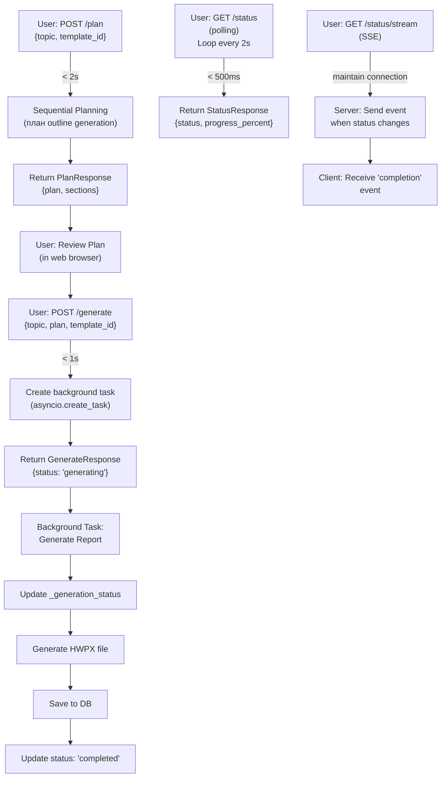

# Unit Spec: Sequential Planning with Real-time Progress Tracking (SSE)

## 1. 요구사항 요약

- **목적:** Sequential MCP를 활용한 체계적 보고서 생성 계획 수립 및 실시간 진행 상황 추적
- **유형:** ☐ 신규 ☒ 변경 ☒ 삭제 (기존 /generate 수정, /plan 신규, /status 신규, /status/stream 신규)
- **핵심 요구사항:**
  - 입력: topic, user_id, template_id (선택), approval_plan (generate 시)
  - 출력: plan (POST /plan), generated_report + hwpx (POST /generate), status JSON (GET /status), SSE stream (GET /status/stream)
  - 예외/제약:
    - POST /plan 응답시간: **반드시 2초 이내**
    - POST /generate 응답시간: 1초 이내 (실제 생성은 백그라운드, 시간 제한 없음)
    - GET /status 응답시간: < 500ms (JSON 폴링)
    - GET /status/stream: SSE 스트림 (연결 유지)
  - 처리흐름 요약:
    1. POST /plan: Sequential Planning으로 보고서 구조 생성 (빠름, 2초 이내)
    2. 사용자 승인/수정
    3. POST /generate: 백그라운드 task로 실제 보고서 생성 (빠른 응답, 백그라운드 진행)
    4. 실시간 진행 상황 추적: GET /status (폴링) + GET /status/stream (SSE 완료 알림)

---

## 2. 구현 대상 파일

| 구분 | 경로                                      | 설명                                  |
| ---- | ----------------------------------------- | ------------------------------------- |
| 신규 | backend/app/utils/sequential_planning.py  | Sequential Planning 로직 구현         |
| 신규 | backend/app/utils/generation_status.py    | 메모리 기반 생성 상태 관리            |
| 신규 | backend/app/routers/topics.py (endpoint) | POST /plan, POST /generate, GET /status, GET /status/stream |
| 변경 | backend/app/models/topic.py               | PlanRequest, PlanResponse 모델 추가   |
| 참조 | backend/app/models/template.py            | Template 모델의 prompt_system 필드    |
| 참조 | backend/app/clients/claude_client.py      | Claude API 호출 기능                  |

---

## 3. 동작 플로우 (Mermaid)



---

## 4. 테스트 계획

### 4.1 원칙

- **테스트 우선(TDD)**: 본 섹션의 항목을 우선 구현하고 코드 작성.
- **계층별 커버리지**: Unit → Integration → API(E2E-lite) 순서로 최소 P0 커버.
- **독립성/재현성**: 외부 연동(LLM/DB/File I/O)은 모킹 또는 임베디드 스토리지 사용.
- **판정 기준**: 기대 상태코드/스키마/부작용(저장/로그)을 명시적으로 검증.

### 4.2 구현 예상 테스트 항목

| TC ID | 계층 | 시나리오 | 목적 | 입력/사전조건 | 기대결과 |
|-------|------|---------|------|--------------|---------|
| TC-PLAN-001 | API | /plan 성공 | 계획 생성 응답 검증 | `POST /plan {topic: "AI", template_id: 1}` | `200`, `plan` 필드 존재, 응답시간 < 2s |
| TC-PLAN-002 | API | /plan 토픽 누락 | 입력 검증 | `POST /plan {}` | `400`, 에러코드 `VALIDATION_ERROR` |
| TC-PLAN-003 | Unit | Sequential Planning | 계획 구조 검증 | template.prompt_system, input_prompt | 반환 plan에 sections[] 배열 포함 |
| TC-GEN-001 | API | /generate 성공 | 백그라운드 생성 트리거 검증 | `POST /generate {topic_id: 1, plan, template_id: 1}` | `202`, `{status: "generating"}`, 응답시간 < 1s |
| TC-GEN-002 | API | /generate 중복 요청 | 중복 생성 방지 | 이미 generating 중인 topic_id로 재요청 | `409`, 에러코드 `CONFLICT` |
| TC-GEN-003 | Integration | 백그라운드 생성 완료 | 상태 업데이트 검증 | /generate 호출 후 백그라운드 완료 대기 | `_generation_status[topic_id].status == "completed"` |
| TC-STATUS-001 | API | GET /status 폴링 | 현재 진행 상태 조회 | `GET /topics/{id}/status` (generating 중) | `200`, `{status: "generating", progress_percent: 50}` |
| TC-STATUS-002 | API | GET /status 완료 상태 | 완료 상태 조회 | `GET /topics/{id}/status` (generating 완료) | `200`, `{status: "completed", progress_percent: 100}` |
| TC-STATUS-003 | API | GET /status 비존재 | 존재하지 않는 topic_id | `GET /topics/9999/status` | `404` |
| TC-STREAM-001 | API | SSE 연결 및 완료 알림 | 서버 push 검증 | `GET /topics/{id}/status/stream` 후 generate 완료 | SSE 연결 유지, "completion" 이벤트 수신 |
| TC-STREAM-002 | API | SSE 타임아웃 | 장시간 연결 | SSE 연결 60초 유지 후 disconnected | 연결 정상 종료, 재연결 가능 |
| TC-STREAM-003 | API | SSE 중복 연결 | 동일 topic_id로 다중 SSE 연결 | 2개 이상의 `/status/stream` 요청 | 모든 연결이 completion 이벤트 수신 |
| TC-INTEG-001 | Integration | 전체 워크플로우 | plan → approve → generate → status → stream | /plan → /generate → /status (polling) → /status/stream | 각 단계가 예상대로 진행되고 최종 완료 |
| TC-PERF-001 | Performance | /plan 응답시간 | 2초 이내 제약 검증 | Sequential Planning 실행 | 응답시간 <= 2.0 초 |

### 4.3 샘플 테스트 코드

테스트 작성가이드 `backend/BACKEND_TEST.md`

---

## 5. API 상세 정의

### 5.1 POST /api/topics/plan - 보고서 계획 수립

**요청:**
```json
{
  "topic": "string (필수, 최대 200자)",
  "template_id": "integer (선택, null이면 default template 사용)",
  "user_id": "string (필수, context에서 추출)"
}
```

**응답 (200 OK):**
```json
{
  "success": true,
  "data": {
    "topic_id": 1,
    "plan": "# 보고서 계획\n## 개요\n...",
    "sections": [
      {
        "title": "개요",
        "description": "보고서의 전체 개요",
        "order": 1
      },
      {
        "title": "시장 분석",
        "description": "시장 현황 분석",
        "order": 2
      }
    ],
    "estimated_sections_count": 5
  }
}
```

**에러 (400, 429):**
```json
{
  "success": false,
  "error": {
    "code": "VALIDATION_ERROR",
    "message": "topic is required"
  }
}
```

**제약:**
- 응답시간: **반드시 2초 이내**
- Rate limiting: 사용자당 분당 10회 이상 요청 시 429 Throttled

---

### 5.2 POST /api/topics/generate - 보고서 생성 시작

**요청:**
```json
{
  "topic": "string (필수)",
  "plan": "string (필수, /plan에서 반환된 plan)",
  "template_id": "integer (선택)",
  "user_id": "string (필수)"
}
```

**응답 (202 Accepted):**
```json
{
  "success": true,
  "data": {
    "topic_id": 1,
    "status": "generating",
    "message": "Report generation started in background",
    "status_check_url": "/api/topics/1/status"
  }
}
```

**에러 (409 Conflict - 중복 생성):**
```json
{
  "success": false,
  "error": {
    "code": "CONFLICT",
    "message": "Generation already in progress for this topic"
  }
}
```

**제약:**
- 응답시간: 1초 이내
- 동시 생성 방지: 동일 topic_id에 대해 상태가 "generating"이면 새로운 요청 거부
- 실제 생성: asyncio.create_task()로 백그라운드 처리

---

### 5.3 GET /api/topics/{id}/status - 현재 진행 상태 조회 (폴링)

**요청:**
```
GET /api/topics/{id}/status
```

**응답 (200 OK) - Generating 중:**
```json
{
  "success": true,
  "data": {
    "topic_id": 1,
    "status": "generating",
    "progress_percent": 45,
    "current_step": "Generating main content...",
    "started_at": "2025-11-12T10:30:00Z",
    "estimated_completion": "2025-11-12T10:45:30Z"
  }
}
```

**응답 (200 OK) - 완료:**
```json
{
  "success": true,
  "data": {
    "topic_id": 1,
    "status": "completed",
    "progress_percent": 100,
    "artifact_id": 123,
    "completed_at": "2025-11-12T10:45:20Z"
  }
}
```

**에러 (404 Not Found):**
```json
{
  "success": false,
  "error": {
    "code": "NOT_FOUND",
    "message": "No generation status found for topic_id 999"
  }
}
```

**제약:**
- 응답시간: < 500ms (메모리 조회)
- 폴링 간격: 클라이언트는 2-3초 간격 권장
- 상태 값: "generating", "completed", "failed"

---

### 5.4 GET /api/topics/{id}/status/stream - 실시간 완료 알림 (SSE)

**요청:**
```
GET /api/topics/{id}/status/stream
Accept: text/event-stream
```

**응답 스트림 (200 OK):**
```
data: {"event": "status_update", "status": "generating", "progress_percent": 50}

data: {"event": "status_update", "status": "generating", "progress_percent": 75}

data: {"event": "completion", "status": "completed", "artifact_id": 123}
```

**제약:**
- 연결 유지: 클라이언트가 연결 종료할 때까지 유지
- 이벤트 타입: "status_update" (진행 중), "completion" (완료/실패)
- 타임아웃: 60초 이상 활동 없으면 연결 정상 종료
- 다중 연결: 동일 topic_id에 대해 여러 클라이언트가 동시에 연결 가능

---

## 6. 데이터 모델 (Pydantic)

### 6.1 요청 모델

```python
# models/topic.py에 추가

class PlanRequest(BaseModel):
    """POST /plan 요청"""
    topic: str = Field(..., min_length=1, max_length=200, description="보고서 주제")
    template_id: Optional[int] = Field(None, description="템플릿 ID")

    class Config:
        json_schema_extra = {
            "example": {
                "topic": "AI 시장 분석",
                "template_id": 1
            }
        }


class GenerateRequest(BaseModel):
    """POST /generate 요청"""
    topic: str = Field(..., min_length=1, max_length=200, description="보고서 주제")
    plan: str = Field(..., min_length=1, description="Sequential Planning에서 받은 계획")
    template_id: Optional[int] = Field(None, description="템플릿 ID")

    class Config:
        json_schema_extra = {
            "example": {
                "topic": "AI 시장 분석",
                "plan": "# 보고서 계획\n## 개요\n...",
                "template_id": 1
            }
        }
```

### 6.2 응답 모델

```python
# models/topic.py에 추가

class PlanSection(BaseModel):
    """계획 섹션"""
    title: str
    description: str
    order: int


class PlanResponse(BaseModel):
    """POST /plan 응답"""
    topic_id: int
    plan: str
    sections: List[PlanSection]
    estimated_sections_count: int


class GenerateResponse(BaseModel):
    """POST /generate 응답"""
    topic_id: int
    status: str  # "generating"
    message: str
    status_check_url: str


class StatusResponse(BaseModel):
    """GET /status 응답 (generating)"""
    topic_id: int
    status: str  # "generating", "completed", "failed"
    progress_percent: int
    current_step: Optional[str] = None
    started_at: Optional[str] = None
    estimated_completion: Optional[str] = None
    # completed인 경우:
    artifact_id: Optional[int] = None
    completed_at: Optional[str] = None
    error_message: Optional[str] = None
```

### 6.3 메모리 상태 구조

```python
# utils/generation_status.py - in-memory dict structure

_generation_status: Dict[int, Dict] = {}

# 예시 구조:
{
    1: {  # topic_id = 1
        "status": "generating",  # "generating" | "completed" | "failed"
        "progress_percent": 50,
        "current_step": "Generating main content...",
        "started_at": "2025-11-12T10:30:00Z",
        "estimated_completion": "2025-11-12T10:45:30Z",
        "artifact_id": None,
        "error_message": None,
        "sse_connections": [],  # SSE 연결 객체들
    }
}
```

---

## 7. 구현 상세 (백엔드 함수)

### 7.1 Sequential Planning (utils/sequential_planning.py)

```python
async def sequential_planning(
    topic: str,
    template_id: Optional[int],
    user_id: str
) -> Dict[str, Any]:
    """
    Sequential Planning을 이용한 보고서 계획 생성

    Args:
        topic: 보고서 주제
        template_id: 사용할 템플릿 ID (None이면 default)
        user_id: 사용자 ID

    Returns:
        {
            "plan": "# 보고서 계획\n...",
            "sections": [{"title": "...", "description": "...", "order": 1}, ...]
        }

    Constraints:
        - 응답시간: < 2초
        - 템플릿의 prompt_system을 활용하여 동적 가이드 제공
    """
    # 1. template_id에서 prompt_system 로드 (또는 default)
    # 2. input_prompt 생성: f"보고서 주제: {topic}\n가이드:\n{prompt_system}"
    # 3. Claude API 호출 (Sequential Planning MCP 사용)
    # 4. 응답 파싱: plan 텍스트 + sections 배열 추출
    # 5. 응답시간 검증 (< 2초)
    # 6. 결과 반환
    pass
```

### 7.2 생성 상태 관리 (utils/generation_status.py)

```python
def update_generation_status(
    topic_id: int,
    status_dict: Dict[str, Any]
) -> None:
    """
    생성 상태 업데이트 (메모리)

    Args:
        topic_id: 토픽 ID
        status_dict: {status, progress_percent, current_step, ...}
    """
    _generation_status[topic_id] = status_dict


def get_generation_status(topic_id: int) -> Optional[Dict[str, Any]]:
    """현재 생성 상태 조회"""
    return _generation_status.get(topic_id)


def clear_generation_status(topic_id: int) -> None:
    """생성 상태 초기화 (완료 후)"""
    if topic_id in _generation_status:
        del _generation_status[topic_id]


def is_generating(topic_id: int) -> bool:
    """현재 생성 중인지 확인"""
    status = get_generation_status(topic_id)
    return status is not None and status.get("status") == "generating"
```

### 7.3 라우터 엔드포인트 (routers/topics.py)

#### POST /api/topics/plan

```python
@router.post("/plan", response_model=response_helper.SuccessResponse)
async def plan_report(
    request: PlanRequest,
    current_user: User = Depends(get_current_user)
):
    """
    보고서 계획 수립 (Sequential Planning)

    Response time constraint: < 2초
    """
    start_time = time.time()

    try:
        plan_result = await sequential_planning(
            topic=request.topic,
            template_id=request.template_id,
            user_id=current_user.id
        )

        elapsed = time.time() - start_time
        logger.info(f"Plan generation completed in {elapsed:.2f}s")

        if elapsed > 2.0:
            logger.warning(f"Plan exceeded 2s constraint: {elapsed:.2f}s")

        # 응답
        return response_helper.success_response(
            data={
                "plan": plan_result["plan"],
                "sections": plan_result["sections"],
                "estimated_sections_count": len(plan_result["sections"])
            }
        )
    except ValueError as e:
        return response_helper.error_response(
            code=ErrorCode.VALIDATION_ERROR,
            message=str(e)
        )
```

#### POST /api/topics/generate

```python
@router.post("/generate", status_code=202, response_model=response_helper.SuccessResponse)
async def generate_report(
    request: GenerateRequest,
    current_user: User = Depends(get_current_user),
    background_tasks: BackgroundTasks = None
):
    """
    보고서 생성 시작 (백그라운드 async task)

    Response time constraint: < 1초 (반환 후 백그라운드 처리)
    """
    # 1. topic 저장 및 topic_id 취득
    topic_id = create_or_update_topic(
        topic=request.topic,
        template_id=request.template_id,
        user_id=current_user.id
    )

    # 2. 중복 생성 확인
    if is_generating(topic_id):
        return response_helper.error_response(
            code=ErrorCode.CONFLICT,
            message="Generation already in progress for this topic",
            status_code=409
        )

    # 3. 초기 상태 설정
    update_generation_status(topic_id, {
        "status": "generating",
        "progress_percent": 0,
        "current_step": "Starting report generation...",
        "started_at": datetime.utcnow().isoformat()
    })

    # 4. 백그라운드 task 생성
    asyncio.create_task(
        _background_generate_report(
            topic_id=topic_id,
            topic=request.topic,
            plan=request.plan,
            template_id=request.template_id,
            user_id=current_user.id
        )
    )

    # 5. 빠른 응답 반환 (< 1초)
    return response_helper.success_response(
        data={
            "topic_id": topic_id,
            "status": "generating",
            "message": "Report generation started in background",
            "status_check_url": f"/api/topics/{topic_id}/status"
        },
        status_code=202
    )


async def _background_generate_report(
    topic_id: int,
    topic: str,
    plan: str,
    template_id: Optional[int],
    user_id: str
):
    """백그라운드에서 실제 보고서 생성 (기존 generate 로직)"""
    try:
        update_generation_status(topic_id, {
            "status": "generating",
            "progress_percent": 20,
            "current_step": "Calling Claude API..."
        })

        # 기존 generate 로직 실행
        markdown = await claude_client.call_claude(
            system_prompt=...,
            user_prompt=...
        )

        update_generation_status(topic_id, {
            "status": "generating",
            "progress_percent": 50,
            "current_step": "Converting to HWPX..."
        })

        # HWPX 변환
        hwpx_path = convert_to_hwpx(markdown)

        update_generation_status(topic_id, {
            "status": "generating",
            "progress_percent": 80,
            "current_step": "Saving to database..."
        })

        # DB 저장
        artifact = save_artifact(hwpx_path, markdown, topic_id)

        # 완료 상태 업데이트
        update_generation_status(topic_id, {
            "status": "completed",
            "progress_percent": 100,
            "artifact_id": artifact.id,
            "completed_at": datetime.utcnow().isoformat()
        })

        logger.info(f"Report generation completed: topic_id={topic_id}")

    except Exception as e:
        logger.error(f"Report generation failed: {e}", exc_info=True)
        update_generation_status(topic_id, {
            "status": "failed",
            "error_message": str(e)
        })
```

#### GET /api/topics/{id}/status

```python
@router.get("/{topic_id}/status", response_model=response_helper.SuccessResponse)
async def get_status(
    topic_id: int,
    current_user: User = Depends(get_current_user)
):
    """
    현재 보고서 생성 상태 조회 (폴링용)

    Response time constraint: < 500ms
    """
    # 권한 확인
    topic = get_topic_or_404(topic_id, current_user.id)

    status = get_generation_status(topic_id)

    if status is None:
        return response_helper.error_response(
            code=ErrorCode.NOT_FOUND,
            message=f"No generation status found for topic_id {topic_id}",
            status_code=404
        )

    return response_helper.success_response(
        data=status
    )
```

#### GET /api/topics/{id}/status/stream

```python
@router.get("/{topic_id}/status/stream")
async def stream_status(
    topic_id: int,
    current_user: User = Depends(get_current_user)
):
    """
    보고서 생성 완료 알림 (SSE 스트림)

    - 클라이언트가 연결을 유지하면서 대기
    - 백그라운드 task가 상태 변경 시 이벤트 발송
    - 완료 또는 실패 시 "completion" 이벤트 발송 후 종료
    """
    # 권한 확인
    topic = get_topic_or_404(topic_id, current_user.id)

    # SSE 응답 시작
    async def event_generator():
        max_wait_time = 3600  # 1시간 타임아웃
        start_time = time.time()
        last_status = None

        while time.time() - start_time < max_wait_time:
            current_status = get_generation_status(topic_id)

            # 상태가 변경되었으면 이벤트 발송
            if current_status and current_status != last_status:
                yield f"data: {json.dumps({
                    'event': 'status_update' if current_status.get('status') == 'generating' else 'completion',
                    'status': current_status.get('status'),
                    'progress_percent': current_status.get('progress_percent')
                })}\n\n"

                last_status = current_status.copy()

                # 완료 또는 실패 시 종료
                if current_status.get('status') in ['completed', 'failed']:
                    yield f"data: {json.dumps({
                        'event': 'completion',
                        'status': current_status.get('status'),
                        'artifact_id': current_status.get('artifact_id'),
                        'error_message': current_status.get('error_message')
                    })}\n\n"
                    break

            # 0.5초마다 체크
            await asyncio.sleep(0.5)

    return StreamingResponse(
        event_generator(),
        media_type="text/event-stream"
    )
```

---

## 8. 구현 체크리스트

### Phase 1: 핵심 유틸 구현
- [ ] `utils/sequential_planning.py` 작성
  - [ ] `async def sequential_planning()` 함수 구현
  - [ ] Claude Sequential Planning MCP 호출
  - [ ] Plan 파싱 및 sections 추출
  - [ ] 응답시간 < 2초 검증

- [ ] `utils/generation_status.py` 작성
  - [ ] `_generation_status: Dict[int, Dict]` 초기화
  - [ ] `update_generation_status()` 함수
  - [ ] `get_generation_status()` 함수
  - [ ] `clear_generation_status()` 함수
  - [ ] `is_generating()` 함수

### Phase 2: 모델 추가
- [ ] `models/topic.py` 수정
  - [ ] `PlanRequest` 클래스 추가
  - [ ] `GenerateRequest` 클래스 추가
  - [ ] `PlanSection` 클래스 추가
  - [ ] `PlanResponse` 클래스 추가
  - [ ] `GenerateResponse` 클래스 추가
  - [ ] `StatusResponse` 클래스 추가

### Phase 3: 라우터 구현
- [ ] `routers/topics.py` 수정
  - [ ] POST `/plan` 엔드포인트 추가
    - [ ] `PlanRequest` 파라미터 처리
    - [ ] `sequential_planning()` 호출
    - [ ] `PlanResponse` 반환
    - [ ] 응답시간 로깅 및 검증

  - [ ] POST `/generate` 엔드포인트 수정
    - [ ] 기존 로직을 `_background_generate_report()` 로 이동
    - [ ] `asyncio.create_task()` 로 백그라운드 처리
    - [ ] 응답시간 < 1초 보장
    - [ ] `is_generating()` 중복 확인
    - [ ] `update_generation_status()` 초기화
    - [ ] `GenerateResponse` (202) 반환

  - [ ] GET `/topics/{id}/status` 엔드포인트 추가
    - [ ] `get_generation_status()` 조회
    - [ ] `StatusResponse` 반환
    - [ ] 404 에러 처리
    - [ ] 응답시간 < 500ms 보장

  - [ ] GET `/topics/{id}/status/stream` 엔드포인트 추가
    - [ ] SSE 스트림 시작
    - [ ] 상태 변경 감지 및 이벤트 발송
    - [ ] 완료/실패 시 "completion" 이벤트 발송
    - [ ] 1시간 타임아웃 설정

### Phase 4: 테스트 작성
- [ ] Unit tests (`tests/test_sequential_planning.py`)
  - [ ] `test_sequential_planning_success()`
  - [ ] `test_sequential_planning_timeout()`
  - [ ] `test_sequential_planning_with_template()`

- [ ] Unit tests (`tests/test_generation_status.py`)
  - [ ] `test_update_generation_status()`
  - [ ] `test_get_generation_status()`
  - [ ] `test_clear_generation_status()`
  - [ ] `test_is_generating()`

- [ ] API tests (`tests/test_topics_plan.py`)
  - [ ] TC-PLAN-001: POST /plan 성공
  - [ ] TC-PLAN-002: POST /plan 토픽 누락
  - [ ] TC-PLAN-003: 응답시간 < 2초

- [ ] API tests (`tests/test_topics_generate.py`)
  - [ ] TC-GEN-001: POST /generate 성공 (202)
  - [ ] TC-GEN-002: POST /generate 중복 요청 (409)
  - [ ] TC-GEN-003: 백그라운드 생성 완료

- [ ] API tests (`tests/test_topics_status.py`)
  - [ ] TC-STATUS-001: GET /status 폴링 (generating)
  - [ ] TC-STATUS-002: GET /status 완료 상태
  - [ ] TC-STATUS-003: GET /status 비존재 (404)

- [ ] API tests (`tests/test_topics_stream.py`)
  - [ ] TC-STREAM-001: SSE 연결 및 완료 알림
  - [ ] TC-STREAM-002: SSE 타임아웃
  - [ ] TC-STREAM-003: SSE 중복 연결

- [ ] Integration tests (`tests/test_e2e_sequential_planning.py`)
  - [ ] TC-INTEG-001: 전체 워크플로우

### Phase 5: 성능 검증
- [ ] 응답시간 검증
  - [ ] POST /plan: < 2초
  - [ ] POST /generate: < 1초
  - [ ] GET /status: < 500ms

- [ ] 부하 테스트
  - [ ] 동시 생성 요청 처리
  - [ ] 메모리 누수 확인

### Phase 6: 문서화
- [ ] CLAUDE.md 업데이트
  - [ ] 새 엔드포인트 명시
  - [ ] 새 유틸 함수 명시
  - [ ] 아키텍처 다이어그램 업데이트

---

## 5. 사용자 요청 프롬프트

### Original User Request (1차):
```
현재 프로젝트에 보고서 내용을 조금 더 풍부하고 구조적으로 생성 할 수 있도록
Sequential mcp를 연동하는 것에 대해서 어떻게 생각해?
```

### Claude 응답 (필요시):
```
Sequential MCP는 다단계 작업을 체계적으로 처리하는데 좋습니다.
보고서 생성을 두 단계로 나누면:
1. 계획 수립 (Sequential Planning) - 빠름
2. 실제 보고서 생성 - 시간 소요
이렇게 하면 사용자가 빠르게 계획을 보고 승인할 수 있습니다.
```

### User Clarification/Modification (2차+):

**2차:** "보고서 작성 계획을 세울때만 사용한다면 어떨까?"
```
계획 수립에만 Sequential MCP를 사용하는 것도 좋은 접근입니다.
```

**3차:** "template.prompt_system 에 있는 데이터를 먼저 SequentialPlanning 쪽에 제공을 하면 어떻게 될까?"
```
prompt_system을 가이드로 제공하면 계획이 더 구체적이고 일관성 있게 됩니다.
```

**4차:** "지금 최초로 보고서가 생성될 때까지 시간이 20초 이상이 걸리고 있는데
이 부분에 사용자에게 진행 예정 상태를 미리 보여주는 형태로 사용한다면 적합할까?"
```
적합합니다. 사용자가 빠르게 계획을 보고 승인할 수 있으면 체감 시간이 단축됩니다.
```

**5차:** "진행 예정 상태 미리 보여주기는 응답이 빨라야 되"
```
맞습니다. 계획 API는 < 2초로 제약을 두어야 합니다.
```

**6차:** "상태 확인 'status' 같은 API 를 구현 할 수 없어?"
```
물론입니다. GET /status (폴링)으로 실시간 진행 상황을 확인할 수 있습니다.
```

**7차:** "1. plan은 필수 (Sequential 을 통한 체계적인 보고서 생성을 위해 필수)
2. 백그라운드로 처리 한다면 프론트 쪽에서 작업이 완료된걸 어떻게 확인 할 수 있는지 추가 검토 요청
3. 진행 상황을 어떻게 관리할 것인지 검토 요청"
```
세 가지 모두 필요합니다. SSE 방식으로 서버에서 완료 알림을 보낼 수 있습니다.
```

**8차:** "SSE 방식 채택, 메모리 기반 방법 채택 - 제약사항 : plan api 응답시간 2초 이내"
```
확인했습니다. 메모리 기반 상태 관리와 SSE로 진행하겠습니다.
```

**9차 (최신):** "기능 수정요청 - 머메이드 syntax 에러 수정 - '상태' api 신규 : 사용자가 웹창에서 현재 진행내역 실시간 확인
- '상태/스트림' api 수정 : 백그라운드에서 진행중인 작업이 완료됨을 서버에서 client로 전달"
```
수정했습니다. 두 가지 API를 분리했습니다:
- GET /status: 폴링용 JSON 응답 (< 500ms)
- GET /status/stream: SSE 완료 알림 (연결 유지)
```

### 최종 명확화 (통합):
- ✅ Sequential Planning을 보고서 계획 수립에만 사용 (2초 이내)
- ✅ template.prompt_system을 가이드로 활용하여 계획의 구체성 향상
- ✅ 보고서 생성은 백그라운드 asyncio.create_task()로 처리
- ✅ POST /plan: 계획 수립 (< 2초)
- ✅ POST /generate: 생성 시작 (< 1초 응답, 백그라운드 진행)
- ✅ GET /topics/{id}/status: 폴링용 진행 상황 조회 (< 500ms JSON)
- ✅ GET /topics/{id}/status/stream: SSE 완료 알림 (연결 유지, 서버 푸시)
- ✅ 메모리 기반 상태 관리 (_generation_status dict)
- ✅ 두 API는 다른 목적으로 사용 (폴링 vs 완료 알림)

---

**요청 일시:** 2025-11-12

**컨텍스트/배경:**
- 보고서 생성 초기 응답 시간이 20초 이상으로 길어서 개선 필요
- 사용자가 보고서 생성 계획을 먼저 보고 승인/수정할 수 있도록 개선
- 백그라운드 생성 중 실시간 진행 상황을 사용자가 확인할 수 있도록 개선
- 관련 이슈: 템플릿의 prompt_system 필드를 활용한 동적 프롬프트 생성

---

## Note

이 Unit Spec은:
- 3개의 신규 API 엔드포인트 추가 (POST /plan, GET /status, GET /status/stream)
- 1개의 기존 엔드포인트 수정 (POST /generate → 백그라운드 처리)
- 2개의 신규 유틸 모듈 추가 (sequential_planning.py, generation_status.py)
- 6개의 신규 Pydantic 모델 추가
를 포함하는 복합 기능 사양입니다.

특히 **응답시간 제약** (POST /plan < 2초, POST /generate < 1초, GET /status < 500ms)과
**SSE 기반 완료 알림** 구현에 주의하여 구현하세요.
