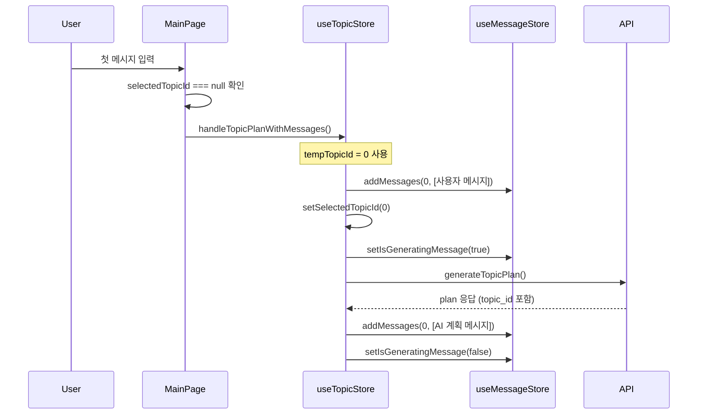
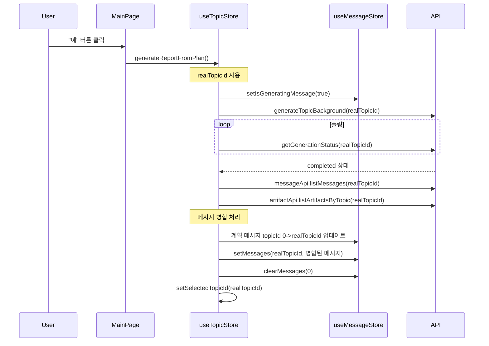
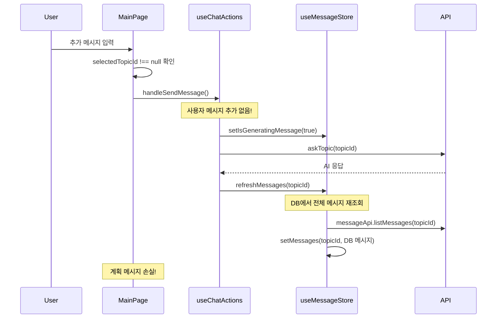

# 대화 흐름 분석 및 버그 리포트

## 목차
1. [현재 버그 현상](#현재-버그-현상)
2. [대화 흐름 분석](#대화-흐름-분석)
3. [버그 원인 분석](#버그-원인-분석)
4. [해결 방안](#해결-방안)
5. [코드 수정 제안](#코드-수정-제안)

---

## 현재 버그 현상

### 문제 설명
보고서 생성 완료 후 사용자가 추가 메시지를 보낼 때, 다음과 같은 문제가 발생합니다:

1. **사용자 메시지가 보이지 않음**: 입력한 메시지가 화면에 즉시 표시되지 않음
2. **GeneratingIndicator만 표시**: 메시지 대신 로딩 인디케이터만 보임
3. **이전 메시지 사라짐**: AI 응답 후 plan 메시지와 보고서 생성 요청 관련 메시지가 사라짐
4. **DB 메시지만 표시**: 최종적으로 DB에 저장된 메시지들만 화면에 남음

### 정상적인 흐름 (예상)
```
1. 사용자: "AI 서비스 동향"
2. AI: 계획 응답
3. [보고서 생성 요청]
4. AI: 보고서 응답
5. 사용자: "내용을 절반으로 줄여줘" <- 즉시 표시
6. [GeneratingIndicator]
7. AI: 수정된 보고서 응답
```

### 실제 발생하는 흐름 (버그)
```
1. 사용자: "AI 서비스 동향"
2. AI: 계획 응답
3. [보고서 생성 요청]
4. AI: 보고서 응답
5. 사용자가 메시지 입력 시:
   - 사용자 메시지 표시 X
   - GeneratingIndicator만 표시
6. AI 응답 후:
   - 계획 메시지 사라짐
   - 보고서 생성 관련 메시지 사라짐
   - DB 메시지만 표시
```

---

## 대화 흐름 분석

### 1. 초기 토픽 생성 흐름 (계획 모드)



**관련 파일**:
- [MainPage.tsx:189-200](src/pages/MainPage.tsx#L189-L200): handleSendMessage 함수
- [useTopicStore.ts:290-368](src/stores/useTopicStore.ts#L290-L368): handleTopicPlanWithMessages 함수

### 2. 보고서 생성 흐름



**관련 파일**:
- [MainPage.tsx:59-69](src/pages/MainPage.tsx#L59-L69): handleGenerateFromOutline 함수
- [useTopicStore.ts:394-518](src/stores/useTopicStore.ts#L394-L518): generateReportFromPlan 함수

### 3. 추가 메시지 전송 흐름 (버그 발생 지점)



**관련 파일**:
- [useChatActions.ts:34-96](src/hooks/useChatActions.ts#L34-L96): handleSendMessage 함수
- [useMessageStore.ts:189-210](src/stores/useMessageStore.ts#L189-L210): refreshMessages 함수

---

## 버그 원인 분석

### 핵심 문제점

#### 1. 사용자 메시지가 즉시 표시되지 않는 이유
- **위치**: [useChatActions.ts:34-96](src/hooks/useChatActions.ts#L34-L96)
- **문제**: `handleSendMessage` 함수에서 사용자 메시지를 store에 추가하지 않음
- **현재 코드**:
  ```typescript
  // 사용자 메시지 추가 로직 없음
  useMessageStore.getState().setIsGeneratingMessage(true)
  await topicApi.askTopic(currentTopicId, { content: message })
  ```

#### 2. 계획 메시지가 사라지는 이유
- **위치**: [useMessageStore.ts:189-210](src/stores/useMessageStore.ts#L189-L210)
- **문제**: `refreshMessages` 함수가 DB에서 조회한 메시지로 전체 교체
- **현재 코드**:
  ```typescript
  // DB 메시지로 완전 교체 (기존 로컬 메시지 손실)
  get().setMessages(topicId, messagesWithArtifacts)
  ```
- **영향**:
  - 계획 메시지는 DB에 저장되지 않음 (로컬에만 존재)
  - `refreshMessages` 호출 시 계획 메시지 손실

#### 3. GeneratingIndicator만 보이는 이유
- **위치**: [MainPage.tsx:353](src/pages/MainPage.tsx#L353)
- **조건**: `isGeneratingMessage && <GeneratingIndicator />`
- **문제**: 사용자 메시지가 store에 없어 이전 메시지만 표시되고, GeneratingIndicator만 추가로 보임

### 데이터 흐름 문제

1. **계획 모드 (topicId=0)**:
   - 사용자/AI 메시지를 로컬 store에 저장
   - DB에는 저장하지 않음

2. **보고서 생성 후 (realTopicId)**:
   - 계획 메시지를 realTopicId로 마이그레이션
   - 서버 메시지와 병합

3. **추가 메시지 전송 시 (문제 발생)**:
   - 사용자 메시지를 store에 추가하지 않음
   - `refreshMessages`가 DB 메시지로 전체 교체
   - 로컬에만 있던 계획 메시지 손실

---

## 해결 방안

### 방안 1: 사용자 메시지 즉시 추가 (권장)

**장점**:
- 사용자 경험 개선 (메시지 즉시 표시)
- 기존 흐름과 일관성 유지
- 구현이 간단함

**구현 방법**:
1. `useChatActions.handleSendMessage`에서 사용자 메시지를 store에 추가
2. API 응답 후 `refreshMessages` 대신 `mergeNewMessages` 사용

### 방안 2: 계획 메시지를 DB에 저장

**장점**:
- 데이터 일관성 확보
- 새로고침 시에도 계획 메시지 유지

**단점**:
- 백엔드 수정 필요
- 구현 복잡도 증가

### 방안 3: Hybrid 접근 (장기적 해결책)

**내용**:
- 단기: 방안 1 적용
- 장기: 방안 2 적용

---

## 코드 수정 제안

### 수정 1: useChatActions.ts - 사용자 메시지 즉시 추가

```typescript
// src/hooks/useChatActions.ts

const handleSendMessage = async (message: string, files: File[], webSearchEnabled: boolean) => {
    const messageStore = useMessageStore.getState()
    messageStore.setIsGeneratingMessage(true)

    try {
        console.log('handleSendMessage >', {message, files, webSearchEnabled, selectedTopicId})
        let currentTopicId = selectedTopicId

        // 첫 메시지: 토픽 생성 (기존 코드 유지)
        if (currentTopicId === null) {
            // ... 기존 코드 ...
        } else {
            // ✅ 추가: 사용자 메시지를 즉시 store에 추가
            const userMessage: MessageModel = {
                id: undefined,
                topicId: currentTopicId,
                role: 'user',
                content: message,
                seqNo: undefined,
                createdAt: new Date().toISOString(),
                isPlan: false
            }

            messageStore.addMessages(currentTopicId, [userMessage])

            // 기존 코드 계속...
            let selectedArtifactId = getSelectedArtifactId(currentTopicId)
            // ...

            await topicApi.askTopic(currentTopicId, {
                content: message,
                artifact_id: selectedArtifactId,
                include_artifact_content: true
            })
        }

        // ✅ 수정: refreshMessages 대신 mergeNewMessages 사용
        // 이렇게 하면 로컬 메시지(계획, 사용자)가 유지됨
        await messageStore.mergeNewMessages(currentTopicId)

        // ... 나머지 코드 ...
    } catch (error: any) {
        // ... 에러 처리 ...
    } finally {
        messageStore.setIsGeneratingMessage(false)
    }
}
```

### 수정 2: useMessageStore.ts - mergeNewMessages 개선

```typescript
// src/stores/useMessageStore.ts

mergeNewMessages: async (topicId: number) => {
    try {
        // 1. 서버에서 메시지 + Artifact 조회
        const messagesResponse = await messageApi.listMessages(topicId)
        const messageModels = mapMessageResponsesToModels(messagesResponse.messages)

        const artifactsResponse = await artifactApi.listArtifactsByTopic(topicId)
        const serverMessages = await enrichMessagesWithArtifacts(
            messageModels,
            artifactsResponse.artifacts
        )

        // 2. 기존 메시지 가져오기 (계획, 사용자 메시지 포함)
        const existingMessages = get().getMessages(topicId)

        // 3. ✅ 개선: 더 정확한 중복 제거 로직
        const existingContents = new Set(
            existingMessages
                .filter(m => m.role === 'user')
                .map(m => m.content)
        )

        const newMessages = serverMessages.filter((m) => {
            // ID가 있으면 ID로 체크
            if (m.id) {
                return !existingMessages.some(em => em.id === m.id)
            }
            // 사용자 메시지는 content로 중복 체크
            if (m.role === 'user') {
                return !existingContents.has(m.content)
            }
            // AI 메시지는 모두 추가
            return true
        })

        // 4. 병합 (기존 + 새 메시지)
        get().setMessages(topicId, [...existingMessages, ...newMessages])

        console.log('✅ mergeNewMessages 완료:', {
            topicId,
            existing: existingMessages.length,
            new: newMessages.length,
            total: existingMessages.length + newMessages.length
        })
    } catch (error) {
        console.error('Failed to merge messages:', error)
    }
}
```

### 수정 3: MainPage.tsx - 메시지 표시 개선

```typescript
// src/pages/MainPage.tsx (line 324-354 부분)

{messages.length === 0 ? (
    <ChatWelcome />
) : (
    <div className={styles.chatMessages}>
        {messages.map((message, index) => {
            const isLastUserMessage =
                message.role === 'user' &&
                index === messages.length - 1

            return (
                <div
                    key={message.clientId || `${message.topicId}-${message.id}`}
                    ref={isLastUserMessage ? lastUserMessageRef : null}
                >
                    {message.isPlan ? (
                        <OutlineMessage
                            message={message}
                            onGenerateReport={handleGenerateFromOutline}
                            onContinue={handleContinueOutline}
                            showButtons={showOutlineButtons}
                        />
                    ) : (
                        <ChatMessage
                            message={message}
                            onReportClick={handleReportClick}
                            onDownload={handleDownload}
                            onDelete={handleDeleteMessage}
                            isGenerating={isGeneratingMessage && index === messages.length - 1}
                            isDeleting={isDeletingMessage}
                        />
                    )}
                </div>
            )
        })}
        {/* ✅ 수정: 마지막 메시지가 사용자 메시지일 때만 표시 */}
        {isGeneratingMessage &&
         messages.length > 0 &&
         messages[messages.length - 1].role === 'user' && (
            <GeneratingIndicator />
        )}
    </div>
)}
```

---

## 테스트 시나리오

### 테스트 1: 기본 흐름
1. 새 대화 시작
2. "AI 서비스 동향" 입력
3. 계획 확인 후 "예" 클릭
4. 보고서 생성 완료 확인
5. "내용을 절반으로 줄여줘" 입력
6. **확인 사항**:
   - 사용자 메시지 즉시 표시
   - GeneratingIndicator 정상 표시
   - AI 응답 후 모든 메시지 유지

### 테스트 2: 메시지 중복 확인
1. 동일한 메시지 여러 번 전송
2. **확인 사항**:
   - 메시지 중복 없음
   - 순서 정확함

### 테스트 3: 새로고침 테스트
1. 대화 진행 후 페이지 새로고침
2. **확인 사항**:
   - DB 저장된 메시지만 표시 (예상 동작)
   - 계획 메시지는 사라짐 (현재 한계)

---

## 결론

현재 버그는 추가 메시지 전송 시 사용자 메시지를 store에 추가하지 않고, `refreshMessages`가 DB 메시지로 전체 교체하면서 발생합니다.

**단기 해결책**:
- `useChatActions.handleSendMessage`에서 사용자 메시지 즉시 추가
- `refreshMessages` 대신 `mergeNewMessages` 사용

**장기 개선 방향**:
- 계획 메시지도 DB에 저장하여 데이터 일관성 확보
- 메시지 관리 로직 통합 및 단순화

이 수정을 통해 사용자 경험을 크게 개선할 수 있으며, 대화 흐름의 연속성을 보장할 수 있습니다.