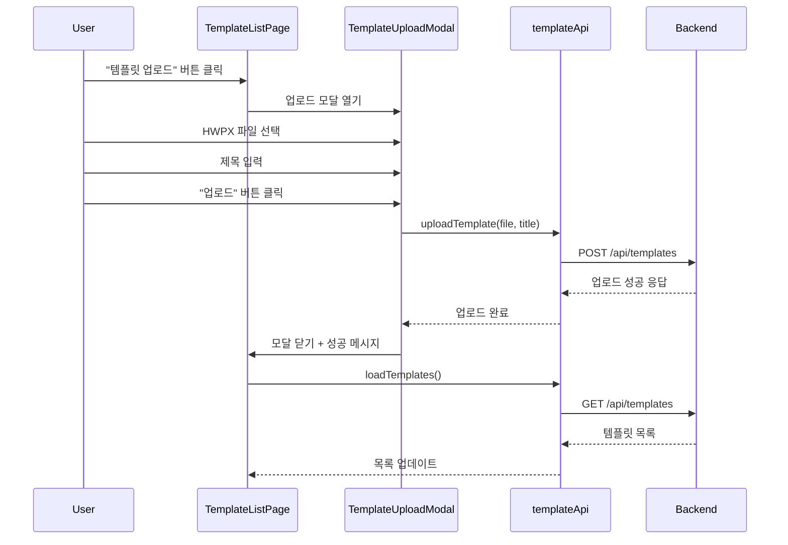
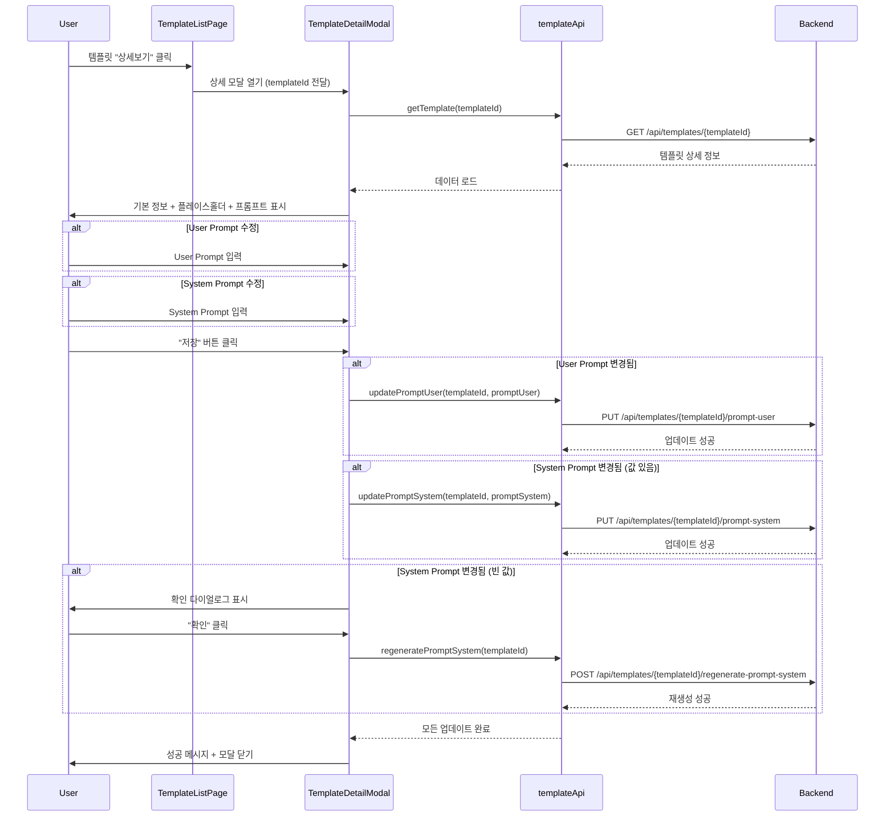
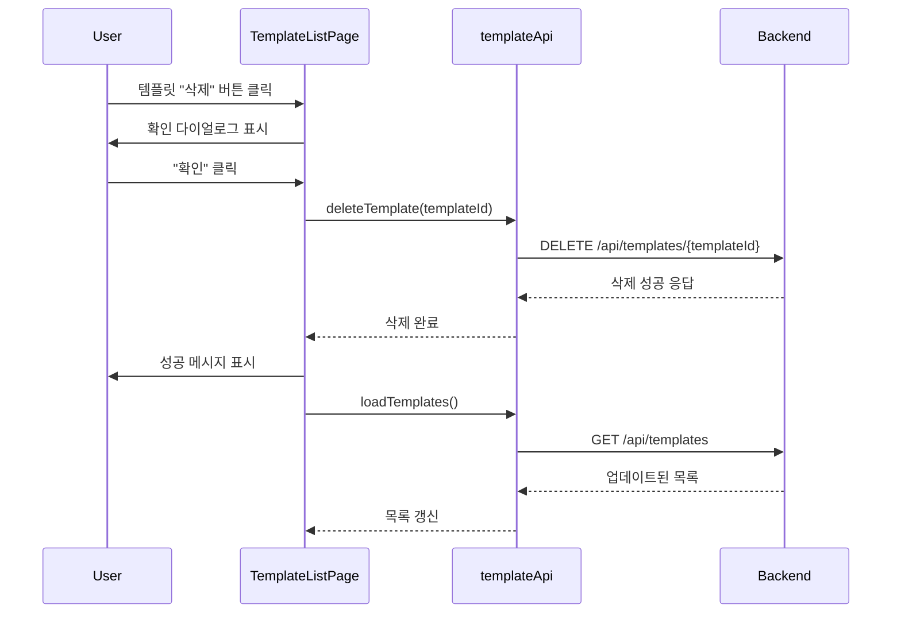
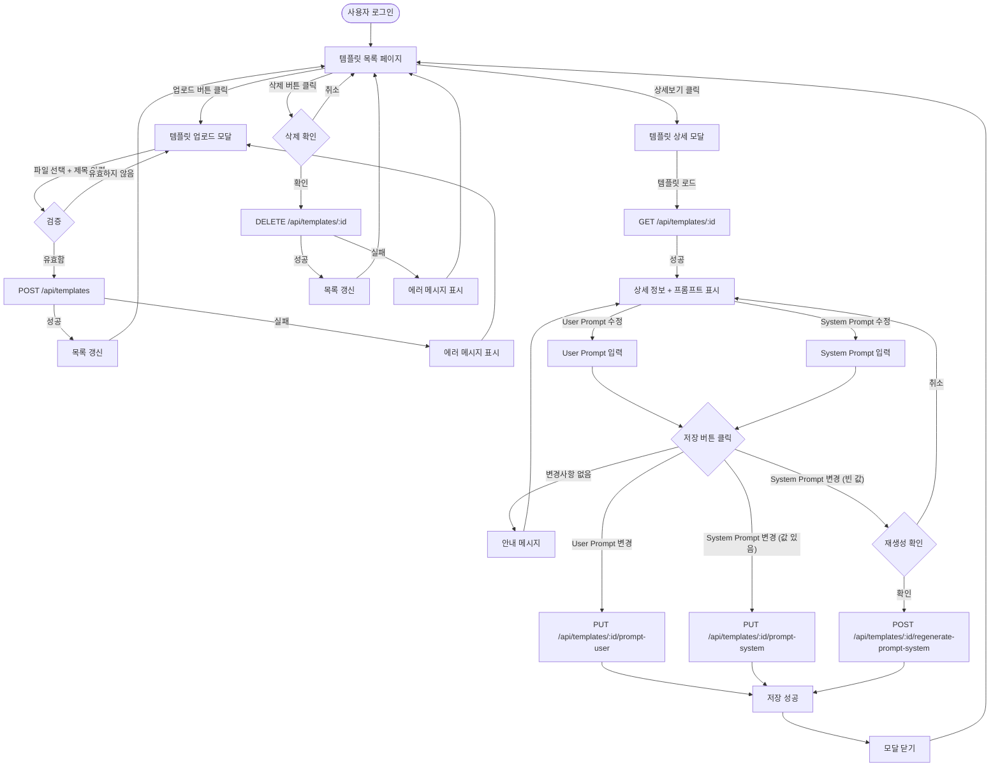

# Template Management - Frontend Documentation

## 개요

템플릿 관리 기능은 사용자가 HWPX 템플릿을 업로드하고, 관리하며, 프롬프트를 설정할 수 있는 기능을 제공합니다.

**주요 기능:**

- 템플릿 목록 조회
- 템플릿 업로드 (HWPX 파일)
- 템플릿 상세 정보 조회
- 템플릿 삭제
- User Prompt / System Prompt 수정
- System Prompt 자동 재생성

---

## 파일 구조

```
frontend/src/
├── components/template/
│   ├── TemplateDetailModal.tsx             # 템플릿 상세 모달 (프롬프트 수정)
│   ├── TemplateDetailModal.module.css      # 템플릿 상세 모달 스타일
│   ├── TemplateSelectionView.tsx           # 템플릿 선택
│   ├── TemplateSelectionView.module.css    # 템플릿 선택 스타일
│   ├── TemplateUploadModal.tsx             # 템플릿 업로드 모달
│   └── TemplateUploadModal.module.css      # 템플릿 업로드 모달 스타일
│
├── services/
│   └── templateApi.ts                 # 템플릿 API 서비스 함수
│
├── types/
│   └── template.ts                    # 템플릿 타입 정의
│
├── constants/
│   └── index.ts                       # API 엔드포인트 상수
│
├── mocks/
│   └── handlers.ts                    # MSW Mock API 핸들러
│
└── pages/
    └── TemplateManagementPage.tsx     # 템플릿 관리 페이지
```

---

## 타입 정의 (types/template.ts)

### 1. TemplateListItem

```typescript
export interface TemplateListItem {
    id: number
    title: string
    filename: string
    file_size: number
    created_at: string
}
```

### 2. TemplateDetail

```typescript
export interface TemplateDetail {
    id: number
    title: string
    filename: string
    file_size: number
    placeholders: Array<{key: string}>
    prompt_user?: string | null // 사용자 정의 프롬프트
    prompt_system?: string | null // 시스템 프롬프트
    created_at: string
}
```

### 3. TemplateUploadRequest

```typescript
export interface TemplateUploadRequest {
    file: File
    title: string
}
```

### 4. UploadTemplateResponse

```typescript
export interface UploadTemplateResponse {
    id: number
    title: string
    filename: string
    file_size: number
    placeholders: Array<{key: string}>
    created_at: string
}
```

### 5. DeleteTemplateResponse

```typescript
export interface DeleteTemplateResponse {
    id: number
    message: string
}
```

### 6. UserPromptRequest

```typescript
export interface UserPromptRequest {
    prompt_user: string
}
```

### 7. PromptSystemRequest

```typescript
export interface PromptSystemRequest {
    prompt_system: string
}
```

### 8. UpdatePromptResponse

```typescript
export interface UpdatePromptResponse {
    id: number
    title: string
    prompt_system: string | null
    prompt_user: string | null
    updated_at: string
}
```

### 9. SystemPromptRegenerateResponse

```typescript
export interface SystemPromptRegenerateResponse {
    id: number
    prompt_system: string | null
    regenerated_at: string
}
```

---

## API 엔드포인트 (constants/index.ts)

```typescript
export const API_ENDPOINTS = {
    // 템플릿 API
    LIST_TEMPLATES: '/api/templates', // GET: 내 템플릿 목록
    GET_TEMPLATE: (templateId: number) => `/api/templates/${templateId}`, // GET: 템플릿 상세 조회
    UPLOAD_TEMPLATE: '/api/templates', // POST: 템플릿 업로드
    DELETE_TEMPLATE: (templateId: number) => `/api/templates/${templateId}`, // DELETE: 템플릿 삭제
    UPDATE_PROMPT_USER: (templateId: number) => `/api/templates/${templateId}/prompt-user`, // PUT: User Prompt 업데이트
    UPDATE_PROMPT_SYSTEM: (templateId: number) => `/api/templates/${templateId}/prompt-system`, // PUT: System Prompt 업데이트
    REGENERATE_PROMPT_SYSTEM: (templateId: number) => `/api/templates/${templateId}/regenerate-prompt-system`, // POST: System Prompt 재생성
    ADMIN_LIST_TEMPLATES: '/api/templates/admin/templates' // GET: 관리자 전체 템플릿 조회
}
```

---

## API 서비스 함수 (services/templateApi.ts)

### 1. listTemplates()

**설명:** 내 템플릿 목록 조회

**시그니처:**

```typescript
listTemplates: async (): Promise<TemplateListItem[]>
```

**엔드포인트:** `GET /api/templates`

**응답:**

```typescript
{
    success: true,
    data: [
        {
            id: 1,
            title: "월간 실적 보고서",
            filename: "monthly_report.hwpx",
            file_size: 12345,
            created_at: "2025-11-17T10:00:00Z"
        },
        // ...
    ]
}
```

---

### 2. getTemplate(templateId)

**설명:** 템플릿 상세 정보 조회 (플레이스홀더 + 프롬프트 포함)

**시그니처:**

```typescript
getTemplate: async (templateId: number): Promise<TemplateDetail>
```

**엔드포인트:** `GET /api/templates/{templateId}`

**응답:**

```typescript
{
    success: true,
    data: {
        id: 1,
        title: "월간 실적 보고서",
        filename: "monthly_report.hwpx",
        file_size: 12345,
        placeholders: [
            {key: "REPORT_TITLE"},
            {key: "REPORT_DATE"},
            {key: "REPORT_CONTENT"}
        ],
        prompt_user: "사용자 정의 프롬프트",
        prompt_system: "자동 생성된 시스템 프롬프트",
        created_at: "2025-11-17T10:00:00Z"
    }
}
```

---

### 3. uploadTemplate(file, title)

**설명:** HWPX 템플릿 업로드

**시그니처:**

```typescript
uploadTemplate: async (file: File, title: string): Promise<UploadTemplateResponse>
```

**엔드포인트:** `POST /api/templates`

**요청:**

```typescript
FormData {
    file: File (HWPX),
    title: "월간 실적 보고서"
}
```

**응답:**

```typescript
{
    success: true,
    data: {
        id: 1,
        title: "월간 실적 보고서",
        filename: "monthly_report.hwpx",
        file_size: 12345,
        placeholders: [{key: "REPORT_TITLE"}],
        created_at: "2025-11-17T10:00:00Z"
    }
}
```

---

### 4. deleteTemplate(templateId)

**설명:** 템플릿 삭제

**시그니처:**

```typescript
deleteTemplate: async (templateId: number): Promise<DeleteTemplateResponse>
```

**엔드포인트:** `DELETE /api/templates/{templateId}`

**응답:**

```typescript
{
    success: true,
    data: {
        id: 1,
        message: "템플릿이 삭제되었습니다."
    }
}
```

---

### 5. updatePromptUser(templateId, promptUser)

**설명:** User Prompt 업데이트

**시그니처:**

```typescript
updatePromptUser: async (templateId: number, promptUser: string): Promise<UpdatePromptResponse>
```

**엔드포인트:** `PUT /api/templates/{templateId}/prompt-user`

**요청:**

```typescript
{
    prompt_user: '사용자 정의 프롬프트 내용'
}
```

**응답:**

```typescript
{
    success: true,
    data: {
        id: 1,
        title: "월간 실적 보고서",
        prompt_system: "자동 생성된 시스템 프롬프트",
        prompt_user: "사용자 정의 프롬프트 내용",
        updated_at: "2025-11-17T12:00:00Z"
    }
}
```

---

### 6. updatePromptSystem(templateId, promptSystem)

**설명:** System Prompt 업데이트

**시그니처:**

```typescript
updatePromptSystem: async (templateId: number, promptSystem: string): Promise<UpdatePromptResponse>
```

**엔드포인트:** `PUT /api/templates/{templateId}/prompt-system`

**요청:**

```typescript
{
    prompt_system: '수정된 시스템 프롬프트'
}
```

**응답:**

```typescript
{
    success: true,
    data: {
        id: 1,
        title: "월간 실적 보고서",
        prompt_system: "수정된 시스템 프롬프트",
        prompt_user: "사용자 정의 프롬프트 내용",
        updated_at: "2025-11-17T12:00:00Z"
    }
}
```

---

### 7. regeneratePromptSystem(templateId)

**설명:** System Prompt 재생성 (템플릿의 플레이스홀더 기반)

**시그니처:**

```typescript
regeneratePromptSystem: async (templateId: number): Promise<SystemPromptRegenerateResponse>
```

**엔드포인트:** `POST /api/templates/{templateId}/regenerate-prompt-system`

**응답:**

```typescript
{
    success: true,
    data: {
        id: 1,
        prompt_system: "새로 생성된 시스템 프롬프트",
        regenerated_at: "2025-11-17T12:30:00Z"
    }
}
```

---

## Mock API (mocks/handlers.ts)

### 1. GET /api/templates - 템플릿 목록 조회

```typescript
http.get('/api/templates', () => {
    return HttpResponse.json({
        success: true,
        data: [
            {
                id: 1,
                title: 'Mock 템플릿 1',
                filename: 'template1.hwpx',
                file_size: 12345,
                created_at: new Date().toISOString()
            },
            {
                id: 2,
                title: 'Mock 템플릿 2',
                filename: 'template2.hwpx',
                file_size: 54321,
                created_at: new Date().toISOString()
            }
        ]
    })
})
```

---

### 2. GET /api/templates/:templateId - 템플릿 상세 조회

```typescript
http.get('/api/templates/:templateId', ({params}) => {
    const {templateId} = params
    return HttpResponse.json({
        success: true,
        data: {
            id: Number(templateId),
            title: `Mock 템플릿 ${templateId}`,
            filename: `template${templateId}.hwpx`,
            file_size: 12345,
            placeholders: [{key: 'REPORT_TITLE'}, {key: 'REPORT_DATE'}, {key: 'REPORT_CONTENT'}],
            prompt_user: 'Mock User Prompt',
            prompt_system: 'Mock System Prompt',
            created_at: new Date().toISOString()
        }
    })
})
```

---

### 3. POST /api/templates - 템플릿 업로드

```typescript
http.post('/api/templates', async ({request}) => {
    const formData = await request.formData()
    const title = formData.get('title') as string

    return HttpResponse.json({
        success: true,
        data: {
            id: Math.floor(Math.random() * 1000),
            title: title || 'Uploaded Template',
            filename: 'uploaded.hwpx',
            file_size: 12345,
            placeholders: [{key: 'PLACEHOLDER_1'}],
            created_at: new Date().toISOString()
        }
    })
})
```

---

### 4. DELETE /api/templates/:templateId - 템플릿 삭제

```typescript
http.delete('/api/templates/:templateId', ({params}) => {
    const {templateId} = params
    return HttpResponse.json({
        success: true,
        data: {
            id: Number(templateId),
            message: '템플릿이 삭제되었습니다.'
        }
    })
})
```

---

### 5. PUT /api/templates/:templateId/prompt-user - User Prompt 업데이트

```typescript
http.put('/api/templates/:templateId/prompt-user', async ({params, request}) => {
    const {templateId} = params
    const body = await request.json()

    return HttpResponse.json({
        success: true,
        data: {
            id: Number(templateId),
            title: `Mock 템플릿 ${templateId}`,
            prompt_system: 'Mock System Prompt',
            prompt_user: body.prompt_user,
            updated_at: new Date().toISOString()
        }
    })
})
```

---

### 6. PUT /api/templates/:templateId/prompt-system - System Prompt 업데이트

```typescript
http.put('/api/templates/:templateId/prompt-system', async ({params, request}) => {
    const {templateId} = params
    const body = await request.json()

    return HttpResponse.json({
        success: true,
        data: {
            id: Number(templateId),
            title: `Mock 템플릿 ${templateId}`,
            prompt_system: body.prompt_system,
            prompt_user: 'Mock User Prompt',
            updated_at: new Date().toISOString()
        }
    })
})
```

---

### 7. POST /api/templates/:templateId/regenerate-prompt-system - System Prompt 재생성

```typescript
http.post('/api/templates/:templateId/regenerate-prompt-system', ({params}) => {
    const {templateId} = params

    return HttpResponse.json({
        success: true,
        data: {
            id: Number(templateId),
            prompt_system: `재생성된 System Prompt (템플릿 ${templateId})`,
            regenerated_at: new Date().toISOString()
        }
    })
})
```

---

## 컴포넌트 상세

### 1. TemplateListPage.tsx

**역할:**

- 템플릿 목록 표시
- 템플릿 업로드 버튼
- 템플릿 상세 보기 / 삭제

**주요 상태:**

```typescript
const [templates, setTemplates] = useState<TemplateListItem[]>([])
const [loading, setLoading] = useState(false)
const [uploadModalOpen, setUploadModalOpen] = useState(false)
const [detailModalOpen, setDetailModalOpen] = useState(false)
const [selectedTemplateId, setSelectedTemplateId] = useState<number | null>(null)
```

**주요 함수:**

- `loadTemplates()` - 템플릿 목록 로드
- `handleUploadClick()` - 업로드 모달 열기
- `handleDetailClick(id)` - 상세 모달 열기
- `handleDelete(id)` - 템플릿 삭제

---

### 2. TemplateUploadModal.tsx

**역할:**

- HWPX 파일 선택 및 제목 입력
- 템플릿 업로드

**주요 상태:**

```typescript
const [file, setFile] = useState<File | null>(null)
const [title, setTitle] = useState('')
const [uploading, setUploading] = useState(false)
```

**주요 함수:**

- `handleFileChange(file)` - 파일 선택 핸들러
- `handleUpload()` - 업로드 실행

**검증 규칙:**

- 파일 확장자: `.hwpx`만 허용
- 제목: 필수 입력

---

### 3. TemplateDetailModal.tsx

**역할:**

- 템플릿 기본 정보 표시
- 플레이스홀더 목록 표시
- User Prompt / System Prompt 수정
- 변경사항 저장

**주요 상태:**

```typescript
const [template, setTemplate] = useState<TemplateDetail | null>(null)
const [loading, setLoading] = useState(false)
const [promptUser, setPromptUser] = useState<string>('')
const [promptSystem, setPromptSystem] = useState<string>('')
const [initialPromptUser, setInitialPromptUser] = useState<string>('')
const [initialPromptSystem, setInitialPromptSystem] = useState<string>('')
const [isSaving, setIsSaving] = useState(false)
```

**주요 함수:**

- `loadTemplate()` - 템플릿 상세 정보 로드
- `hasUserPromptChanged()` - User Prompt 변경 여부
- `hasSystemPromptChanged()` - System Prompt 변경 여부
- `hasAnyChanges()` - 전체 변경 여부
- `handleSave()` - 저장 핸들러

**저장 로직:**

1. 변경사항 없으면 안내 메시지 표시
2. User Prompt 변경 시 → `updatePromptUser()` 호출
3. System Prompt 변경 시:
    - 빈 값이면 → 확인 다이얼로그 → `regeneratePromptSystem()` 호출
    - 값이 있으면 → `updatePromptSystem()` 호출
4. 저장 완료 후 모달 닫기

---

## 유저 플로우

### 1. 템플릿 업로드 플로우



---

### 2. 템플릿 상세 조회 및 프롬프트 수정 플로우



---

### 3. 템플릿 삭제 플로우



---

### 4. 전체 유저 플로우 다이어그램



---

## 주요 기능 요약

### 1. 템플릿 업로드

- HWPX 파일 업로드
- 제목 입력 필수
- 업로드 시 플레이스홀더 자동 추출
- **System Prompt 자동 생성** (backend)

### 2. 템플릿 목록 조회

- 내가 업로드한 템플릿만 표시
- 제목, 파일명, 파일 크기, 생성일 표시

### 3. 템플릿 상세 조회

- 기본 정보 표시
- 플레이스홀더 목록 표시
- User Prompt / System Prompt 표시 및 수정

### 4. 프롬프트 수정

- **User Prompt**: 사용자가 자유롭게 입력 (선택사항)
- **System Prompt**:
    - 초기값은 템플릿 업로드 시 자동 생성
    - 사용자가 수정 가능
    - 빈 값으로 저장 시 자동 재생성

### 5. 변경 감지 및 저장

- 초기값과 현재값 비교
- 변경된 항목만 API 호출
- 저장 중 모달 닫기/취소 방지

### 6. 템플릿 삭제

- 확인 다이얼로그
- 삭제 후 목록 자동 갱신

---

## 스타일링 (CSS Modules)

### 변수 사용 (variables.css 참조)

```css
/* TemplateDetailModal.module.css */
.promptTextarea {
    width: 100%;
    padding: var(--spacing-sm) var(--spacing-md);
    border: 1px solid var(--border-color);
    border-radius: var(--radius-md);
    font-family: 'Courier New', monospace;
    font-size: var(--font-size-sm);
    line-height: 1.6;
    resize: vertical;
    transition: border-color var(--transition-base);
}

.promptTextarea:focus {
    outline: none;
    border-color: var(--primary-color);
    box-shadow: 0 0 0 2px rgba(24, 144, 255, 0.2);
}

.promptTextarea:disabled {
    background-color: #f5f5f5;
    cursor: not-allowed;
}

.promptHint {
    margin-top: var(--spacing-xs);
    font-size: var(--font-size-xs);
    color: var(--text-secondary);
    font-style: italic;
}
```

---

## 에러 처리

### API 에러

```typescript
try {
    const data = await templateApi.getTemplate(templateId)
    setTemplate(data)
} catch (error: any) {
    console.error('TemplateDetailModal > loadTemplate', error)
    antdMessage.error(error.message || '템플릿 조회에 실패했습니다.')
    onClose()
}
```

### 업로드 검증 에러

- 파일 확장자 검증 (.hwpx만 허용)
- 제목 필수 입력 검증

### 저장 에러

- User Prompt 업데이트 실패
- System Prompt 업데이트 실패
- System Prompt 재생성 실패

---

## 테스트 시나리오

### 1. Mock API 테스트

- ✅ GET /api/templates - 목록 조회
- ✅ GET /api/templates/:id - 상세 조회
- ✅ POST /api/templates - 업로드
- ✅ DELETE /api/templates/:id - 삭제
- ✅ PUT /api/templates/:id/prompt-user - User Prompt 업데이트
- ✅ PUT /api/templates/:id/prompt-system - System Prompt 업데이트
- ✅ POST /api/templates/:id/regenerate-prompt-system - System Prompt 재생성

### 2. 컴포넌트 테스트

- [ ] TemplateListPage 렌더링
- [ ] TemplateUploadModal 파일 선택 및 업로드
- [ ] TemplateDetailModal 상세 정보 표시
- [ ] 프롬프트 수정 및 저장
- [ ] 변경 감지 로직

### 3. 통합 테스트

- [ ] 템플릿 업로드 → 목록 갱신
- [ ] 템플릿 상세 조회 → 프롬프트 수정 → 저장
- [ ] 템플릿 삭제 → 목록 갱신

---

## 향후 개선 사항

### 1. 기능 추가

- [ ] 템플릿 검색 기능
- [ ] 템플릿 필터링 (날짜, 파일명 등)
- [ ] 템플릿 복제 기능
- [ ] 템플릿 미리보기 (플레이스홀더 위치 표시)

### 2. UX 개선

- [ ] 드래그 앤 드롭 업로드
- [ ] 프롬프트 미리보기 (Markdown 렌더링)
- [ ] 프롬프트 변경 이력 (버전 관리)
- [ ] 프롬프트 템플릿 라이브러리

### 3. 성능 최적화

- [ ] 템플릿 목록 페이지네이션
- [ ] 무한 스크롤
- [ ] 이미지 레이지 로딩

---

**문서 작성일:** 2025-11-17
**버전:** 1.0.0
**작성자:** Claude Code
