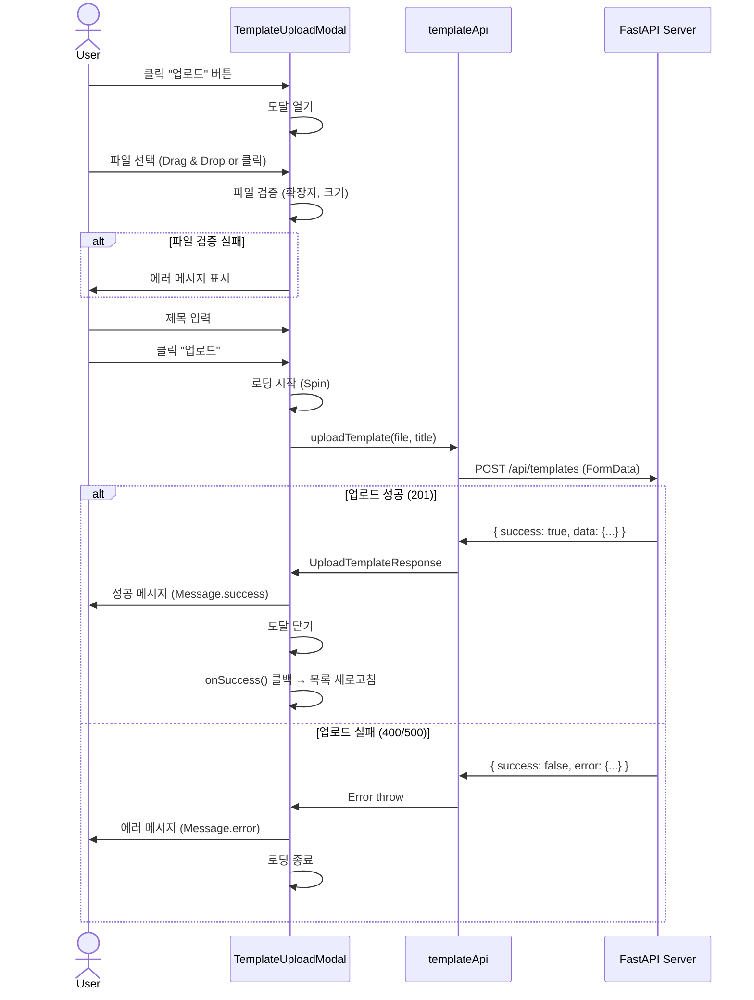
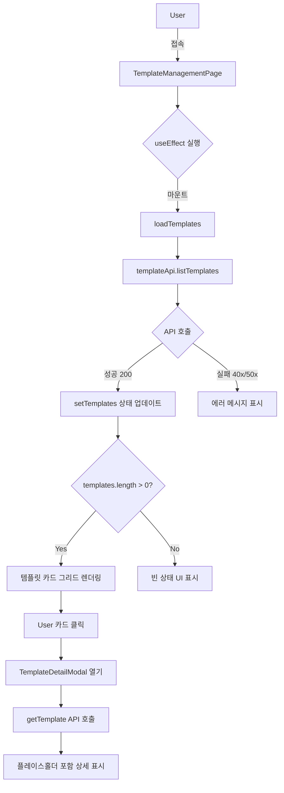
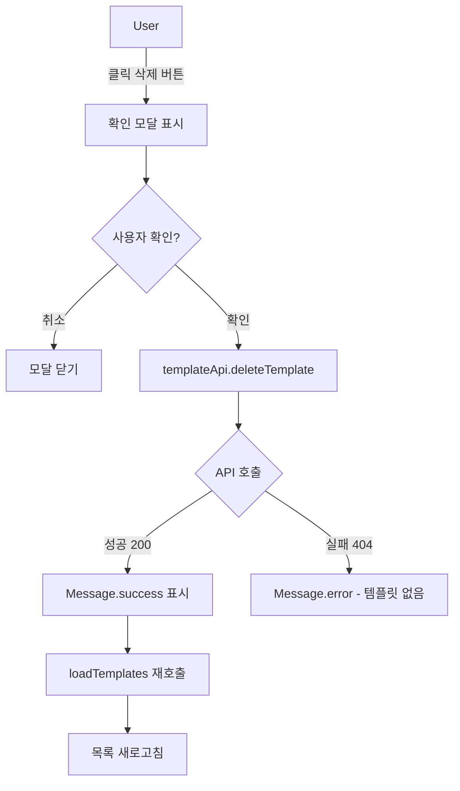
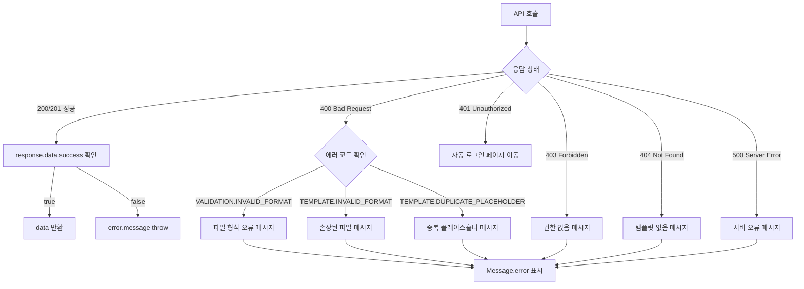

# 템플릿 관리 기능 프론트엔드 구현 계획서

> HWP Report Generator - Template Management Frontend Implementation Plan
>
> 작성일: 2025-11-07
> 버전: 1.0
> 상태: 계획 단계

---

## 목차

1. [프로젝트 개요](#1-프로젝트-개요)
2. [구현 범위](#2-구현-범위)
3. [구현 계획](#3-구현-계획)
4. [상세 구현 명세](#4-상세-구현-명세)
5. [플로우 다이어그램](#5-플로우-다이어그램)
6. [사이드 이펙트 및 고려사항](#6-사이드-이펙트-및-고려사항)
7. [테스트 케이스](#7-테스트-케이스)
8. [UI/UX 디자인](#8-uiux-디자인)
9. [체크리스트](#9-체크리스트)
10. [참고 문서](#10-참고-문서)

---

## 1. 프로젝트 개요

### 1.1 목적 및 배경

**목적:**
사용자가 커스텀 HWPX 템플릿 파일을 업로드하고 관리할 수 있는 프론트엔드 UI를 구현합니다.

**배경:**

- 백엔드에서 템플릿 관리 API가 완전히 구현됨 (v2.1)
- 5개 API 엔드포인트 제공 (업로드, 조회, 상세, 삭제, 관리자 조회)
- 플레이스홀더 자동 추출 및 검증 기능 완료
- 프론트엔드 UI만 구현하면 즉시 사용 가능

**참고:**

- 아직 메시지 전송 시 템플릿과 같이 요청하는 것은 백엔드 미구현 상태

**핵심 가치:**

- 사용자가 부서별/용도별 맞춤 보고서 양식 사용 가능
- 템플릿 파일 업로드만으로 플레이스홀더 자동 인식
- 관리자는 전체 템플릿 현황 모니터링 가능

### 1.2 핵심 기능

#### 일반 사용자

1. **템플릿 업로드** 📤
    - HWPX 파일 + 제목 입력
    - Drag & Drop 지원
    - 업로드 후 플레이스홀더 자동 표시

2. **템플릿 관리** 📋
    - 내 템플릿 목록 조회 (카드 그리드)
    - 템플릿 상세 보기 (플레이스홀더 포함)
    - 템플릿 삭제 (소프트 삭제)

#### 관리자

3. **전체 템플릿 조회** 👨‍💼
    - 모든 사용자 템플릿 목록
    - 사용자명, 파일 크기, 플레이스홀더 개수 표시

### 1.3 백엔드 API 현황

| API              | 메서드 | 경로                             | 상태    | 권한   |
| ---------------- | ------ | -------------------------------- | ------- | ------ |
| 템플릿 업로드    | POST   | `/api/templates`                 | ✅ 완료 | 로그인 |
| 내 템플릿 목록   | GET    | `/api/templates`                 | ✅ 완료 | 로그인 |
| 템플릿 상세      | GET    | `/api/templates/{id}`            | ✅ 완료 | 로그인 |
| 템플릿 삭제      | DELETE | `/api/templates/{id}`            | ✅ 완료 | 로그인 |
| 전체 템플릿 조회 | GET    | `/api/templates/admin/templates` | ✅ 완료 | 관리자 |

**테스트 상태:**

- ✅ Unit Tests: 12/12 통과
- ✅ API Tests: 4/4 통과
- ✅ 프로덕션 준비 완료

---

## 2. 구현 범위

### 2.1 생성할 파일 목록

#### 신규 파일 (6개)

```
frontend/
├── src/
│   ├── services/
│   │   └── templateApi.ts ⭐ 신규 - 템플릿 API 서비스
│   │
│   ├── types/
│   │   └── template.ts ⭐ 신규 - 템플릿 TypeScript 타입
│   │
│   └── components/
│       └── template/
│           ├── TemplateUploadModal.tsx ⭐ 신규 - 업로드 모달
│           ├── TemplateUploadModal.module.css ⭐ 신규 - 모달 스타일
│           ├── TemplateCard.tsx ⭐ 신규 - 템플릿 카드
│           ├── TemplateCard.module.css ⭐ 신규 - 카드 스타일
│           ├── TemplateDetailModal.tsx ⭐ 신규 - 상세 모달
│           └── TemplateDetailModal.module.css ⭐ 신규 - 상세 모달 스타일
│
└── doc/
    └── plan/
        └── template_management_implementation.md ⭐ 이 문서
```

#### 수정 파일 (3개)

```
frontend/
├── src/
│   ├── constants/
│   │   └── index.ts ✏️ 수정 - 템플릿 API 엔드포인트 추가
│   │
│   └── components/
│       ├── user/
│       │   ├── SettingsModal.tsx ✏️ 수정 - 템플릿 관리 탭 추가 ⭐⭐
│       │   └── SettingsModal.module.css ✏️ 수정 - 템플릿 탭 스타일 추가
│       │
│       └── admin/
│           └── TemplateManagement.tsx ✏️ 수정 - 관리자 템플릿 탭 추가
```

**⚠️ 중요 변경사항:**
- ❌ **별도 페이지 생성 취소**: `TemplateManagementPage.tsx` 생성하지 않음
- ✅ **SettingsModal 통합**: 기존 `SettingsModal.tsx`에 "템플릿 관리" 탭 추가
- ✅ **라우팅 변경 없음**: `/templates` 라우트 추가하지 않음
- ✅ **접근 경로**: Sidebar → 설정 아이콘 클릭 → SettingsModal → 템플릿 탭

### 2.2 기술 스택

**Core:**

- React 19.1.1 (Functional Components)
- TypeScript 5.9.3
- Vite 7.1.7

**UI Library:**

- Ant Design 5.27.6
    - Upload (파일 업로드, Drag & Drop)
    - Card (템플릿 카드)
    - Modal (업로드/상세 모달)
    - Table (관리자 목록)
    - Tag (플레이스홀더 배지)
    - Message (알림)
    - Button, Space, Spin 등

**HTTP Client:**

- Axios 1.12.2 (기존 API 클라이언트 재사용)

**Routing:**

- React Router DOM 7.9.4

**Styling:**

- CSS Modules (`.module.css`)
- CSS Variables (rem 단위)

### 2.3 디렉토리 구조

```
frontend/src/
├── services/
│   ├── api.ts              # 기존 Axios 인스턴스
│   ├── authApi.ts          # 기존
│   ├── topicApi.ts         # 기존
│   ├── messageApi.ts       # 기존
│   ├── artifactApi.ts      # 기존
│   ├── adminApi.ts         # 기존
│   └── templateApi.ts      # ⭐ 신규
│
├── types/
│   ├── api.ts              # 기존 공통 타입
│   ├── auth.ts             # 기존
│   ├── user.ts             # 기존
│   ├── topic.ts            # 기존
│   ├── message.ts          # 기존
│   ├── artifact.ts         # 기존
│   └── template.ts         # ⭐ 신규
│
├── pages/
│   ├── LoginPage.tsx       # 기존
│   ├── MainPage.tsx        # 기존
│   └── AdminPage.tsx       # 기존
│
└── components/
    ├── auth/               # 기존
    ├── chat/               # 기존
    ├── layout/             # 기존
    ├── user/               # 기존
    │   ├── SettingsModal.tsx # ✏️ 수정 - 템플릿 탭 추가 ⭐⭐
    │   └── SettingsModal.module.css # ✏️ 수정 - 스타일 추가
    │
    ├── admin/              # 기존
    │   ├── PromptManagement.tsx
    │   └── TemplateManagement.tsx # ✏️ 수정 (관리자용)
    │
    └── template/           # ⭐ 신규 디렉토리
        ├── TemplateUploadModal.tsx
        ├── TemplateUploadModal.module.css
        ├── TemplateCard.tsx
        ├── TemplateCard.module.css
        ├── TemplateDetailModal.tsx
        └── TemplateDetailModal.module.css
```

---

## 3. 구현 계획

### 3.1 Phase별 일정

| Phase       | 작업 내용               | 파일 | 예상 공수 | 우선순위 |
| ----------- | ----------------------- | ---- | --------- | -------- |
| **Phase 1** | 기본 구조               | 3개  | 0.5일     | P0       |
| **Phase 2** | 업로드 기능             | 2개  | 1일       | P0       |
| **Phase 3** | SettingsModal 통합      | 4개  | 1.5일     | P1       |
| **Phase 4** | 관리자 페이지           | 1개  | 0.5일     | P2       |
| **총계**    |                         | 10개 | **3.5일** |          |

### 3.2 Phase 1: 기본 구조 (0.5일) 🟢

#### 작업 항목

1. **TypeScript 타입 정의** (`types/template.ts`)
    - Template, Placeholder 엔티티
    - API 요청/응답 타입
    - 컴포넌트 Props 타입

2. **API 서비스 구현** (`services/templateApi.ts`)
    - `listTemplates()` - GET /api/templates
    - `getTemplate(id)` - GET /api/templates/{id}
    - `uploadTemplate(file, title)` - POST /api/templates
    - `deleteTemplate(id)` - DELETE /api/templates/{id}
    - `listAllTemplates()` - GET /api/templates/admin/templates

3. **상수 추가** (`constants/index.ts`)
    - API_ENDPOINTS에 템플릿 엔드포인트 추가

#### 완료 조건

- [ ] 타입 정의 완료 (컴파일 에러 없음)
- [ ] API 서비스 함수 작성 완료
- [ ] 상수 추가 완료

---

### 3.3 Phase 2: 업로드 기능 (1일) 🟡

#### 작업 항목

1. **TemplateUploadModal 컴포넌트**
    - Ant Design Upload 컴포넌트 통합
    - Drag & Drop 지원
    - 파일 검증 (확장자, 크기)
    - FormData로 multipart/form-data 전송
    - 에러 처리 (400, 500)
    - 성공 시 콜백 호출

2. **스타일링** (`TemplateUploadModal.module.css`)
    - 모달 레이아웃
    - 업로드 영역 스타일
    - 로딩 스피너

#### 구현 세부사항

**파일 검증:**

- 확장자: `.hwpx`만 허용
- 파일 크기: 최대 10MB (프론트 검증)
- MIME 타입: `application/x-hwpx` 또는 `application/zip`

**에러 처리:**

- `VALIDATION.INVALID_FORMAT` → ".hwpx 파일만 업로드 가능합니다."
- `TEMPLATE.INVALID_FORMAT` → "HWPX 파일이 손상되었습니다."
- `TEMPLATE.DUPLICATE_PLACEHOLDER` → "플레이스홀더가 중복되었습니다."
- 기타 에러 → "업로드 중 오류가 발생했습니다."

#### 완료 조건

- [ ] 모달 열기/닫기 동작
- [ ] 파일 선택 및 Drag & Drop
- [ ] 제목 입력
- [ ] 업로드 진행 상태 표시
- [ ] 에러 메시지 표시
- [ ] 성공 시 모달 닫기 및 목록 새로고침

---

### 3.4 Phase 3: SettingsModal 통합 및 목록/상세 (1.5일) 🟡

#### 작업 항목

1. **SettingsModal 수정** (`components/user/SettingsModal.tsx`) ⭐⭐
    - `TabType`에 'templates' 추가: `type TabType = 'general' | 'profile' | 'templates'`
    - 템플릿 탭 버튼 추가 (FileOutlined 아이콘)
    - 템플릿 관리 탭 콘텐츠 영역 구현:
      - 템플릿 목록 상태 관리 (`useState`)
      - 템플릿 목록 조회 (GET /api/templates)
      - 카드 그리드 레이아웃
      - 업로드 버튼 → TemplateUploadModal 열기
      - 빈 상태 처리 (템플릿 없을 때)
      - 로딩 스피너

2. **SettingsModal 스타일 추가** (`SettingsModal.module.css`)
    - `.templateGrid` - 카드 그리드 레이아웃
    - `.emptyTemplate` - 빈 상태 스타일
    - `.uploadButton` - 업로드 버튼 스타일

3. **TemplateCard** (템플릿 카드 컴포넌트)
    - 제목, 파일명, 크기, 날짜 표시
    - 상세 보기 버튼
    - 삭제 버튼 (확인 모달)

4. **TemplateDetailModal** (상세 모달)
    - 템플릿 메타데이터 표시
    - 플레이스홀더 목록 (Tag로 표시)
    - 플레이스홀더 개수 표시

#### 구현 세부사항

**파일 크기 표시:**

```typescript
function formatFileSize(bytes: number): string {
    if (bytes < 1024) return `${bytes} B`
    if (bytes < 1024 * 1024) return `${(bytes / 1024).toFixed(1)} KB`
    return `${(bytes / (1024 * 1024)).toFixed(1)} MB`
}
```

**날짜 포맷:**

```typescript
import {formatDate} from '../utils/formatters'
// "2025-11-06T10:30:00" → "2025-11-06 10:30"
```

**플레이스홀더 배지:**

```tsx
<div className={styles.placeholders}>
    {placeholders.map((p, index) => (
        <Tag key={index} color="blue">
            {p.key}
        </Tag>
    ))}
</div>
```

#### 완료 조건

- [ ] 템플릿 목록 표시 (카드 그리드)
- [ ] 업로드 버튼 동작
- [ ] 카드 클릭 시 상세 모달 열기
- [ ] 삭제 확인 및 실행
- [ ] 빈 상태 UI 표시
- [ ] 로딩 상태 표시

---

### 3.5 Phase 4: 관리자 페이지 (1일) 🔵

#### 작업 항목

1. **TemplateManagement** (관리자 컴포넌트)
    - 전체 템플릿 목록 조회 (GET /api/templates/admin/templates)
    - Ant Design Table 사용
    - 컬럼: ID, 제목, 사용자명, 파일 크기, 플레이스홀더 개수, 생성일

2. **AdminPage 통합**
    - 템플릿 관리 탭 추가
    - 메뉴 아이템 추가

3. **라우팅 설정**
    - `/templates` 라우트 추가 (일반 사용자)
    - `/admin` 페이지에 템플릿 탭 통합 (관리자)

#### 구현 세부사항

**Table 컬럼:**

```typescript
const columns = [
    {title: 'ID', dataIndex: 'id', width: 70},
    {title: '제목', dataIndex: 'title'},
    {title: '사용자', dataIndex: 'username'},
    {title: '파일 크기', dataIndex: 'file_size', render: formatFileSize},
    {title: '플레이스홀더', dataIndex: 'placeholder_count'},
    {title: '생성일', dataIndex: 'created_at', render: formatDate}
]
```

**권한 검증:**

```typescript
const { user } = useAuth();
if (!user?.is_admin) {
  return <Navigate to="/" replace />;
}
```

#### 완료 조건

- [ ] 관리자 템플릿 테이블 표시
- [ ] 사용자명 컬럼 표시
- [ ] 플레이스홀더 개수 표시
- [ ] 페이지네이션 (선택사항)
- [ ] 권한 검증 (관리자만 접근)

---

## 4. 상세 구현 명세

### 4.1 API 엔드포인트 매핑

#### 1. 템플릿 업로드

**API:**

```
POST /api/templates
Content-Type: multipart/form-data
```

**요청:**

```typescript
// FormData
{
  file: File,      // HWPX 파일
  title: string    // 템플릿 제목
}
```

**응답 (201):**

```typescript
{
  success: true,
  data: {
    id: number,
    title: string,
    filename: string,
    file_size: number,
    placeholders: Array<{ key: string }>,
    created_at: string
  }
}
```

**에러 (400):**

```typescript
{
  success: false,
  error: {
    code: "VALIDATION.INVALID_FORMAT" | "TEMPLATE.INVALID_FORMAT" | "TEMPLATE.DUPLICATE_PLACEHOLDER",
    message: string,
    hint: string
  }
}
```

---

#### 2. 내 템플릿 목록

**API:**

```
GET /api/templates
```

**응답 (200):**

```typescript
{
  success: true,
  data: Array<{
    id: number,
    title: string,
    filename: string,
    file_size: number,
    created_at: string
  }>
}
```

---

#### 3. 템플릿 상세

**API:**

```
GET /api/templates/{template_id}
```

**응답 (200):**

```typescript
{
  success: true,
  data: {
    id: number,
    title: string,
    filename: string,
    file_size: number,
    placeholders: Array<{ key: string }>,
    created_at: string
  }
}
```

**에러 (404):**

```typescript
{
  success: false,
  error: {
    code: "TEMPLATE.NOT_FOUND",
    message: "템플릿을 찾을 수 없습니다."
  }
}
```

---

#### 4. 템플릿 삭제

**API:**

```
DELETE /api/templates/{template_id}
```

**응답 (200):**

```typescript
{
  success: true,
  data: {
    id: number,
    message: "템플릿이 삭제되었습니다."
  }
}
```

---

#### 5. 관리자: 전체 템플릿 조회

**API:**

```
GET /api/templates/admin/templates
```

**응답 (200):**

```typescript
{
  success: true,
  data: Array<{
    id: number,
    title: string,
    username: string,
    file_size: number,
    placeholder_count: number,
    created_at: string
  }>
}
```

---

### 4.2 TypeScript 타입 정의

**파일: `frontend/src/types/template.ts`**

```typescript
/**
 * types/template.ts
 *
 * 템플릿 관련 TypeScript 타입 정의
 */

/**
 * 템플릿 엔티티 (DB 모델)
 */
export interface Template {
    id: number
    user_id: number
    title: string
    description?: string
    filename: string
    file_path: string
    file_size: number
    sha256: string
    is_active: boolean
    created_at: string
    updated_at: string
}

/**
 * 플레이스홀더 엔티티
 */
export interface Placeholder {
    id: number
    template_id: number
    placeholder_key: string
    created_at: string
}

/**
 * 템플릿 목록 아이템 (간소화된 버전)
 */
export interface TemplateListItem {
    id: number
    title: string
    filename: string
    file_size: number
    created_at: string
}

/**
 * 템플릿 상세 정보 (플레이스홀더 포함)
 */
export interface TemplateDetail {
    id: number
    title: string
    filename: string
    file_size: number
    placeholders: Array<{key: string}>
    created_at: string
}

/**
 * 템플릿 업로드 요청
 */
export interface TemplateUploadRequest {
    file: File
    title: string
}

/**
 * 템플릿 업로드 응답
 */
export interface UploadTemplateResponse {
    id: number
    title: string
    filename: string
    file_size: number
    placeholders: Array<{key: string}>
    created_at: string
}

/**
 * 관리자: 템플릿 목록 아이템
 */
export interface AdminTemplateItem {
    id: number
    title: string
    username: string
    file_size: number
    placeholder_count: number
    created_at: string
}

/**
 * 템플릿 삭제 응답
 */
export interface DeleteTemplateResponse {
    id: number
    message: string
}
```

---

### 4.3 API 서비스 구현

**파일: `frontend/src/services/templateApi.ts`**

```typescript
/**
 * services/templateApi.ts
 *
 * 템플릿 관련 API 서비스
 */

import api from './api'
import {API_ENDPOINTS} from '../constants'
import type {ApiResponse} from '../types/api'
import type {TemplateListItem, TemplateDetail, UploadTemplateResponse, DeleteTemplateResponse, AdminTemplateItem} from '../types/template'

export const templateApi = {
    /**
     * 내 템플릿 목록 조회
     *
     * @returns 템플릿 목록
     */
    listTemplates: async (): Promise<TemplateListItem[]> => {
        const response = await api.get<ApiResponse<TemplateListItem[]>>(API_ENDPOINTS.LIST_TEMPLATES)

        if (!response.data.success || !response.data.data) {
            throw new Error(response.data.error?.message || '템플릿 목록 조회에 실패했습니다.')
        }

        return response.data.data
    },

    /**
     * 템플릿 상세 조회
     *
     * @param templateId - 템플릿 ID
     * @returns 템플릿 상세 정보
     */
    getTemplate: async (templateId: number): Promise<TemplateDetail> => {
        const response = await api.get<ApiResponse<TemplateDetail>>(API_ENDPOINTS.GET_TEMPLATE(templateId))

        if (!response.data.success || !response.data.data) {
            throw new Error(response.data.error?.message || '템플릿 조회에 실패했습니다.')
        }

        return response.data.data
    },

    /**
     * 템플릿 업로드
     *
     * @param file - HWPX 파일
     * @param title - 템플릿 제목
     * @returns 업로드된 템플릿 정보
     */
    uploadTemplate: async (file: File, title: string): Promise<UploadTemplateResponse> => {
        const formData = new FormData()
        formData.append('file', file)
        formData.append('title', title)

        const response = await api.post<ApiResponse<UploadTemplateResponse>>(API_ENDPOINTS.UPLOAD_TEMPLATE, formData, {
            headers: {
                'Content-Type': 'multipart/form-data'
            }
        })

        if (!response.data.success || !response.data.data) {
            throw new Error(response.data.error?.message || '템플릿 업로드에 실패했습니다.')
        }

        return response.data.data
    },

    /**
     * 템플릿 삭제
     *
     * @param templateId - 삭제할 템플릿 ID
     */
    deleteTemplate: async (templateId: number): Promise<DeleteTemplateResponse> => {
        const response = await api.delete<ApiResponse<DeleteTemplateResponse>>(API_ENDPOINTS.DELETE_TEMPLATE(templateId))

        if (!response.data.success || !response.data.data) {
            throw new Error(response.data.error?.message || '템플릿 삭제에 실패했습니다.')
        }

        return response.data.data
    },

    /**
     * 관리자: 전체 템플릿 조회
     *
     * @returns 전체 템플릿 목록
     */
    listAllTemplates: async (): Promise<AdminTemplateItem[]> => {
        const response = await api.get<ApiResponse<AdminTemplateItem[]>>(API_ENDPOINTS.ADMIN_LIST_TEMPLATES)

        if (!response.data.success || !response.data.data) {
            throw new Error(response.data.error?.message || '템플릿 목록 조회에 실패했습니다.')
        }

        return response.data.data
    }
}
```

---

### 4.4 컴포넌트 Props 인터페이스

#### TemplateUploadModal

```typescript
interface TemplateUploadModalProps {
    isOpen: boolean
    onClose: () => void
    onSuccess: () => void
}
```

#### TemplateCard

```typescript
interface TemplateCardProps {
    template: TemplateListItem
    onDelete: (id: number) => void
    onViewDetail: (id: number) => void
}
```

#### TemplateDetailModal

```typescript
interface TemplateDetailModalProps {
    isOpen: boolean
    onClose: () => void
    templateId: number
}
```

---

### 4.5 상태 관리 전략

**로컬 상태 (useState):**

- 템플릿 목록: `const [templates, setTemplates] = useState<TemplateListItem[]>([])`
- 로딩 상태: `const [loading, setLoading] = useState(false)`
- 모달 상태: `const [isUploadModalOpen, setIsUploadModalOpen] = useState(false)`
- 선택 템플릿: `const [selectedTemplateId, setSelectedTemplateId] = useState<number | null>(null)`

**전역 상태:**

- 사용 안 함 (템플릿은 페이지 로컬 상태로 충분)

**데이터 갱신:**

- 업로드 성공 시: `loadTemplates()` 재호출
- 삭제 성공 시: `loadTemplates()` 재호출

---

## 5. 플로우 다이어그램

### 5.1 템플릿 업로드 플로우



---

### 5.2 템플릿 조회 플로우



---

### 5.3 템플릿 삭제 플로우



---

### 5.4 에러 처리 플로우



---

## 6. 사이드 이펙트 및 고려사항

### 6.1 파일 업로드 보안

#### 문제점

- 악성 파일 업로드 위험
- 대용량 파일로 인한 서버 부하
- 파일명에 특수문자 포함 시 경로 탐색 공격

#### 대응 방안

**1. 프론트엔드 검증:**

```typescript
// 파일 확장자 검증
const allowedExtensions = ['.hwpx']
const fileExtension = file.name.toLowerCase().substring(file.name.lastIndexOf('.'))

if (!allowedExtensions.includes(fileExtension)) {
    message.error('.hwpx 파일만 업로드 가능합니다.')
    return false
}

// 파일 크기 검증 (10MB)
const maxSize = 10 * 1024 * 1024 // 10MB
if (file.size > maxSize) {
    message.error('파일 크기는 10MB를 초과할 수 없습니다.')
    return false
}

// MIME 타입 검증
const allowedMimeTypes = ['application/x-hwpx', 'application/zip']
if (!allowedMimeTypes.includes(file.type) && file.type !== '') {
    message.warning('HWPX 파일 형식을 확인해주세요.')
}
```

**2. 백엔드 검증 (이미 구현됨):**

- ZIP Magic Byte 검증 (`PK\x03\x04`)
- SHA256 해시 계산
- 플레이스홀더 중복 검증
- 파일명 sanitization

---

### 6.2 에러 처리 전략

#### 네트워크 에러

**문제:**

- 타임아웃 (대용량 파일)
- 연결 끊김
- CORS 에러

**대응:**

```typescript
try {
    await templateApi.uploadTemplate(file, title)
} catch (error: any) {
    if (error.code === 'ECONNABORTED') {
        message.error('업로드 시간이 초과되었습니다. 다시 시도해주세요.')
    } else if (error.message.includes('Network Error')) {
        message.error('네트워크 연결을 확인해주세요.')
    } else {
        message.error(error.message || '업로드 중 오류가 발생했습니다.')
    }
}
```

#### API 에러 매핑

| 백엔드 에러 코드                 | 프론트엔드 메시지                                       |
| -------------------------------- | ------------------------------------------------------- |
| `VALIDATION.INVALID_FORMAT`      | ".hwpx 파일만 업로드 가능합니다."                       |
| `TEMPLATE.INVALID_FORMAT`        | "HWPX 파일이 손상되었습니다. 파일을 다시 저장해주세요." |
| `TEMPLATE.DUPLICATE_PLACEHOLDER` | "플레이스홀더가 중복되었습니다. 템플릿을 수정해주세요." |
| `TEMPLATE.NOT_FOUND`             | "템플릿을 찾을 수 없습니다."                            |
| `AUTH.UNAUTHORIZED`              | "로그인이 필요합니다." (자동 리다이렉트)                |
| `SERVER.INTERNAL_ERROR`          | "서버 오류가 발생했습니다. 관리자에게 문의해주세요."    |

---

### 6.3 사용자 경험 (UX)

#### 로딩 상태

**문제:**

- 업로드 중 사용자가 모달을 닫으려 할 수 있음
- 긴 업로드 시간에 사용자 불안

**대응:**

```typescript
// 업로드 중 모달 닫기 방지
const handleModalClose = () => {
  if (uploading) {
    message.warning('업로드가 진행 중입니다. 잠시만 기다려주세요.');
    return;
  }
  onClose();
};

// 로딩 스피너 + 진행 메시지
{uploading && (
  <div className={styles.uploadingOverlay}>
    <Spin size="large" />
    <p>템플릿을 업로드하는 중입니다...</p>
  </div>
)}
```

#### 빈 상태 UI

**템플릿이 없을 때:**

```tsx
{
    templates.length === 0 && !loading && (
        <div className={styles.emptyState}>
            <FileOutlined style={{fontSize: '3rem', color: '#ccc'}} />
            <h3>템플릿이 없습니다</h3>
            <p>새 템플릿을 업로드하여 시작하세요.</p>
            <Button type="primary" onClick={() => setIsUploadModalOpen(true)}>
                템플릿 업로드
            </Button>
        </div>
    )
}
```

#### 성공 피드백

```typescript
// 업로드 성공
message.success({
    content: '템플릿이 성공적으로 업로드되었습니다.',
    duration: 3
})

// 삭제 성공
message.success('템플릿이 삭제되었습니다.')
```

---

### 6.4 성능 최적화

#### 불필요한 리렌더링 방지

```typescript
// TemplateCard를 React.memo로 감싸기
export default React.memo(TemplateCard)

// 콜백 함수 메모이제이션
const handleDelete = useCallback((id: number) => {
    // ...
}, [])
```

#### 이미지/아이콘 최적화

```typescript
// Ant Design 아이콘 Tree Shaking
import {UploadOutlined, DeleteOutlined, EyeOutlined} from '@ant-design/icons'
// ❌ import * as Icons from '@ant-design/icons';
```

#### API 호출 최적화

```typescript
// 템플릿 목록은 페이지 마운트 시 1회만 호출
useEffect(() => {
    loadTemplates()
}, []) // 의존성 배열 비움

// 업로드/삭제 후에만 재호출
const handleUploadSuccess = () => {
    loadTemplates() // 명시적 호출
    setIsUploadModalOpen(false)
}
```

---

### 6.5 권한 검증

#### 일반 사용자 페이지

**문제:**

- 로그인하지 않은 사용자 접근

**대응:**

```typescript
// App.tsx 라우팅
<Route
  path="/templates"
  element={
    <PrivateRoute>
      <TemplateManagementPage />
    </PrivateRoute>
  }
/>
```

#### 관리자 페이지

**문제:**

- 일반 사용자가 관리자 API 호출 시도

**대응:**

```typescript
// AdminPage.tsx
const { user } = useAuth();

if (!user?.is_admin) {
  return <Navigate to="/" replace />;
}
```

---

### 6.6 기존 코드와의 충돌 가능성

#### 라우팅 충돌

**문제:**

- `/templates` 경로가 이미 사용 중일 수 있음

**확인 방법:**

```bash
# App.tsx에서 라우트 확인
grep -r "path=\"/templates\"" frontend/src/
```

**대응:**

- 충돌 시 `/my-templates` 또는 `/template-management` 사용

#### CSS 클래스명 충돌

**문제:**

- 글로벌 CSS에 `.template` 클래스가 이미 있을 수 있음

**대응:**

- CSS Modules 사용으로 자동 해결 (`.module.css`)
- 클래스명: `.templateCard` → `TemplateCard_templateCard_xxxxx`

#### API 클라이언트 충돌

**문제:**

- `api.ts`의 인터셉터가 multipart/form-data 헤더를 덮어쓸 수 있음

**대응:**

```typescript
// api.ts 인터셉터 확인
api.interceptors.request.use((config) => {
    // Content-Type이 이미 설정되어 있으면 유지
    if (!config.headers['Content-Type']) {
        config.headers['Content-Type'] = 'application/json'
    }
    return config
})
```

---

### 6.7 모바일 반응형

**문제:**

- 카드 그리드가 모바일에서 깨질 수 있음

**대응:**

```css
/* TemplateManagementPage.module.css */
.cardGrid {
    display: grid;
    grid-template-columns: repeat(auto-fill, minmax(20rem, 1fr));
    gap: 1.5rem;
}

/* 모바일 */
@media (max-width: 768px) {
    .cardGrid {
        grid-template-columns: 1fr;
    }
}
```

---

## 7. 테스트 케이스

### 7.1 정상 시나리오 (Happy Path)

#### TC-001: 템플릿 업로드 성공

**전제 조건:**

- 로그인 완료
- 유효한 HWPX 파일 준비 (report_template.hwpx, 45KB)

**단계:**

1. `/templates` 페이지 접속
2. "업로드" 버튼 클릭
3. 모달에서 파일 선택 (Drag & Drop)
4. 제목 입력: "재무보고서 템플릿"
5. "업로드" 버튼 클릭

**예상 결과:**

- ✅ 업로드 성공 메시지 표시
- ✅ 모달 닫힘
- ✅ 템플릿 목록에 새 카드 추가됨
- ✅ 플레이스홀더 개수 표시됨 (예: 5개)

---

#### TC-002: 템플릿 목록 조회

**전제 조건:**

- 로그인 완료
- 사용자가 템플릿 3개 보유

**단계:**

1. `/templates` 페이지 접속

**예상 결과:**

- ✅ 3개의 템플릿 카드 표시
- ✅ 각 카드에 제목, 파일명, 크기, 날짜 표시
- ✅ 로딩 스피너 표시 후 사라짐

---

#### TC-003: 템플릿 상세 조회

**전제 조건:**

- 로그인 완료
- 템플릿 목록에 템플릿 1개 이상 존재

**단계:**

1. 템플릿 카드 클릭 (또는 "상세" 버튼)
2. 상세 모달 확인

**예상 결과:**

- ✅ 모달 열림
- ✅ 템플릿 메타데이터 표시 (제목, 파일명, 크기, 날짜)
- ✅ 플레이스홀더 목록 배지로 표시
- ✅ 플레이스홀더 개수 표시

---

#### TC-004: 템플릿 삭제

**전제 조건:**

- 로그인 완료
- 템플릿 목록에 템플릿 1개 이상 존재

**단계:**

1. 템플릿 카드의 "삭제" 버튼 클릭
2. 확인 모달에서 "확인" 클릭

**예상 결과:**

- ✅ 삭제 성공 메시지 표시
- ✅ 해당 카드가 목록에서 제거됨
- ✅ 목록 새로고침됨

---

#### TC-005: 관리자 전체 템플릿 조회

**전제 조건:**

- 관리자 계정으로 로그인
- 여러 사용자가 템플릿 보유

**단계:**

1. `/admin` 페이지 접속
2. "템플릿 관리" 탭 클릭

**예상 결과:**

- ✅ 전체 템플릿 테이블 표시
- ✅ 사용자명 컬럼 표시
- ✅ 플레이스홀더 개수 표시

---

### 7.2 에러 시나리오

#### TC-E01: 잘못된 파일 형식 (.docx)

**단계:**

1. 업로드 모달에서 `.docx` 파일 선택

**예상 결과:**

- ❌ 에러 메시지: ".hwpx 파일만 업로드 가능합니다."
- ❌ 업로드 진행 안 됨

---

#### TC-E02: 대용량 파일 (15MB)

**단계:**

1. 업로드 모달에서 15MB HWPX 파일 선택

**예상 결과:**

- ❌ 에러 메시지: "파일 크기는 10MB를 초과할 수 없습니다."
- ❌ 업로드 진행 안 됨

---

#### TC-E03: 손상된 HWPX 파일

**단계:**

1. 업로드 모달에서 손상된 HWPX 파일 선택
2. 제목 입력 후 업로드

**예상 결과:**

- ❌ 백엔드 400 에러
- ❌ 에러 메시지: "HWPX 파일이 손상되었습니다."

---

#### TC-E04: 플레이스홀더 중복

**단계:**

1. `{{TITLE}}` 플레이스홀더가 2개 있는 HWPX 파일 업로드

**예상 결과:**

- ❌ 백엔드 400 에러
- ❌ 에러 메시지: "플레이스홀더 {{TITLE}}이 중복되었습니다."

---

#### TC-E05: 존재하지 않는 템플릿 조회

**단계:**

1. 템플릿 상세 모달 열기 (templateId: 9999)

**예상 결과:**

- ❌ 백엔드 404 에러
- ❌ 에러 메시지: "템플릿을 찾을 수 없습니다."

---

#### TC-E06: 권한 없는 템플릿 삭제 시도

**단계:**

1. 다른 사용자의 템플릿 ID로 삭제 API 직접 호출

**예상 결과:**

- ❌ 백엔드 404 에러 (권한 검증)
- ❌ 에러 메시지: "템플릿을 찾을 수 없습니다."

---

#### TC-E07: 로그인하지 않은 상태에서 접근

**단계:**

1. 로그아웃 상태에서 `/templates` 접속

**예상 결과:**

- ❌ 자동으로 `/login` 페이지로 리다이렉트

---

#### TC-E08: 일반 사용자가 관리자 페이지 접근

**단계:**

1. 일반 사용자 계정으로 `/admin` 접속

**예상 결과:**

- ❌ 403 에러 또는 `/` 페이지로 리다이렉트

---

#### TC-E09: 네트워크 연결 끊김

**단계:**

1. 네트워크 끊기
2. 템플릿 업로드 시도

**예상 결과:**

- ❌ 에러 메시지: "네트워크 연결을 확인해주세요."

---

#### TC-E10: 업로드 중 모달 닫기 시도

**단계:**

1. 파일 업로드 시작
2. 업로드 진행 중 모달 닫기 버튼 클릭

**예상 결과:**

- ⚠️ 경고 메시지: "업로드가 진행 중입니다. 잠시만 기다려주세요."
- ❌ 모달 닫히지 않음

---

### 7.3 엣지 케이스

#### TC-EDGE-01: 빈 제목 입력

**단계:**

1. 파일 선택 후 제목 입력 안 함
2. 업로드 버튼 클릭

**예상 결과:**

- ⚠️ 제목 입력 필드에 "제목을 입력해주세요" 검증 메시지

---

#### TC-EDGE-02: 매우 긴 제목 (100자)

**단계:**

1. 100자 길이의 제목 입력
2. 업로드

**예상 결과:**

- ⚠️ 제목 길이 제한 (예: 최대 50자)
- ❌ 에러 메시지 또는 자동 truncate

---

#### TC-EDGE-03: 특수문자 포함 제목

**단계:**

1. 제목: `<script>alert('xss')</script>`
2. 업로드

**예상 결과:**

- ✅ 백엔드에서 sanitization 처리
- ✅ 화면에 안전하게 표시 (XSS 방지)

---

#### TC-EDGE-04: 플레이스홀더 0개인 템플릿

**단계:**

1. 플레이스홀더가 없는 HWPX 파일 업로드

**예상 결과:**

- ✅ 업로드 성공
- ✅ "플레이스홀더: 0개" 표시

---

#### TC-EDGE-05: 플레이스홀더 50개 이상

**단계:**

1. 플레이스홀더 50개 포함 HWPX 업로드
2. 상세 모달 확인

**예상 결과:**

- ✅ 모달에 스크롤 표시
- ✅ 모든 플레이스홀더 표시 (또는 "더보기" 기능)

---

#### TC-EDGE-06: 동시에 여러 파일 업로드 시도

**단계:**

1. 모달 2개 동시에 열기 (불가능해야 함)
2. 또는 빠르게 2번 업로드 버튼 클릭

**예상 결과:**

- ❌ 동시 업로드 방지 (로딩 중 버튼 비활성화)

---

#### TC-EDGE-07: 템플릿 0개 상태

**단계:**

1. 템플릿이 없는 사용자 계정으로 `/templates` 접속

**예상 결과:**

- ✅ 빈 상태 UI 표시
- ✅ "템플릿이 없습니다" 메시지
- ✅ "업로드" 버튼 표시

---

### 7.4 테스트 매트릭스

| 테스트 유형       | 정상   | 에러   | 엣지   | 총계   |
| ----------------- | ------ | ------ | ------ | ------ |
| 단위 테스트 (API) | 5      | 5      | 2      | 12     |
| 컴포넌트 테스트   | 3      | 3      | 3      | 9      |
| 통합 테스트       | 2      | 2      | 2      | 6      |
| E2E 테스트        | 5      | 10     | 7      | 22     |
| **총계**          | **15** | **20** | **14** | **49** |

---

## 8. UI/UX 디자인

### 8.1 템플릿 관리 페이지 레이아웃

```
┌─────────────────────────────────────────────────────────────┐
│  Sidebar │  템플릿 관리                    [+ 업로드]        │
│          ├───────────────────────────────────────────────────┤
│  ┌────┐  │                                                   │
│  │대화│  │  ┌─────────────┐  ┌─────────────┐  ┌─────────────┐│
│  │목록│  │  │ 📄 재무보고서│  │ 📄 영업보고서│  │ 📄 인사보고서││
│  │    │  │  │ 템플릿       │  │ 템플릿       │  │ 템플릿       ││
│  └────┘  │  │              │  │              │  │              ││
│          │  │ template.hwpx│  │ report.hwpx  │  │ hr_temp.hwpx ││
│  ┌────┐  │  │ 45.6 KB      │  │ 52.3 KB      │  │ 38.1 KB      ││
│  │사용│  │  │ 5개 플레이스  │  │ 4개 플레이스  │  │ 6개 플레이스  ││
│  │자  │  │  │ 2025-11-06   │  │ 2025-11-05   │  │ 2025-11-04   ││
│  │정보│  │  │              │  │              │  │              ││
│  └────┘  │  │ [상세] [삭제]│  │ [상세] [삭제]│  │ [상세] [삭제]││
│          │  └─────────────┘  └─────────────┘  └─────────────┘│
│  ┌────┐  │                                                   │
│  │설정│  │  ┌─────────────┐  ┌─────────────┐                 │
│  └────┘  │  │ 📄 기획보고서│  │ 📄 예산보고서│                 │
│          │  │ ...          │  │ ...          │                 │
│  [로그  │  │              │  │              │                 │
│   아웃] │  └─────────────┘  └─────────────┘                 │
└──────────┴─────────────────────────────────────────────────────┘
```

### 8.2 업로드 모달

```
┌────────────────────────────────────────┐
│  템플릿 업로드                    [X]  │
├────────────────────────────────────────┤
│                                        │
│  제목 *                                │
│  ┌──────────────────────────────────┐ │
│  │ 재무보고서 템플릿                │ │
│  └──────────────────────────────────┘ │
│                                        │
│  파일 선택 *                           │
│  ┌──────────────────────────────────┐ │
│  │                                  │ │
│  │       📁 파일을 드래그하거나      │ │
│  │          클릭하여 업로드          │ │
│  │                                  │ │
│  │      (.hwpx 파일, 최대 10MB)     │ │
│  │                                  │ │
│  └──────────────────────────────────┘ │
│                                        │
│  선택된 파일: report_template.hwpx     │
│  크기: 45.6 KB                         │
│                                        │
│           [취소]      [업로드]         │
└────────────────────────────────────────┘
```

### 8.3 상세 모달

```
┌────────────────────────────────────────┐
│  템플릿 상세                      [X]  │
├────────────────────────────────────────┤
│                                        │
│  제목: 재무보고서 템플릿                │
│  파일명: report_template.hwpx          │
│  파일 크기: 45.6 KB                    │
│  생성일: 2025-11-06 10:30              │
│                                        │
│  플레이스홀더 (5개):                    │
│  ┌──────────────────────────────────┐ │
│  │ {{TITLE}}  {{DATE}}  {{SUMMARY}} │ │
│  │ {{BACKGROUND}}  {{MAIN_CONTENT}} │ │
│  │ {{CONCLUSION}}                   │ │
│  └──────────────────────────────────┘ │
│                                        │
│                         [닫기]         │
└────────────────────────────────────────┘
```

### 8.4 관리자 템플릿 테이블

```
┌─────────────────────────────────────────────────────────────┐
│  관리자 페이지 > 템플릿 관리                                  │
├─────────────────────────────────────────────────────────────┤
│  ┌───┬────────────┬──────┬────────┬──────┬────────────┐   │
│  │ID │ 제목       │사용자│ 크기   │플레홀│ 생성일     │   │
│  ├───┼────────────┼──────┼────────┼──────┼────────────┤   │
│  │ 1 │재무보고서   │user1 │ 45.6KB │  5개 │2025-11-06  │   │
│  │ 2 │영업보고서   │user2 │ 52.3KB │  4개 │2025-11-05  │   │
│  │ 3 │인사보고서   │user1 │ 38.1KB │  6개 │2025-11-04  │   │
│  │ 4 │기획보고서   │user3 │ 41.2KB │  5개 │2025-11-03  │   │
│  └───┴────────────┴──────┴────────┴──────┴────────────┘   │
│                                                             │
│  총 4개 템플릿                      [ 1 ] 2 3 4 >          │
└─────────────────────────────────────────────────────────────┘
```

### 8.5 빈 상태 UI

```
┌─────────────────────────────────────────┐
│  템플릿 관리              [+ 업로드]    │
├─────────────────────────────────────────┤
│                                         │
│                                         │
│              📁                         │
│                                         │
│         템플릿이 없습니다                │
│                                         │
│    새 템플릿을 업로드하여 시작하세요     │
│                                         │
│        ┌─────────────────┐             │
│        │  템플릿 업로드   │             │
│        └─────────────────┘             │
│                                         │
│                                         │
└─────────────────────────────────────────┘
```

### 8.6 컴포넌트 계층 구조

```
App
└── Routes
    ├── PrivateRoute
    │   └── TemplateManagementPage
    │       ├── TemplateUploadModal
    │       ├── TemplateCard (여러 개)
    │       │   └── TemplateDetailModal
    │       └── EmptyState (조건부)
    │
    └── PrivateRoute (requireAdmin)
        └── AdminPage
            └── TemplateManagement (탭)
                └── Table
```

### 8.7 사용자 인터랙션 시나리오

#### 시나리오 1: 첫 템플릿 업로드

1. **진입**: `/templates` 접속 → 빈 상태 UI
2. **액션**: "템플릿 업로드" 버튼 클릭
3. **모달**: 업로드 모달 열림
4. **입력**: 제목 "재무보고서 템플릿" 입력
5. **파일**: 파일 Drag & Drop
6. **검증**: 파일명, 크기 표시
7. **업로드**: "업로드" 버튼 클릭
8. **로딩**: 스피너 + "업로드 중..." 메시지
9. **성공**: 모달 닫기 + 성공 메시지
10. **갱신**: 카드 그리드에 새 템플릿 표시

---

#### 시나리오 2: 템플릿 상세 확인

1. **클릭**: 템플릿 카드의 "상세" 버튼
2. **모달**: 상세 모달 열림
3. **확인**: 플레이스홀더 목록 확인
4. **닫기**: "닫기" 버튼 또는 ESC

---

#### 시나리오 3: 템플릿 삭제

1. **클릭**: 템플릿 카드의 "삭제" 버튼
2. **확인**: "정말 삭제하시겠습니까?" 모달
3. **승인**: "확인" 버튼
4. **삭제**: API 호출
5. **성공**: 카드 제거 + 성공 메시지

---

#### 시나리오 4: 에러 복구

1. **업로드**: 손상된 파일 업로드
2. **에러**: "HWPX 파일이 손상되었습니다." 메시지
3. **재시도**: 올바른 파일로 다시 업로드
4. **성공**: 정상 업로드 완료

---

## 9. 체크리스트

### 9.1 구현 전 준비사항

#### 환경 설정

- [ ] Node.js 18+ 설치 확인
- [ ] npm 패키지 설치 (`npm install`)
- [ ] 백엔드 서버 실행 (`http://localhost:8000`)
- [ ] 프론트엔드 개발 서버 실행 (`npm run dev`)

#### 백엔드 확인

- [ ] 백엔드 API 테스트 (Swagger UI: `http://localhost:8000/docs`)
- [ ] 템플릿 업로드 API 동작 확인
- [ ] 샘플 HWPX 파일 준비 (`backend/templates/report_template.hwpx`)

#### 코드 리뷰

- [ ] `frontend/CLAUDE.md` 코딩 규칙 숙지
- [ ] 기존 코드 스타일 파악 (다른 페이지 참고)
- [ ] CSS Modules 패턴 확인

---

### 9.2 구현 중 체크리스트

#### Phase 1: 기본 구조

- [ ] `types/template.ts` 생성 및 타입 정의
- [ ] `services/templateApi.ts` 생성 및 함수 구현
- [ ] `constants/index.ts` 수정 (API_ENDPOINTS 추가)
- [ ] TypeScript 컴파일 에러 없음 확인

#### Phase 2: 업로드 기능

- [ ] `components/template/` 디렉토리 생성
- [ ] `TemplateUploadModal.tsx` 구현
    - [ ] Props 인터페이스 정의
    - [ ] Ant Design Upload 컴포넌트 통합
    - [ ] 파일 검증 로직 (확장자, 크기)
    - [ ] FormData 생성 및 API 호출
    - [ ] 에러 처리 (try-catch, 에러 매핑)
    - [ ] 로딩 상태 관리
    - [ ] 성공 콜백 호출
- [ ] `TemplateUploadModal.module.css` 작성
    - [ ] rem 단위 사용
    - [ ] CSS 변수 사용
    - [ ] 모바일 반응형

#### Phase 3: 목록 및 상세

- [ ] `pages/TemplateManagementPage.tsx` 구현
    - [ ] useState로 템플릿 목록 관리
    - [ ] useEffect로 데이터 로드
    - [ ] 카드 그리드 레이아웃
    - [ ] 빈 상태 UI
    - [ ] 로딩 스피너
- [ ] `TemplateCard.tsx` 구현
    - [ ] 템플릿 정보 표시
    - [ ] 파일 크기 포맷팅
    - [ ] 날짜 포맷팅
    - [ ] 삭제 확인 모달
- [ ] `TemplateDetailModal.tsx` 구현
    - [ ] API 호출로 상세 데이터 로드
    - [ ] 플레이스홀더 배지 렌더링
    - [ ] 스크롤 처리 (플레이스홀더 많을 때)
- [ ] CSS Modules 작성 (각 컴포넌트)

#### Phase 4: 관리자 페이지

- [ ] `components/admin/TemplateManagement.tsx` 수정
    - [ ] Ant Design Table 구현
    - [ ] 컬럼 정의
    - [ ] 관리자 권한 검증
- [ ] `AdminPage.tsx` 수정
    - [ ] 템플릿 관리 탭 추가
- [ ] `App.tsx` 수정
    - [ ] `/templates` 라우트 추가

---

### 9.3 구현 후 검증사항

#### 기능 테스트

- [ ] TC-001 ~ TC-005 (정상 시나리오) 모두 통과
- [ ] TC-E01 ~ TC-E10 (에러 시나리오) 모두 통과
- [ ] TC-EDGE-01 ~ TC-EDGE-07 (엣지 케이스) 모두 통과

#### 코드 품질

- [ ] ESLint 에러 없음 (`npm run lint`)
- [ ] TypeScript 컴파일 에러 없음 (`tsc --noEmit`)
- [ ] 불필요한 console.log 제거
- [ ] 주석 정리 (필요한 주석만 남김)

#### 성능

- [ ] 불필요한 리렌더링 없음 (React DevTools Profiler)
- [ ] API 호출 중복 없음 (Network 탭 확인)
- [ ] 번들 크기 증가 확인 (`npm run build`)

#### 접근성

- [ ] 키보드 네비게이션 동작 (Tab, Enter, ESC)
- [ ] 포커스 인디케이터 표시
- [ ] 스크린 리더 테스트 (선택사항)

#### 반응형

- [ ] 데스크톱 (1920px) 레이아웃 정상
- [ ] 태블릿 (768px) 레이아웃 정상
- [ ] 모바일 (375px) 레이아웃 정상

#### 브라우저 호환성

- [ ] Chrome 최신 버전
- [ ] Firefox 최신 버전
- [ ] Safari 최신 버전 (선택사항)
- [ ] Edge 최신 버전 (선택사항)

#### 보안

- [ ] XSS 방지 (사용자 입력 sanitization)
- [ ] CSRF 방지 (JWT 토큰 사용)
- [ ] 파일 검증 (확장자, 크기, MIME 타입)

---

### 9.4 배포 전 체크리스트

- [ ] 프로덕션 빌드 성공 (`npm run build`)
- [ ] 빌드 파일 크기 확인 (`dist/` 폴더)
- [ ] 환경변수 설정 확인 (`.env.production`)
- [ ] API 엔드포인트 URL 확인 (프로덕션 서버)
- [ ] 에러 로깅 설정 (Sentry 등)
- [ ] 성능 모니터링 설정 (Google Analytics 등)

---

## 10. 참고 문서

### 10.1 백엔드 문서

- **API 문서 (Swagger UI)**: `http://localhost:8000/docs`
- **Unit Spec**: `backend/doc/specs/20251106_template_upload.md`
- **백엔드 가이드**: `backend/CLAUDE.md`
- **백엔드 온보딩**: `BACKEND_ONBOARDING.md`

### 10.2 프론트엔드 문서

- **프론트엔드 가이드**: `frontend/CLAUDE.md`
- **프론트엔드 온보딩**: `FRONTEND_ONBOARDING.md`
- **프로젝트 가이드**: `CLAUDE.md`

### 10.3 라이브러리 문서

- **React 19**: https://react.dev/
- **TypeScript 5**: https://www.typescriptlang.org/docs/
- **Ant Design 5**: https://ant.design/components/overview/
    - Upload: https://ant.design/components/upload/
    - Card: https://ant.design/components/card/
    - Modal: https://ant.design/components/modal/
    - Table: https://ant.design/components/table/
    - Tag: https://ant.design/components/tag/
    - Message: https://ant.design/components/message/
- **Axios**: https://axios-http.com/docs/intro
- **React Router v7**: https://reactrouter.com/

### 10.4 디자인 참고

- **Ant Design Design Values**: https://ant.design/docs/spec/values
- **CSS Modules**: https://github.com/css-modules/css-modules

### 10.5 테스트 도구

- **Jest**: https://jestjs.io/
- **React Testing Library**: https://testing-library.com/react
- **Cypress**: https://www.cypress.io/ (E2E 테스트)

---

## 부록

### A. 파일 크기 포맷팅 유틸리티

```typescript
// utils/formatters.ts

/**
 * 바이트를 읽기 쉬운 단위로 변환
 *
 * @param bytes - 바이트 크기
 * @returns 포맷팅된 문자열 (예: "45.6 KB")
 */
export function formatFileSize(bytes: number): string {
    if (bytes === 0) return '0 B'
    if (bytes < 1024) return `${bytes} B`
    if (bytes < 1024 * 1024) return `${(bytes / 1024).toFixed(1)} KB`
    if (bytes < 1024 * 1024 * 1024) return `${(bytes / (1024 * 1024)).toFixed(1)} MB`
    return `${(bytes / (1024 * 1024 * 1024)).toFixed(1)} GB`
}
```

### B. API 에러 코드 상수

```typescript
// constants/errorCodes.ts

export const ERROR_CODES = {
    // Template errors
    TEMPLATE_NOT_FOUND: 'TEMPLATE.NOT_FOUND',
    TEMPLATE_INVALID_FORMAT: 'TEMPLATE.INVALID_FORMAT',
    TEMPLATE_DUPLICATE_PLACEHOLDER: 'TEMPLATE.DUPLICATE_PLACEHOLDER',

    // Validation errors
    VALIDATION_INVALID_FORMAT: 'VALIDATION.INVALID_FORMAT',
    VALIDATION_REQUIRED_FIELD: 'VALIDATION.REQUIRED_FIELD',

    // Auth errors
    AUTH_UNAUTHORIZED: 'AUTH.UNAUTHORIZED',

    // Server errors
    SERVER_INTERNAL_ERROR: 'SERVER.INTERNAL_ERROR'
} as const
```

### C. 에러 메시지 매핑

```typescript
// utils/errorMessages.ts

import {ERROR_CODES} from '../constants/errorCodes'

export const ERROR_MESSAGES: Record<string, string> = {
    [ERROR_CODES.VALIDATION_INVALID_FORMAT]: '.hwpx 파일만 업로드 가능합니다.',
    [ERROR_CODES.TEMPLATE_INVALID_FORMAT]: 'HWPX 파일이 손상되었습니다. 파일을 다시 저장해주세요.',
    [ERROR_CODES.TEMPLATE_DUPLICATE_PLACEHOLDER]: '플레이스홀더가 중복되었습니다. 템플릿을 수정해주세요.',
    [ERROR_CODES.TEMPLATE_NOT_FOUND]: '템플릿을 찾을 수 없습니다.',
    [ERROR_CODES.AUTH_UNAUTHORIZED]: '로그인이 필요합니다.',
    [ERROR_CODES.SERVER_INTERNAL_ERROR]: '서버 오류가 발생했습니다. 관리자에게 문의해주세요.'
}

/**
 * 에러 코드를 사용자 친화적인 메시지로 변환
 */
export function getErrorMessage(errorCode?: string, defaultMessage?: string): string {
    if (!errorCode) return defaultMessage || '오류가 발생했습니다.'
    return ERROR_MESSAGES[errorCode] || defaultMessage || '오류가 발생했습니다.'
}
```

---

## 변경 이력

| 버전 | 날짜       | 변경 내용 | 작성자      |
| ---- | ---------- | --------- | ----------- |
| 1.0  | 2025-11-07 | 초안 작성 | Claude Code |

---

**문서 상태**: ✅ 승인 대기
**다음 단계**: Phase 1 구현 시작
**예상 완료일**: 2025-11-11 (D+4)

---

_이 문서는 HWP Report Generator 템플릿 관리 기능 프론트엔드 구현을 위한 완전한 가이드입니다._
