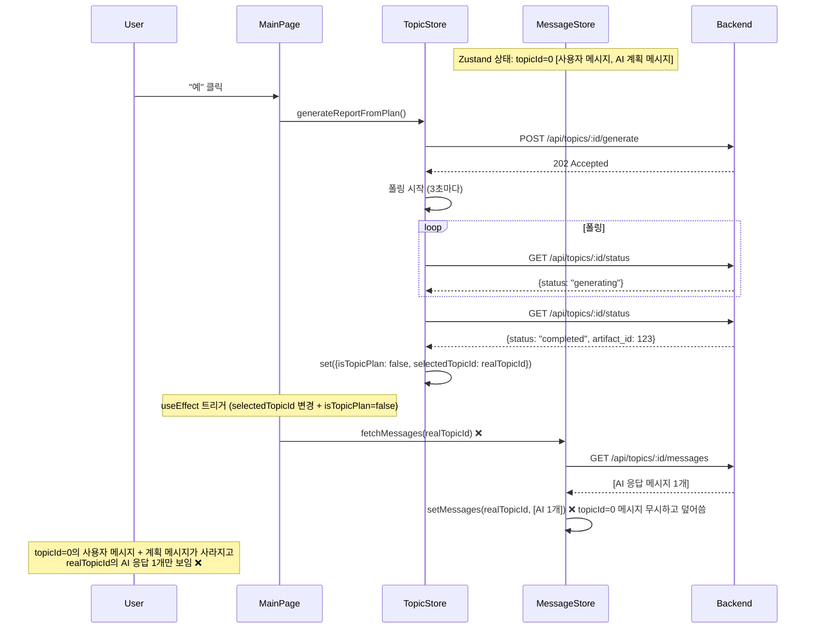
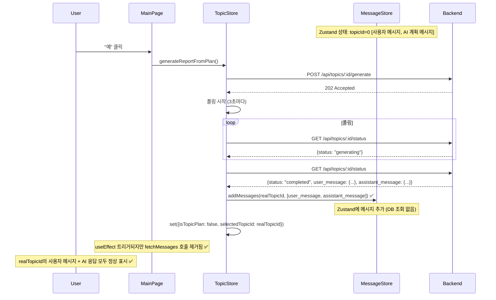
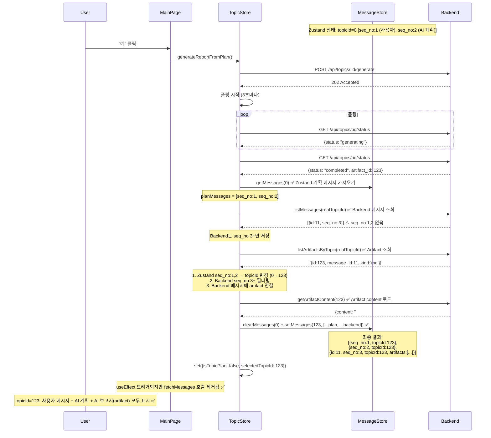

# Unit Spec: 보고서 생성 후 Zustand 메시지 관리 전환

**작성일:** 2025-11-13
**타입:** Bug Fix + Refactoring
**담당:** Frontend

---

## 1. 요구사항 요약

### 1.1 Purpose
- **문제:** "예" 클릭 → 보고서 생성 완료 → 기존 대화 내역(사용자 메시지 + AI 응답)이 사라지고 AI 응답 1개만 보임
- **근본 원인:** `fetchMessages()`가 DB에서 조회한 데이터로 Zustand 상태를 **덮어씀** (setMessages)
- **올바른 접근:** **Zustand를 Single Source of Truth로 사용** - 보고서 생성 완료 시 Backend가 반환한 메시지와 Artifact만 Zustand에 **추가(append)**
- **목표:** 보고서 생성 완료 후 기존 계획 모드의 메시지를 유지하면서 새로 생성된 메시지와 Artifact를 추가

#### ✅ CRITICAL: Backend 저장 동작 이해
- **Backend DB는 seq_no 3부터 저장** (보고서 생성 메시지부터)
- **seq_no 1 (사용자 메시지), seq_no 2 (AI 개요)는 Backend에 저장되지 않음**
- **따라서 seq_no 1,2는 Backend ID 매칭 불필요** - topicId만 변경하면 됨
- **seq_no 3+ 메시지만 Backend에서 조회하여 artifact 연결**

### 1.2 Type
- Bug Fix (Frontend) + Architecture Refactoring

### 1.3 Core Requirements

| 항목 | 설명 |
|------|------|
| **FR-1** | Zustand를 Single Source of Truth로 사용 - DB 조회(`fetchMessages`) 제거 |
| **FR-2** | 보고서 생성 완료 시 Backend가 생성한 메시지 + Artifact를 Zustand에 추가 |
| **FR-3** | MainPage `useEffect`에서 `fetchMessages` 호출 제거 (계획 모드 → 일반 모드 전환 시에도 호출 안 함) |
| **FR-4** | 보고서 생성 완료 후 artifact 정보를 메시지에 연결하여 표시 |

---

## 2. 구현 대상 파일

### 2.1 파일 변경 목록

| 상태 | 파일 경로 | 설명 |
|------|-----------|------|
| **Change** | `frontend/src/stores/useTopicStore.ts` | `generateReportFromPlan` 함수 수정 - status 응답에서 메시지 추출 및 Zustand에 추가 |
| **Change** | `frontend/src/pages/MainPage.tsx` | `useEffect` 로직 수정 - `fetchMessages` 호출 완전 제거 |
| **Change** | `frontend/src/stores/useMessageStore.ts` | `updateMessageWithArtifact` 함수 추가 (artifact 연결용) |
| **Reference** | `frontend/src/services/topicApi.ts` | `getGenerationStatus` 응답 타입 확인 |

---

## 3. 해결 방안 (Zustand Single Source of Truth)

### 3.1 핵심 전략

**원칙:**
1. **Zustand만 사용** - DB 조회(`fetchMessages`) 완전 제거
2. **보고서 생성 완료 시** - Backend `/status` API 응답에서 생성된 메시지 + artifact 정보를 Zustand에 추가
3. **MainPage `useEffect`** - `fetchMessages` 호출 제거

### 3.2 Backend API 응답 구조 (참고)

```typescript
// GET /api/topics/:id/status (completed 상태)
{
  "success": true,
  "data": {
    "topic_id": 1,
    "status": "completed",
    "progress_percent": 100,
    "artifact_id": 123,  // ✅ Artifact ID 존재
    "completed_at": "2025-11-12T10:45:20Z"
  }
}
```

**문제:**
- 현재 Backend는 `artifact_id`만 반환하고, 생성된 **메시지 정보는 반환하지 않음**
- Frontend가 메시지를 Zustand에 추가하려면 추가 정보가 필요함

### 3.3 해결 방안 선택

#### Option 1 (권장): Backend API 수정 - `/status`에 메시지 정보 포함

**장점:**
- Frontend가 단일 API 호출로 모든 정보를 가져올 수 있음
- 네트워크 요청 최소화
- 데이터 일관성 보장

**Backend 수정 필요:**
```typescript
// GET /api/topics/:id/status (completed 상태)
{
  "success": true,
  "data": {
    "topic_id": 1,
    "status": "completed",
    "progress_percent": 100,
    "artifact_id": 123,
    "completed_at": "2025-11-12T10:45:20Z",

    // 🆕 생성된 메시지 정보 추가
    "user_message": {
      "id": 1,
      "role": "user",
      "content": "AI 트렌드 분석 보고서 작성",
      "seq_no": 1,
      "created_at": "2025-11-12T10:30:00Z"
    },
    "assistant_message": {
      "id": 2,
      "role": "assistant",
      "content": "# AI 트렌드 분석 보고서\n\n...",
      "seq_no": 2,
      "created_at": "2025-11-12T10:45:20Z",
      "artifact_id": 123  // ✅ Artifact 연결
    }
  }
}
```

**Frontend 구현:**
```typescript
// useTopicStore.ts - generateReportFromPlan

const checkStatus = async () => {
    const status = await topicApi.getGenerationStatus(response.topic_id)

    if (status.status === 'completed') {
        antdMessage.success('보고서가 생성되었습니다.')

        // 1. Zustand에 메시지 추가 (Backend에서 반환한 정보 사용)
        const messageStore = useMessageStore.getState()
        const newMessages = [
            status.user_message,
            status.assistant_message
        ]
        messageStore.addMessages(response.topic_id, newMessages)

        // 2. 계획 모드 종료 + selectedTopicId 전환
        set({isTopicPlan: false, selectedTopicId: response.topic_id})

        setIsLoadingMessages(false)
    }
}
```

---

#### Option 2 (선택): Frontend에서 Backend 메시지 추가 전략

**✅ CRITICAL: Backend 저장 사실**
- **Backend는 seq_no 3+ 메시지만 저장** (보고서 생성부터)
- **seq_no 1,2는 Backend DB에 없음** (계획 모드 메시지)
- **따라서 seq_no 매칭이 아니라 메시지 추가 방식 사용**

**핵심 아이디어:**
1. **Zustand 메시지 (seq_no 1,2):** topicId만 0 → realTopicId로 변경
2. **Backend 메시지 (seq_no 3+):** Backend에서 조회하여 Zustand에 추가
3. **Artifact 연결:** Backend 메시지에만 artifact 연결 필요

**장점:**
- ✅ Backend 수정 불필요
- ✅ 빠른 구현 (30분 - 1시간)
- ✅ 즉시 배포 가능
- ✅ 기존 메시지 내용 유지 (계획 내용 그대로 표시)
- ✅ Artifact 정상 연결

**단점:**
- ⚠️ Backend와 추가 통신 필요 (listMessages, listArtifacts)
- ⚠️ 향후 메시지 삭제/수정 기능 구현 시 리팩토링 필요

**처리 플로우:**
1. 기존 Zustand 메시지 (seq_no 1,2) topicId만 변경 (0 → realTopicId)
2. `listMessages(realTopicId)` + `listArtifactsByTopic(realTopicId)` 호출
3. Backend 메시지 (seq_no 3+) 필터링
4. Backend 메시지에 artifact 연결 (enrichMessagesWithArtifacts)
5. Zustand에 Backend 메시지 추가

**구현:**
```typescript
// useTopicStore.ts - generateReportFromPlan

const checkStatus = async () => {
    const status = await topicApi.getGenerationStatus(response.topic_id)

    if (status.status === 'completed') {
        antdMessage.success('보고서가 생성되었습니다.')

        const messageStore = useMessageStore.getState()

        // 1. 기존 계획 모드 메시지(topicId=0) 가져오기
        const planMessages = messageStore.getMessages(0) // [seq_no:1, seq_no:2]

        try {
            // 2. Backend에서 메시지 + Artifact 조회
            const messagesResponse = await messageApi.listMessages(response.topic_id)
            const artifactsResponse = await artifactApi.listArtifactsByTopic(response.topic_id)

            // Response → Model 변환
            const backendMessageModels = mapMessageResponsesToModels(messagesResponse.messages)

            // 3. 계획 메시지의 최대 seq_no 찾기
            const maxPlanSeqNo = Math.max(...planMessages.map(m => m.seqNo))

            // 4. Backend 메시지 중 seq_no > maxPlanSeqNo인 것만 필터링
            const newBackendMessages = backendMessageModels.filter(m => m.seqNo > maxPlanSeqNo)

            // 5. 새 Backend 메시지에 artifact 연결
            const newMessagesWithArtifacts = await enrichMessagesWithArtifacts(
                newBackendMessages,
                artifactsResponse.artifacts
            )

            // 6. 기존 계획 메시지의 topicId 업데이트 (0 → realTopicId)
            const updatedPlanMessages = planMessages.map(msg => ({
                ...msg,
                topicId: response.topic_id
            }))

            // 7. Zustand 상태 업데이트
            messageStore.clearMessages(0) // 계획 모드 메시지 제거
            messageStore.setMessages(response.topic_id, [
                ...updatedPlanMessages,    // seq_no 1,2 (topicId 갱신)
                ...newMessagesWithArtifacts // seq_no 3+ (artifact 포함)
            ])

        } catch (error) {
            console.error('Failed to load backend messages:', error)

            // 에러 시에도 계획 메시지는 표시 (topicId만 변경, artifacts 없이)
            const updatedPlanMessages = planMessages.map(msg => ({
                ...msg,
                topicId: response.topic_id
            }))

            messageStore.clearMessages(0)
            messageStore.setMessages(response.topic_id, updatedPlanMessages)
        }

        // 8. 계획 모드 종료 + selectedTopicId 전환
        set({isTopicPlan: false, selectedTopicId: response.topic_id})

        setIsLoadingMessages(false)
    }
}
```

**메시지 처리 예시:**

| Zustand 메시지 (계획 모드) | Backend 메시지 | 처리 방식 | 결과 |
|-------------------------|---------------|---------|------|
| `{id: undefined, seq_no: 1, role: 'user', content: "AI 트렌드 보고서 작성", topicId: 0}` | ❌ **없음** (Backend는 저장 안 함) | topicId만 변경 | `{id: undefined, seq_no: 1, content: "AI 트렌드 보고서 작성", topicId: 123}` |
| `{id: undefined, seq_no: 2, role: 'assistant', content: "## 보고서 개요\n...", topicId: 0}` | ❌ **없음** (Backend는 저장 안 함) | topicId만 변경 | `{id: undefined, seq_no: 2, content: "## 보고서 개요\n...", topicId: 123}` |
| ❌ **없음** | `{id: 11, seq_no: 3, role: 'assistant', content: "# AI 트렌드 분석 보고서\n..."}` | Backend에서 가져와 추가 | `{id: 11, seq_no: 3, content: "# AI 트렌드...", topicId: 123, artifacts: [{id: 5, kind: 'md', content: '...'}]}` |

---

## 4. 권장 해결 방안 (Option 2 - Backend 메시지 추가 전략)

**선택 이유:**
1. **빠른 구현:** Backend 수정 불필요, 30분 - 1시간 내 완료
2. **즉시 배포 가능:** Frontend만 수정하여 빠르게 버그 해결
3. **실용성:** seq_no 3+ 메시지만 Backend에서 조회하여 추가
4. **Artifact 정상 연결:** 보고서 다운로드, 미리보기 기능 정상 작동

**Frontend 수정 요약:**
1. `useTopicStore.ts`: `generateReportFromPlan`에서 보고서 완료 시
   - 기존 Zustand 메시지 (seq_no 1,2) topicId만 변경 (0 → realTopicId)
   - `listMessages(realTopicId)` + `listArtifactsByTopic(realTopicId)` 호출
   - seq_no 3+ Backend 메시지 필터링하여 artifact 연결
   - Backend 메시지를 Zustand에 추가
2. `MainPage.tsx`: `useEffect`에서 `fetchMessages` 호출 완전 제거

**Option 1 (Backend API 수정) 고려 시기:**
- 향후 메시지 삭제/수정 기능 추가 시
- Backend 메시지 내용과 Zustand 메시지 내용의 일치가 중요할 때
- 다음 스프린트에서 리팩토링으로 진행

---

## 5. 플로우 다이어그램

### 5.1 Before (버그 상황)



### 5.2 After (Option 1 - Backend API 수정, 권장)



### 5.3 After (Option 2 - Backend 메시지 추가, 권장)



---

## 6. 테스트 계획

### 6.1 Unit Tests (Option 1 - Backend API 수정)

| TC | Layer | 설명 | 예상 결과 |
|----|-------|------|-----------|
| **TC-1** | Store | `generateReportFromPlan` 완료 후 `addMessages` 호출 확인 | Backend 응답의 메시지가 Zustand에 추가됨 |
| **TC-2** | Store | `addMessages` 완료 후 `isLoadingMessages=false` 설정 | 로딩 상태가 올바르게 해제됨 |
| **TC-3** | Store | 폴링 완료 후 `selectedTopicId`가 올바른 값으로 설정됨 | `selectedTopicId === response.topic_id` |
| **TC-4** | Page | MainPage `useEffect`에서 `fetchMessages` 호출 안 함 | `fetchMessages` 호출 횟수 0 |

### 6.2 Unit Tests (Option 2 - Frontend만 수정)

| TC | Layer | 설명 | 예상 결과 |
|----|-------|------|-----------|
| **TC-5** | Store | 계획 모드 메시지(topicId=0)를 realTopicId로 업데이트 | 메시지의 topicId가 변경됨 |
| **TC-6** | Store | `clearMessages(0)` 후 임시 메시지 삭제 확인 | topicId=0의 메시지가 삭제됨 |
| **TC-7** | Store | `setMessages(realTopicId, updatedMessages)` 호출 확인 | realTopicId로 메시지 설정됨 |
| **TC-8** | Store | artifact_id가 마지막 메시지에 연결됨 | assistant 메시지에 artifact_id 존재 |

### 6.3 Integration Tests

| TC | 설명 | 예상 결과 |
|----|------|-----------|
| **TC-9** | 사용자가 "예" 클릭 → 보고서 생성 완료 → 대화 내역 확인 | 사용자 메시지 + AI 응답 모두 표시됨 |
| **TC-10** | 보고서 생성 실패 시 에러 메시지 표시 | 적절한 에러 메시지 표시 |
| **TC-11** | 보고서 생성 타임아웃 시 경고 메시지 표시 | 경고 메시지 표시, 토픽으로 전환됨 |
| **TC-12** | Zustand 상태에만 메시지 존재하고 DB 조회 안 함 | `fetchMessages` 호출 없음, Zustand 메시지만 표시 |

### 6.4 E2E Tests

| TC | 사용자 시나리오 | 예상 결과 |
|----|----------------|-----------|
| **TC-13** | 신규 사용자 메시지 입력 → 계획 생성 → "예" 클릭 → 보고서 생성 | 대화 내역에 사용자 메시지 + AI 응답 2개 표시 |
| **TC-14** | 보고서 생성 후 추가 메시지 전송 | 기존 메시지 유지되고 새 메시지 추가됨 |
| **TC-15** | 보고서 클릭 → 미리보기 → 다운로드 | Artifact가 정상적으로 연결되어 다운로드됨 |

---

## 7. 에러 처리

### 7.1 에러 시나리오

| 시나리오 | 에러 처리 | 사용자 피드백 |
|---------|----------|--------------|
| **Status API 응답 없음** | 콘솔 에러 로그, 기존 메시지 유지, 폴링 재시도 | "상태 확인에 실패했습니다. 재시도 중..." |
| **보고서 생성 실패** | 폴링 중단, 에러 메시지 표시 | "보고서 생성에 실패했습니다." |
| **타임아웃** | 폴링 중단, 경고 메시지 표시 | "보고서 생성이 오래 걸립니다. 잠시 후 다시 확인해주세요." |
| **메시지 추가 실패 (Option 1)** | 콘솔 에러 로그, 기존 상태 유지 | "메시지 추가에 실패했습니다." |
| **Artifact 연결 실패 (Option 2)** | Artifact 없이 메시지만 표시 | 콘솔 경고, 사용자에게는 미표시 |

---

## 8. 체크리스트

### 8.1 구현 전
- [ ] Unit Spec 검토 및 승인
- [ ] **Option 1 (Backend API 수정) vs Option 2 (Frontend만) 확정**
- [ ] Backend 팀과 API 수정 가능 여부 협의 (Option 1 선택 시)
- [ ] MessageStore의 `addMessages` 동작 확인

### 8.2 구현 중 (Option 1 - Backend API 수정)

**Backend:**
- [ ] `GET /api/topics/:id/status` 응답에 `user_message`, `assistant_message` 필드 추가
- [ ] 메시지 스키마에 `id`, `role`, `content`, `seq_no`, `created_at`, `artifact_id` 포함
- [ ] Backend Unit Tests 작성 및 통과

**Frontend:**
- [ ] `useTopicStore.ts` - `generateReportFromPlan` 함수 수정
  - `checkStatus`에서 status 응답의 메시지 추출
  - `addMessages(realTopicId, [user_message, assistant_message])` 호출
- [ ] `MainPage.tsx` - `useEffect`에서 `fetchMessages` 호출 완전 제거
- [ ] `topicApi.ts` - `getGenerationStatus` 응답 타입 업데이트
- [ ] 테스트 코드 작성 (TC-1 ~ TC-4)

### 8.3 구현 중 (Option 2 - seq_no 기반 병합, 권장)

- [ ] `useTopicStore.ts` - `generateReportFromPlan` 함수 수정
  - 계획 모드 메시지(topicId=0) 가져오기
  - `listMessages(realTopicId)` + `listArtifactsByTopic(realTopicId)` 호출
  - seq_no 기반으로 Zustand 메시지와 Backend 메시지 매칭
  - Backend의 `id`, `artifacts`만 Zustand 메시지에 추가
  - Artifact content 로드 (`getArtifactContent`)
  - `clearMessages(0)` + `setMessages(realTopicId, merged)` 호출
- [ ] `MainPage.tsx` - `useEffect`에서 `fetchMessages` 호출 완전 제거
- [ ] 테스트 코드 작성 (TC-5 ~ TC-8)

### 8.4 구현 후
- [ ] 모든 Unit Tests 통과
- [ ] Integration Tests (TC-9 ~ TC-12) 통과
- [ ] E2E 테스트 (TC-13 ~ TC-15) 수동 실행 및 검증
- [ ] 브라우저 테스트 (Chrome, Firefox, Safari)
- [ ] CLAUDE.md 업데이트 (Zustand Single Source of Truth 방침 추가)
- [ ] Git 커밋
  - Frontend: `fix: 보고서 생성 후 Zustand 메시지 관리 전환 (fetchMessages 제거)`
  - Backend (Option 1): `feat: GET /api/topics/:id/status에 메시지 정보 추가`

---

## 9. 참고 자료

- [frontend/src/stores/useTopicStore.ts:339-430](frontend/src/stores/useTopicStore.ts#L339-L430)
- [frontend/src/stores/useMessageStore.ts:103-141](frontend/src/stores/useMessageStore.ts#L103-L141)
- [frontend/src/pages/MainPage.tsx:71-84](frontend/src/pages/MainPage.tsx#L71-L84)
- [backend/doc/specs/20251112_sequential_planning_with_sse_progress.md](backend/doc/specs/20251112_sequential_planning_with_sse_progress.md)

---

## 10. 구현 우선순위

### 10.1 즉시 구현 (권장 - Option 2: seq_no 기반 병합)
- Frontend만 수정하여 빠르게 버그 해결
- seq_no로 정확한 매칭 및 Artifact 연결
- **소요 시간:** 30분 - 1시간

### 10.2 장기 구현 (고려 - Option 1: Backend API 수정)
- Backend API 수정 포함한 완전한 해결
- 메시지 삭제/수정 등 향후 기능 확장 시 필요
- **소요 시간:** Backend 1-2시간 + Frontend 1시간 + 테스트 1시간 = 3-5시간

### 10.3 권장 접근
1. **즉시 (선택됨):** Option 2 (seq_no 기반 병합)로 빠르게 버그 수정 및 배포
2. **향후:** 메시지 삭제/수정 기능 추가 시 Option 1로 리팩토링 고려

---

**마지막 업데이트:** 2025-11-13
**상태:** ✅ Spec 작성 완료, Option 2 (seq_no 기반 병합) 선택, 구현 준비 완료
