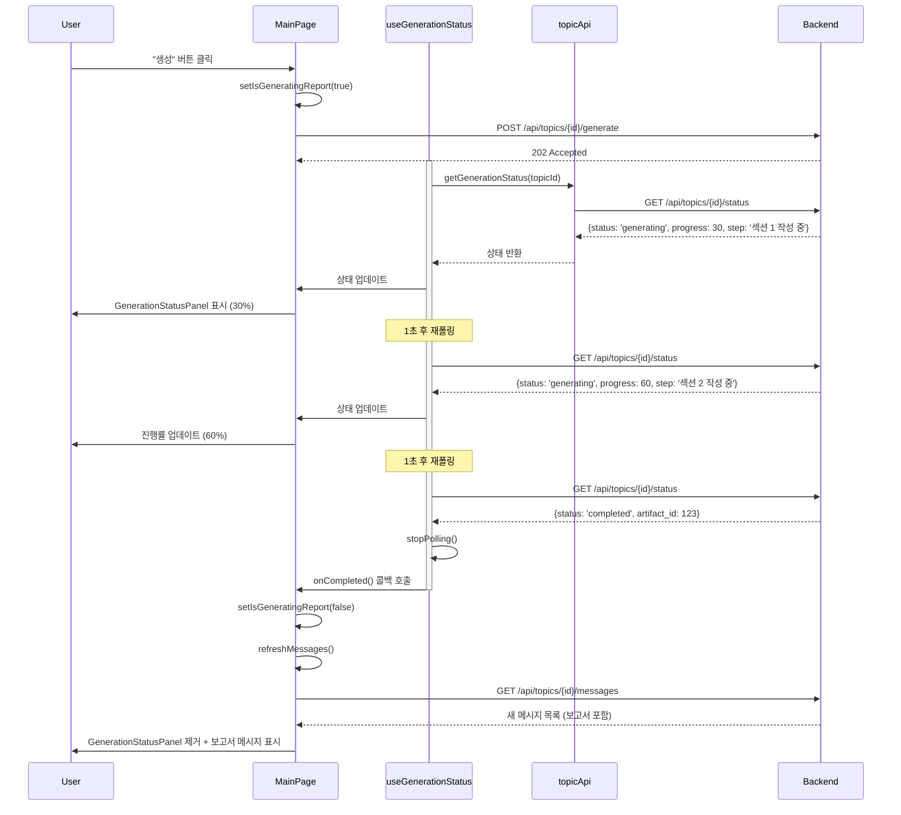

# Unit Spec: 실시간 보고서 생성 상태 UI

**작성일:** 2025-11-14
**타입:** 신규 기능 (Frontend)
**목적:** 보고서 생성 중 `/api/topics/{topic_id}/status` API를 폴링하여 진행 상태를 Assistant 좌측에 실시간으로 표시

---

## 1. 요구사항 요약 (Purpose & Core Requirements)

### 1.1 Purpose
- 사용자가 보고서 생성 요청 후 대기하는 동안 **진행 상태를 시각적으로 확인**할 수 있도록 함
- 백그라운드 생성 API (`POST /api/topics/{id}/generate`) 호출 후 `GET /api/topics/{id}/status`를 주기적으로 폴링하여 상태 업데이트
- 보고서 생성 완료 시 UI에서 자동으로 사라지고 결과 메시지 표시

### 1.2 Type
- **Feature**: 신규 UI 컴포넌트 (GenerationStatusPanel)
- **Integration**: MainPage에서 상태 관리 및 폴링 로직 추가

### 1.3 Core Requirements
1. **위치**: **chatMessages 영역 내에서 ChatMessage들과 함께 렌더링**
   - `{messages.map(...)}` 루프 **아래**에 별도 컴포넌트로 배치
   - GeneratingIndicator와 유사한 위치 (메시지 목록 마지막에 표시)
   - ChatMessage와 동일한 레이아웃 구조 (avatar + content 형태)
2. **폴링**: `/api/topics/{topic_id}/status` API를 **1초마다** 호출하여 상태 업데이트
3. **표시 정보**:
   - 진행률 (progress_percent)
   - 현재 작업 단계 (current_step)
   - 상태 (generating / completed / failed)
4. **자동 제거**:
   - 상태가 `completed` 또는 `failed`가 되면 컴포넌트 자동 제거
   - 보고서 생성 완료 시 새 메시지가 추가되면 컴포넌트 제거
5. **UI 제약**:
   - ChatMessage 스타일과 일관성 유지 (avatar + content wrapper)
   - Assistant 아바타 사용
   - 메시지 플로우에 자연스럽게 통합

---

## 2. 구현 대상 파일

### 2.1 신규 파일

| 파일 경로 | 역할 |
|---------|------|
| `frontend/src/components/chat/GenerationStatusMessage.tsx` | 생성 상태 표시 컴포넌트 (ChatMessage와 유사한 구조) |
| `frontend/src/components/chat/GenerationStatusMessage.module.css` | 상태 메시지 스타일 (ChatMessage.module.css 기반) |
| `frontend/src/hooks/useGenerationStatus.ts` | 상태 폴링 및 관리 커스텀 훅 |

### 2.2 수정할 파일

| 파일 경로 | 수정 내용 |
|---------|----------|
| `frontend/src/pages/MainPage.tsx` | - useGenerationStatus 훅 사용<br>- GenerationStatusMessage를 chatMessages 영역에 렌더링 (messages.map() 아래)<br>- handleGenerateFromOutline/handleGenerateFromEditedPlan에서 폴링 시작 |
| `frontend/src/services/topicApi.ts` | 이미 구현됨 (getGenerationStatus 메서드 존재) |
| `frontend/src/constants/index.ts` | 이미 구현됨 (GET_GENERATION_STATUS 엔드포인트 존재) |

### 2.3 참조 파일 (변경 없음)

| 파일 경로 | 참조 목적 |
|---------|----------|
| `frontend/src/components/chat/GeneratingIndicator.tsx` | 로딩 UI 참고 |
| `backend/doc/specs/20251112_sequential_planning_with_sse_progress.md` | API 스펙 확인 |

---

## 3. 상세 설계

### 3.1 GenerationStatusMessage 컴포넌트

#### Props
```typescript
interface GenerationStatusMessageProps {
    status: 'generating' | 'completed' | 'failed'
    progressPercent: number
    currentStep?: string
    errorMessage?: string
}
```

#### UI 구조 (ChatMessage와 동일한 레이아웃)
```
┌─────────────────────────────────────┐
│ [A]  Assistant          HH:MM       │ ← Header (Avatar + Name + Time)
│      보고서 생성 중...              │ ← Title
│      ███████████░░░░░ 75%           │ ← Progress Bar
│      현재: 섹션 3 작성 중           │ ← Current Step
└─────────────────────────────────────┘
```

#### 주요 기능
- **Progress Bar**: Ant Design `<Progress>` 컴포넌트 사용
- **자동 숨김**: status가 `completed` 또는 `failed` 시 MainPage에서 제거
- **에러 표시**: status가 `failed`일 때 errorMessage를 빨간색으로 표시
- **시간 표시**: 현재 시각 표시 (ChatMessage와 동일)
- **Assistant 아바타**: ChatMessage의 Assistant 아바타 재사용

#### 스타일 (ChatMessage.module.css 기반)
- `.chatMessage.assistant`:
  - ChatMessage와 동일한 구조
  - Display: flex
  - Gap: 1rem
  - Padding: 1rem

- `.messageAvatar`:
  - ChatMessage와 동일한 Assistant 아바타

- `.messageContentWrapper`:
  - Flex: 1
  - Min-width: 0

- `.statusContent`:
  - Background: #f5f7fa (연한 회색, 일반 메시지와 구분)
  - Padding: 1rem
  - Border-radius: 8px
  - Border-left: 4px solid #1976d2 (진행 중 표시)

### 3.2 useGenerationStatus 훅

#### 역할
- `/api/topics/{id}/status` API 폴링
- 상태 변화 감지 및 자동 중단
- 컴포넌트 언마운트 시 폴링 정리

#### 인터페이스
```typescript
interface UseGenerationStatusOptions {
    topicId: number | null
    enabled: boolean  // 폴링 시작/중지 플래그
    interval?: number // 폴링 간격 (ms, 기본값: 1000)
    onCompleted?: () => void  // 완료 시 콜백
    onFailed?: (error: string) => void  // 실패 시 콜백
}

interface UseGenerationStatusReturn {
    status: 'idle' | 'generating' | 'completed' | 'failed'
    progressPercent: number
    currentStep?: string
    errorMessage?: string
    isPolling: boolean
    startPolling: () => void
    stopPolling: () => void
}
```

#### 구현 로직
```typescript
export const useGenerationStatus = (options: UseGenerationStatusOptions): UseGenerationStatusReturn => {
    const [state, setState] = useState<{
        status: 'idle' | 'generating' | 'completed' | 'failed'
        progressPercent: number
        currentStep?: string
        errorMessage?: string
    }>({
        status: 'idle',
        progressPercent: 0
    })

    const intervalRef = useRef<NodeJS.Timeout | null>(null)
    const [isPolling, setIsPolling] = useState(false)

    const stopPolling = useCallback(() => {
        if (intervalRef.current) {
            clearInterval(intervalRef.current)
            intervalRef.current = null
        }
        setIsPolling(false)
    }, [])

    const fetchStatus = useCallback(async () => {
        if (!options.topicId) return

        try {
            const data = await topicApi.getGenerationStatus(options.topicId)

            setState({
                status: data.status,
                progressPercent: data.progress_percent,
                currentStep: data.current_step,
                errorMessage: data.error_message
            })

            // 완료 또는 실패 시 폴링 중단
            if (data.status === 'completed') {
                stopPolling()
                options.onCompleted?.()
            } else if (data.status === 'failed') {
                stopPolling()
                options.onFailed?.(data.error_message || '보고서 생성 실패')
            }
        } catch (error) {
            console.error('Failed to fetch generation status:', error)
            stopPolling()
            options.onFailed?.('상태 조회 실패')
        }
    }, [options.topicId, options.onCompleted, options.onFailed, stopPolling])

    const startPolling = useCallback(() => {
        if (isPolling || !options.topicId) return

        setIsPolling(true)
        fetchStatus() // 즉시 한 번 실행

        intervalRef.current = setInterval(fetchStatus, options.interval || 1000)
    }, [isPolling, options.topicId, options.interval, fetchStatus])

    // enabled 플래그 변경 시 자동 시작/중단
    useEffect(() => {
        if (options.enabled && options.topicId) {
            startPolling()
        } else {
            stopPolling()
        }

        return () => stopPolling()
    }, [options.enabled, options.topicId, startPolling, stopPolling])

    return {
        ...state,
        isPolling,
        startPolling,
        stopPolling
    }
}
```

### 3.3 MainPage 수정

#### State 추가
```typescript
const [isGeneratingReport, setIsGeneratingReport] = useState(false)
```

#### useGenerationStatus 훅 사용
```typescript
const {
    status,
    progressPercent,
    currentStep,
    errorMessage,
    isPolling,
    stopPolling
} = useGenerationStatus({
    topicId: selectedTopicId,
    enabled: isGeneratingReport,
    interval: 1000,
    onCompleted: () => {
        console.log('보고서 생성 완료')
        setIsGeneratingReport(false)
        refreshMessages(selectedTopicId!)  // 새 메시지 로드
    },
    onFailed: (error) => {
        console.error('보고서 생성 실패:', error)
        setIsGeneratingReport(false)
        antdMessage.error(error)
    }
})
```

#### handleGenerateFromOutline 수정
```typescript
const handleGenerateFromOutline = async () => {
    // PlanPreview가 열려있다면 닫기
    if (planPreviewOpen) {
        setPlanPreviewOpen(false)
    }

    // OutlineMessage 버튼 숨기기
    setShowOutlineButtons(false)

    // 생성 시작 플래그 활성화 (폴링 시작)
    setIsGeneratingReport(true)

    await generateReportFromPlan(setIsLoadingMessages)

    // 참고: 폴링은 useGenerationStatus 내부에서 상태 변화에 따라 자동 중단
}
```

#### JSX 추가 (chatMessages 영역 내)
```tsx
<div className={styles.chatMessages}>
    {messages.map((message, index) => {
        const isLastUserMessage = message.role === 'user' && index === messages.length - 1

        return (
            <div key={message.clientId} ref={isLastUserMessage ? lastUserMessageRef : null}>
                {message.isPlan ? (
                    <OutlineMessage ... />
                ) : (
                    <ChatMessage ... />
                )}
            </div>
        )
    })}

    {/* 생성 중일 때 상태 메시지 표시 */}
    {isGeneratingReport && status === 'generating' && (
        <GenerationStatusMessage
            status={status}
            progressPercent={progressPercent}
            currentStep={currentStep}
            errorMessage={errorMessage}
        />
    )}

    {isGeneratingMessage && <GeneratingIndicator />}
</div>
```

---

## 4. 흐름도 (Mermaid Sequence Diagram)



---

## 5. 테스트 계획

### 5.1 Unit Tests (useGenerationStatus 훅)

| TC ID | 테스트 케이스 | 입력 | 기대 결과 |
|-------|--------------|------|----------|
| UT-01 | 폴링 시작 | enabled=true, topicId=1 | 1초마다 API 호출 |
| UT-02 | 폴링 중단 (completed) | status='completed' 응답 | stopPolling() 호출, onCompleted() 실행 |
| UT-03 | 폴링 중단 (failed) | status='failed' 응답 | stopPolling() 호출, onFailed() 실행 |
| UT-04 | enabled=false | enabled=false | 폴링 시작 안 됨 |
| UT-05 | 언마운트 시 정리 | 컴포넌트 언마운트 | intervalRef 클리어 |

### 5.2 Component Tests (GenerationStatusMessage)

| TC ID | 테스트 케이스 | Props | 기대 결과 |
|-------|--------------|-------|----------|
| CT-01 | 정상 렌더링 | status='generating', progress=50 | Progress Bar 50% 표시 |
| CT-02 | 현재 단계 표시 | currentStep='섹션 1 작성 중' | currentStep 텍스트 표시 |
| CT-03 | 에러 표시 | status='failed', errorMessage='...' | 에러 메시지 빨간색 표시 |
| CT-04 | Assistant 아바타 표시 | status='generating' | Assistant 아바타 렌더링 |

### 5.3 Integration Tests (MainPage)

| TC ID | 테스트 케이스 | 시나리오 | 기대 결과 |
|-------|--------------|----------|----------|
| IT-01 | 보고서 생성 플로우 | 생성 버튼 클릭 → 폴링 시작 → 완료 | 상태 메시지 표시 → 진행률 업데이트 → 메시지 제거 |
| IT-02 | 에러 발생 플로우 | 생성 버튼 클릭 → API 에러 | 에러 메시지 표시 + 메시지 제거 |
| IT-03 | chatMessages 영역 배치 | 생성 중 | GenerationStatusMessage가 messages.map() 아래에 표시됨 |
| IT-04 | 다른 토픽 이동 | 생성 중 다른 토픽 선택 | 폴링 중단 + 메시지 제거 |

### 5.4 E2E Tests

| TC ID | 테스트 케이스 | 사용자 액션 | 기대 결과 |
|-------|--------------|------------|----------|
| E2E-01 | 전체 보고서 생성 | 계획 생성 → "생성" 클릭 → 대기 | 실시간 진행률 표시 → 보고서 완성 |
| E2E-02 | 편집 후 생성 | 계획 수정 → "보고서 생성" 클릭 | 실시간 진행률 표시 → 보고서 완성 |
| E2E-03 | 브라우저 새로고침 | 생성 중 새로고침 | 상태 복구 (진행 중이면 패널 다시 표시) |

---

## 6. 에러 처리 시나리오

### 6.1 API 에러

| 에러 상황 | 처리 방법 |
|----------|----------|
| 네트워크 에러 | 폴링 중단, 에러 메시지 표시 (antdMessage.error) |
| 404 (토픽 없음) | 폴링 중단, "토픽을 찾을 수 없습니다" 메시지 |
| 500 (서버 에러) | 폴링 중단, "서버 오류가 발생했습니다" 메시지 |

### 6.2 상태 불일치

| 상황 | 처리 방법 |
|------|----------|
| 백엔드에서 이미 completed 상태 | 첫 폴링에서 바로 완료 처리, 패널 즉시 제거 |
| 백엔드 상태 없음 (404) | 폴링 중단, 상태 초기화 |

### 6.3 사용자 인터랙션

| 상황 | 처리 방법 |
|------|----------|
| 생성 중 다른 토픽 선택 | useEffect cleanup에서 폴링 중단 |
| 생성 중 로그아웃 | api.ts 인터셉터에서 자동 처리 (401 → 로그인 페이지) |

---

## 7. UI/UX 상세 스펙

### 7.1 색상 및 타이포그래피
- 헤더 제목: `color: #1976d2`, `font-weight: 600`
- Progress Bar: Ant Design 기본 색상 (#1890ff)
- 에러 상태: `color: #f5222d`
- 배경: `background: #ffffff`

### 7.2 레이아웃
- ChatMessage와 동일한 구조 (display: flex, gap: 1rem)
- `.messageAvatar`: 좌측 고정
- `.messageContentWrapper`: flex: 1
- `.statusContent`:
  - Background: `#f5f7fa`
  - Padding: `1rem`
  - Border-radius: `8px`
  - Border-left: `4px solid #1976d2`

### 7.3 애니메이션
- Fade In: `@keyframes fadeIn { from { opacity: 0; } to { opacity: 1; } }`
- Duration: `0.3s`
- Easing: `ease-out`

### 7.4 반응형 (모바일)
- ChatMessage와 동일한 반응형 적용
- `@media (max-width: 768px)`:
  - Avatar 크기 축소
  - Padding 조정

---

## 8. 사이드 이펙트 분석

### 8.1 긍정적 효과
1. **UX 개선**: 대기 시간 동안 명확한 피드백
2. **신뢰성**: 진행 상태 실시간 확인으로 사용자 불안 해소
3. **디버깅**: 어느 단계에서 멈췄는지 확인 가능

### 8.2 잠재적 문제 및 해결

#### 문제 1: 폴링 과부하
- **상황**: 1초마다 API 호출 시 서버 부담
- **해결**: 백엔드에서 상태 캐싱 (이미 v2.4에서 구현됨, 메모리 기반)

#### 문제 2: 여러 탭에서 동시 폴링
- **상황**: 같은 사용자가 여러 탭 열고 동시에 보고서 생성
- **해결**: 각 탭이 독립적으로 폴링, 백엔드는 topic_id로 상태 관리하므로 문제 없음

#### 문제 3: 브라우저 새로고침 시 상태 손실
- **상황**: 생성 중 새로고침하면 패널 사라짐
- **해결 (선택사항)**:
  - v1: 새로고침 후 상태 복구 없음 (단순 구현)
  - v2: MainPage 마운트 시 selectedTopicId의 상태 확인, generating이면 폴링 재시작

**권장**: v1으로 시작, 추후 필요 시 v2 구현

#### 문제 4: 폴링 중 토픽 전환
- **상황**: 생성 중 다른 토픽으로 이동
- **해결**: useEffect cleanup에서 stopPolling() 호출

---

## 9. 구현 체크리스트

### Step 1: useGenerationStatus 훅 생성
- [ ] `useGenerationStatus.ts` 파일 생성
- [ ] 폴링 로직 구현 (setInterval, clearInterval)
- [ ] 상태 관리 (useState, useRef)
- [ ] 완료/실패 시 자동 중단
- [ ] cleanup 로직 (useEffect return)

### Step 2: GenerationStatusMessage 컴포넌트 생성
- [ ] `GenerationStatusMessage.tsx` 파일 생성
- [ ] Props 정의 및 기본 UI 구현 (ChatMessage 구조 참고)
- [ ] Assistant 아바타 렌더링
- [ ] Ant Design Progress 컴포넌트 사용
- [ ] 상태별 UI 분기 (generating / failed)
- [ ] 시간 표시 (formatTime)

### Step 3: 스타일링
- [ ] `GenerationStatusMessage.module.css` 생성
- [ ] ChatMessage 스타일 기반으로 작성
- [ ] `.statusContent` 스타일 (배경, border-left)
- [ ] Fade In 애니메이션
- [ ] 반응형 (모바일) 스타일

### Step 4: MainPage 통합
- [ ] `isGeneratingReport` 상태 추가
- [ ] useGenerationStatus 훅 사용
- [ ] handleGenerateFromOutline/handleGenerateFromEditedPlan 수정
- [ ] GenerationStatusMessage를 chatMessages 영역에 추가
- [ ] cleanup 로직 추가 (useEffect)

### Step 5: 테스트 및 검증
- [ ] 훅 단위 테스트 (5개)
- [ ] 컴포넌트 테스트 (4개)
- [ ] 통합 테스트 (4개)
- [ ] E2E 테스트 (3개)

---

## 10. 향후 개선 가능성

### v2 기능 (선택사항)
1. **SSE (Server-Sent Events) 지원**
   - 폴링 대신 실시간 스트림
   - 백엔드 `/api/topics/{id}/status/stream` 엔드포인트 활용

2. **애니메이션 개선**
   - Progress Bar 애니메이션
   - 단계 전환 시 페이드 효과

3. **소리 알림**
   - 완료 시 알림음 재생 (선택사항)

4. **상태 복구 (새로고침 후)**
   - LocalStorage에 generating 플래그 저장
   - 마운트 시 상태 확인 후 폴링 재시작

---

**최종 검토일:** 2025-11-14
**작성자:** Claude Code
**버전:** 1.0
**상태:** ✅ 검토 대기 (사용자 승인 필요)
