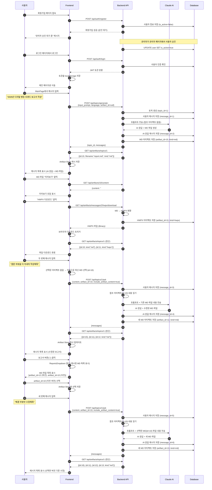

# 사용자 플로우 (User Flow)

HWP Report Generator 애플리케이션의 전체 사용 흐름을 설명합니다.

## 전체 플로우 다이어그램



---

## 단계별 상세 설명

### 1. 회원가입 및 승인

**플로우:**

```
사용자 → 회원가입 폼 작성 → 가입 완료 (승인 대기) → 관리자 승인 → 로그인 가능
```

**API:**

- `POST /api/auth/register`

    ```json
    // Request
    {
      "email": "user@example.com",
      "password": "password123",
      "username": "홍길동"
    }

    // Response
    {
      "success": true,
      "data": {
        "id": 5,
        "email": "user@example.com",
        "username": "홍길동",
        "is_active": false  // 관리자 승인 대기
      }
    }
    ```

- `PATCH /api/admin/users/5/toggle-active` (관리자만)
    ```json
    // Response
    {
        "success": true,
        "data": {
            "id": 5,
            "is_active": true // 승인 완료
        }
    }
    ```

---

### 2. 로그인

**플로우:**

```
사용자 → 이메일/비밀번호 입력 → JWT 토큰 발급 → localStorage 저장 → MainPage 이동
```

**API:**

- `POST /api/auth/login`

    ```json
    // Request
    {
      "email": "user@example.com",
      "password": "password123"
    }

    // Response
    {
      "success": true,
      "data": {
        "access_token": "eyJhbGciOiJIUzI1NiIs...",
        "token_type": "bearer",
        "user": {
          "id": 5,
          "email": "user@example.com",
          "username": "홍길동"
        }
      }
    }
    ```

---

### 3. 첫 번째 메시지 전송 (토픽 생성)

**플로우:**

```
메시지 입력 → 토픽 생성 + AI 응답 → MD 파일 생성 → 아티팩트 목록 캐싱
```

**API:**

- `POST /api/topics/generate`

    ```json
    // Request
    {
      "input_prompt": "2025년 디지털 뱅킹 트렌드 보고서 작성",
      "language": "ko"
    }

    // Response
    {
      "success": true,
      "data": {
        "topic_id": 1,
        "input_prompt": "2025년 디지털 뱅킹 트렌드 보고서 작성",
        "language": "ko"
      }
    }
    ```

- `GET /api/messages?topic_id=1`

    ```json
    // Response
    {
        "success": true,
        "data": {
            "messages": [
                {
                    "id": 1,
                    "role": "user",
                    "content": "2025년 디지털 뱅킹 트렌드 보고서 작성",
                    "created_at": "2025-11-05T10:30:00Z"
                },
                {
                    "id": 2,
                    "role": "assistant",
                    "content": "# 2025년 디지털 뱅킹 트렌드\n\n## 요약\n...",
                    "created_at": "2025-11-05T10:30:15Z"
                }
            ]
        }
    }
    ```

- `GET /api/artifacts/topics/1`
    ```json
    // Response
    {
        "success": true,
        "data": {
            "artifacts": [
                {
                    "id": 10,
                    "filename": "2025년_디지털뱅킹_트렌드.md",
                    "kind": "md",
                    "file_size": 15234,
                    "message_id": 2,
                    "created_at": "2025-11-05T10:30:15Z"
                }
            ],
            "total": 1,
            "page": 1,
            "page_size": 50
        }
    }
    ```

---

### 4. MD 파일 미리보기

**플로우:**

```
"미리보기" 버튼 클릭 → 파일 내용 조회 → 모달에 렌더링
```

**API:**

- `GET /api/artifacts/10/content`
    ```json
    // Response
    {
        "success": true,
        "data": {
            "artifact_id": 10,
            "filename": "2025년_디지털뱅킹_트렌드.md",
            "content": "# 2025년 디지털 뱅킹 트렌드\n\n## 요약\n...",
            "kind": "md"
        }
    }
    ```

---

### 5. HWPX 다운로드

**플로우:**

```
"다운로드" 버튼 클릭 → MD → HWPX 변환 → 브라우저 다운로드 → HWPX 아티팩트 생성 → 목록 갱신
```

**API:**

- `GET /api/artifacts/messages/2/hwpx/download?locale=ko`

    ```
    // Response: Binary file (application/octet-stream)
    // Content-Disposition: attachment; filename="2025년_디지털뱅킹_트렌드.hwpx"
    ```

- `GET /api/artifacts/topics/1` (갱신)
    ```json
    // Response
    {
        "success": true,
        "data": {
            "artifacts": [
                {
                    "id": 10,
                    "filename": "2025년_디지털뱅킹_트렌드.md",
                    "kind": "md",
                    "message_id": 2
                },
                {
                    "id": 11,
                    "filename": "2025년_디지털뱅킹_트렌드.hwpx",
                    "kind": "hwpx",
                    "message_id": 2,
                    "source_artifact_id": 10
                }
            ]
        }
    }
    ```

---

### 6. 두 번째 메시지 (자동 최신 MD 선택)

**플로우:**

```
메시지 입력 → 자동으로 최신 MD 선택 → AI가 기존 보고서 기반 수정 → 새 MD 생성
```

**Frontend 로직:**

```typescript
// 선택된 아티팩트가 없으면 자동으로 최신 MD 선택
if (!selectedArtifactId) {
    const artifacts = await loadArtifacts(topicId)
    const markdownArtifacts = artifacts.filter((art) => art.kind === 'md')
    if (markdownArtifacts.length > 0) {
        autoSelectLatest(topicId, markdownArtifacts)
        selectedArtifactId = getSelectedArtifactId(topicId)
    }
}
```

**API:**

- `POST /api/topics/1/ask`

    ```json
    // Request
    {
      "content": "결론 부분을 더 자세히 작성해줘",
      "artifact_id": 10,  // 자동 선택된 최신 MD
      "include_artifact_content": true
    }

    // Response
    {
      "success": true,
      "data": {
        "message_id": 4,
        "content": "# 2025년 디지털 뱅킹 트렌드\n\n## 결론\n...",
        "created_at": "2025-11-05T10:35:00Z"
      }
    }
    ```

- `GET /api/artifacts/topics/1` (갱신)
    ```json
    // Response
    {
        "success": true,
        "data": {
            "artifacts": [
                {
                    "id": 12,
                    "filename": "2025년_디지털뱅킹_트렌드_v2.md",
                    "kind": "md",
                    "message_id": 4,
                    "source_artifact_id": 10
                },
                {"id": 10, "kind": "md"},
                {"id": 11, "kind": "hwpx"}
            ]
        }
    }
    ```

---

### 7. 특정 MD 파일 선택 후 메시지 전송

**플로우:**

```
보고서 버튼(📄) 클릭 → MD 목록 표시 → 이전 버전 선택 → 메시지 입력 → 선택한 버전 기반 수정
```

**Frontend 로직:**

```typescript
// 1. 보고서 버튼 클릭
const handleReportsClick = async (topicId: number) => {
    setIsReportsDropdownOpen(true)
    const artifacts = await loadArtifacts(topicId) // 캐시 또는 API 호출
    const markdownArtifacts = artifacts.filter((art) => art.kind === 'md')
    // 드롭다운에 MD 목록 표시
}

// 2. 사용자가 artifact_id=10 선택
selectArtifact(topicId, 10)

// 3. 메시지 전송 시 선택된 아티팩트 사용
const selectedArtifactId = getSelectedArtifactId(topicId) // 10
await topicApi.askTopic(topicId, {
    content: '배경 부분만 수정해줘',
    artifact_id: selectedArtifactId, // 10
    include_artifact_content: true
})
```

**API:**

- `GET /api/artifacts/topics/1` (보고서 버튼 클릭 시)

    ```json
    // Response: 캐시된 데이터 또는 최신 목록
    {
        "success": true,
        "data": {
            "artifacts": [
                {"id": 12, "filename": "..._v2.md", "kind": "md"}, // 최신
                {"id": 10, "filename": "..._v1.md", "kind": "md"}, // 이전
                {"id": 11, "kind": "hwpx"}
            ]
        }
    }
    ```

- `POST /api/topics/1/ask` (선택한 아티팩트 기반)

    ```json
    // Request
    {
      "content": "배경 부분만 수정해줘",
      "artifact_id": 10,  // 사용자가 선택한 이전 버전
      "include_artifact_content": true
    }

    // Response
    {
      "success": true,
      "data": {
        "message_id": 6,
        "content": "배경 부분을 수정했습니다...",
        "created_at": "2025-11-05T10:40:00Z"
      }
    }
    ```

- `GET /api/artifacts/topics/1` (갱신)
    ```json
    // Response: 새로운 MD 파일 추가됨
    {
        "success": true,
        "data": {
            "artifacts": [
                {"id": 13, "filename": "..._v3.md", "kind": "md", "source_artifact_id": 10},
                {"id": 12, "kind": "md", "source_artifact_id": 10},
                {"id": 10, "kind": "md"},
                {"id": 11, "kind": "hwpx"}
            ]
        }
    }
    ```

---

## 상태 관리 구조

### Artifact Store (Zustand)

```typescript
// 토픽별 아티팩트 캐싱
artifactsByTopic: {
  1: [
    { id: 10, kind: "md", filename: "..._v1.md" },
    { id: 11, kind: "hwpx", filename: "..._v1.hwpx" },
    { id: 12, kind: "md", filename: "..._v2.md" },
    { id: 13, kind: "md", filename: "..._v3.md" }
  ]
}

// 토픽별 선택된 아티팩트
selectedArtifactIds: {
  1: 10  // topic_id=1에서 artifact_id=10 선택됨
}
```

### 캐시 갱신 타이밍

1. **메시지 전송 후**: `refreshArtifacts(topicId)` - 새 MD 파일 감지
2. **HWPX 다운로드 후**: `refreshArtifacts(topicId)` - 새 HWPX 파일 감지
3. **보고서 버튼 클릭**: `loadArtifacts(topicId)` - 캐시 있으면 재사용, 없으면 API 호출

---

## 주요 컴포넌트 및 훅

| 컴포넌트/훅              | 역할                                  |
| ------------------------ | ------------------------------------- |
| `MainPage.tsx`           | 메인 채팅 페이지, 전체 상태 통합      |
| `ChatInput.tsx`          | 메시지 입력, 보고서 버튼              |
| `ChatMessage.tsx`        | 메시지 렌더링, 미리보기/다운로드 버튼 |
| `ReportsDropdown.tsx`    | MD 파일 목록 표시, 선택 UI            |
| `ReportPreview.tsx`      | MD 파일 미리보기 모달                 |
| `useChatActions.ts`      | 메시지 전송 로직                      |
| `useArtifactHandlers.ts` | 아티팩트 관련 핸들러                  |
| `useArtifactStore.ts`    | 아티팩트 캐싱 및 선택 상태 관리       |

---

## 핵심 API 엔드포인트 요약

| 엔드포인트                                   | 메서드 | 설명                         |
| -------------------------------------------- | ------ | ---------------------------- |
| `/api/auth/register`                         | POST   | 회원가입                     |
| `/api/auth/login`                            | POST   | 로그인 (JWT 발급)            |
| `/api/admin/users/{id}/toggle-active`        | PATCH  | 사용자 승인 (관리자)         |
| `/api/topics/generate`                       | POST   | 첫 메시지 + 토픽 생성        |
| `/api/topics/{id}/ask`                       | POST   | 후속 메시지 전송             |
| `/api/messages`                              | GET    | 토픽의 메시지 목록 조회      |
| `/api/artifacts/topics/{id}`                 | GET    | 토픽의 아티팩트 목록 조회    |
| `/api/artifacts/{id}`                        | GET    | 아티팩트 메타데이터 조회     |
| `/api/artifacts/{id}/content`                | GET    | MD 파일 내용 조회            |
| `/api/artifacts/messages/{id}/hwpx/download` | GET    | HWPX 다운로드 (MD→HWPX 변환) |

---

## 참고 사항

### 아티팩트 자동 선택 규칙

1. **첫 번째 메시지**: `artifact_id=null` (참조 없음)
2. **두 번째 메시지부터**: 선택된 아티팩트가 없으면 **자동으로 최신 MD 선택**
3. **사용자가 명시적으로 선택**: 선택한 아티팩트 사용

### MD 파일 버전 관리

- 매 AI 응답마다 **새로운 MD 파일 생성** (불변성 유지)
- `source_artifact_id`: 어떤 파일을 기반으로 수정했는지 추적
- 사용자는 언제든 **이전 버전을 선택하여 대화 가능**

### HWPX 변환

- HWPX는 **요청 시 생성** (MD → HWPX 변환)
- 변환된 HWPX는 **별도 아티팩트로 저장**
- 같은 MD에 대해 다시 다운로드하면 **기존 HWPX 재사용**
